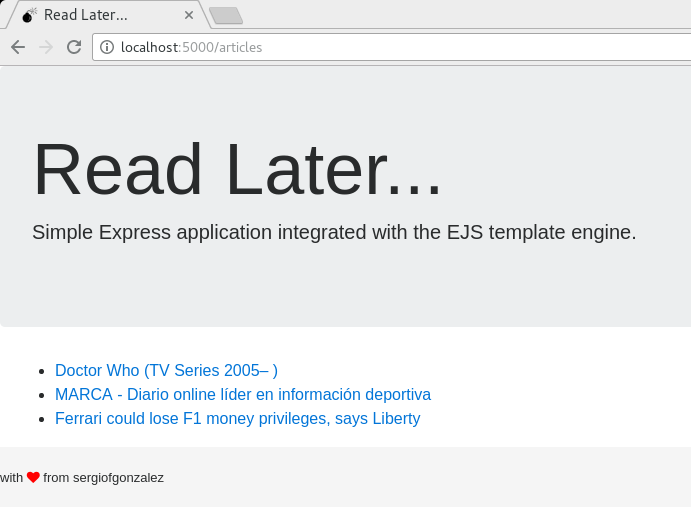

# 06-restful-express-with-ui
> Express based RESTful server with body parsing support, a persistence layer using SQLite, a readability module and some basic UI using the EJS template engine

## Description
Illustrates how to create a simple RESTful layer to manage *articles* downloaded from internet web pages on the backend, while serving a basic server side rendered UI.



### UI Details
Using the `ejs` module integrated with `express` a basic UI is prepared and rendered from the server side. This allows to create HTML partials in the `/views` folder which include both HTML and JavaScript bindings.
The HTML is developed using *Bootstrap 4*, *Font Awesome* a *favicon* and *custom CSS* to demonstrate how to reference static routes.

In the *Express* application, the following features are introduced to handle the UI:

#### Exposing static routes
You can configure Express to map static resources like CSS, images and icons on specific routes, so that HTML views include friendly routes which map to folders inside `node_modules`.

For example, the following piece of code is used to map the Bootstrap library in `node_modules/bootstrap/dist/css/bootstrap.css` to `/css/bootstrap.css`.
```javascript
app.use(
  "/css/bootstrap.css",   // name that can be used within the HTML views
  express.static(`node_modules/bootstrap/dist/css/bootstrap.css`)); // physical location of the module

```
Then, in the HTML view you will be able to use:
```html
...
  <!-- Bootstrap 4 CSS -->
  <link rel="stylesheet" href="/css/bootstrap.css">
...
```

You can also map directories, for example, for `font-awesome` you can do:
```javascript
app.use(
  "/css/font-awesome",   // name that can be used within the HTML views
  express.static(`node_modules/font-awesome`)); // physical location of the module
```
which will give access to the CSS and fonts (fonts are referenced within the CSS file):
```html
  <!-- Font Awesome for the icons -->
  <link rel="stylesheet" href="/css/font-awesome/css/font-awesome.css">
```

Finally, you can also map static resources in your app, like custom CSS and images:
```javascript
app.use(
  "/css",   // name that can be used within the HTML views
  express.static(`${__dirname}/css`)); // physical location of the module

app.use("/images", express.static(`${__dirname}/images`));
```

#### Configuring views location
The default location for the `views` will not work with the project structure. Therefore, it is necessary to customize it using the views property:

```javascript
app.set(`views`, `${__dirname}/views`);
```

#### Serving HTML and JSON
The `GET` endpoints are configured to serve HTML or JSON depending on the `Accept` HTTP header received.

```javascript
  res.format({
    html: () => res.render("articles.ejs", {articles}),
    json: () => res.send(articles)
  });
```

#### EJS Template Details
Basic EJS Template syntax is used, as it was intended to demonstrate *Express* capabilities rather than *EJS* capabilities.
+ Including partials
+ Using bound JavaScript objects
+ Embedding JavaScript to conditionally include HTML

### Backend Details
The following routes must are enabled:
+ `POST /articles` &mdash; Create a new article
+ `GET /articles/:id` &mdash; Retrieve the given article
+ `GET /articles` &mdash; Retrieve all the articles
+ `DELETE /articles/:id` &mdash; Delete an article

The parsing is performed with the `body-parser` module configured to handle both form encoded data and JSON.

The persistence layer exposes the following methods:
+ `Article.all(callback)` &mdash; Return all articles
+ `Article.find(id, callback)` &mdash; Return the corresponding article
+ `Article.create(article, callback)` &mdash; Save/Update the given article
+ `Article.delete(id, callback)` &mdash; Deletes the given article


The data for the application is persisted on a *SQLite* database. The file `later.sqlite` will be created to maintain the articles data between executions. This file will be automatically created on the first run.

A readability module `node-readability` is used to simplify the web page structure so that it can be persisted in the database as text. The `node-readability` module receives a *URL* and returns an object that contains a `title` and `contents`.
```javascript
  read(url, (err, result) => {
    if (err || !result) {
      // ... manage error ...
    }
    Article.create({title: result.title, content: result.content}, (err, article) => {
      // ... persist on the database ...
    });
```

### Testing the application with the browser
As the application includes a UI for GET operations you can test the functionality from http://localhost:port/articles.


### Testing the application with curl
You can use `curl` to test the application
```bash
# Test create a new article using form encoded bodies 
$ curl --data "url=http://www.imdb.com/title/tt0436992/" http://localhost:port/articles

# Test create a new article using JSON encoded bodies 
$ curl curl --header "Content-Type: application/json" \
--data '{"url": "http://www.imdb.com/title/tt0436992/"}' \
http://localhost:port/articles

# Test retrieve the given article 1 in JSON
curl --headerAccept: application/json" http://localhost:port/articles/1

# Test retrieve all the articles in JSON
$ curl --headerAccept: application/json" http://localhost:port/articles

# Test delete article
$ curl --request "DELETE" http://localhost:5000/articles/1

```


### Additional info
The project can be used as a template for all *Express* based projects. It includes the `config` custom module and lists `express`, `body-parser` and `log4js` as dependencies.
The *SQLite* database layer is handled with `sqlite3` module.
The simplification of the accessed web pages (aka readability) is done through `node-readability` module.
As the `config` module is not published in *NPM*, config dependencies `nconf` and `js-yaml` are also added in the `package.json`.

The template engine for the UI is `ejs`. Both *Bootstrap 4* and *Font Awesome* CSS libraries referenced from the pages are managed through *NPM*.
