# e03-express-https-static-website

> *Express* application that exposes a static website through HTTPS

## Application Description

In this project we build the an Express based server that can be used to expose an static or JavaScript based website. The most relevant part of this exercise is the configuration of the security certificates to use HTTPS. 

The following steps will be followed:
1. Generate a key for the *root SSL certificate*
2. Create the *root SSL certificate*
3. Create the *CSR (certificate signing request)*, also known as the *server key*
4. Create the *server certificate*
5. Configure the *Express application* with server certificate and server key (CSR)
6. Test 1, accepting browser security warnings
7. Install the *root SSL certificate* into Ubuntu's system certificate store
8. Configure *Chrome* browser with *root SSL certificate*


### Step 1: Generating a key for the *root SSL certificate*

In this step, we generate a private key that will be used in the creation of the *root SSL certificate*. As this key is not specifically linked with this application, it is recommended to create it and keep it separate from the application you want to secure with HTTPS.

Therefore, you should type:

```
# create and cd to a directory not linked with the Express app
mkdir -p ~/Development/https-resources
cd ~/Development/https-resources

# generate an AES256, 2048 bits long key for the root SSL certificate
$ openssl genrsa -aes256 -out rootCA.key 2048
Generating RSA private key, 2048 bit long modulus
.....................................................................................................................................................+++
...................+++
e is 65537 (0x10001)
Enter pass phrase for rootCA.key:   # <- type a password
Verifying - Enter pass phrase for rootCA.key:  # <- retype previous password
```

### Step 2: Create the *root SSL certificate*

In this step, we create the root SSL certificate. This will be used as a self-signed CA, used to validate the server certificate(s) we use.

```
# create root SSL certificate using previously generated key
# -nodes: don't encrypt the private key
# -days: override the default validity with the given number
$ openssl req -x509 -new -nodes -key rootCA.key -sha256 -days 1024 -out rootCA.pem
Enter pass phrase for rootCA.key: # <- the password used for the key in the prev step
You are about to be asked to enter information that will be incorporated
into your certificate request.
What you are about to enter is what is called a Distinguished Name or a DN.
There are quite a few fields but you can leave some blank
For some fields there will be a default value,
If you enter '.', the field will be left blank.
-----
Country Name (2 letter code) [AU]:.
State or Province Name (full name) [Some-State]:.
Locality Name (eg, city) []:.
Organization Name (eg, company) [Internet Widgits Pty Ltd]:.
Organizational Unit Name (eg, section) []:.
Common Name (e.g. server FQDN or YOUR name) []:Self-Signed Local CA Certificate  # <- this will be used to identify the cert later on
Email Address []:sergio.f.gonzalez@gmail.com # <- same as above
```

At this point, you will have the key and certificate for your local CA:
```
$ cd ~/Development/https-resources
$ ls -la
total 16
drwxrwxr-x 2 ubuntu ubuntu 4096 Mar 14 16:10 .
drwxrwxr-x 4 ubuntu ubuntu 4096 Mar 14 15:58 ..
-rw-rw-r-- 1 ubuntu ubuntu 1766 Mar 14 16:00 rootCA.key
-rw-rw-r-- 1 ubuntu ubuntu 1277 Mar 14 16:10 rootCA.pem
```

### Step 3: Create the *CSR (certificate signing request)*, also known as the *server key*

In this step we will generate the server key, that is, the private part of the keypair that will be installed on the server application to enable HTTPS. For this reason, the *Express* application will need access to this key, so you might want to place it under the `./app/src/certs` or a similar directory.
However, it is also possible to use the same self-signed certificate for different applications running on the same development environment, so you can also create it in `~/Development/https-resources` with the other system-level certificates. 
We will use the latter approach.

Note also that, in general, the generated key should not be distributed or committed into the repo. However, this is self-signed key intented for development, so no harm done even if you commit it.

To create the *server key* we will first create a `server.csr.cnf` file that will alleviate many of the manual inputs for the subsequent command.
```
# server.csr.cnf

[req]
default_bits = 2048
prompt = no
default_md = sha256
distinguished_name = dn

[dn]
CN = localhost
emailAddress = sergio.f.gonzalez@gmail.com
```

Now we're ready to create the actual *server key*:
```
# create the certificate signing request (CSR), also referred to as server key
$ openssl req -new -sha256 -nodes -out server.csr -newkey rsa:2048 -keyout server.key -config <(cat server.csr.cnf)
Generating a 2048 bit RSA private key
.............+++
.......................................+++
writing new private key to 'server.key'
-----
```

### Step 4: Create the *server certificate*

In this step we generate the *X509 v3 certificate*, that is, the public part of the keypair that will be installed on the server application to enable HTTPS. For this reason, the *Express* application will need access to this certificate, so you might want to place it under the `./app/src/certs` or a similar directory.
If you intend to use the same cert for several locally hosted applications, you can create the cert in the same `~/Development/https-resources` we've been using and copy it later to the HTTPS-enabled application.


Note also that, in contrast to the server key, the generated key can be distributed and committed into the repo. 

First of all, we need to create a file with the configuration information for the *X509 v3 certificate* that we will use afterwards:

```
# v3.ext

authorityKeyIdentifier=keyid,issuer
basicConstraints = CA:FALSE
keyUsage = digitalSignature, nonRepudiation, keyEncipherment, dataEncipherment
subjectAltName = @alt_names

[alt_names]
DNS.1 = localhost
IP.1 = 127.0.0.1
IP.2 = 192.168.56.101
IP.3 = 192.168.56.102
```

Note that we specify both the DNS and IP addresses for which the *server certificate* will be valid. This is especially useful if (like me) you use a VM for local development and you sometimes access the applications running inside the VM from the host machine (e.g. 192.168.56.101) as well.

Then, we can proceed to create the *server certificate*:
```
$ openssl x509 -req -in server.csr -CA rootCA.pem -CAkey rootCA.key -CAcreateserial \
-out server.crt -days 1024 -sha256 -extfile v3.ext
Signature ok
subject=/CN=localhost/emailAddress=sergio.f.gonzalez@gmail.com
Getting CA Private Key
Enter pass phrase for rootCA.key: # <- type the password configured in step 1
```

### Step 5: Configure the *Express application* with server certificate and server key (CSR)

Now we're ready to start testing our *HTTPS-enabled Express* application.
The first thing we should do, is copy the *server certificate* and *server key* to a directory within the application sources, for example `./app/src/certs`.

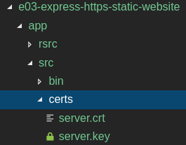

The main pieces of the Express configuration are:
+ Enable and configure the [*Helmet*](https://www.npmjs.com/package/helmet) middleware in `index.js`
+ Configure HTTPS on the `www` module, ensuring that the certificate and server key are read from the configuration

Once this is completed, you can type:
```
$ npm start
  express-static:index Application running with env = development +0ms
  express-static:index Application running with NODE_ENV = undefined +2ms
  express-static:wwww Listening on Port 8443 +0ms
```

### Step 6: Test, accepting browser security warnings

In this step, we will use *Chrome* to validate that we can access the application locally using HTTPS (or remotely, if the server is hosted on a VM, for example), by accepting the security warnings presented to use by the browser.

So, when accessing https://localhost:8443 we will see:

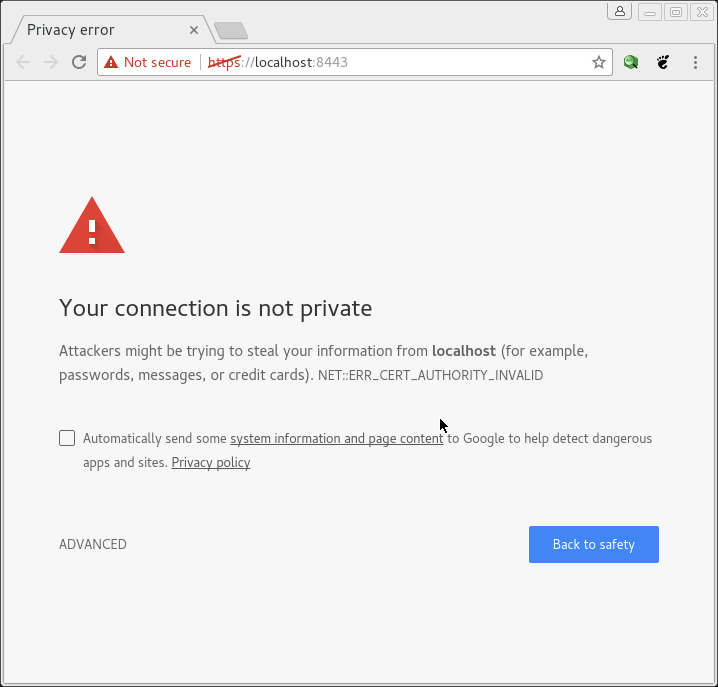

But you will be able to click on *Advanced* and *Proceed to localhost* to access the HTTPS enabled website:

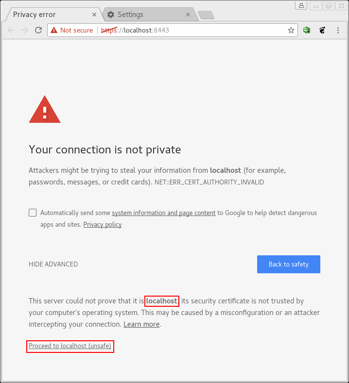

And the static web page will be displayed:

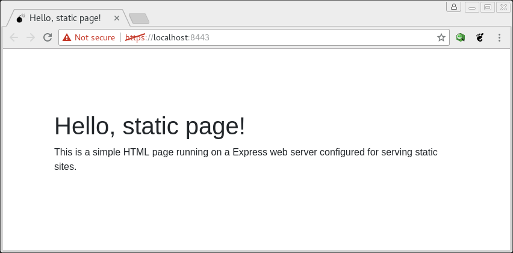

At this point, you might be satisfied enough, but we will go the extra mile and configure the self-signed root CA on the system certificate store and in Chrome, so that you no longer receive the security warnings.

### Step 7: Install the *root SSL certificate* into the Ubuntu's system certificate store

Installing the *root SSL certificate* in Ubuntu's certificate store will help the applications that rely on that store to validate server certificates, so it's a good thing to do.

The procedure has been tested on *Ubuntu 16.04*:
```
# Installing the CA
$ sudo cp ~/Development/https-resources/rootCA.pem /usr/local/share/ca-certificates/rootCA.crt

# Refresh the certs store
$ sudo update-ca-certificates
Updating certificates in /etc/ssl/certs...
1 added, 0 removed; done.
Running hooks in /etc/ca-certificates/update.d...
done.
```
After that step, there are a couple of things you can do to validate that everything is going well:
+ Check that the copied certificate has been added to the chain in `ca-certificates.crt`
+ Use openssl to obtain detailed information from the server

For the first validation type:
```
# Checking
$ cat /etc/ssl/certs/ca-certificates.crt
...
-----BEGIN CERTIFICATE-----
MIIDYzCCAkugAwIBAgIJAIO2XWFg6i8ZMA0GCSqGSIb3DQEBCwUAMEgxGjAYBgNV
BAMMEUxvY2FsIENlcnRpZmljYXRlMSowKAYJKoZIhvcNAQkBFhtzZXJnaW8uZi5n
b256YWxlekBnbWFpbC5jb20wHhcNMTgwMzE0MTAwNjIwWhcNMjEwMTAxMTAwNjIw
WjBIMRowGAYDVQQDDBFMb2NhbCBDZXJ0aWZpY2F0ZTEqMCgGCSqGSIb3DQEJARYb
c2VyZ2lvLmYuZ29uemFsZXpAZ21haWwuY29tMIIBIjANBgkqhkiG9w0BAQEFAAOC
AQ8AMIIBCgKCAQEAwbuDifjqr9NJkNB0Pr3hSUV2txtQN5C0zq2OdN9fOddFgN+b
ekzPg5122ypXs3Paei5123STZnT7woZwcg67aPaKiXkz5OXsC911C/nLvHA5foUT
ibq1ubhtQQiTXMTVENJ3IfymcmMhuBpX/RbR8ZNljNbPrXSSf43gnYfbGZKFvwn1
z9C2Euak7pza5HsFxxFfcC8FYhXsOq+MhWgwPAp/3lAG0cloMNLf8cAyiCAodswM
rJsJ/In4du5AM786OZaf85Dcd8A2lb3qCrsMv7R4p1v7iZGm1YLPQSRUbvG+VeI0
hFGTO/iKbYtrEfSRSvCkl+FtRYeElsJNgF9I+wIDAQABo1AwTjAdBgNVHQ4EFgQU
OS3HjjgmAvDbNeSlAHPfwvgki8cwHwYDVR0jBBgwFoAUOS3HjjgmAvDbNeSlAHPf
wvgki8cwDAYDVR0TBAUwAwEB/zANBgkqhkiG9w0BAQsFAAOCAQEABfeNAqluh5FS
dc6gGfN9sVJCigktfnMZt5QTVQYO+tHNfaEaJm4JO5NYB8VOQ3t4PNBFJydmKEwI
flh56QitqTyIIkN3DAN3K0Ab+Lki1hh3/wTmRmQfpkG0mwTylBvHc2A10AIHp++n
vFLyZ30sSrqu6IrDIs+EvqwY+FjR+rMRX2E9tniCQNd75td7eeiLq7uNHC7zqkMk
Bo0M+ZSMuthTlUqYqGhzFeMDz6y++G75RFGoPx7n0Lon0igrnjJ9j/GhsjEestbz
t89m10W+BeBPy6nvsAmTtMwUz1EIq53LjKRHBChhd09mstIcnMf6fjlnZvh5pgXV
DuP5Phb6NA==
-----END CERTIFICATE-----
```

You can check that the last entry in the file matches the contents of our `rootCA.pem`.

The second verification is much more elaborate and requires the server to be running. It consists on an *OpenSSL* command that actually interacts with the server as the browser would do and returns the HTTPS related information:

```
# start the server
$ npm start

$ openssl s_client -connect localhost:5000 -CApath /etc/ssl/certs
CONNECTED(00000003)
depth=1 CN = Self-Signed Local CA Certificate, emailAddress = sergio.f.gonzalez@gmail.com
verify return:1
depth=0 CN = localhost, emailAddress = sergio.f.gonzalez@gmail.com
verify return:1
---
Certificate chain
 0 s:/CN=localhost/emailAddress=sergio.f.gonzalez@gmail.com
   i:/CN=Self-Signed Local CA Certificate/emailAddress=sergio.f.gonzalez@gmail.com
---
Server certificate
-----BEGIN CERTIFICATE-----
MIIDljCCAn6gAwIBAgIJAI1whZHDLtRXMA0GCSqGSIb3DQEBCwUAMFcxKTAnBgNV
BAMMIFNlbGYtU2lnbmVkIExvY2FsIENBIENlcnRpZmljYXRlMSowKAYJKoZIhvcN
AQkBFhtzZXJnaW8uZi5nb256YWxlekBnbWFpbC5jb20wHhcNMTgwMzE0MTU1MzA4
WhcNMjEwMTAxMTU1MzA4WjBAMRIwEAYDVQQDDAlsb2NhbGhvc3QxKjAoBgkqhkiG
9w0BCQEWG3Nlcmdpby5mLmdvbnphbGV6QGdtYWlsLmNvbTCCASIwDQYJKoZIhvcN
AQEBBQADggEPADCCAQoCggEBANtnJrpE7INd5dCRWnOxNPG+LBsPrSZ6JQ4Mdaw8
tnMb5SLJ160+Ht9ds7mbw4E+bDmQZMKXyrsEc7e0EEQGIWOo2hQHOw+fsLeYCtTp
iciwXR7rb5KzthbbPovfi9xZTY8i1svZIHlWIgpZR7BFxMe4uW8sSw3ktQSISifQ
NVF4gZw5muRHIQHZ7+/B3mkLsByNbAgSaCkGsseAjEpWPW4sTH6qCodCQbw5FWgW
xc0002tCXG50v4PUny8x6SU+cmUdT7f4FrP9EjerRPRSlrj6BA50OreRS+L2xEWG
aH4rVX3Epdnk7kJ5GjFHVrWZwxn9JdPgQ0W7eNdKt2h0adECAwEAAaN8MHowHwYD
VR0jBBgwFoAUYWASZIvZ6bomdXjaF1u6eOVR+eQwCQYDVR0TBAIwADALBgNVHQ8E
BAMCBPAwPwYDVR0RBDgwNoIJbG9jYWxob3N0ggkxMjcuMC4wLjGCDjE5Mi4xNjgu
NTYuMTAxgg4xOTIuMTY4LjU2LjEwMjANBgkqhkiG9w0BAQsFAAOCAQEALQcD8SNX
UekZem23uK6rUttQG60SiNFo/r+dCmwpbrwdocUpgFfvUcovGalk/FPtq+lh6VCj
KIH0tu+H14IVFsIu+5xr5xb7ys6rDusk/ugPqpHptr726k9deYuuTuJY9H+lO/5g
/4XyGNvy0s2QRX/88fe6cbcGWJX1kadM8d3a8fCz1/x/Sqm8K2drzrV2NMSgNI9Q
rcN36o/mYM/sj4jJTJbRAO0EdksmFysTOxMwTiloJE5ZBFv85So7WGbbIiAeF/GR
Bz1mD9idbXzsfAYqj6yesp6LyLQWwttZj58v4TWMpgMBFczDst3StwCYx5cNPLjH
aRaLBKC5LAEkgw==
-----END CERTIFICATE-----
subject=/CN=localhost/emailAddress=sergio.f.gonzalez@gmail.com
issuer=/CN=Self-Signed Local CA Certificate/emailAddress=sergio.f.gonzalez@gmail.com
---
No client certificate CA names sent
Peer signing digest: SHA512
Server Temp Key: ECDH, P-256, 256 bits
---
SSL handshake has read 1608 bytes and written 431 bytes
---
New, TLSv1/SSLv3, Cipher is ECDHE-RSA-AES128-GCM-SHA256
Server public key is 2048 bit
Secure Renegotiation IS supported
Compression: NONE
Expansion: NONE
No ALPN negotiated
SSL-Session:
    Protocol  : TLSv1.2
    Cipher    : ECDHE-RSA-AES128-GCM-SHA256
    Session-ID: 4684C4A11F275F63B0FFA58FF047AD312D3D9382C614A2DCF3B40A1816210939
    Session-ID-ctx:
    Master-Key: C5ABA74C46C701C8257F6AF19AFA88314E9EAA4AB0F82E67F4274E5BD67BE7414873BB71FF98DC62DEB990E65215C11D
    Key-Arg   : None
    PSK identity: None
    PSK identity hint: None
    SRP username: None
    TLS session ticket lifetime hint: 300 (seconds)
    TLS session ticket:
    0000 - db 47 ff d6 1a 55 9b a9-a4 c4 d1 22 10 fc e9 73   .G...U....."...s
    0010 - ff c2 94 30 b2 84 70 95-90 79 36 b7 ae c1 23 5a   ...0..p..y6...#Z
    0020 - b7 4f 2d d0 f3 03 ea 38-f1 73 3a f0 3f d3 ba d6   .O-....8.s:.?...
    0030 - a1 9c 29 ab 54 2f 5a 0e-56 af f0 87 eb a4 b2 b5   ..).T/Z.V.......
    0040 - aa 30 8e 37 2a b4 5a ba-b4 4d f1 7a b8 ec 0a 25   .0.7*.Z..M.z...%
    0050 - 3a ab f7 7a ef 50 a1 95-2b 05 c5 10 a1 22 a7 dc   :..z.P..+...."..
    0060 - 08 37 69 15 ba 1b e7 a0-84 cf 90 76 df 48 25 63   .7i........v.H%c
    0070 - af fa b9 a5 e6 ba 34 c6-da 11 77 47 69 81 33 a1   ......4...wGi.3.
    0080 - 03 bb 78 2f 9f be fa 63-e7 51 61 c2 3e db f2 90   ..x/...c.Qa.>...
    0090 - 67 ab ec 2a 70 21 b0 fb-0d 09 e5 5e 44 90 df b0   g..*p!.....^D...
    00a0 - 8f 6e 7a 95 89 25 30 35-d1 06 43 67 b9 a9 2f e5   .nz..%05..Cg../.
    00b0 - 23 c8 ec 69 6f 0e 39 94-3d be 7c c7 04 2a 41 21   #..io.9.=.|..*A!

    Start Time: 1521052765
    Timeout   : 300 (sec)
    Verify return code: 0 (ok)
---
```

In this output you can see how the correct certificate has been identified and all the return codes are successful.

The same type of output you'd get for `127.0.0.1:8443`.

### Step 8: Install the *root SSL certificate* into Chrome's certificate store

If we try again to access https://localhost:8443 from the browser we will see that we still get the same security warning as before, but that can be easily fixed by installing the *root SSL certificate* `rootCA.pem` generated on [step 2](#step-2-create-the-root-ssl-certificate).

To do that, open Chrome Settings, type *Manage Certificates*:

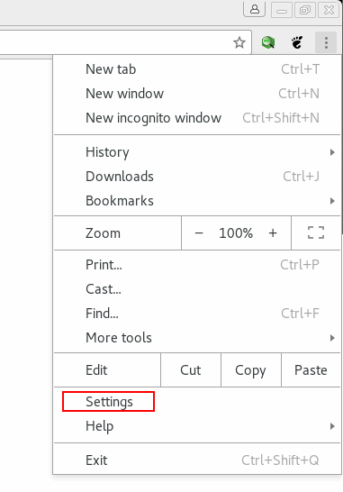

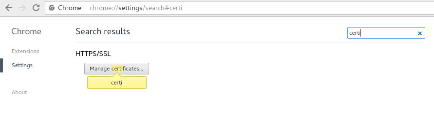

Then, you just have to import the self-signed root SSL certificate into Chrome:
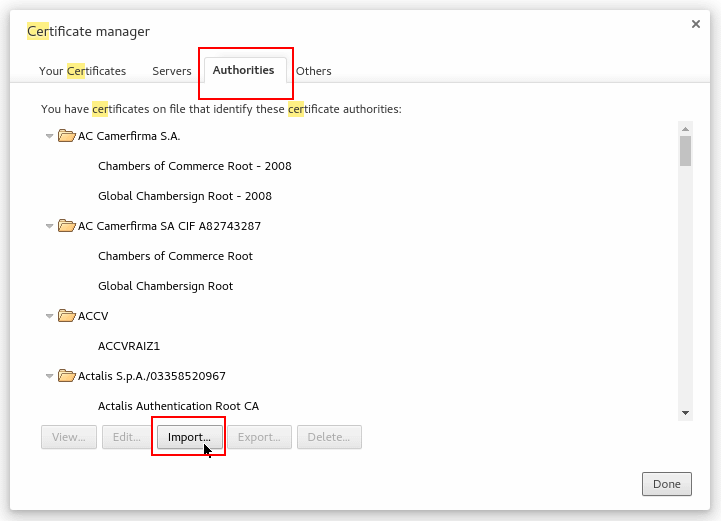

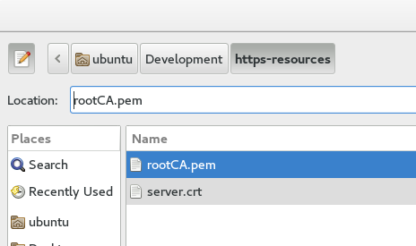

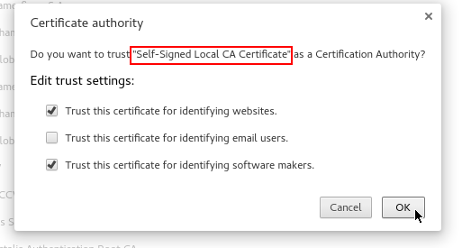

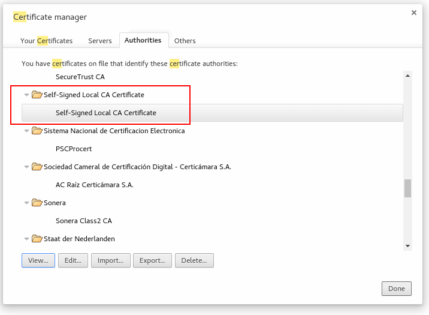

Once completed the configuration, you can try again to access https://localhost:8443 and you will see the green lock on the toolbar!

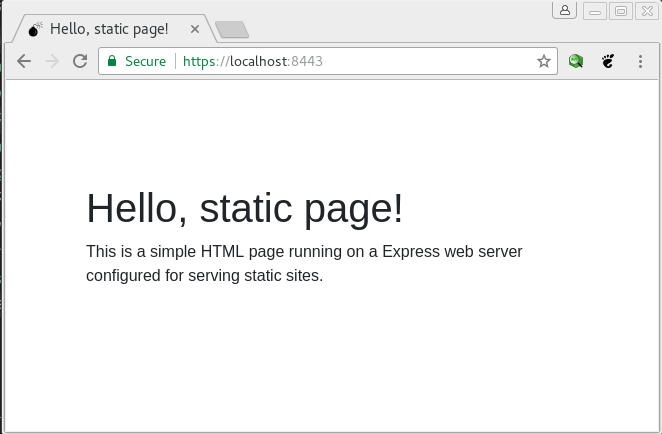

Note that the same sequence of steps can be followed to install the *root SSL certificate* into the host machine if you use VMs for local development.

## References

+ https://medium.freecodecamp.org/how-to-get-https-working-on-your-local-development-environment-in-5-minutes-7af615770eec
+ https://superuser.com/questions/437330/how-do-you-add-a-certificate-authority-ca-to-ubuntu
+ https://www.openssl.org/docs/manmaster/man1/req.html
+ http://blogmines.com/blog/how-to-import-a-certificate-in-google-chrome/