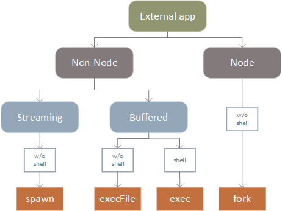

# 06-hello-detached-process

> executing a non-Node application, as a detached process, so that it can keep running even when the parent process dies

## Description

This example illustrates how to start a detached process from a Node.js application using `spawn` so that it is unaffected with what happens with the parent process (normally, any child process will be terminated when the parent process is terminated).

In the example, we run a long running script stored in `scripts/` using `spawn`. This script writes a record every second to the file `execution-log.txt`.

Note that even when detaching, the parent process will remain active. However, when you kill the parent process (e.g. typing CTRL-C), the child process will remain active.

In Node.js, the `child_process` module allows you to execute other applications (including Node applications).
It provides 4 different async methods that are intended for different scenarios:
+ `execFile` &mdash; execute an external application, given a set of arguments, and callback with the buffered output after the process exits.
+ `spawn` &mdash; execute an external application, given a set of arguments, and provide a streaming interface for I/O and events for when the process exits.
+ `exec` &mdash; execute one or more commands inside a shell an callback with the buffered output after the process exits.
+ `fork` &mdash; execute a Node module as a separate process, given a set of arguments, provide a streaming and eventd interface like `spawn` and also set up an inter-process communication (IPC) channel between the parent and child process.

