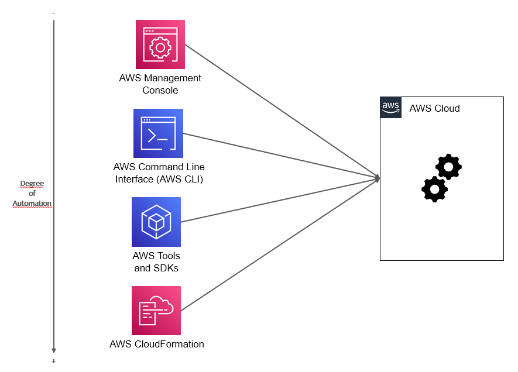

# Chapter 19 &mdash; Interacting with Amazon Web Services
## Section 1: Intro to AWS
> basic concepts about AWS and the cloud

### Summary
+ Overview of AWS
+ Cloud: types and service categorization
+ Benefits of AWS

### Intro
*Amazon Web Services (AWS)* is a platform of web services that offers solutions for computing, storing, and networking at different levels of abstraction. These web services are available through the public internet using standard protocols such as HTTP.

In more general terms, AWS is known as a public cloud computing platform:
> Cloud computing is a model for enabling ubiquitous, convenient, on-demand network access to a shared pool of configurable computing resources (such as networks, vms, storage, applications, and services) that can be rapidly provisioned and released with minimal management effort or service provider interaction.

Clouds can be classified as:
+ *public* &mdash; a cloud managed by an organization and open to use by the general public
+ *private* &mdash; a cloud that virtualizes and distributes the IT infrastructure for a single organization
+ *hybrid* &mdash; a mixture of a public and private cloud

The cloud computing services can be classified according to the level of abstraction they provide:
+ *IaaS* &mdash; provides fundamental resources like computing, storage, and networking capabilities.
+ *PaaS* &mdash; provides platforms on which you can deploy custom applications to the cloud.
+ *SaaS* &mdash; combines infrastructure and software running in the cloud.

### Benefits of AWS

+ Innovative and fast-growing platform
+ Wide range of services that solve common problems
+ Automation baked into the platform
+ Scalability and reliability
+ Reduced time to market
+ Economies of scale
+ Huge global infrastructure
+ Pay-per-use

### Ways to interact with AWS

The following diagram depicts the different ways you can use to interact with AWS:

### AWS global infrastructure: *Regions* and *Availability Zones*

AWS Cloud infrastructure is built around *AWS Regions* and *Availability Zones*.

> An *AWS Region* is a physical location in the world where AWS have multiple *Availability Zones*. Each *AWS Region* is designed to be completely isolated from other *AWS Regions*.

> An *Availability Zone* consists of one or more concrete discrete data centers, each with redundant power, networking, and connectivity, housed in separate facilities. Each *Availability Zone* is designed as an independent failure zone: each *Availability Zone* is isolated, but the *Availability Zones* within a *AWS Region* are connected through low-latency links.

There are over 60 *Availability Zones* in more than 20 *AWS Regions* around the world.

### You know you've mastered this section when...

+ You are comfortable describing AWS as a public cloud
+ You understand the different types of clouds and their service categorization according to the abstraction level they provide
+ You understand the benefits of using AWS (or any cloud provider for that matter)
+ You are aware of the different options available to access and interact with AWS
+ You can define the terms *AWS Region* and *Availability Zone*.

### Glossary

| Term         | Description |
| :----------- | :---------- |
| *Amazon Web Services* | *Amazon Web Services (AWS)* is a platform of web services that offers solutions for computing, storing, and networking at different levels of abstraction. These web services are available through the public internet using standard protocols such as HTTP. |
| *AKI* | *Amazon Kernel Image* (*AKI*) the artifact from where the kernel is loaded when launching an *EC2* instance. |
| *AMI* | *Amazon Machine Image* (*AMI*) is the basis an *EC2* instance starts from on *AWS*. <small>An *AMI* is a special type of *virtual appliance* for use with the *EC2* service. Technically, it consists of a read-only filesystem including the OS, additional software, and configuration.</small> |
| *ARN* | *Amazon Resource Name (ARN)* is the way in which resources are identified in AWS. It is an identifier with a particular format that includes the account, the service, the region, etc. |
| *Availability Zone* | A one or more discrete data centers, each with redundant power, networking, and connectivity, house in separate facilities. Each *Availability Zone* is designed as an independent failure zone: each *Availability Zone* is isolated, but the *Availability Zones* within an *AWS Region* are connected through low-latency links. |
| *AWS SAM* | AWS Serverless Application Model. An open source framework that you can use to build serverless applications on AWS. It invludes a template specification that extends *CloudFormation templates* and a CLI that is used to build applications defined by *AWS SAM templates*. |
| *AWS Region* | A physical location in the world where AWS have multiple *Availability Zones*.  Each *AWS Region* is designed to be completely isolated from other *AWS Regions*. |
| *AWS shared responsibility* | The security model for *AWS Cloud* in which *AWS* is responsible for *security of the cloud* while you're responsible for *security in the cloud*. |
| Cloud Computing | Cloud computing is a model for enabling ubiquitous, convenient, on-demand network access to a shared pool of configurable computing resources (such as networks, VMs, storage, applications, and services) that can be rapidly provisioned and released with minimal management effort or service provider interaction. |
| Edge location | Endpoints for AWS that are used for caching contents. |
| *Elastic IP* | A static IPv4 address that can be attached to a machine so that it public address is preserved when stopping and starting an *EC2* instance. |
| Hypervisor | The software component responsible for isolating the guests running on a host machine from each other, and for scheduling requests to the hardware, by providing a virtual platform to the guest software. |
| IAM user | Identifies people (human users) with access to your AWS account. |
| IAM group | A collection of IAM users. |
| IAM role | Identifies AWS resources with access to other AWS resources in your account. |
| IAM policy | Document that defines the permissions of a given user. |
| Inline Policy | An IAM policy defined for a particular *IAM role*, *IAM user* or *IAM group* and that cannot exist without it. It is not a standalone object. |
| Managed Policy | An IAM policy intended to be reused. There are two types: *AWS Managed policies* and *Customer Managed Policies*. |
| Principle of Least Privilege | The principle of least privilege is the information security concept in which a user/resource is given the minimum level of access (permissions) needed to perform their function. This ensures that the access a user/resource receives is exactly the one needed and nothing more. |
| Security Group | A stateful security artifact provided by *AWS* that lets you control the inbound/outbound traffic rules for your resources. Each rule is defined for a given direction, IP protocol, Port and Source/Destination. The latter can be a given IP address, an IP range, or a security group. |
| Stack | The realization of a *CloudFormation* template. |
| Template | (*CloudFormation*) A file written in JSON/YAML format that describes the state of a particular infrastructure solution. |
| Virtual appliance | an image of a virtual machine containing an OS and preconfigured software. |
| VPC Flow Logs | Service that allows you to get access to aggregated log messages containing granted and rejected connections. |

### AWS Services

| AWS Service | Category | Description |
| :---------- | :------- | :---------- |
| AWS CloudFormation | Management and Governance | Gives developers and system admins an easy way to create and manage a collection of related AWS resources. The service supports provisioning, updating, and deletion in an orderly and predictable fashion. *AWS CloudFormation* is the *IaC* solution for AWS. |
| Amazon EC2 | Compute | Web service that provides secure, resizable compute capacity in the cloud. <small>It is designed to make web-scale computing easier for developers. Amazon EC2 changes the economonics of computing by allowing you to pay only for capacity that you actually use. Amazon EC2 provides devs and sysadmins the tools to build failure resilient applications and isolate themselves from common failure scenarios.</small> |
| Amazon VPC | Networking | *Amazon Virtual Private Cloud (Amazon VPC)* lets you provision a logically isolated section of the AWS Cloud where you can launch AWS resources in a virtual network that you define. You can select your own IP address range, create subnets, and configure the route tables, network gateways, and network ACLs. You can use both IPv4 and IPv6 in your *VPC*. |
| AWS IAM | Security, Identity, and Compliance | *AWS Identity and Access Management (IAM)* enables you to securely control access to AWS services and resources for your users. Using *AWS IAM* you can create and manage AWS users and groups, and use permissions to allow and deny their access to AWS resources. |
