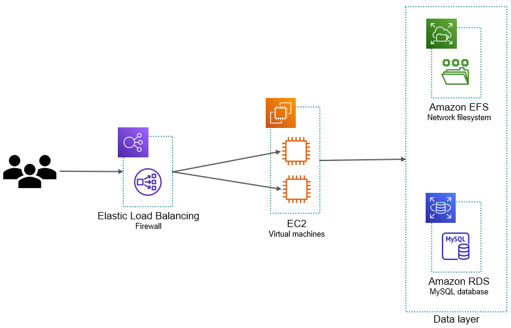

# Chapter 19 &mdash; Interacting with Amazon Web Services
## Section 2: A Deployment Example &mdash; Wordpress on AWS
> Designing an architecture for a highly-available deployment on AWS

### Summary
+ Drawing and understanding AWS architecture diagrams
+ Understanding the basics of compute, storage and database services
+ Additional services on AWS

### Intro
This section puts you in the place of a Technical Architect that needs to migrate an existing *WordPress* running on an on-premise infrastructure to AWS. You need the *WordPress* to be available 99.99% of the time, so you will need to design a highly-available solution.

| NOTE: |
| :---- |
| *WordPress* is written in PHP and uses a MySQL database to store data. Apache is used as the web server to serve the pages. |

### Designing your infrastructure

In order to keep it simple, and yet comply with the high-availability requirements you will develop the following solution:

The most relevant pieces of the infrastructure are:

+ **Elastic Load Balancing (ELB)** &mdash; The load balancer will distribute traffic to a bunch of virtual machines, and is highly available by default. We'll use an Application Load Balancer (ALB) which operates on Layer 7 (HTTP and HTTPS).

+ **Elastic Compute Cloud (EC2)** &mdash; EC2 service provides virtual machines that we will use to install the software products supporting WordPress: Apache, PHP, and WordPress. In the event of a virtual machine failure, the *Load Balancer* will be in charge of stop sending traffic ro the failed VM. The health of the virtual machines will be based on signals sent by the *Load Balancer*.

+ **Relational Database Service (RDS) for MySQL** &mdash; RDS provides *MySQL-as-a-Service*. We can configure the database instance size (storage, CPU, RAM), and RDS will take over operational tasks. A highly-available version is provided, but we won't use it.

+ **Elastic File System** &mdash; EFS is a scalable, highly available and durable network file system, your virtual machines can access these files using the well-known protocols such as NFSv4.1 protocol.

Another important aspect that is not evident in the picture are the **Security Groups**. *Security Groups* control incoming and outgoing traffic to the VMs, database, load balancer, etc. You can think of *security groups* as firewalls rule that drive whether the components can communicate with each other using specific ports and protocols.

### Supporting services available for our deployment
Apart from the infrastructure services described above, there's a plethora of other services than will assist in the deployment and tracking of resources we define.

#### CloudFormation: Infrastructure-as-Code

**AWS Cloud Formation** is the AWS service that let you handle infrastructure as code. Specifically, it will let you create a *stack*, and then add a template that will include the specification of your infrastructure as a JSON or YAML object.

This is a fundamental piece for *automating* your infrastructure deployments, both for creation and update. It is also a great option for deleting your infrastructure when implementing a *proof-of-concept*.

#### Resource Groups: grouping your infrastructure
A **Resource Group** is a collection of AWS resources that are identified as belonging to a particular set. In particular, all AWS resources can be identified and tagged using *key-value pairs*, and *resource groups* specify which tags are needed for a resource to belong to a particular group.

#### AWS Pricing Calculator: estimating your costs

[AWS Simple Monthly Calculator](https://calculator.s3.amazonaws.com/index.html) is a web page that was traditionally used to estimate your costs in AWS. However, it has been deprecated in favor of [AWS Pricing Calculator](https://calculator.aws/#/).

The idea is exactly the same, list all the components you use, along with some ancillary costs related to other things such as bandwidth or additional storage.

### You know you've mastered this section when...

+ You're comfortable reading and drawing AWS architecture diagrams
+ You're familiar with the basic elements of a deployment:
  + **EC2** &mdash; Virtual machines
  + **ALB** &mdash; Application Load Balancers
  + **RDS** &mdash; Relational database-as-a-Service
  + **EFS** &mdash; Durable network file system
  + **Security Groups** &mdash; Firewall rules attached to AWS resources
  + **CloudFormation** &mdash; Infrastructure-as-Code
  + **Resource Groups** &mdash; Grouping your infrastructure resources
  + **AWS Pricing Calculator** &mdash; Estimating your infrastructure costs
