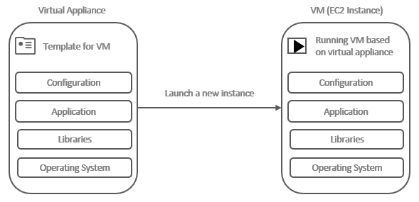

# Chapter 19 &mdash; Interacting with Amazon Web Services
## Section 3: Using EC2
> first steps with VMs in AWS

### Summary
+ Introducing VMs in AWS
+ AMIs and Virtual Appliances
+ EC2 instances: types and sizes
+ Lifecycle of an instance
+ Criteria for selecting an *AWS Region*
+ EC2 pricing model: on-demand and reserved instances
+ Labs:
  + Lab 3.1: Creating a key pair
  + Lab 3.2: Launching an EC2 instance from the AWS Console
  + Lab 3.3: Obtaining the system logs of an EC2 instance
  + Lab 3.4: Installing an Apache HTTP server with an *Elastic IP*
  + Lab 3.5: Attaching an additional network interface to a VM

### Intro

On AWS, *virtual machines* (VMs) are offered by the service called *Elastic Compute Cloud (EC2)*.

A VM is a *portion* of a physical machine that is isolated by software from other VMs on the same physical machine.

The following diagram illustrates the concept:


+ A VM consists of CPUs, memory, networking interfaces, and storage.

+ The physical machine is called the *host machine*, and the VMs running on it are called guests.

+ A *hypervisor* is responsible for isolating the guests from each other, and for scheduling requests to the hardware, by providing a virtual platform to the guest system.

### Concepts on AMIs and Virtual Appliances

The AMI is the basis your VM starts from on AWS. The AMI concept is closely related to the more general term of a *virtual appliance*:

> A *virtual appliance* is an image of a virtual machine containing an OS and preconfigured software. *Virtual appliances* are used when the hypervisor starts a new VM. Because a *virtual appliance* contains a fixed state, every time you start a VM based on a virtual appliance you'll get the exact same result. *Virtual appliances* are useful to eliminate the effort of installing and configuring complex stacks of software (e.g. S/4HANA running on RHEL).



As illustrated in the diagram above, a *virtual appliance* defines a template for a virtual machine.

The *AMI* is a special type of *virtual appliance* for use with the EC2 service. Technically, it consists of a read-only filesystem including the OS, additional software, and configuration.

| NOTE: |
| :---- |
| When launching an EC2 instance, the kernel itself is loaded from an Amazon Kernel Image (AKI), that is not part of the AMI. |

### EC2 instances: family types and sizes

EC2 instances are classified in family types:

| Family | Description |
| :----- | :---------- |
| f     | Accelerated computing based on FPGAs |
| i     | High-speed, SDD storage |
| g     | Accelerated graphics computing |
| h     | High disk throughput |
| t ⭐  | General purpose, moderate baseline performance with the ability to burst to higher performance for short periods of time |
| d     | Dense storage (HDD optimized) |
| r     | Memory optimized |
| m ⭐  | General purpose, with balanced ratio of CPU and memory |
| c[g]  | Computing optimized (High CPU performance) |
| p     | Graphics Optimized (CPU based) |
| x     | Memory optimized |
| z     | High-end compute capacity and memory footprint |

The instance type is denoted using the following syntax:

```
{family}{generation}[{variant}].{size}
```

For example, a `t2.micro` is a *micro* instance size of the second generation of the T family of instances.

| NOTE: |
| :---- |
| You can obtain information about the resource associated to an EC2 instance if you *ssh* into the instance and run `cat /proc/cpuinfo` and `free -mh`. |

If you run those commands on a *t2.micro* you will obtain:

```bash
$ cat /proc/cpuinfo
processor	: 0
vendor_id	: GenuineIntel
cpu family	: 6
model		: 63
model name	: Intel(R) Xeon(R) CPU E5-2676 v3 @ 2.40GHz
stepping	: 2
microcode	: 0x44
cpu MHz		: 2399.940
cache size	: 30720 KB
physical id	: 0
siblings	: 1
core id		: 0
cpu cores	: 1
apicid		: 0
initial apicid	: 0
fpu		: yes
fpu_exception	: yes
cpuid level	: 13
wp		: yes
flags		: fpu vme de pse tsc msr pae mce cx8 apic sep mtrr pge mca cmov pat pse36 clflush mmx fxsr sse sse2 ht syscall nx rdtscp lm constant_tsc rep_good nopl xtopology cpuid pni pclmulqdq ssse3 fma cx16 pcid sse4_1 sse4_2 x2apic movbe popcnt tsc_deadline_timer aes xsave avx f16c rdrand hypervisor lahf_lm abm cpuid_fault invpcid_single pti fsgsbase bmi1 avx2 smep bmi2 erms invpcid xsaveopt
bugs		: cpu_meltdown spectre_v1 spectre_v2 spec_store_bypass l1tf mds swapgs itlb_multihit
bogomips	: 4800.09
clflush size	: 64
cache_alignment	: 64
address sizes	: 46 bits physical, 48 bits virtual
power management:

$ free -mh
              total        used        free      shared  buff/cache   available
Mem:           983M         88M        457M        512K        436M        756M
Swap:            0B          0B          0B
```

### EC2 instance lifecycle

The following actions control the lifecycle of an EC2 instance:

+ Launch &mdash; start a VM for the first time.
+ Start &mdash; starts an stopped VM.
+ Stop &mdash; stops a running VM. A stopped VM does not incur in charges except for the attached resources like network-attached storage. An stopped VM will likely lose the information that was not persisted on network-attached storage.
+ Reboot &mdash; Stops and immediately restarts a VM on the same host, so that you don't lose your data (even if not persisted on network-attached storage).
+ Terminate &mdash; completely removes a VM from the system. A terminated VM cannot be started again.

### Criteria for selecting a particular *AWS Region*
As discussed previously, AWS offers data centers all over the world. You should choose the one that best suits your needs:

+ Latency &mdash; you should choose the data center that offers the shortest distance to your users/infrastructure.

+ Compliance &mdash; some countries require that the data should be stored and process within their borders.

+ Service availability &mdash; not all the data centers offer all the services. If you are planning to use a particular service on a particular region you should check the availability first.

+ Costs &mdash; service pricing varies by region. You should choose the region with provices with the best compromise between latency and price.

AWS groups its data centers into *AWS Regions* such as "US East, North Virgina" (`us-east-1`), "EU, Frankfurt" (`eu-central-1`) or "Asia Pacific, Tokyo" (`ap-northeast-1`).

### EC2 pricing model
The machines you launch when you need them on AWS are known as *on-demand instances*, and they're billed for every second or hour the machine is running.

To reduce costs there are two options: *spot instances* and *reserved instances*.

With *spot instances* you bid for unused capacity in an AWS data center, with the price based on the laws of supply and demand. If the price of your bid is fulfilled, a VM will start and billed at the spot price. Once the spot price exceeds your bid, the VM will be *terminated* after two minutes. This options is best suited to asynchronous tasks like ML, data encoding, etc.

| NOTE: |
| :---- |
| A *spot instance* request is created from the *EC2 service* page, within the *Instances* submenu. |


With *reserved instances* you pay for a machine that you're going to need for a year or longer and you receive a discount in advance.

You can opt for:
+ No upfront payment, 1-year term
+ Partial upfront, 1 or 3-year term
+ All upfront, 1 or 3-year term

| NOTE: |
| :---- |
| Most EC2 instances running Linux are billed per second with a minimum charge per instance of 60 seconds. Windows machines and some Linux distros such as Red Hat Enterprise Linux are billed per hour. |

Additionally, if you use the *reserved instances* approach, you can choose to buy them with or without capacity reservation:
+ *Reserved instance with capacity reservation* &mdash; you reserve an instance in an specific *Availability Zone*, so that you know that you will always be able to start a VM no matter the demand on that particular data center.

+ *Reserved instance without capacity reservation* &mdash; you benefit from the reduced hourly prices for your VM in the region you have selected for your *reserved instance* but you might find it hard to start a VM if for some reason there is a high-demand of computing resources.

| NOTE: |
| :---- |
| With *reserved instances without capacity reservation* you can buy capacity for an specific machine in a region (e.g. *m4.xlarge*), and run equivalent workloads (e.g. two *m4.large*) making use of the same reservation. |

It is possible to modify a reservation without additional charges to adapt to your workload over time:
+ toggle the capacity reservation options (with/without)
+ modify which data center your reservation is in
+ split/merge reservations (e.g. merge two t2.small into t2.medium)

Also, when buying a reservation for three years you have the option to choose between standard or convertible. A standard reservation limits you to a specific instance family (e.g. *m4*), while the convertible reservation lets you change the instance family. The latter are more expensive at the cost of higher flexibility.

The recommendation is:
+ Start with *on-demand* instances
+ Switch to a mix of *on-demand* and *reserved instances* later. Depending on your requirements, you can choose between reservations with and without capacity reservation.

### Labs

#### Lab 3.1: Creating a key pair

Logging into an EC2 instance requires a key. This labs details the steps to create a key from the AWS management console.

1. In the AWS Console, navigate to the EC2 service page. Then click on *Key Pairs* item on the *Network & Security* Group.

2. Click on *Create Key Pair*.

3. Select the format of the key (PEM/PPK).

4. Enter the name of the key.

5. Download the key.

6. (Optional) Store it with the rest of your SSH keys under `~/.ssh` with a `400` (or `600` for rw) so that only your user could read it.


| NOTE: |
| :---- |
| The general approach does not change for the more compact *ed25519* key type recently added to AWS. |

### Lab 3.2: Launching an EC2 instance from the AWS Console

From main page of the EC2 service in the AWS Console, click on the *Launch Instance* button.

You will then need to follow these steps:
1. Select an OS &mdash; AWS offers the Amazon Linux AMI, based on Red Hat Enterprise Linux and optimized for use with EC2. You can also select from a wide range of Linux/Windows and Mac instances.

2. Choosing the size/type of your VM

3. Configuring details &mdash; in this step you will be asked to select the network/subnet on which the instance will be placed, and whether you would like to enable the instance with a public IP so that you can connect to it from outside AWS infrastructure.

4. Adding storage

5. Tagging your VM

6. Configuring the firewall &mdash; in this step you enable the networking rules that will be applied to inbout/outbound traffic.

7. Reviewing and selecting a key pair used for SSH authentication &mdash; the key pair will be used as the initial authentication method to connect to your newly created instance.

8. (Optional) Once running, you will be able to connect to your EC2 instance using the command `ssh -i {path-to-key} {username}@{public-DNS}. Each AMI might require a different username when connecting to it. You can find such information by navigating to the *Instances* group of options, clicking on *Instances* and within the main page, clicking on the *Connect* button.

For example, for a key with a pem file named `awsia.pem` with IP address `3.87.27.209` and user ec2-user
```bash
ssh -i ~/.ssh/awsia.pem \
ec2-user@ec2-3-87-27-209.compute-1.amazonaws.com
```

Note that if you choose an Ubuntu OS, the username will be different:

```bash
 ssh -i ~/.ssh/awsia.pem \
 ubuntu@ec2-3-87-27-209.compute-1.amazonaws.com
```

#### Lab 3.3: Obtaining the system logs of an EC2 instance

If you find a problem with your VM and cannot connect to it using the usual methods, you can retrieve the system logs from a running instance.

1. From the EC2 service page, select the running instance

2. Click on the Actions menu and choose *Monitor and troubleshoot* &raquo; Get system logs.


#### Lab 3.4: Installing an Apache HTTP server on an EC2 instance with an *Elastic IP*

The first task is to launch an EC2 instance in the same way we did for [Lab 3.2](#lab-3.2-launching-an-ec2-instance-from-the-aws-console). Make sure to enable in the security group SSH access from your IP address, as well as HTTP access from everywhere.

Then you need to install and start the Apache HTTP server:

```bash
$ sudo yum install httpd -y
...
$ sudo systemctl start httpd
$ sudo systemctl status httpd
```

If everything goes well, you will be able to see the *Test Page* from Apache when you open your browser and type the *public DNS* of the EC2 instance.

Note that the actions to carry out the same tasks in Ubuntu are similar with only a few changes:
+ Run `sudo apt update && sudo apt install apache2 -y` to install Apache
+ Run `sudo systemctl status apache2` to validate that Apache HTTP server is running.

As discussed on the concepts section, When you stop and start a VM you will be assigned a different public IP address. If you want to host your application with a fixed IP address you have to use a service called *Elastic IP*.

In order to attach an *Elastic IP* that will survive stop/start operations you have to:

1. Navigate to the *EC2 service*

2. Choose *Elastic IPs* from the submenu

3. Click on *Allocate Elastic IP address*


Then you will need to associate it to your running instance by:

1. Click on the *Actions* dropdown:

2. Select *Associate Elastic IP address*


Now you will be able to access your machine using the given Elastic IP address, that will survive stop/start.

#### Lab 3.5: Attaching an additional network interface to a VM

There are certain circumstances in which you would like to add an additional network interface to a VM. With a secondary network interface, a VM can serve requests in two different public IP addresses.

The process is similar to the creation and association of an *Elastic IP*:

1. From the *EC2 submenu* for *Network & Security* you must select *Network interfaces* and create a new network interface in the same VPC and subnet in which the instance you want to attach it to is placed.

2. From the actions menu you must select *Attach* and select the corresponding instance.

| NOTE: |
| :---- |
| The network interface must be defined in the same VPC and subnet as you the EC2 instance. |

Once attached, you will be able to run `ifconfig` to see both network interfaces:

```bash
$ ifconfig
eth0 ...
...

eth1 ...
...
```

#### Cleaning up checklist
EC2 service:
- [ ] No EC2 instances should be in state other than terminated.
- [ ] No **Volumes** should be available
- [ ] Only the default security group should be defined
- [ ] ElasticIPs addresses listing should be empty
- [ ] Network Interfaces listing should be empty
- [ ] Only `awsia` key-pair should be available

### You know you've mastered this section when...

+ You're comfortable using the basic services of *EC2* using the *AWS Console*.
+ You're familiar with the different family types and sizes of the *EC2* service.
+ You're aware of the *EC2* instance lifecycle.
+ You're aware of the different guidelines and recommendations when choosing an *AWS Region*
+ You're aware of the *EC2* pricing model:
  + You know about the *on-demand*, *spot instances* and *reserved instances*
  + You know about the discounts when you use the *reserved instances* and are aware that you can purchase them with and without reserved capacity.


### Services used in this chapter

| AWS Service | Category | Description |
| :---------- | :------- | :---------- |
| Amazon EC2 | Compute | Web service that provides secure, resizable compute capacity in the cloud.<br><small>It is designed to make web-scale computing easier for developers.<br>Amazon EC2 changes the economonics of computing by allowing you to pay only for capacity that you actually use.<br>Amazon EC2 provides devs and sysadmins the tools to build failure resilient applications and isolate themselves from common failure scenarios.</small> |
