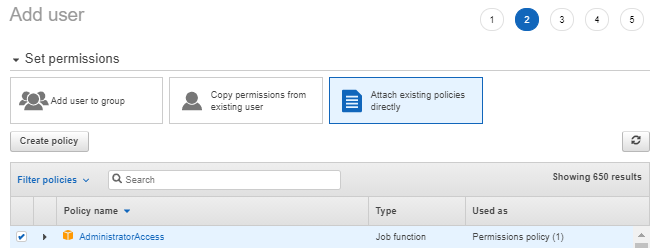

# Chapter 19 &mdash; Interacting with Amazon Web Services
## Section 4: Programming your infrastructure
> TBD

### Summary
+ TBD

### Intro

AWS provides an API that control every part of AWS over HTTP. As this options requires a lot of repititive work, ant it is very low-level, AWS offers several tools on top of the HTTP API to facilitate the job of interacting with AWS programmatically:

+ Command-line interface (CLI) &mdash; that allows you to interact with AWS from your terminal and shell scripts.

+ Software development kits (SDKs) &mdash; that allows you to use your favorite programming language to make calls to AWS services.

+ *AWS CLoudFormation* &mdash; that lets you to describe the state of the infrastructure in terms of artifacts called *templates* and use the *AWS CloudFormation* service to translate those *templates* into API calls.


### Infrastructure as Code (IaC)

*Infrastructure as Code* is the idea of using a high-level programming language to control cloud resources (such as VMs, networks, DNS entries).

This approach will let you use current trends such as *DevOps* and their ecosystem of tools to automate the provisioning of infrastructure, and applying the same set of quality guidelines that would apply to traditional software development.

### Using the CLI

The *AWS CLI* is a convenient way to use AWS from your terminal. It provides a unified interface for all AWS services across different operating systems.

| NOTE: |
| :---- |
| To install/update the *AWS CLI* follow the instructions in https://docs.aws.amazon.com/cli/latest/userguide/install-cliv2.html.<br>Once installed, you can configure autocompletion in your shell by following the instructions on https://docs.aws.amazon.com/cli/latest/userguide/cli-configure-completion.html. |


To use the CLI, you need to specify a service and an action using the syntax:

```bash
aws [--profile {profile-name}] {service} {action} [--key value ...]
```

In order to obtain help you should type:

+ `aws help` &mdash; for general help on the `aws` command.
+ `aws {service} help` &mdash; to obtain help on a particular *AWS service*.
+ `aws {service} {action} help &mdash; to obtain help on a particular action for an *AWS service*.

### Programming with the SDK
AWS offers SDKs for a number of programming languages and platforms. Those SDK facilitate the interaction with AWS by taking care of things such as HTTP communication, result serialization, authentication, etc.

### Labs

#### Lab 4.1: Create an *AWS CLI* user

To use the CLI, you need to authenticate through an *access key* and *secret access key* that will be bound to a user.

To create a new user and attach to it those access and secret access key you need to:

1. Navigate to the *IAM service* page.

2. Click on *Users* in the submenu.

3. Click on *Add User*.

4. Enter a user name that identifies it as a *CLI* user, such as `cli_user` or similar.

5. Select programmatic access.

6. In the permissions sections, select *Attach existing policies directly* and check *AdministratorAccess*. 

7. Review the details and click on *Create User*.

8. Run `aws configure` if it is the first time that you run the *AWS CLI* or alternatively, run `aws --profile {profile-name} configure`  so that the *access key* and *secret access key* get correctly configured in the corresponding `~/.aws/credentials` and the configuration gets written into the `~/.aws/config` files.
9. (Optional) If you are configuring a different profile than the default one, you might also consider configuring the `~/.aws/config` file with your default *AWS Region* and output format:

9. Run a command to validate everything is configured correctly:

```bash
$ bash aws [--profile {profile-n}] --region us-east-1 ec2 describe-regions
s --profile awsia ec2 --region us-east-1 describe-regions
{
    "Regions": [
        {
            "Endpoint": "ec2.eu-north-1.amazonaws.com",
            "RegionName": "eu-north-1",
            "OptInStatus": "opt-in-not-required"
        },
        {
            "Endpoint": "ec2.ap-south-1.amazonaws.com",
            "RegionName": "ap-south-1",
            "OptInStatus": "opt-in-not-required"
        },
        {
            "Endpoint": "ec2.eu-west-3.amazonaws.com",
            "RegionName": "eu-west-3",
            "OptInStatus": "opt-in-not-required"
        },
        {
            "Endpoint": "ec2.eu-west-2.amazonaws.com",
            "RegionName": "eu-west-2",
            "OptInStatus": "opt-in-not-required"
        },
        {
            "Endpoint": "ec2.eu-west-1.amazonaws.com",
            "RegionName": "eu-west-1",
            "OptInStatus": "opt-in-not-required"
        },
        {
            "Endpoint": "ec2.ap-northeast-2.amazonaws.com",
            "RegionName": "ap-northeast-2",
            "OptInStatus": "opt-in-not-required"
        },
        {
            "Endpoint": "ec2.ap-northeast-1.amazonaws.com",
            "RegionName": "ap-northeast-1",
            "OptInStatus": "opt-in-not-required"
        },
        {
            "Endpoint": "ec2.sa-east-1.amazonaws.com",
            "RegionName": "sa-east-1",
            "OptInStatus": "opt-in-not-required"
        },
        {
            "Endpoint": "ec2.ca-central-1.amazonaws.com",
            "RegionName": "ca-central-1",
            "OptInStatus": "opt-in-not-required"
        },
        {
            "Endpoint": "ec2.ap-southeast-1.amazonaws.com",
            "RegionName": "ap-southeast-1",
            "OptInStatus": "opt-in-not-required"
        },
        {
            "Endpoint": "ec2.ap-southeast-2.amazonaws.com",
            "RegionName": "ap-southeast-2",
            "OptInStatus": "opt-in-not-required"
        },
        {
            "Endpoint": "ec2.eu-central-1.amazonaws.com",
            "RegionName": "eu-central-1",
            "OptInStatus": "opt-in-not-required"
        },
        {
            "Endpoint": "ec2.us-east-1.amazonaws.com",
            "RegionName": "us-east-1",
            "OptInStatus": "opt-in-not-required"
        },
        {
            "Endpoint": "ec2.us-east-2.amazonaws.com",
            "RegionName": "us-east-2",
            "OptInStatus": "opt-in-not-required"
        },
        {
            "Endpoint": "ec2.us-west-1.amazonaws.com",
            "RegionName": "us-west-1",
            "OptInStatus": "opt-in-not-required"
        },
        {
            "Endpoint": "ec2.us-west-2.amazonaws.com",
            "RegionName": "us-west-2",
            "OptInStatus": "opt-in-not-required"
        }
    ]
}
```

#### Labs 4.2: CLI: using `--filters`

The following lab illustrates how to list all running EC2 instances of type *t2.micro* using `--filters`.

Run the following command:

```bash
$ aws ec2 \
describe-instances \
--filters "Name=instance-type,Values=t2.micro"
{
    "Reservations": []
}
```

#### Labs 4.3: CLI: using `--query`

The following lab illustrates how to extract a particular value from the JSON output of a CLI command using `--query` (which uses the JMESPath syntax).

For example, to obtain the first ImageID returned by the command `aws ec2 describe-images` you would do:

```bash
$ aws ec2 describe-images --query "Images[0].ImageId"
```

To obtain an array with all the states of the images returned by the command `aws ec2 describe-images` you would do:

```bash
$ aws ec2 describe-images --query "Images[*].State"
```

| NOTE: |
| :---- |
| To update the output of a particular command you can use the `--output text` modifier. |

#### Labs 4.4: CLI: Spin up a temporary VM with a given image

The following script:
+ spins up a VM on the default VPC and first subnet of the VPC
+ creates a security group that opens port 22 to the world
+ waits until the VM is running
+ connects to the machine using SSH using the configured key pair
+ waits for the user to click on Enter to signal the use of the VM is no longer needed
+ terminates the instance
+ waits for the instance to be terminates
+ deletes the created security group

```bash
#!/bin/bash -e

IMAGE_NAME='amzn2-ami-hvm-2.0.20210219.*-x86_64-gp2'

AMI_ID="$(aws \
ec2 describe-images \
--filters "Name=name,Values=$IMAGE_NAME" \
--query "Images[0].ImageId" \
--output text)"

VPC_ID="$(aws \
ec2 describe-vpcs \
--filters "Name=isDefault,Values=true" \
--query "Vpcs[0].VpcId" \
--output text)"

SUBNET_ID="$(aws \
ec2 describe-subnets \
--filters "Name=vpc-id,Values=$VPC_ID" \
--query "Subnets[0].SubnetId" \
--output text)"

SG_ID="$(aws \
ec2 create-security-group \
--group-name temp-security-group \
--description "Temporaty security group created by spin_up_vm.sh" \
--vpc-id "$VPC_ID" \
--output text)"

aws \
ec2 authorize-security-group-ingress \
--group-id "$SG_ID" \
--protocol tcp --port 22 --cidr 0.0.0.0/0

INSTANCE_ID=$(aws \
ec2 run-instances \
--image-id "$AMI_ID" \
--key-name "$KEY_PAIR_NAME" \
--instance-type t2.micro \
--security-group-ids "$SG_ID" \
--subnet-id "$SUBNET_ID" \
--query "Instances[0].InstanceId" \
--output text)

aws \
ec2 wait instance-running \
--instance-ids "$INSTANCE_ID"

PUBLIC_DNS_NAME="$(aws \
ec2 describe-instances \
--instance-ids "$INSTANCE_ID" \
--query "Reservations[0].Instances[0].PublicDnsName" \
--output text)"

read -r -p "Press [ENTER] to terminate $INSTANCE_ID"

TERMINATION_JSON="$(aws \
ec2 terminate-instances \
--instance-ids "$INSTANCE_ID")"

aws \
ec2 wait instance-terminated \
--instance-ids "$INSTANCE_ID" \

aws \
ec2 delete-security-group \
--group-id "$SG_ID"
```

| EXAMPLE: |
| :------- |
| See [01 &mdash; CLI: Spin up a VM](01-lab4.4-cli-spin-up-vm) for a runnable example. |

#### Labs 4.5: SDK: Spin up a temporary VM with a given image

The following program:
+ spins up a VM on the default VPC and first subnet of the VPC
+ creates a security group that opens port 22 to the world
+ waits until the VM is running
+ connects to the machine using SSH using the configured key pair
+ waits for the user to click on Enter to signal the use of the VM is no longer needed
+ terminates the instance
+ waits for the instance to be terminates
+ deletes the created security group

It uses the AWS SDK for Node.js v3.

```javascript
import {
  AuthorizeSecurityGroupIngressCommand,
  CreateSecurityGroupCommand,
  DeleteSecurityGroupCommand,
  DescribeImagesCommand,
  DescribeInstancesCommand,
  DescribeInstanceStatusCommand,
  DescribeKeyPairsCommand,
  DescribeSecurityGroupsCommand,
  DescribeSubnetsCommand,
  DescribeVpcsCommand,
  EC2Client,
  RunInstancesCommand,
  TerminateInstancesCommand
} from '@aws-sdk/client-ec2';
import { fromIni } from '@aws-sdk/credential-provider-ini';
import { getMyPublicIpAddress } from './lib/get-my-public-ip-address.js';
import readline from 'readline';

let commandLineArgs;
if (process.argv.length > 2) {
  commandLineArgs = process.argv.slice(2);
} else {
  console.error(`ERROR: Usage node.js main {key-pair-name} [{profile}]`);
  process.exit(1);
}

const [ keyPairName, profileName ] = commandLineArgs;

const ec2Client = profileName? new EC2Client({
  region: 'us-east-1',
  credentials: fromIni({ profile: profileName })
}) : new EC2Client({
  region: 'us-east-1'});

async function getImageData(imageNamePattern) {
  const params = {
    Filters: [
      { Name: 'name', Values: [ imageNamePattern ] }
    ]
  };

  const command = new DescribeImagesCommand(params);
  try {
    const imageData = await executeCommand(command);
    if (imageData.Images.length > 0) {
      return imageData.Images[0];
    } else {
      throw new Error(`No images matching '${ imageNamePattern }'`);
    }
  } catch (err) {
    console.error(`ERROR: getImageId: Could not obtain imageData for '${ imageNamePattern }': ${ err.message }`);
    throw new Error(err.message);
  }
}

async function getDefaultVPC() {
  const params = {
    Filters: [
      { Name: 'isDefault', Values: [ true ] }
    ]
  };
  const command = new DescribeVpcsCommand(params);

  try {
    const vpcData = await executeCommand(command);
    if (vpcData.Vpcs.length > 0) {
      return vpcData.Vpcs[0];
    } else {
      throw new Error(`Could not find default VPC`);
    }
  } catch (err) {
    console.error(`ERROR: getDefaultVPC: Could not obtain default VPC info: ${ err.message }`);
    throw new Error(err.message);
  }
}

async function getFirstSubnet(vpcId) {
  const params = {
    Filters: [
      { Name: 'vpc-id', Values: [ vpcId ] }
    ],
    MaxResults: 5 // expects a value >= 5
  };
  const command = new DescribeSubnetsCommand(params);

  try {
    const subnetData = await executeCommand(command);
    if (subnetData.Subnets.length > 0) {
      return subnetData.Subnets[0];
    } else {
      throw new Error(`Could not find the first subnet in VPC ${ vpcId }`);
    }
  } catch (err) {
    console.error(`ERROR: getDefaultVPC: Could not obtain default VPC info: ${ err.message }`);
    throw new Error(err.message);
  }
}

// eslint-disable-next-line no-unused-vars
async function getSecurityGroup(vpcId) {
  const params = {
    Filters: [
      { Name: 'description', Values: [ 'Temporary security group created by Node.js' ] },
      { Name: 'group-name', Values: [ 'temp-security-group-nodejs' ] },
      { Name: 'vpc-id', Values: [ vpcId ] }
    ]
  };

  const command = new DescribeSecurityGroupsCommand(params);
  try {
    const sgData = await executeCommand(command);
    return sgData.SecurityGroups.length > 0? { GroupId: sgData.SecurityGroups[0].GroupId } : { GroupId: null };
  } catch (err) {
    console.error(`ERROR: getSecurityGroup: Could not obtain info about security group: ${ err.message }`);
    throw new Error(err.message);
  }

}

async function createSecurityGroup(vpcId) {
  const params = {
    Description: 'Temporary security group created by Node.js',
    GroupName: 'temp-security-group-nodejs',
    VpcId: vpcId
  };
  const command = new CreateSecurityGroupCommand(params);

  try {
    const sgData = await executeCommand(command);
    return { GroupId: sgData.GroupId };
  } catch (err) {
    console.error(`ERROR: createSecurityGroup: Could not createSecurityGroup on vpcId '${ vpcId }': ${ err.message }`);
    throw new Error(err.message);
  }
}

async function deleteSecurityGroup(groupId) {
  const params = {
    GroupId: groupId
  };

  const command = new DeleteSecurityGroupCommand(params);

  try {
    await executeCommand(command);
  } catch (err) {
    console.error(`ERROR: deleteSecurityGroup: could not delete security group id '${ groupId }'`);
  }
}

async function openSSH(securityGroupId) {
  const myIpAddress = await getMyPublicIpAddress();

  const params = {
    GroupId: securityGroupId,
    IpPermissions: [
      {
        IpProtocol: 'tcp',
        FromPort: 22,
        ToPort: 22,
        IpRanges: [{ CidrIp: `${ myIpAddress }/32` }]
      }
    ]
  };

  const command = new AuthorizeSecurityGroupIngressCommand(params);

  try {
    await executeCommand(command);
  } catch (err) {
    console.error(`ERROR: getDefaultVPC: Could not obtain default VPC info: ${ err.message }`);
    throw new Error(err.message);
  }

}

async function validateKeyPairExist(keyPairName) {
  // just for fun we retrieve all keyPairs and validate using a for loop
  const params = {};
  const command = new DescribeKeyPairsCommand(params);

  try {
    const keyPairsData = await executeCommand(command);
    const nameMatches = (element) => element.KeyName === keyPairName;
    const exists = keyPairsData?.KeyPairs.some(nameMatches);
    return exists;
  } catch (err) {
    console.error(`ERROR: getDefaultVPC: Could not obtain default VPC info: ${ err.message }`);
    throw new Error(err.message);
  }
}

async function launchInstance(amiId, keyPairName, instanceType, securityGroupId, subnetId) {
  const params = {
    ImageId: amiId,
    KeyName: keyPairName,
    InstanceType: instanceType,
    SecurityGroupIds: [ securityGroupId ],
    SubnetId: subnetId,
    MinCount: 1,
    MaxCount: 1,
    TagSpecifications: [
      { Key: 'Name', Value: 'temp-vm-spun-up-from-nodejs' }
    ]
  };

  const command = new RunInstancesCommand(params);
  try {
    const launchInstancesData = await executeCommand(command);
    return launchInstancesData.Instances[0];
  } catch (err) {
    console.error(`ERROR: launchInstance: Could not launch instance ${ err.message }`);
    throw new Error(err.message);
  }

}

async function getInstanceStatus(instanceId) {
  const params = {
    InstanceIds: [ instanceId ]
  };

  const command = new DescribeInstanceStatusCommand(params);
  try {
    const instanceStatusData = await executeCommand(command);
    return instanceStatusData.InstanceStatuses.length > 0? instanceStatusData.InstanceStatuses[0].InstanceState : null;
  } catch (err) {
    console.error(`ERROR: getInstanceStatus: could not obtain status for ${ instanceId }`);
    throw new Error(err.message);
  }
}

async function sleep(millis) {
  return new Promise((resolve) => {
    setTimeout(() => {
      resolve();
    }, millis);
  });
}

async function waitUntilInstanceRunning(instanceId) {
  const instanceStatus = await getInstanceStatus(instanceId);
  if (instanceStatus && instanceStatus.Name === 'running') {
    return;
  } else {
    console.log(`INFO: waitUntilInstanceRunning: ${ instanceId } is not yet running: waiting for 15 seconds`);
    await sleep(15000);
    await waitUntilInstanceRunning(instanceId);
  }
}

async function getInstanceInfo(instanceId) {
  const params = {
    InstanceIds: [ instanceId ]
  };

  const command = new DescribeInstancesCommand(params);
  try {
    const instanceData = await executeCommand(command);
    return instanceData.Reservations[0].Instances[0];
  } catch (err) {
    console.error(`ERROR: getInstanceInfo: could not obtain instanceInfo for ${ instanceId }`);
    throw new Error(err.message);
  }
}

async function terminateInstance(instanceId) {
  const params = {
    InstanceIds: [ instanceId ]
  };

  const command = new TerminateInstancesCommand(params);
  try {
    const instanceData = await executeCommand(command);
    return instanceData.TerminatingInstances[0];
  } catch (err) {
    console.error(`ERROR: getInstanceInfo: could not obtain instanceInfo for ${ instanceId }`);
    throw new Error(err.message);
  }
}


async function waitUntilInstanceTerminated(instanceId) {
  const instanceInfo = await getInstanceInfo(instanceId);
  if (instanceInfo && instanceInfo.State.Name === 'terminated') {
    return;
  } else {
    console.log(`INFO: waitUntilInstanceTerminated: ${ instanceId } is not yet terminated: waiting for 15 seconds`);
    await sleep(15000);
    await waitUntilInstanceTerminated(instanceId);
  }
}

async function executeCommand(command) {
  try {
    return ec2Client.send(command);
  } catch (err) {
    console.error(`ERROR: executeCommand: ${ err.message }`);
    throw err;
  }
}

async function readStdin() {
  return new Promise(resolve => {
    const rl = readline.createInterface({ input: process.stdin, output: process.stdout });

    rl.question(`Press [ENTER] to terminate instance:`, userInput => {
      resolve(userInput);
      rl.close();
    });
  });
}


async function main() {
  // As of 2021-02-28 this image name brought the Amazon AMI you get on AWS console
  const IMAGE_NAME_PATTERN = 'amzn2-ami-hvm-2.0.20210219.*-x86_64-gp2';
  const { ImageId, Name } = await getImageData(IMAGE_NAME_PATTERN);

  const { VpcId } = await getDefaultVPC();

  const { SubnetId } = await getFirstSubnet(VpcId);

  let { GroupId } = await getSecurityGroup(VpcId);
  if (GroupId) {
    await deleteSecurityGroup(GroupId);
  }

  ({ GroupId } = await createSecurityGroup(VpcId));

  await openSSH(GroupId);

  const exists = await validateKeyPairExist(keyPairName);
  if (!exists) {
    console.error(`ERROR: main: the key '${ keyPairName }' does not exist`);
    throw new Error('Provided Key Pair does not exist');
  }

  const { InstanceId, State } = await launchInstance(ImageId, keyPairName, 't2.micro', GroupId, SubnetId);

  await waitUntilInstanceRunning(InstanceId);

  const { PublicDnsName } = await getInstanceInfo(InstanceId);
  console.log(`Type:
  ssh -i ~/.ssh/${ keyPairName }.pem ec2-user@${ PublicDnsName }`);

  await readStdin();

  await terminateInstance(InstanceId);

  await waitUntilInstanceTerminated(InstanceId);

  await deleteSecurityGroup(GroupId);
}

main()
  .then(() => console.log('INFO: main: done!'))
  .catch((err) => console.error(`ERROR: main: ${ err.message }`));
```

| EXAMPLE: |
| :------- |
| See [02 &mdash; SDK: Spin up a VM](02-lab4.5-sdk-spin-up-vm) for a runnable example. |

### You know you've mastered this section when...


### Code samples and mini-projects

#### [01 &mdash; CLI: Spin up a VM](01-lab4.4-cli-spin-up-vm)
Illustrates how to use the CLI to spin up a new VM.

#### [02 &mdash; SDK: Spin up a VM](02-lab4.5-sdk-spin-up-vm)
Illustrates how to use the AWS SDK for Node.js (v3) to spin up a new VM

### Services used in this chapter

| AWS Service | Category | Description |
| :---------- | :------- | :---------- |
