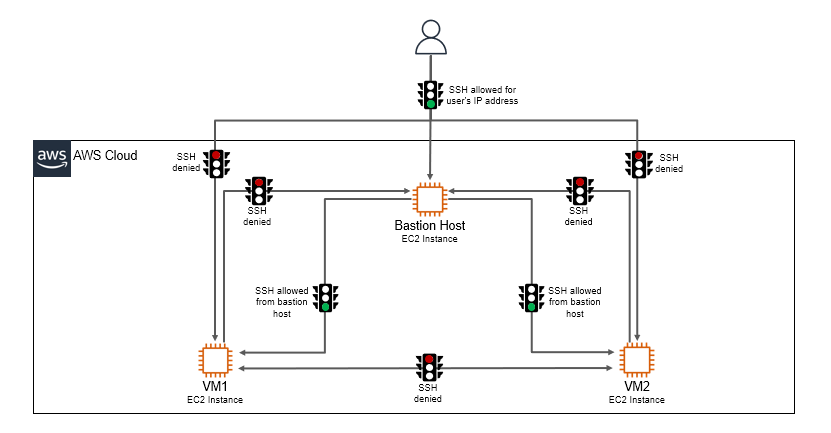

# Part 2: Applications
## Chapter 19 &mdash; Amazon Web Services
### Section 6: Security concepts in AWS: IAM, security groups, and VPCs
#### 05 &mdash; CloudFormation: Infrastructure with VPC and subnets
> A *CloudFormation* instance that spins up a network sound infrastructure.


The following picture describes the approach:



##### Usage

You will find a bash script that will submit the template YAML to *CloudFormation* using the *AWS CLI*.

```bash
./create-stack.sh {key-name} [{profile-name:-default}]
```

Once finished, you can do:
```bash
./delete-stack.sh [{profile-name:-default}]
```
