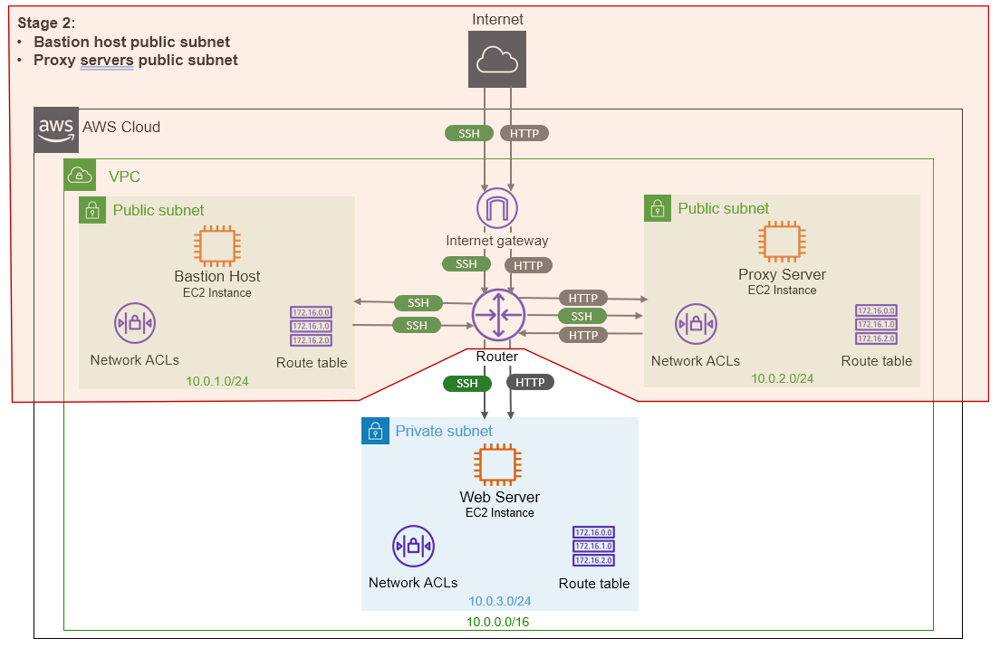

# Chapter 19 &mdash; Interacting with Amazon Web Services
## Section 6: Security concepts in AWS: IAM, security groups, and VPCs
> TBD

### Summary
+ AWS Security Model
+ IAM: users and roles
+ Security Groups to control inbound/outbound traffic
+ Basic network design: Private and Public Networks in AWS

### Intro

This section deals with the most basic (and important) techniques that you will need to implement to secure your systems on AWS:

+ Maintaining your software up to date

+ Restricting access to your AWS account

+ Controlling network traffic to and from your AWS resources

+ Designing private and public networks and distributing your resources accordingly

+ Enforcing encryption and security standards in your application and resources

### AWS Security: AWS *shared responsibility model*

AWS defines security in terms of a *shared responsibility model. While AWS is responsible for the *security of the cloud*, you, as an AWS user, are responsible for the *security in the cloud*.

This means that you retain control of the security you choose to implement to protect your own content, platform, applications, system, and networks in the same you'd do in an *on-premises* data center.

For example, as part of the *shared responsibility model* you will be responsible for:

+ Implementing access management the restrict access to resources such as S3 and EC2 to only the interested parties (you will use *AWS IAM* for that).

+ Encrypting network traffic to prevent attackers from reading or manipulating data (enabling *encryption in-transit* for the given services and attaching certificates to your web application components so that they use HTTPS instead of HTTP).

+ Configuring a firewall for your virtual network (VPC) that controls incoming and outgoing traffic with security groups and *Access Control Lists (ACLs)*.

+ Encrypting data in your stateful systems (enabling *encryption at rest* for the given services such as EBS volumes, databases, S3...).

+ Keeping your OS and applications up to date with your VMs, containers, lambda functions...

In turn, AWS provides the necessary security-specific tools, features, and services across network security, configuration management, access control, and data encryption so that you can implement the strictest security measures you can think of.

| NOTE: |
| :---- |
| You can review AWS security standards from https://aws.amazon.com/compliance/. |


### Keeping your software up to date
In the *shared security responsibility model* in AWS, you will be responsible for keeping the software up-to-date including:
+ OS software
+ Software libraries like Java, Python, Node.js...
+ Application software like PostgreSQL, WordPress, etc.

In order to check what packages require a security update you can do:

```bash
$ yum --security check-update
```

In order to facilitate your tasks, Amazon maintains a web page with the important security updates affecting *Amazon Linux AMI* at https://alas.aws.amazon.com/.

The process to update the software of a running instance differs if your *launching the instance* for the first time, or if you need to install security updates once the machine is running.

#### Installing security updates on startup

If you create *EC2 instances* with *CloudFormation* template, you can either:

+ Install all updates at the end of the boot process including `yum -y update` in your *user-data* script. Note that this option might leave your system in an unpredictable state, as your applications might not be prepared to run with the newer versions of certain packages (e.g. if Python2 gets removed and Python3 is installed instead).

+ Install only the security updates doing: `yum -y --security update` in your *user-data* script.

+ Define the package versions explicitly, and apply the updates affecting that specific version. This can be done using `yum -y update-to kernel-tools-4.14.219-164.354.amzn2.x86_64`.


| NOTE: |
| :---- |
| Installing only security updates on Debian based machines it is a bit more complicated. First, you will need to install the `unattended-upgrades` package. Once installed, you just need to run `unattended-upgrades -v`. |

#### Installing security updates on running instances

When you have to update a *fleet* of running *EC2 instances*, you can prepare a script that lists the instances and then run `yum -y --security update` in each of them:

```bash
PUBLIC_IP_ADDRESSES="$(aws ec2 --profile {profile-name} \
--filters "Name=instance-state-name,Values=running" \
--query "Reservations[].Instances[].PublicIpAddress" \
--output text)"

for PUBLIC_IP_ADDRESS in $PUBLIC_IP_ADDRESSES; do
  ssh -t "ec2-user@$PUBLIC_IP_ADDRESS" \
  "sudo yum -y --security update"
done
```

### Securing your AWS account

In the *shared security responsibility model* in AWS, you will also be responsible for keeping your AWS account secure. If an attacker gets access to your AWS account, they will be able to steal your data, use resources at your expense, and delete your critical infrastructure.

You can think of an AWS account as a container for all the resources that you own: *EC2* instances, *CloudFormation* stacks, *IAM* users, etc.

Each AWS account comes with a *root* user granted unrestricted access to all resources. Because of that, it is recommended to create an additional user to log into the Management Console (different from the *root* user) and another specific *CLI* user to be able to run *CLI* commands.

To access your AWS account, an attacker must be able to authenticate to your account either using the *root* user, using another user, or authenticating as an *AWS resource*, such as an *EC2 instance*.

To authenticate as a root user or normal user an attacker will need your credentials and possibly access to your device if you have enabled multi-factor authentication (which is clearly encouraged). To authenticate as an *AWS resource* the attacker needs to send API/CLI requests.

As a result, as basic security measures you should:
+ Enable MFA for your *root* user.
+ Do not use your *root* user for regular AWS tasks, and use a regular user with appropriate permissions instead.
+ Enable MFA for your *regular* (non-root) users.
+ Tailor the permissions for your *regular* users following the *Principle of Least Privilege*.
+ Tailor the permissions of your generated access/secret keys, so that if they get stolen the damages can be contained.
+ Tailor the permissions of your services (e.g. EC2 instances), so that the amount of API/CLI keys that can be used from within the services follow the *Principle of Least Privilege*.

### AWS Identity and Access Management (IAM)

*AWS Identity and Access Management (IAM)* enables you to securely control access to AWS services and resources for your users.

Using *AWS IAM* you can create and manage *AWS users* and *groups*, and use permissions to allow and deny their access to AWS resources.

*AWS IAM* allows you to:

+ Manage IAM users and their access &mdash; you can create users in *IAM*, assign them individual security credentials (access keys, passwords, and multi-factor authentication devices), or request temporary security credentials to provide users access to AWS services and resources. You can manage permissions in order to control which operations a user can perform.

+ Manage IAM roles and their permissions &mdash; you can create roles in IAM and manage permissions to control which operations can be performed by the entity, or AWS service, that assumes the role. You can also define which entity is allowed to assume the role.

+ Manage federated users and their permissions &mdash; you can enable identity federation to allow existing identities (users, groups, and roles) in your enterprise to access the AWS Management Console, call AWS APIs, and access resources, without the need to create an IAM user for each identity.

| NOTE: |
| :---- |
| *AWS IAM* is a *global service*, is not bound to any specific region. |

The following diagram shows an overview of all the core concepts of the *AWS IAM* service:


*AWS IAM* provides authentication and authorization for the AWS API &mdash; *AWS IAM* controls who (authentication) and what (authorization) actions you can perform in the AWS cloud.

+ IAM user &mdash; the concept used to identify people with access to your AWS account.

+ IAM group &mdash; a collection of IAM users.

+ IAM role &mdash; the concept used to identify resources and bind them with a set of permissions (e.g. EC2 instance with access to *CloudFormation* to create stacks).

+ IAM policy &mdash; the document that defines the permissions for an *IAM user*, *IAM group*, or *IAM role*.

| NOTE: |
| :---- |
| Roles are used to authenticate AWS entities such as EC2 instances. IAM users authenticate the people who manage AWS resources, such as sysadmins, DevOps engineers, or software devs.<br>By default, users and roles can't do anything &mdash; they only identify people or AWS entities. Both Roles and Users can be bound to policies that tailor their authorizations (what they can do). |

The following table elaborates on a few different actions that root users, IAM users and IAM roles can do in AWS:

|     | Root user | IAM user | IAM role |
| :-- | :-------- | :------- | :------- |
| Use credentials to log into the AWS Management Console? | Yes | Yes | No |
| Can have access keys? | Yes, but not recommended | Yes | No |
| Can belong to a group? | No | Yes | No |
| Can be associated with a AWS resource? | No | No | Yes |

#### Defining permissions with an IAM policy

By attaching one or multiple IAM policies to an *IAM user* or to an *IAM role*, you are granting permissions to manage AWS resources.

Policies are defined in JSON and contain one or more statements that either allow or deny *specific actions* on *specific resources*. The wildcard character `*` can be used to create generic statements.

For example, the following policy has one statement that allows every action for the EC2 service, for all resources:

```json
{
  "Version": "2012-10-17",
  "Statement": [
    {
      "Sid": "1",
      "Effect": "Allow",
      "Action": "ec2:*",
      "Resource": "*"
    }
  ]
}
```

The following policy has the effect of allowing every action for the *EC2* service except the termination of instances. Note that `Deny` takes precedence over `Allow` and that the order is not important:

```json
{
  "Version": "2012-10-17",
  "Statement": [
    {
      "Sid": "1",
      "Effect": "Allow",
      "Action": "ec2:*",
      "Resource": "*"
    },
    {
      "Sid": "2",
      "Effect": "Deny",
      "Action": "ec2:TerminateInstances",
      "Resource": "*"
    }
  ]
}
```

As a consequence, the following policy denies all actions. That is, the second statement of the policy has no consequences:

```json
{
  "Version": "2012-10-17",
  "Statement": [
    {
      "Sid": "1",
      "Effect": "Deny",
      "Action": "ec2:*",
      "Resource": "*"
    },
    {
      "Sid": "2",
      "Effect": "Allow",
      "Action": "ec2:TerminateInstances",
      "Resource": "*"
    }
  ]
}
```

Resources in the policies must be specified using their *Amazon Resource Name (ARN)*.

The syntax for an *ARN* is as follows:

```
arn:aws:{service}:{region}:{account-id}:{maybe-resource-type}/{resource}
```

For example, the *ARN* for a given *EC2* instance running on `us-east-1` in the account `123456789012` will be similar to:

```
arn:aws:ec2:us-east-1:123456789012:instance/i-06d4262a0fd80193f
```

You can also find the ARN for your user typing:

```bash
$ aws iam get-user --query "User.Arn"
"arn:aws:iam::123456789012:user/sergio"
```

| NOTE: |
| :---- |
| AS IAM is a global service, the `{region}` part of the ARN is empty. |


Now that you know how to describe specific resources, you can write policies that allow specific actions on specific resources:

```json
{
  "Version": "2012-10-17",
  "Statement": [
    {
      "Sid": "1",
      "Effect": "Allow",
      "Action": "ec2:TerminateInstances",
      "Resource": "arn:aws:ec2:us-east-1:123456789012:instance/i-06d4262a0fd80193f"
    }
  ]
}
```

You can use the wildcard character `*` to specify a set of items matching a given string pattern:

```json
 "Resource": "arn:aws:s3:::my_bucket/*"
 ```

 You can also specify a set of specific resources using an array:

 ```json
 "Resource": [
    "arn:aws:dynamodb:us-east-2:account-ID-without-hyphens:table/books_table",
    "arn:aws:dynamodb:us-east-2:account-ID-without-hyphens:table/magazines_table"
]
```

There are two types of policies:

+ *Managed Policies* &mdash; used when you want to create policies that can be reused in your account. There are two subtypes:
  + *AWS managed policy* &mdash; a policy maintained by AWS. Those are policies that grant admin rights, read-only rights, power user rights, etc.
  + *Customer managed policy* &mdash; a policy maintained by yoursef that represents reusable roles in your organizations (e.g. sysadmin roles, DevOps engineers role, Software devs roles, etc.)

+ Inline policy &mdash; a policy that belongs to a certain *IAM role*, *IAM user*, or *IAM group*. An *inline policy* isn't a *standalone object* and therefore, cannot exist without the *IAM role*, *IAM user* or *IAM group* that is attached to.

| NOTE: |
| :---- |
| With *AWS CloudFormation it's easy to maintain inline policies. |

#### Users for authentication, groups to organize users

A user can authenticate using either a user name and password (*AWS Management console*), or through some access keys (*AWS CLI*).

As the *root user* has total control over your account, is highly encouraged that you create *IAM users* to comply with the *Principle of Least Privilege*. Thus:
+ each person access your account will have their unique username and credentials.
+ you can grant each individual the exact permission set they require.

*Groups* can help you organize the users in your account. They can't be used to authenticate, but they can centralize authorization as you will be able to attach policies to *IAM groups*, and then *IAM users* to those groups. *IAM users* will inherit the permissions from the groups. If after a while you decide to tailor the permissions of a given *IAM group*, all the users will automatically will be granted the updated set of permissions.

The following script creates an `"Admins"` group, attaches the `"Administrator"` admin policy to the group, and then creates a user `myuser` and adds it to the newly created group:

```bash
$ aws iam create-group --group-name "Admins"
$ aws iam attach-group-policy --group-name "Admins" \
--policy-arn "arn:aws:iam:aws:policy/AdministratorAccess"
$ aws iam create-user --user-name "myuser"
$ aws iam add-user-to-group --group-name "Admins" \
--user-name "myuser"
$ aws iam create-login-profile --user-name "myuser" --password "super-secret"
```

| NOTE: |
| :---- |
| It is higly recommended to enable multi-factor authentication (MFA) for all your users. If possible, don't use the same MFA device for your root user that you use for your regular user. |


#### Authenticating AWS resources with *IAM roles*

For an *AWS resource* to access the *AWS API*, it needs to authenticate itself. For example, an *EC2 instance* might want to store some data in *Amazon S3*. Although it is technically possible to create *access keys* and store them in the *AWS resource*, that is a poor solution. Instead, you are encouraged to use an *IAM role* whenever you need to authenticate *AWS resources* to the *AWS API*.

If an *IAM role* is attached to an *AWS resource* such as an *EC2 instance*, all policies attached to the role will be evaluated to decided if that *AWS resource* is permitted to use a particular AWS API call.

For example, the following snippet will stop a given instance after 5 minutes:

```bash
echo "aws ec2 \
stop-instances \
--instance-ids i-06d4262a0fd80193f \
| at now + 5 minutes
```

The previous snippet won't work unless we grant the *EC2 instance* the permission to stop itself. Therefore, we need to attach an *IAM role* to the instance that grants the `ec2::StopInstances` action.

We can define that role with a *CloudFormation* template:

```yaml
Role:
  Type: 'AWS::IAM::Role'
  Properties:
    AssumeRolePolicyDocument:
      Version: '2012-10-17'
      Statement:
        - Effect: Allow
          Principal:
            Service: 'ec2.amazonaws.com'
          Action:
            - 'sts:AssumeRole'
    Policies:
      - PolicyName: 'ec2-stop-instances'
        PolicyDocument:
          Version: '2012-10-17'
          Statement:
            - Sid: Stmt1425388787000
              Effect: Allow
              Action: 'ec2:StopInstances'
              Resource: '*'
              Condition:
                StringEquals:
                  'ec2:ResourceTag/aws:cloudformation:stack-id': !Ref 'AWS::StackId'
```

To attach an inline role to an instance, you must first create an *instance profile*:

```yaml
InstanceProfile:
  Type: 'AWS::IAM::InstanceProfile'
  Properties:
    Roles:
      - !Ref Role
```

| EXAMPLE: |
| :------- |
| See [02 &mdash; CloudFormation: Instance that stops itself](02-lab6.1-cloudformation-instance-stop) for the complete YAML code. |

### Controlling the network traffic in AWS
You only want traffict to enter or leave a particular machine if it has to do so. Typically, you setup a firewall to control ingoing (also called inbound or ingress) and outgoing (also called outbound or egress) traffic.

The same applies to resources on AWS. You are given tools to open only the ports that must be accessible and close down all other ports.

Before network traffic can enter or leave your AWS resource, it goes through a firewall provided by AWS. This filrewall inspects the network traffic and uses rules to decide whether the traffic is allowed or denied.

This firewall is implemented in AWS through the concept of *Security Groups*. By default, a *Security Group* does not allow any inbound traffic (you must add your own rules to allow specific incoming traffic), and a rule that allows all outbound traffic by default.

| NOTE: |
| :---- |
| If your use case requires a stricter control of outbound traffic you should remember to remove the rule that allows all outbound traffic by default. |

Again, in the *shared responsibility model* of AWS, AWS is responsible for providing the firewall, and you, as a customer of AWS are responsible for defining the rules.

| NOTE: |
| :---- |
| The [*VPC Flow Logs*](https://docs.aws.amazon.com/vpc/latest/userguide/flow-logs.html) service allows you to get access to aggregated log messages containing granted and rejected connections. This can be very helpful when debugging or monitoring network traffic. |

#### Controlling traffic with *security groups*

You can associate a *security group* with AWS resources such as *EC2 instances* to control inbound and outbound traffic. In general, it is possible to associate more than one security group to an *AWS resource*, and also to associate a given security group to multiple *AWS resources*.

The *security group* will let you define two sets of rules:

+ *inbound rules* &mdash; filter traffic based on its source. It can be either an IP address or another *security group*. The effect of adding inbound rules will consist in allowing incoming traffic only from a specific source IP address range.

+ *outbound rules* &mdash; filter traffic based on its destination. It can be either an IP address or a security group. The effect of adding outbound rules will consists in allowing outgoing traffic to only a specific destination IP address range.

Each rule will be specified using the following information:
+ Direction &mdash; inbound or outbound
+ IP protocol &mdash; TCP, UDP, ICMP...
+ Port
+ Source/Destination based on IP address, IP address range, or security group.

| NOTE: |
| :---- |
| As a golden rule, you should define your security group rules as restrictive as possible. |

The following snippet describes an empty security group (no rules defined on it) that is associated with an *EC2 instance*.

```yaml
Resources:
  SecurityGroup:
    Type: 'AWS::EC2::SecurityGroup'
    Properties:
      GroupDescription: 'Empty security group'
      VpcId: !Ref VPC
      Tags:
        - Key: Name
          Value: 'Empty-SG'
  Instance:
    Type: 'AWS::EC2::Instance'
    Properties:
      ...
      SecurityGroupIds:
        - !Ref SecurityGroup
      ...
```

Thus, a *security group* is associated with a particular *VPC*, and then associated to the instance using its `SecurityGroupIds` property.

*Inbound rules* can be defined in the *security group* using the `SecurityGroupIngress` property:

```yaml
Resources:
  SecurityGroup:
    Type: 'AWS::EC2::SecurityGroup'
    Properties:
      GroupDescription: 'Security Group allowing ICMP traffic'
      VpcId: !Ref VPC
      Tags:
        - Key: Name
          Value: 'Inbound-ICMP-SG'
      SecurityGroupIngress:
        - IpProtocol: icmp
          FromPort: '-1'
          ToPort: '-1'
          CidrIp: '0.0.0.0/0'
```

In the previous snippet, we're allowing ICMP traffic from any source IP address.


The `SecurityGroupIngress` is an array that allows you to specify multiple rules with the same structure. For example, to also allow SSH traffic we would do:

```yaml
Resources:
  SecurityGroup:
    Type: 'AWS::EC2::SecurityGroup'
    Properties:
      GroupDescription: 'Security Group allowing ICMP and SSH traffic'
      VpcId: !Ref VPC
      Tags:
        - Key: Name
          Value: 'Inbound-ICMP-SSH-SG'
      SecurityGroupIngress:
        - IpProtocol: icmp
          FromPort: '-1'
          ToPort: '-1'
          CidrIp: '0.0.0.0/0'
        - IpProtocol: tcp
          FromPort: '22'
          ToPort: '22'
          CidrIp: '0.0.0.0/0'
```

Until now, we have allowed traffic from any IP address by using the CIDR `0.0.0.0/0`. However, as discussed before the security group rules should be as restrictive as possible and therefore, SSH should be allowed only from where we intend to manage the instance.

This can be easily fixed by adding a new parameter `IpForSSH` and using it when defining our SSH inbound rule:

```yaml
Parameters:
  IpForSSH:
    Description: 'Public IP address from where I will SSH'
    Type: String
...
Resources:
  SecurityGroup:
    Type: 'AWS::EC2::SecurityGroup'
    Properties:
      GroupDescription: 'Security Group allowing ICMP and SSH traffic'
      VpcId: !Ref VPC
      Tags:
        - Key: Name
          Value: 'Inbound-ICMP-SSH-SG'
      SecurityGroupIngress:
        - IpProtocol: icmp
          FromPort: '-1'
          ToPort: '-1'
          CidrIp: '0.0.0.0/0'
        - IpProtocol: tcp
          FromPort: '22'
          ToPort: '22'
          CidrIp: !Sub '${IpForSSH}/32'
```

It is also possible to allow traffic from a *source/destination security group*. This is useful when the IP address range that you want to allow traffic in or out is already configured with an specific *security group* (such as an *RDS* database instance). This will make the rule definition more flexible as it will survive IP changes.

Specifying a security group as a source for an inbound security rule can be done usin the following snippet:

```yaml
  SecurityGroup:
    Type: 'AWS::EC2::SecurityGroup'
    Properties:
      GroupDescription: 'Security Group allowing ICMP and SSH traffic'
      VpcId: !Ref VPC
      Tags:
        - Key: Name
          Value: 'Inbound-ICMP-SSH-SG'
      SecurityGroupIngress:
        - IpProtocol: icmp
          FromPort: '-1'
          ToPort: '-1'
          CidrIp: '0.0.0.0/0'
        - IpProtocol: tcp
          FromPort: '22'
          ToPort: '22'
          SourceSecurityGroupId: !Ref AnotherSecurityGroup
  AnotherSecurityGroup:
    ...
```

For a simple scenario that spins up an *EC2 instance* attached with security groups please see [03 &mdash; CloudFormation: Instance attached with Security Group](03-lab6.2-cloudformation-instance-security-group) for a runnable example.

For a more complicated scenario involving several instances and a bastion host please see: [04 &mdash; CloudFormation: Infrastructure with bastion host](04-lab6.3-cloudformation-infra-bastion-host)

##### A few basic notes about networking

The next section will deal with all the details about networking, but in the meantime it is importanto to understand the difference between public and private IP addresses and the CIDR notation.

On your home network, you will be assigned an IP address that most likely will start with `192.168.0.*`. All the devices within your local network will be assigned an IP address that follows that pattern (phones, tablets, SmartTV sets, Videogame consoles...). Those are known as *private IP addresses*.

However, when you access the Internet, all your devices will use the same *public IP address*. That is because only your *home router* has a *public IP address*, and all requests no matter from which device had been originated are redirected by the gateway. Your home network does not know about the *public IP address*, but instead, know that the *Internet Gateway* (that is, your home router) is reachable in a particular *private IP address* such as `192.168.0.1`. Once a request is sent to the *Internet Gateway*, a mechanism known as *network address translation* kicks in, which will wrap the device request and *forward* it under the *public IP address*.

| NOTE: |
| :---- |
| To find your *public IP address* you can visit [ipify](https://www.ipify.org/), or type `curl 'https://api64.ipify.org?format=json'` or `curl 'https://api64.ipify.org?format=text'`. |


You saw in the last YAML snippet that the specification of a single IP address was written as `${IpForSSH}/32`, while when we wanted to allow any IP address we used `0.0.0.0/0`. This notation is known as *Classless Inter-Domain Routing (CIDR)*. The `/32` and `/0` portion defines how many bits (32 and 0, in these case) should be used to form a range of addresses. Therefore, when using `/32` we are specifying an *exact* IP address, while `/0` we are not fixing any bit and therefore we are describing a range that contains every possible IP address.

The amount of bits we fix is not limited to `/0` or `/32`. For example, you can do:

+ `10.0.0.0/8` to specify a range that goes from `10.0.0.0` to `10.255.255.255`.

+ `10.0.0.0/16` to specify a range that goes from `10.0.0.0` to `10.0.255.255`.

+ `10.0.0.0/24` to specify a range that goes from `10.0.0.0` to `10.0.0.255`.

An you are not bound either to binary boundaries such as 8, 16, 24, 32, although typically it is easier to make sense of IP ranges when doing so.

#### The *bastion host* (*jumpbox*) concept

The concept of a *bastion host* for SSH access (also known as *jumpbox*) consists in setting up one virtual machine, the *bastion host*, that can be access via SSH from the internet, typically from a small set of specific source IP addresses.

The rest of VMs of the infrastructure are configured to be accessed via SSH only from the bastion host.

The advantages of this approach are:
+ You have only one entry point into your system, and that entry point does nothing but SSH. This reduces the attack surface of your infrastructure, lets you focus on securing the *bastion host*, and if exploited, the bastion host does not host any important infrastructure (it is just a jumpbox).

+ If any other machine of your infrastructure is compromised (e.g. the web server), the attacker won't be able to jump from that compromised machine to any other machine (e.g. from the web server to the db server).

Implementing the concept of a *bastion host* is quite straightforward &mdash; you only have to follow these simple rules:

+ Allow SSH access to the bastion host from a small set of IP addresses (ideally, the IP addresses of your VPN, or your specific IP address if not using a VPN).

+ Allow SSH access to all other VMs in your infrastructure only if the source is the *bastion host*.

The following diagram depicts the approach:


If we assume that VM1 and VM2 are your web server and database server respectively, you can deduce from the picture, that you can only reach them through the bastion host. That limits the surface attack of your application to the bastion host, which can be secured to be accessible only from your IP address.

This infrastructure requires the following resources:
+ An *EC2 instance* representing the *bastion host* configured with a *security group* named `SG-Bastion-Host` that only allows SSH connections from your IP address. Note that the bastion will need outbound connectivity.

+ Two *EC2 instances* representing *VM1* and *VM2* associated with a *security group* that only allows inbound SSH connections coming from the *security group* `SG-Bastion-Host`. The instances can be configured with no outbound connectivity (if required).

| NOTE: |
| :---- |
| Additionally, you can configure the *bastion host* to use a mechanism known as *Agent Forwarding*, which lets you authenticte with the same key you used to log in to the bastion host for further SSH logins initiated from that *bastion hosts* without requiring additional authentication. However, *agent forwarding* represents a security risk because when using this mechanism, the *bastion host* is able to read the private key from your computer. As a consequence, if the *bastion host* is compromised, an attacker would have access to your private key.<br>An alternative, more secure approach, consists in using the bastion host as a proxy using the command `ssh -J ec2-user@BastionHostPublicName ec2-user@Instance1PublicName`. The argument `-J` for *jump* lets you connect to the target host by first making a *ssh* connection to the jump host described after the `-J` argument, and then establishing a TCP forwarding to the ultimate destination from there.<br>To be able to use `ssh -J` you will have to add the key to your agent using `ssh-add path/to/key.pem`. That will also relieve your from having to type `ssh -i path/to/key.pem ...` every time. |

| TIP: |
| :---- |
| If you want to remove a particular identity from the identities you have added using `ssh-add`, you will need to first extract the public key from the *pem* file using `ssh-keygen -y -f path/to/key.pem > path/to/key.pub`, and then run `ssh-add -d path/to/key.pub`.<br>You can check the currently added identities using `ssh-add -l`. |

### Creating a robust network infrastructure in the cloud with *Amazon VPC*

*Amazon Virtual Private Cloud (VPC)* lets you provision a logically isolated section of the AWS Cloud where you can launch AWS resources in a virtual network that you define. You can select your own IP address range, create subnets, and configure the route tables and network gateways. You can use both IPv4 and IPv6 in your *VPC* for secure and easy access to resources and applications.

You can easily customize the network configuration for your *VPC* to do things like create a public facing subnet for your web servers that will be accessible from the Internet, while your backend systems and databases are placed in a private facing subnet with no Internet access.

Within the *VPC* you will be able to leverage multiple layers of security (including security groups and network access control lists) to help control access to AWS resources in each subnet.

Finally, you can also create a hardware-based *Virtual Private Network (VPN)* connection between your corporate data center and your *VPC* and leverage the AWS Cloud as an extension of your corporate data center.

In practical terms, when you create a *VPC*, you get your own *private network* on AWS, in the sense that you can use an address range that is not necessarily connected to the public Internet from the ranges:
+ `10.0.0.0/8`
+ `172.16.0.0/12`
+ `192.168.0.0/16`

Within the *VPC* you will be able to create *subnets*, *route tables*, *ACLs*, *Internet Gateways*, and *VPN endpoints*.

> *Subnets* allow you to separate concerns within a *VPC*. Create a separate *subnet* for your databases, web servers, proxy servers, application servers, or whenever you can *logically separate* the responsibilities of a system.

> As a *rule of thumb*, always have at least two *subnets*: a *public facing subnet* that has a route to the Internet; and private subnet that doesn't.

| NOTE: |
| :---- |
| Elements that should be accessible from the Internet, such as *load balancers* or *web servers* should be placed into the *public subnet*. Application servers and databases should reside in the *private subnet*. |


As an example, we will create a VPC to host an enterprise web application. It will feature the *bastion host* concept from the previous section, only that this time we will place it on a public subnet that will only contain that server.

Additionally, we will create a private subnet for the web servers, and another public subnet for the public-facing proxy servers. As a consequence, *web servers* won't be directly accessible over the Internet, but only through the proxy servers.

| NOTE: |
| :---- |
| The role of the proxy servers will be to absorb most of the traffic by responding to requests with the latest version of a page they have in their cache, and forwarding the traffic to the private web servers when they don't have it. |

Therefore, in terms of networkwing we will:
+ Create a *VPC* using the address space `10.0.0.0/16`.
+ Create a *public subnet* for the bastion host on `10.0.1.0/24`.
+ Create another *public subnet* for the proxy servers on `10.0.2.0/24`.
+ Create a *private subnet* for the web servers on `10.0.3.0/24`.

AWS features an additional layer of network security, separate from *Security Groups*, implemented via *Access Control Lists (ACLs)*.

Network ACLs restrict traffic that goes from one subnet to another, acting as a firewall. In our case, we will need to allow the following network traffic, that we will need to translate into *Network ACLs*:

+ Allow SSH traffic from `{myIpAddress}/32` to `10.0.1.0/24` &mdash; this will ensure that you can connect to the *bastion host*.

+ Allow SSH traffic from `10.0.1.0/24` to `10.0.2.0/24` &mdash; this will allow jumping from the bastion host to the proxy servers subnet.

+ Allow SSH traffic from `10.0.1.0/24` to `10.0.3.0/24` &mdash; this will allow jumping from the bastion host to the web servers subnet.

+ HTTP traffic from `0.0.0.0/0` to `10.0.2.0/24` should be allowed &mdash; to ensure that end-users can access the proxy servers subnet to get public access to the application content.

Review: should this only be HTTP traffic?
+ HTTP traffic from `10.0.2.0/24` to `10.0.3.0/24` should be allowed &mdash; to ensure that proxy servers can access the web servers.

Also, in the same way that in our home network we have a component that handles the access of the devices connected to our private network to the Internet, we will need to setup another AWS resource known as *Internet Gateway (IGW)* that will allow traffic from/to the Internet to reach the instances placed on `10.0.1.0/24` (the *bastion host* subnet) and `10.0.2.0/24` (the *proxy servers* subnet).

The following diagram illustrates the *VPC design* of such an approach:


The relevant aspects and components of the solution above are:
+ A *VPC* is a private network within the AWS cloud.
+ A *subnet* uses a subset of the *VPCs* entire address space to create a logical network segment.
+ The *Network Access Control Lists (ACLs)* control the traffic entering or leaving the subnet.
+ The *Route tables* define routes for packets that enter or leave the subnet.
+ The *Router* routes packages entering or leaving the subnet based on the rules defined in the route table.

Let's explore piece by piece the different parts that make up the solution.

#### Creating the *VPC*

The first thing to create is the VPC. This will allow you to create a private network with your desired IP address range. Following the diagram above, we want to create our VPC with the range `10.0.0.0/16`.

For now, the IPv4 Cidr block, the name, and the optional flag to enable DNS hostnames is all that is needed.

| NOTE: |
| :---- |
| The *Enable DNS hostnames* flag indicates whether instances with public IP addresses get corresponding public DNS hostnames. |

In summary, we create:

| Name | IPv4 CIDR | Default VPC |
| :--- | :-------- | :---------- |
| my-vpc | `10.0.0.0/16` | False |

#### Creating the *Internet Gateway (IGW)*

The *Internet Gateway (IGW)* is a VPC component that will translate the public IP addresses of your AWS resources to their private IP addresses using network address translation (NAT).

All public IP addresses used in the *VPC* will be controlled by this *IGW*.

In order to create it, you just need to give it a name, and as a second step, attach it to the recently created VPC.

| Name | Attached VPC |
| :--- | :----- |
| my-igw | my-vpc (`10.0.0.0/16`) |


#### Defining the public bastion host subnet

The *bastion host subnet* will use the range `10.0.1.0/24`. We will place the *bastion host EC2 instance* in that *subnet* that we should configure as publicly accessible and satisfying the following connectivity requirements:
+ The *bastion host* must be accessible via SSH only from a certain set of IP addresses (e.g. my IP address)
+ The *bastion host* must be able to access the *proxy server subnet* in `10.0.2.0/24`.
+ The *bastion host* must be able to access the *web server subnet* in `10.0.3.0/24`.

As such we need to:

+ Create a new subnet in an specific *Availability Zone*, for example `us-east-1a` with the given *CidrBlock* `10.0.1.0/24`.

| Name | IPv4 CIDR | VPC Name | Availability Zone |
| :--- | :-------- | :------- | :---------------- |
| my-public-subnet-bastion-host | `10.0.1.0/24` | my-vpc (`10.0.0.0/16`) | `us-east-1a` |


| REMINDER: |
| :---- |
| An *Availability Zone* consists of one or more concrete discrete data centers, each with redundant power, networking, and connectivity, housed in separate facilities. Each *Availability Zone* is designed as an independent failure zone: each *Availability Zone* is isolated, but the *Availability Zones* within a *AWS Region* are connected through low-latency links. |

+ Create a *route table* for the subnet that will allow us to define a route between this *subnet* and the *IGW*.

| Name | Subnet Association |
| :--- | :----------------- |
| my-route-table-for-public-subnet-bastion-host | my-public-subnet-bastion-host (`10.0.1.0/24`) |

| Route Table | Destination | Target |
| :---------- | :---------- | :----- |
| my-route-table-for-public-subnet-bastion-host | `10.0.0.0/16` (default) | local |
| my-route-table-for-public-subnet-bastion-host | `0.0.0.0/0` | my-igw |

These routes ensure that there is a route for the *bastion host public subnet* to communicate with the resources within the *VPC*, while the rest of the elements outside of the *VPC* should communicate through the *IGW*.


+ Create a *Network ACL* for this subnet that will define the traffic rules for this subnet:

| ACL Name | Subnet Association(s) | VPC Association |
| :------- | :-------------------- | :-------------- |
| my-acl-for-public-subnet-bastion-host | my-public-subnet-bastion-host (`10.0.1.0/24`) | my-vpc (`10.0.0.0/16`) |


  + ingress traffic
    + Allow SSH from my IP address
    + Allow TCP traffic on ports 1024-65535 from any IP address, this will ensure that the bastion host can connect to the Internet
    + Allow TCP traffic on port 443 from any IP address, this will ensure that the bastion can hit HTTPS sites.

  + egress traffic
    + Allow SSH traffic to any IP address on the VPC (`10.0.0.0/16`)
    + Allow TCP traffic on ports 1024-65535 to any IP address on the VPC (`10.0.0.0/16`).

| NOTE: |
| :---- |
| Inbound/Outbound TCP traffic on ports 1024-65535 are known as ephemeral ports and are used to support TCP communications on addition to the well-known ports. |

Current Inbound ruleset
| Rule # | In/out | Type | Protocol | Port(s) | Source | Allow/Deny | Description |
| :----- | :----- | :--- | :------- | :------ | :----- | :--------- | :---------- |
| 100 | Inbound | SSH | TCP | 22 | `${my-ip-address}/32` | Allow | Enable inbound SSH |
| 200 | Inbound | Custom TCP | TCP | 1024-65535 | 0.0.0.0/0 | Allow | Enable Internet connectivity |
| * | Inbound | All Traffic | All | 0.0.0.0/0 | Deny | Disable all other traffic |

Current Outbound ruleset
| Rule # | In/out | Type | Protocol | Port(s) | Source | Allow/Deny | Description |
| :----- | :----- | :--- | :------- | :------ | :----- | :--------- | :---------- |
| 100 | Outbound | SSH | TCP | 22 | 10.0.0.0/16 | Allow | Allow outbound SSH |
| 200 | Outbound | Custom TCP | TCP | 1024-65535 | 0.0.0.0/0 | Allow | Required for Inbound SSH |
| 300 | Outbound | HTTP | TCP | 80 | 0.0.0.0/0 | Allow | Required if HTTP allowed |
| 400 | Outbound | HTTPS | TCP | 443 | 0.0.0.0/0 | Allow | Required if HTTPS allowed |
| * | Outbound | All Traffic | All | 0.0.0.0/0 | Deny | Disable all other traffic |

Note that rules 300 and 400 are only required if you want to allow the *bastion host* to connect to the Internet, or to use `curl` or *AWS CLI*. A pure bastion might not need to have that.

#### Stage 1: Validation


At this point we have created:
  + A VPC to isolate our application in the IP address space `10.0.0.0/16`.
  + An Internet Gateway in our newly created VPC.
  + A subnet where we will place our bastion host in the IP address space `10.0.1.0/24`. This subnet is defined in the specific availablity zone `us-east-1a`.
  + A *Route table* associated to this subnet that defines a route from this subnet to any IP address (`0.0.0.0/0`) through the *Internet Gateway*, on top of the defaul local route the VPC `10.0.0.0/16`.
  + A *Network ACL* that will allow us to connect from a particular private IP address to the bastion host via SSH. It should also allow the bastion host to connect via SSH to any IP address of the VPC.
  + (Optionally) We might want to allow the bastion host to have access to the Internet, which will require a few extra entries in the *Network ACL*.

As a result, if we launch an *EC2 instance* in this subnet we will be able to perform the following checks:

[X] Private IP address of the bastion host is in the `10.0.1.0/24` address spaces
[X] Bastion host is accessible through SSH from my public IP address
[X] Bastion host cannot be accessed from other public IP address, even if security group allows all traffic from anywhere
[X] (Optionally) Bastion host can connect to the Internet using HTTP (e.g. can *curl* or run `aws` commands). Note that to use `aws` commands the instance needs to be associated with an *IAM role*.


Note that we will not be able to validate that the *bastion host* can SSH into other VPC resources (proxy server and web server instance) just yet.

#### Differences between Network ACLs and Security Groups

There is an important difference between security groups and ACLs:
> *Security groups* are stateful, but *Network ACLs* aren't.

If you enable an inbound port in a *security group*, the corresponding response to requests on that port will be allowed to. That is, if you open the port 22 on a security group you will be able to connect via SSH.

That is not true for *Network ACLs*. If you open the port 22 for inbound communications, you still might not be able to connect via SSH. You will be required to also allow outbound ephemeral ports because `sshd` (SSH daemon) uses ephemeral ports to control communications with the client.

That is why we had to define the rule #200 in our set of outbound rules.

Another difference is that you have to explicitly define the priorities of your *ACL rules*. When evaluating an *ACL*, the first rule that matches a package will be applied, while all others will be skipped.

| NOTE: |
| :---- |
| It is recommended to always configure your security groups, and work with *Network ACLs* to add an extra layer of security. |

#### Defining the proxy servers subnet

The *proxy servers subnet* will also be a public subnet like the one we defined for the bastion host, but this one use the IP address space `10.0.2.0/24`. We will place the *proxy servers* in that *subnet* that we should configure as publicly accessible via HTTP and HTTPS, but only allowing SSH connections from the bastion host.

In summary:
+ The *proxy servers* must be accessible via SSH only from the *bastion host subnet*
+ The *proxy servers* must be accessible from the Internet when using HTTP/HTTPS.
+ The *proxy servers* must be able to communicate through HTTP/HTTPS with the *web server subnet* in `10.0.3.0/24`.


The actions to perform are:
+ Create a new subnet in an specific *Availability Zone*, for example `us-east-1a` with the given *CidrBlock* `10.0.2.0/24`.

| Name | IPv4 CIDR | VPC Name | Availability Zone |
| :--- | :-------- | :------- | :---------------- |
| my-public-subnet-proxy | `10.0.2.0/24` | my-vpc (`10.0.0.0/16`) | `us-east-1a` |


+ Create a *route table* for the subnet that will allow us to define a route between this *subnet* and the *IGW*.

| Name | Subnet Association |
| :--- | :----------------- |
| my-route-table-for-public-subnet-proxy | my-public-subnet-proxy (`10.0.2.0/24`) |

| Route Table | Destination | Target |
| :---------- | :---------- | :----- |
| my-route-table-for-public-subnet-proxy | `10.0.0.0/16` (default) | local |
| my-route-table-for-public-subnet-proxy | `0.0.0.0/0` | my-igw |

These routes ensure that there is a route for the *bastion host public subnet* to communicate with the resources within the *VPC*, while the rest of the elements outside of the *VPC* should communicate through the *IGW*.


+ Create a *Network ACL* for this subnet that will hold the traffic rules for this subnet:

| ACL Name | Subnet Association(s) | VPC Association |
| :------- | :-------------------- | :-------------- |
| my-acl-for-public-subnet-proxy | my-public-subnet-bastion-host (`10.0.2.0/24`) | my-vpc (`10.0.0.0/16`) |

| NOTE: |
| :---- |
| At this point, review the Network ACL associations for your subnets. It might happen that the bastion host Network ACL is applied to this subnet too. If that is the case, associate the newly created *Network ACL* explicitly in the subnet definition page.<br>This happens because the first one is tagged as the default Network ACL and therefore, new subnets will be associated that Network ACL by default. |


| NOTE: |
| :---- |
| Inbound/Outbound TCP traffic on ports 1024-65535 are known as ephemeral ports and are used to support TCP communications on addition to the well-known ports. |

Current Inbound ruleset
| Rule # | In/out | Type | Protocol | Port(s) | Source | Allow/Deny | Description |
| :----- | :----- | :--- | :------- | :------ | :----- | :--------- | :---------- |
| 100 | Inbound | SSH | TCP | 22 | 10.0.1.0/24 | Allow | Enable inbound SSH |
| 200 | Inbound | HTTP | TCP | 80 | 0.0.0.0/0 | Allow | Enable inbound HTTP |
| 300 | Inbound | HTTPS | TCP | 443 | 0.0.0.0/0 | Allow | Enable inbound HTTPS |
| 400 | Inbound | Custom TCP | TCP | 1024-65535 | 0.0.0.0/0 | Allow | Enable Internet connectivity |
| * | Inbound | All Traffic | All | 0.0.0.0/0 | Deny | Disable all other traffic |

Current Outbound ruleset
| Rule # | In/out | Type | Protocol | Port(s) | Source | Allow/Deny | Description |
| :----- | :----- | :--- | :------- | :------ | :----- | :--------- | :---------- |
| 100 | Outbound | HTTP | TCP | 80 | 0.0.0.0/0 | Allow | Enable outbound HTTP |
| 200 | Outbound | HTTPS | TCP | 443 | 0.0.0.0/0 | Allow | Enable outbound HTTPS |
| 300 | Outbound | Custom TCP | TCP | 1024-65535 | 10.0.1.0/24 | Allow | Required for Inbound SSH |
| * | Outbound | All Traffic | All | 0.0.0.0/0 | Deny | Disable all other traffic |


| NOTE: |
| :---- |
| You might want to only allow proxy server to have outbound communications with the web server instead of the whole internet?????? by tailoring the egress rules. |

#### Stage 2: Validation



At this point we have created the following additional resources:
  + A subnet where we will place our proxy server in the IP address space `10.0.2.0/24`. This subnet is defined in the specific availablity zone `us-east-1a`.
  + A *Route table* associated to this subnet that defines a route from this subnet to any IP address (`0.0.0.0/0`) through the *Internet Gateway*, on top of the defaul local route the VPC `10.0.0.0/16`.
  + A *Network ACL* that will allow us to connect to the proxy server via SSH only from the bastion host, and to everywhere using HTTP and HTTPS.

As a result, if we launch an *EC2 instance* in this subnet we will be able to perform the following checks:

[X] Proxy server is not accessible through SSH from my IP address
[X] Proxy server is accessible through SSH when jumping from the bastion host
[X] HTTP/HTTPS outbound connectivity from the proxy server is possible
[X] HTTP/HTTPS inbound connectivity from anywhere is possible

| NOTE: |
| :---- |
| The connection from the *bastion host* to the *proxy server* using ` ssh -J ec2-user@{bastion-host-public-ip} ec2-user@{proxy-server-public-ip} did not work the first time.<br>It was necessary to first login into the *bastion host*, then ssh explicitly into the proxy server from there (it should fail because you don't have the private key in the bastion), but the next time it worked. |

#### Defining the web servers subnet

The *web servers subnet* will be a private subnet &mdash; all the resources hosted in this subnet will not be accessible from the Internet.


### Labs

#### Lab 6.1: Create an Instance that stops itself after x minutes

The following lab illustrates how to create an EC2 instance using *CloudFormation* that stops itself after a given number of minutes.

In order to do that, the *EC2 instance* has to be attached an *IAM role* that grants the instance permission to stop itself. This is done by creating an *inline IAM role*, which requires an *instance profile*.

The example consists of:
+ CloudFormation YAML template that describes all the resources of the lab
+ Bash script that submits the YAML template to *CloudFormation* to create the stack

| EXAMPLE: |
| :------- |
| See [02 &mdash; CloudFormation: Instance that stops itself](02-lab6.1-cloudformation-instance-stop) for a runnable example. |

#### Lab 6.2: Create an Instance configured with a security group that allows for ICMP from any IP address and SSH from a specific IP address.

The following lab illustrates how to create an *EC2 instance* that allows ICMP requests from any IP address and SSH only from a particular public IP address.

The example consists of:
+ CloudFormation YAML template that describes all the resources of the lab
+ A set of Bash scripts that submits the YAML template to *CloudFormation* to create/update/delete the stack

| EXAMPLE: |
| :------- |
| See [03 &mdash; CloudFormation: Instance attached with Security Group](03-lab6.2-cloudformation-instance-security-group) for a runnable example. |

#### Lab 6.3: Setting up an infrastructure with a bastion host

This lab explore a more complicated scenario involving several instances attached with strict security group rules and a bastion host to manage them.

| EXAMPLE: |
| :------- |
| See [04 &mdash; CloudFormation: Infrastructure with bastion host](04-lab6.3-cloudformation-infra-bastion-host) for a runnable example. |

### You know you've mastered this section when...


### Code samples and mini-projects

#### [01 &mdash; CloudFormation: Deployment sample](01-cloudformation-deployment-sample)
A comprehensive CloudFormation template demonstrating several deployment techniques such as *user data*, *variable substitution*, `cfn-signal`...

#### [02 &mdash; CloudFormation: Instance that stops itself](02-lab6.1-cloudformation-instance-stop)
A *CloudFormation* instance that spins up an *EC2 instance* that stops itself after a certain number of minutes. The example illustrates how to attach *inline IAM roles* to *EC2 instances* using *CloudFormation*.

#### [03 &mdash; CloudFormation: Instance attached with Security Group](03-lab6.2-cloudformation-instance-security-group)
A *CloudFormation* instance that spins up an *EC2 instance* configured to allow ICMP from any IP address and that only allows SSH from an specific public IP address.

#### [04 &mdash; CloudFormation: Infrastructure with bastion host](04-lab6.3-cloudformation-infra-bastion-host)
A *CloudFormation* instance that spins up an infrastructure consisting of a *bastion host* that is the only two *EC2 instances* that sit behind it. The security groups are configured according to the *Principle of Least Privilege*.

### Services used in this chapter

| AWS Service | Category | Description |
| :---------- | :------- | :---------- |
| AWS CloudFormation | Management and Governance | Gives developers and system admins an easy way to create and manage a collection of related AWS resources.<br>The service supports provisioning, updating, and deletion in an orderly and predictable fashion.<br>*AWS CloudFormation* is the *IaC* solution for AWS. |
| Amazon EC2 | Compute | Web service that provides secure, resizable compute capacity in the cloud.<br><small>It is designed to make web-scale computing easier for developers.<br>Amazon EC2 changes the economonics of computing by allowing you to pay only for capacity that you actually use.<br>Amazon EC2 provides devs and sysadmins the tools to build failure resilient applications and isolate themselves from common failure scenarios.</small> |
