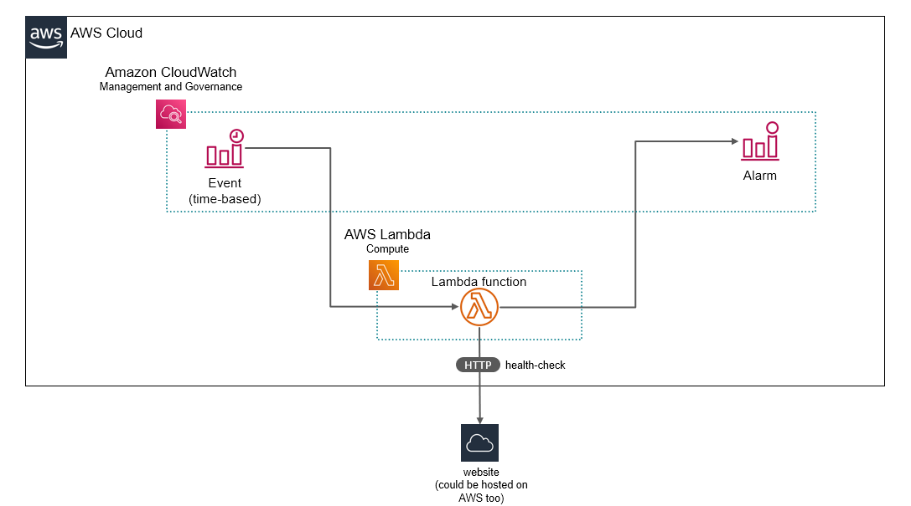
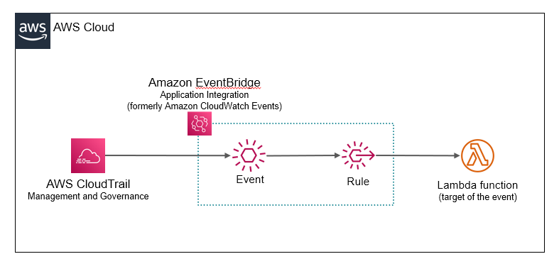
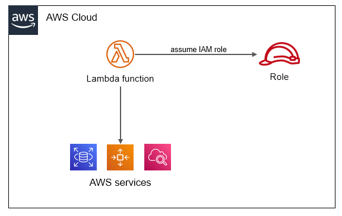

# Chapter 19 &mdash; Interacting with Amazon Web Services
## Section 7: AWS Lambda
> Serverless functions on AWS

### Summary
+ Creating *Lambda functions*
+ Triggering *Lambda functions* with *AWS EventBridge*
+ Searching through *Lambda function's* logs with *AWS CloudWatch*
+ Monitoring Lambda functions with *CloudWatch alarms*
+ Configuring *IAM roles* to *Lambda functions* can access other services
+ Common uses cases for *Lambda functions*: Web applications, data processing, and IoT with *AWS Lambda*
+ Limitations of *AWS Lambda*

### Intro

*AWS Lambda* lets you run code without provisioning or managing servers. With *AWS Lambda* all you have to do is implement a function with a particular signature, upload your code, and configure the execution environment. Afterwrds, the code will be executed within a fully managed computing environment, on which you no longer need to install security updated, replace failed VMs, manage remote access, and in which you are billed by invocation. Welcome to the *serverless* world!

However, the world serverless is a bit misleading. There are servers running in the background, but those are hidden from you. As a result, you don't need to think about the infrastructure supporting your code.

We can define a serverless system as one that meets the following criteria:
+ No need to manage and maintain virtual machines
+ Fully managed service offering scalability and high availability
+ Billed by request/by resource consumption


### Running your code on AWS Lambda

The lifecycle of an application running on *AWS Lambda* is as follows:
  1. Write the code
  2. Upload your code and dependencies
  3. Create a function with a given environment and configuration
  4. Invoke the function to execute your code in the cloud

### AWS Lambda vs. EC2

| Topic | AWS Lambda | EC2 Instance |
| :---- | :--------- | :----------- |
| Granularity of virtualization | Sandboxed execution environment for a single function | Full-blown OS for running one or multiple applications |
| Operations | no-ops &mdash; production-ready, fully managed infrastructure | User responsible for operating the instances in a secure, scalable and highly available way |
| Billing | per invocation/per resources | per second, no matter if the VM is idling or not |
| Scalability | Scales automatically.<br>Includes a throttling limit to prevent unwanted charges | You have to configure an *auto scaling group* to spin up more instances |
| High availability | Fault tolerant by default.<br>The infrastructure spans multiple machines and data centers. | You need to design a *high availability* approach as the EC2 instances are not highly-available by default. |


### Example: Website health check with AWS Lambda

In this section we are going to build a component that sends a health-check every *x* minutes to a certain web site and validates it is running:



The easiest way to create an *AWS Lambda function* is to go to the AWS console and select the *Lambda* service. From there you will be able to configure, code or upload the code of your lambda function.

Our lambda will receive from an environment variable named `WEBSITE_HEALTH_CHECK_URLS` a JSON string with an array of websites to check. The code will use an *async generator* to ping those sites and will return the status of a simple HTTP operation for those sites:

Let's start with the `index.js`. This is the file that *AWS Lambda* service will scan for an async function named `handler`. You will have to honor the signature and name for the service: `exports.handler = async (event) {...}`.


For example, in our case, the website checker works as follows:

```javascript
const { CheckUrls } = require('./lib/check-urls');


// eslint-disable-next-line no-unused-vars
exports.handler = async (event) => {

  const urls = process.env.WEBSITE_HEALTH_CHECK_URLS? JSON.parse(process.env.WEBSITE_HEALTH_CHECK_URLS) : [];

  const checkUrls = new CheckUrls(urls);

  const statuses  = [];
  for await (const status of checkUrls) {
    console.log(status);
    statuses.push(status);
  }

  const response = {
    statusCode: 200,
    body: JSON.stringify(statuses)
  };

  return response;
};
```
| NOTE: |
| :---- |
| Despite supporting Node.js 14 runtime, *ES modules* are not supported for Lambdas. |


In order to test your lambda function, you can simple include an addition `main.js` program that invokes the `handler(...)` function exposed in the `index.js`:

```javascript
const { handler } = require('./index');

async function main() {

  const urls = [
    'https://nodejsdesignpatterns.com',
    'https://www.example.com',
    'https://this-web-does-not-exist.com'
  ];
  process.env.WEBSITE_HEALTH_CHECK_URLS=JSON.stringify(urls);

  console.log(`WEBSITE_HEALTH_CHECK_URLS=`, process.env.WEBSITE_HEALTH_CHECK_URLS);

  const result = await handler();
  console.log(`handler execution result: `, result);
}

main()
  .then(() => console.log(`done!`))
  .catch((err) => console.error(`Error: ${ err.message }`));
```

That way you can easily simulate what the *AWS Lambda* engine will do.

Then, you need to package your lambda function with all your `node_modules` dependencies on a zip and either upload it to *Amazon S3* or to the *AWS Lambda* section of the *AWS console*.

Let's suppose that our lambda is called `website-health-check`. During the *Lambda function* definition process an IAM role is created `website-health-check-role-{*}`. This IAM role is configured specifically for the lambda being created (that is, the role references specifically `website-health-check`).

The role allows this specific lambda to create a log group in *AWS CloudWatch* and allows the lambda to operate within the VPC.

```
+ website-health-check-role-{*}
|
|---- AWSLambdaBasicExecutionRole-{*}
|
|---- AWSLambdaVPCAccessExecutionRole-{*}
```

AWSLambdaBasicExecutionRole-{*}:

```json
{
    "Version": "2012-10-17",
    "Statement": [
        {
            "Effect": "Allow",
            "Action": "logs:CreateLogGroup",
            "Resource": "arn:aws:logs:us-east-1:745748850001:*"
        },
        {
            "Effect": "Allow",
            "Action": [
                "logs:CreateLogStream",
                "logs:PutLogEvents"
            ],
            "Resource": [
                "arn:aws:logs:us-east-1:745748850001:log-group:/aws/lambda/website-health-check:*"
            ]
        }
    ]
}
```

AWSLambdaVPCAccessExecutionRole-{*}
```json
{
    "Version": "2012-10-17",
    "Statement": [
        {
            "Effect": "Allow",
            "Action": [
                "ec2:CreateNetworkInterface",
                "ec2:DeleteNetworkInterface",
                "ec2:DescribeNetworkInterfaces"
            ],
            "Resource": "*"
        }
    ]
}
```

| NOTE: |
| :---- |
| The *AWS Lambda being created must not be associated within your VPC. If you defined the Lambda in your VPC it will have no Internet access, even if your VPC is connected to an *Internet gateway*. |

From the console itself, you will be able to invoke your function and validate that it is working as expected. Once it is ready, you will want to configure the event that will trigger your execution.

For this particular lambda function, a timed event will be appropriate. You can use an *Amazon EventBridge* (formerly *AWS CloudWatch Events*) to schedule a trigger that will invoke your lambda function according to a particular rate (e.g. every 5 minutes). Then, you can also use *CloudWatch alarms* to define an alarm that will fire off when the lambda function throws an error.

It is important to understand the different metrics associated to a Lambda function:

| Metric | Description |
| :----- | :---------- |
| Invocations | Number of times a function has been invoked (either successfully or failed). |
| Errors | Counts the number of times a function failed to execute due to errors inside the function |
| Duration | Measures how long the code takes to run, from the time when the code starts executing to when it stops executing. |
| Throttles | How many invocations have been throttled due to reaching this limit. |


Thus, if you configure an alarm to fire off based on the error metric, it will be associated to the number of times the lambda function fails to execute due to exceptions.

| EXAMPLE: |
| :------- |
| See [01 &mdash; Lambda function: Website health check](01-website-health-check-lambda) for a runnable example. |

### Lambda functions running in your VPC

*Lambda functions* run outside your defined VPCs by default. Also by default, *Lambda functions* are connected to the Internet, and therefore able to access services/websites available on the public Internet.

However, you might have an use case for a *Lambda function* that need access to a resource that is running in a private subnet within your VPC.

When doing so, you will need to define the *VPC*, *subnets*, *security groups* and rest of the components for your *Lambda function* to have access to your private resources, as well as possibly the public internet (e.g. an enhanced version of our website-health-check that persists in a *RDS database* the result of the health checks over the time).

| NOTE: |
| :---- |
| You have to be aware that to access private resources, you have to place your *Lambda function* in the corresponding private subnet. However, if your function needs Internet access, use a *NAT gateway*. Connecting a *Lambda function* to a public subnet doesn't give it Internet access or a public IP address. |

AWS recommends to place a *Lambda function* in a VPC only when it is absolutely necessary to reach a resource that is not accesible otherwise.

| NOTE: |
| :---- |
| Placing a *Lambda function* in a VPC increases complexity, as a number of private IP addresses need to be reserved for scaling concurrent invocations. Also, *NAT gateways* have an associated hourly cost, which is independent of the outband traffic cost.<br>Also, some resources allow you to define a VPC endpoint which would allow a *Lambda function* operating on a private subnet to access *AWS resources* such as S3. |

### Example: Using SAM to deploy a *Lambda function*
This section illustrates how to deploy a *Lambda function* and all its dependencies without using the AWS console.

In the process, we will create a *Lambda function* from scratch that will automaticall add a tag containing the name of the user who launched an *EC2 instance*. The *Lambda function* will use an event-driven approach &mdash; it will subscribe to *Amazon CloudWatch/EventBridge events*.

The diagram for the solution will be as follows:



As seen in the diagram:
+ *AWS CloudTrail* emits an event for every call placed to the AWS API.
+ We configure a rule in *Amazon EventBridge/Amazon CloudWatch* to listen to the event triggered when a new *EC2 instance* is launched (`RunInstances`).
+ We configure the same rule to invoke a *Lambda function* that will receive and process the event.

The event generated by *AWS CloudTrail* will include the following information:

| Event Property | Description |
| :------------- | :---------- |
| `detail-type`  | A string identifying that the even comes from *AWS CloudTrail* |
| `source` | The string that identifies the source of the event, for example `aws.ec2` |
| `eventName` | A string that identifies the event such as `RunInstances`|
| `userIdentity`| An object identifying the user that triggered the event |
| `responseElements` | An object describing the response from the AWS API. This will include detailed information, such as the ID of the launched EC2 instance. |


#### Implementing the *Lambda function*

The following snippet represents the code of the *Lambda function* that receives a *CloudWatch event* from EC2 and tags an instance:

```javascript
const { EC2Client, CreateTagsCommand } = require('@aws-sdk/client-ec2');

const ec2Client = new EC2Client();

exports.handler = async (event) => {
  console.log(event);


  const userName = event.detail.userIdentity.arn.split('/')[1];
  const instanceId = event.detail.responseElements.instancesSet.items[0].instanceId;

  console.log(`INFO: adding owner tag: '${ userName }' to instance ${ instanceId }`);

  const params = {
    Resources: [instanceId],
    Tags: [{ Key: 'Owner', Value: userName }]
  };

  const command = new CreateTagsCommand(params);
  try {
    const tagData = await ec2Client.send(command);
    return tagData;
  } catch (err) {
    console.error(`ERROR: could not tag instance: ${ err.message }`);
    throw err;
  }
};
```

We use the JavaScript SDK v3 for this purpose. In the main program, we require the `EC2Client` and the *command* used to tag instances from the `@aws-sdk/client-ec2` library.

Then we extract from the `event` object the username associated to the launch *EC2 instance* request, and the instanceId of the instance launched.

Then we set up the *command* and execute it to tag the instance with the tag `Owner: username`.

| NOTE: |
| :---- |
| The *Command pattern* is a *behavioral pattern* that consists of an object representing the intention to perform a method invocation.<br>The actual invocation, which will happen at a later time, is delegated to another component different from the one that created the *command* object. |

In order to test it, you can configure the following test event in the Lambda console:

```json
{
  "version": "0",
  "id": "<uuid-of-the-event>",
  "detail-type": "AWS API Call via CloudTrail",
  "source": "aws.ec2",
  "account": "<aws-account-id>",
  "time": "2021-03-25T07:15:53Z",
  "region": "us-east-1",
  "resources": [],
  "detail": {
    "eventVersion": "1.08",
    "userIdentity": {
      "type": "IAMUser",
      "principalId": "<the-principalId>",
      "arn": "arn:aws:iam::<aws-account-id>:user/<user-id-who-originated-the-request>",
      "accountId": "<aws-account-id>",
      "accessKeyId": "<some-access-key>",
      "userName": "<user-id-who-originated-the-request>",
      "sessionContext": {
        "sessionIssuer": {},
        "webIdFederationData": {},
        "attributes": {
          "mfaAuthenticated": "true",
          "creationDate": "2021-03-25T06:46:39Z"
        }
      }
    },
    "responseElements": {
      "requestId": "<uuid-of-the-request>",
      "reservationId": "<reservation-id>",
      "ownerId": "<owner-id>",
      "groupSet": {},
      "instancesSet": {
        "items": [
          {
            "instanceId": "<the-instance-id>",
            "imageId": "ami-0533f2ba8a1995cf9",
            "instanceState": {
              "code": 0,
              "name": "pending"
            }
          }
        ]
      }
    }
  }
}
```

where you can modify the `instanceId` with a real instanceId that you have in your account to validate that it is correctly tagged.


#### Setting up EventBridge/CloudWatch event manually

While our ultimate goal is to create a *CloudFormation template* that sets up all the necessary pieces of our application solution, it is highly recommended to try and do some of the set up manually, so you can get a feeling of the different things that need to be configured.

In this section we will detail how to create a the *EventBridge rule* that acts as the glue between the event that is triggered when an instance is launched, and the invocation of our *Lambda function* that tags the newly launched instance.

For our particular case, we need to create a rule that is triggered when the `RunInstances` event is captured:
```json
{
  "source": ["aws.ec2"],
  "detail-type": ["AWS API Call via CloudTrail"],
  "detail": {
    "eventSource": ["ec2.amazonaws.com"],
    "eventName": ["RunInstances"]
  }
}
```

As seen on the JSON summary of the rule, the event is triggered via *CloudTrail*. This means that we need to additionally set up a *CloudTrail trail* that logs user and API activity and collects it in an file stored in *Amazon S3*.

The bucket that hosts the *CloudTrail logs* must be configured with an specific set of  bucket policies and ACLs to enable its access from *Amazon CloudTrail*:

These bucket policies can be summarized in the following JSON document:

```json
{
  "Version": "2012-10-17",
  "Statement": [
    {
      "Sid": "AWSCloudTrailAclCheck",
      "Effect": "Allow",
      "Principal": {
        "Service": "cloudtrail.amazonaws.com"
      },
      "Action": "s3:GetBucketAcl",
      "Resource": "arn:aws:s3:::<bucket-name-with-cloudtrail-logs>"
    },
    {
      "Sid": "AWSCloudTrailWrite",
      "Effect": "Allow",
      "Principal": {
        "Service": "cloudtrail.amazonaws.com"
      },
      "Action": "s3:PutObject",
      "Resource": "arn:aws:s3:::<bucket-name-with-cloudtrail-logs>/AWSLogs/<folder-with-trail-logs>/*",
      "Condition": {
        "StringEquals": {
          "s3:x-amz-acl": "bucket-owner-full-control"
        }
      }
    }
  ]
}
```

The bucket policies for the bucket must be:

| Grantee | Objects | Bucket ACL |
| :------ | :------ | :--------- |
| Bucket owner | List, Write | Read, Write |
| Everyone | - | - |
| Authenticated users | - | - |
| S3 log delivery group | - | - |

#### Lambda functions security model

Lambda dunctions typically interact with other AWS services. For example, your Lambda function might read a file from *Amazon S3*, write log messages to *Amazon CloudWatch*, or tag an *EC2 instance.

These API calls from the *Lambda function* to the corresponding services need to be authenticated and authorized, and this is done by configuring the *Lambda function* to assume an *IAM role* while executing.



Behind the scenes, temporary credentials are generated based on the IAM role associated to the *Lambda function* and injected into each invocation via environment variables.

| NOTE: |
| :---- |
| You should follow the same principle of least privilege when configuring your *Lambda functions*. |

When defining a *CloudFormation template* for our example, we will need to include a policy that grants our *Lambda function* permissions to execute the `CreateTags` operations. We can do that with an *inline policy*:

```yaml
  EC2OwnerTagFunction:
    Type: 'AWS::Serverless::Function'
    Properties:
      Handler: 'app/src/index.handler'
      Runtime: 'nodejs14.x'
      CodeUri: './auto-tag-lambda-function'
      Policies:
        - Version: '2012-10-17'
          Statement:
            - Effect: Allow
              Action: 'ec2:CreateTags'
              Resource: '*'
```

#### Deploying a Lambda function with SAM

AWS releases the *Serverless Application Model (SAM)* to provide a framework for serverless applications. This framework extends plain *CloudFormation templates* to make it easier to specify *Lambda functions* and their additional resources (APIs, databasees, event source mappings...).

*AWS SAM* also helps you with the deployment of the *Lambda function*, so that you no longer need to zip and upload the files.

Let's start with the template specification, which is both a *CloudFormation template* and a *SAM template*:

```yaml
---
AWSTemplateFormatVersion: '2010-09-09'
Transform: 'AWS::Serverless-2016-10-31'
Description: |
  Stack to automate the setup an event triggered Lambda function that
  is fired when EC2 instances are launched.

Parameters:
  CreateCloudTrail:
    Description: 'Create CloudTrail (set to false if CloudTrail is already enabled in your account)'
    Type: String
    Default: 'true'
    AllowedValues: ['true', 'false']

Conditions:
  MustCreateCloudTrail: !Equals [!Ref CreateCloudTrail, 'true']

Resources:
  TrailBucket:
    Condition: MustCreateCloudTrail
    DeletionPolicy: Retain
    UpdateReplacePolicy: Retain
    Type: 'AWS::S3::Bucket'
    Properties:
      BucketName: !Sub '${AWS::StackName}-${AWS::AccountId}-cloudtrail-logs'

  TrailBucketPolicy:
    Condition: MustCreateCloudTrail
    Type: 'AWS::S3::BucketPolicy'
    Properties:
      Bucket: !Ref TrailBucket
      PolicyDocument:
        Version: '2012-10-17'
        Statement:
          - Sid: AWSCloudTrailAclCheck
            Effect: Allow
            Principal:
              Service: 'cloudtrail.amazonaws.com'
            Action: 's3:GetBucketAcl'
            Resource: !Sub 'arn:aws:s3:::${TrailBucket}'
          - Sid: AWSCloudTrailWrite
            Effect: Allow
            Principal:
              Service: 'cloudtrail.amazonaws.com'
            Action: 's3:PutObject'
            Resource: !Sub 'arn:aws:s3:::${TrailBucket}/AWSLogs/${AWS::AccountId}/*'
            Condition:
              StringEquals:
                's3:x-amz-acl': 'bucket-owner-full-control'

  Trail:
    Condition: MustCreateCloudTrail
    DependsOn: TrailBucketPolicy
    Type: 'AWS::CloudTrail::Trail'
    Properties:
      IsLogging: true
      IsMultiRegionTrail: false
      S3BucketName: !Ref TrailBucket

  EC2OwnerTagFunction:
    Type: 'AWS::Serverless::Function'
    Properties:
      Handler: 'app/src/index.handler'
      Runtime: 'nodejs14.x'
      CodeUri: './auto-tag-lambda-function'
      Policies:
        - Version: '2012-10-17'
          Statement:
            - Effect: Allow
              Action: 'ec2:CreateTags'
              Resource: '*'
      Events:
        CloudTrail:
          Type: CloudWatchEvent
          Properties:
            Pattern:
              detail-type:
                - 'AWS API Call via CloudTrail'
              source:
                - 'aws.ec2'
              detail:
                eventName:
                  - 'RunInstances'

```

The structure is almost identical to the one you would use for plain *CloudFormation*, with a few slight differences:

+ In the template header you find the `Transform: 'AWS::Serverless-2016-10-31'` property specification. The `Transform` section specifies one or more macros that *AWS CloudFormation* will use to process our template. In short, it will let us keep using *CloudFormation*'s declarative approach while enhancing the template capabilities.<br>In our case we're using `AWS::Serverless` transform, that takes an entire template written in the *AWS SAM* syntax and expands it into a compliant *CloudFormation template*.

+ In the parameters section we define a `CreateCloudTrail` parameter that will allow us to reuse an already created *CloudTrail*.

+ The `Conditions` section is also new, and lets you specify circumstances on which certain resources of the template should be processed or not. Again, this section will add a lot of flexibility to our templates.

+ The `Resources` section specified all the *AWS resources* that we need for our application:

  + A bucket to store the *CloudTrail logs* and that will only be created if the `MustCreateCloudTrail` is satisfied.

  + A bucket policy that will associate the necessary permissions and ACLs to the *CloudTrail logs* bucket.

  + A *CloudTrail trail* which will collect all the operations on our region, and that will be used to trigger our *Lambda dunction*

  + A *Lambda function*, that is accommodated through *AWS SAM* specification and that features the following capabilities:
    + An *inline policy* that grants permissions to the *Lambda function* to tag *EC2 instances*.
    + A *CloudWatch/EventBridge event* consisting in the acting upon the event `RunInstances` coming from `'aws.ec2'` source.

With the *CloudFormation template* in place, you just have to create a bucket to hold your deployment packages:

```bash
# create a new bucket for our deployment
$ aws s3 mb s3://{your-lambda-function}-sam-deployments
```

```bash
# upload the deployment to the bucket,
# get a copy of the template in output.yml
$ aws \
cloudformation package \
--template-file <your-cf-sam-template>.yml \
--s3-bucket {your-lambda-function}-sam-deployments \
--output-template-file output.yml
```

And the last part is the deployment:

```bash
# deploy the CF/SAM template to create a CF stack
aws \
cloudformation deploy \
--stack-name <your-stack-name> \
--template-file output.yml \
--parameter-overrides "ParameterKey=CreateCloudTrail,ParameterValue=true" \
--capabilities CAPABILITY_IAM \
```

| EXAMPLE: |
| :------- |
| See #### [02 &mdash; Auto tagging of launched instance](02-auto-tag-instance-lambda) for a runnable example. |

### Recommended use cases for *AWS Lambda*

*Lambda functions* is not a silver bullet. It comes with their own set of limitations and nuances that you should be aware of when you decide to use it to implement a particular solution.

+ Each Lambda execution must complete in 900 seconds or less
+ You must be aware of *Lambda functions cold-start* &mdash; if your function goes for some time without being invoked there is a chance that AWS *offloads* your *Lambda function*. As a result, the next invocation will require a complete reconfiguration of your *Lambda function* which might take from a few milliseconds to several seconds.
+ The maximum amount of memory you can provision for a *Lambda function* is 10 Gib.
+ CPU and networking capabilities are derived from the amount of memory allocated to the *Lambda function* &mdash; it is not possible to increase CPU capacity for intense CPU tasks without increasing as well the memory.
+ The maximum size for a deployment package is 50 MB (zipped). The exploded package cannot be bigger than 250 MB.

| NOTE: |
| :---- |
| The page [AWS Lambda: Lambda quotas](https://docs.aws.amazon.com/lambda/latest/dg/gettingstarted-limits.html) contains the latest information regarding *Lambda quotas and limits*. |

#### AWS Lambda pricing model

*AWS Lambda* is billed per requests, which is great for applications with an *uneven* access patterns. Also, *AWS Lambda* free tier does not expire after 12 months.

This means that the first 1M requests every month are free, assuming 400,000 seconds of execution of a *Lambda function* configured with 1 GB of memory.

Even after the 1M/400,000 seconds of 1GB executions, the price per request and memory is extremely cheap:
  + $0.20 per 1M requests
  + $0.0000166667 for every GB-second of execution

For example, for an application that is invoked 1.2M times, configured with 1536 MB in memory and that run for 60 hours a month we will have to pay:

| Concept | Value |
| :------ | :---- |
| Invocations | 1.2M |
| Memory | 1536 MB |
| Execution time  | 216000 seconds |

This means, we have less than the equivalent of a *Lambda function* that executes for 400,000 seconds with 1 GB of memory, and as a result we do not pay anything for the execution time.

In terms of invocations, we have exceeded by 200,000 invocations the free tier, and as a result we have to pay 200,000 * $0.20 / 1,000,000 which amounts to $0.04.

Also, the *Total Cost of Ownership (TCO)* of *AWS Lambda* is typically lower is it requires less operational related activities (patching, upgrading, backups, etc.)


| NOTE: |
| :---- |
| See https://aws.amazon.com/lambda/pricing/ for the latest information on pricing for *AWS Lambda*. |

#### Use Case: Web Application

A common use case for *AWS Lambda* is to use it as a backend for a web application.

This consists of:
+ *Amazon API Gateway* &mdash; which offers scalable and secure API management solution.
+ *AWS Lambda* &mdash; triggered from the *API Gateway* to process the requests.
+ *Amazon S3 and DynamoDB* &mdash; for the persistence layer

#### Use Case: Data processing

Another common use case is *event-driven* data processing &mdash; whenever data becomes available, an event is generated and a *Lambda function* is invoked to process the information.

This solution typically includes the following services:
+ *Amazon S3* &mdash; for the landing zone of new data
+ *AWS Lambda* &mdash; for the implementation of the processing logic
+ *DynamoDB/ElasticSearch* &mdash; for the persistence layer

#### Use Case: IoT backend

The IoT backend is a variant of the data processing use case, in which the *AWS IoT service* is used to enable the communication between devices and as the component that triggers events for our lambdas.

### Mini-project: Container image support for AWS Lambda

In December 2020, support was announced for container images in *AWS Lambda*.

This means that you can now package and deploy container images of up to 10 GB in size. To simplify things, AWS provides base images for all the supported Lambda runtimes (Python, Node.js, Java, .NET, Go and Ruby) but they also provide based images based on Amazon Linux to include your own rutime.

The easiest way for Node.js is to use one of the readily available base images as seen below:

```Dockerfile
FROM amazon/aws-lambda-nodejs:14.2021.03.22.18

ARG APP_PATH=lambda-health-check
LABEL maintainer="sergio.f.gonzalez@gmail.com"
ENV REFRESHED_AT 2021-03-26.000

# copy and install 3rd party dependencies
COPY ${APP_PATH}/package*.json ./
RUN npm ci --production

# copy the source code of our app
COPY ${APP_PATH}/app/src/ .

# start the program
CMD ["main.lambdaHandler"]
```

| NOTE: |
| :---- |
| I wasn't able to package the Node.js application in any other directory other than the default one. Thus, I removed `WORKDIR` from the `Dockerfile`. |

Note that once the container has been built, you will be able to test the lambda function before uploading it to AWS.

In order to do that, you will need to start the container in a special manner:

```bash
docker run -d -p 8080:8080 lambda-health-check:latest
```

And then, you can use curl to test it:

```bash
$ curl -X POST \
"http://localhost:8080/2015-03-31/functions/function/invocations" \
-d '{}'
"https://nodejsdesignpatterns.com is up, status: 200\nhttps://example.com is up, status: 200\nhttps://this-web-does-not-exist.com is down, error: getaddrinfo ENOTFOUND this-web-does-not-exist.com"
```

Once it works, you can create a *Lambda function* in the *AWS Management Console* selecting *Container Image* as the source for your Lambda.

| EXAMPLE: |
| :------- |
| See [03 &mdash; Lambda function: Website health check packaged as a Docker container](03-lambda-container) for a runnable example. |


#### Mini-project: Container-based lambda deployment using SAM

In the previous mini-project, we manually deployed a container-based *Lambda function* to AWS using the *AWS Console*.

In this section we explore a different approach based using the *SAM CLI* approach. This approach follows a guided, command-line approach that ensures that the resources are successfully built and deployed without having to manually interact with the *AWS Console*.

| NOTE: |
| :---- |
| We will use *AWS SAM CLI* to create a container-based *Lambda function*, but a similar approach can be used to create a *ZIP* based one. |

##### Step 1: Install *AWS SAM CLI*
The first step of the process consists in installing the *AWS SAM CLI tool* following the indications from
https://docs.aws.amazon.com/serverless-application-model/latest/developerguide/serverless-sam-cli-install.html.

You can validate the installation by typing:

```bash
$ sam --version
SAM CLI, version 1.21.1
```

##### Step 2: Dowload a sample application
As the starting point, we will use a command that downloads a well-configured sample application, which we will slightly modify to accommodate the code that we want to run.

In order to do that, we create a directory, run `sam init` and follow the on-screen prompts:

```bash
# create the directory that will contain the solution
$ mkdir 04-sam-lambda-container
$ cd 04-sam-lambda-container

# run sam init to download the sample application
$ sam init
```

Select *AWS Quick Start Templates*, Image (artifact is an image uploaded to an ECR image repository), and the *amazon/nodejs14.x-base* image.

Then, select the name of your application as: `sam-lambda-health-check`.

As a result of running `sam init` and selecting those choices, a new directory named: `sam-lambda-health-check/` will be created will all the resources needed for our project, that we will need to customize according to our preferences.

##### Step 3: Customizing the sample
In the next step we need to customize the Node.js sample provided with our own code.

In our particular case, we will nee to substitute the `hello-world/` directory with the directory that contains the source code of our application.

Also, as our application does not make use of events (i.e. it is a self-contained lambda), we can remove the `events/` directory as well.

The *SAM* approach expects to find the `Dockerfile` within the Node.js application directory. Therefore, you will have to place the file there to accommodate with the expected structure.

The `Dockerfile` provided is the following:

```Dockerfile
FROM amazon/aws-lambda-nodejs:14.2021.03.22.18

LABEL maintainer="sergio.f.gonzalez@gmail.com"
ENV REFRESHED_AT 2021-03-26.000

# copy and install 3rd party dependencies
COPY package*.json ./
RUN npm ci --production

# copy the source code of our app
COPY app/src/ .

# start the program
CMD ["main.lambdaHandler"]
```


Right after that, we need to update the `template.yaml` file that contains the *CloudFormation/SAM template* of our application to make it consistent with the approach:

```yaml
AWSTemplateFormatVersion: '2010-09-09'
Transform: AWS::Serverless-2016-10-31
Description: |
  sam-lambda-health-check

  Sample SAM Template for sam-lambda-health-check

# More info about Globals: https://github.com/awslabs/serverless-application-model/blob/master/docs/globals.rst
Globals:
  Function:
    Timeout: 3

Resources:
  LambdaHealthCheckFunction:
    Type: AWS::Serverless::Function
    Properties:
      PackageType: Image
    Metadata:
      DockerTag: latest
      DockerContext: ./lambda-health-check
      Dockerfile: Dockerfile

Outputs:
  LambdaFunction:
    Description: "Lambda Function ARN"
    Value: !GetAtt LambdaHealthCheckFunction.Arn
  LambdaFunctionIamRole:
    Description: "Implicit IAM Role created for the Lambda function"
    Value: !GetAtt LambdaHealthCheckFunction.Arn
```

#### Step 4: Building the sample

In the next step, you have to use the *SAM CLI* to build your project.

This step will build your container and set up some additional necessary resources into staging folders with `.aws-sam` so that everything is ready to be deployed.

```bash
# change dir to where your template.yaml is found
$ ls
lambda-health-check README.md template.yaml

# build the app
sam build
Building codeuri: /home/ubuntu/Development/git-repos/side-projects/nodejs-in-action/chapter19-aws/07-aws-lambda/04-sam-lambda-container/sam-lambda-health-check runtime: None metadata: {'DockerTag': 'latest', 'DockerContext': '/home/ubuntu/Development/git-repos/side-projects/nodejs-in-action/chapter19-aws/07-aws-lambda/04-sam-lambda-container/sam-lambda-health-check/lambda-health-check', 'Dockerfile': 'Dockerfile'} functions: ['LambdaHealthCheckFunction']
Building image for LambdaHealthCheckFunction function
Setting DockerBuildArgs: {} for LambdaHealthCheckFunction function
Step 1/7 : FROM amazon/aws-lambda-nodejs:14.2021.03.22.18
 ---> 7672de2086bf
...
Step 7/7 : CMD ["main.lambdaHandler"]
 ---> Running in b467f8c4e3a3
 ---> ab2d284f9c85
Successfully built ab2d284f9c85
Successfully tagged lambdahealthcheckfunction:latest

Build Succeeded

Built Artifacts  : .aws-sam/build
Built Template   : .aws-sam/build/template.yaml

Commands you can use next
=========================
[*] Invoke Function: sam local invoke
[*] Deploy: sam deploy --guided
```

If you review the contents of `.aws-sam` you will see that a modified `template.yaml` is found there with the main difference being that an `ImageUri` has been added to the template:

```Dockerfile
AWSTemplateFormatVersion: '2010-09-09'
Transform: AWS::Serverless-2016-10-31
...
Globals:
  Function:
    Timeout: 3
Resources:
  LambdaHealthCheckFunction:
    Type: AWS::Serverless::Function
    Properties:
      PackageType: Image
      ImageUri: lambdahealthcheckfunction:latest
    Metadata:
      DockerTag: latest
      DockerContext: ./lambda-health-check
      Dockerfile: Dockerfile
Outputs:
...
```

If you scan your recently created images, you will see that a new image has been created:

```bash
$ docker images
REPOSITORY                  TAG      IMAGE ID       CREATED         SIZE
lambdahealthcheckfunction   latest   ab2d284f9c85   5 minutes ago   467MB
```

Note also that a few hints about what we can do next is given:

+ test the function locally using `sam local invoke`
+ perform the deployment using `sam deploy --guided`

#### Step 5: Invoking the function prior to deployment

In order to validate that the function works as expected, you just have to do `sam local invoke and it works!`:

```bash
$ sam local invoke
Invoking Container created from lambdahealthcheckfunction:latest
Image was not found.
Building image.................
Skip pulling image and use local one: lambdahealthcheckfunction:rapid-1.21.1.

START RequestId: 5c6db40a-b826-4a9a-905e-e88f6b4c6fc8 Version: $LATEST
2021-03-29T08:59:55.643Z        5c6db40a-b826-4a9a-905e-e88f6b4c6fc8    INFO    https://nodejsdesignpatterns.com is up, status: 200
2021-03-29T08:59:56.237Z        5c6db40a-b826-4a9a-905e-e88f6b4c6fc8    INFO    https://example.com is up, status: 200
2021-03-29T08:59:56.551Z        5c6db40a-b826-4a9a-905e-e88f6b4c6fc8    INFO    https://this-web-does-not-exist.com is down, error: getaddrinfo ENOTFOUND this-web-does-not-exist.com
END RequestId: 5c6db40a-b826-4a9a-905e-e88f6b4c6fc8
REPORT RequestId: 5c6db40a-b826-4a9a-905e-e88f6b4c6fc8  Init Duration: 0.04 ms  Duration: 1804.13 msBilled Duration: 1900 ms        Memory Size: 128 MB     Max Memory Used: 128 MB
"https://nodejsdesignpatterns.com is up, status: 200\nhttps://example.com is up, status: 200\nhttps://this-web-does-not-exist.com is down, error: getaddrinfo ENOTFOUND this-web-does-not-exist.com"(base)
```

Note that we get both the logs and the output from the *Lambda function*.

#### Step 6: Deploying to AWS

The last step consists in deploying to AWS, and *SAM CLI* will help there too, just by doing `sam deploy --guided`.

| NOTE: |
| :---- |
| It is recommended to also include `--profile <aws-profile>` so that the resources are created in the correct AWS account. |

```bash
$ sam deploy --profile <aws-profile> --guided
```

You will then have to provide the necessary information needed to deploy the informatio:
| Parameter | Description | Example Value |
| :-------- | :---------- | :------------ |
| Stack Name | The name of CF stack that will be created | sam-lambda-health-check-app |
| AWS Region | The region on which the CF stack will be deployed | us-east-1 |
| Image Repository | The URI of the ECR repo where image will be pushed | <your-account-id>.dkr.ecr.<region-id>.amazonaws.com/<namespace>/lambda-health-check |

| NOTE: |
| :---- |
| You might need to create an *ECR repository* if you don't have one available for your Lambda function. |


After providing those parameters and confirming the choices, the deployment process will start automaticaly and the *CloudFormation stack* will be created, the image will be pushed to the provided *Amazon ECR repository* and you will be able to invoke your function.

| NOTE: |
| :---- |
| An additional deployment S3 bucket will be created for you automatically with naming `aws-sam-cli-managed-<sam-profile>-samclisourcebucket-<id>`. |

If everything goes well, you will obtain a message: *Successfully created/updated stack - sam-lambda-health-check-app in us-east-1*.

#### Step 7: Cleaning up resources

Once you want to *retire* the deployed application you will just need to use *CloudFormation* and delete the stack:

```bash
$ aws --profile <aws-profile> \
cloudformation delete-stack \
--stack-name sam-lambda-health-check-app
```

Additionally, you might need to manually remove a few other *dangling* resources:
+ Additional S3 bucket used for the deployment &mdash; the bucket `aws-sam-cli-managed-<sam-profile>-samclisourcebucket-<id>` will have to be emptied.
+ Additional *CloudFormation stack* used for creating the deployment bucket &mdash; the template `aws-sam-cli-managed-<sam-profile>` will have to be removed.
+ *CloudWatch logs* &mdash; the log group associated to the deployed lambda will have to be removed.
+ *ECR repository* &mdash; the repository to which the image was uploaded will have to be removed.


| EXAMPLE: |
| :------- |
| See [04 &mdash; Lambda function: using *SAM* to deploy a custom Lambda function](04-sam-lambda-container) for a runnable example. |


#### Mini-project: An enhanced Lambda deployment lifecycle with *SAM/CF*

In this mini-project, we add a few automation scripts to enhance the experience of deploying a container-based *Lambda function*.

| EXAMPLE: |
| :------- |
| See [05 &mdash; Lambda function: enhancing *CloudFormation/SAM* experience to deploy a custom Lambda function](05-sam-cf-automated-lambda) for a runnable example. |


### You know you've mastered this section when...

+ You understand the details of the *AWS Lambda* service and its serverless model:
  + No need to manage and maintain virtual machines
  + Fully managed service offering scalability and high availability
  + Billed by request/by resource consumption

+ You're familiar with the development lifecycle for *AWS Lambda*.

+ You recognize that *AWS Lambda* allows you to build applications in a wide range of programming languages using a fully managed, highly available, and scalable environment.

+ You're familiar with *AWS Lambda management console* to manually configure, code, and test *Lambda functions*.

+ You understand the metrics associated to *Lambda functions*:
  + Invocations
  + Errors
  + Duration
  + Throttles

+ You're aware that lambda functions are always event-driven. They can be triggered by scheduled events, or other event sources such as data (e.g. file arriving to S3) or infrastructure events (EC2 instance being launched).

+ You're fully aware of the differences between creating a Lambda function within or outside a *VPC*. In particular, you're aware that even if you place a *Lambda function* on a public subnet of a *VPC* it won't have Internet access.

+ You're familiar with the *CloudFormation/SAM templates* that allows you to package and deploy *Lambda functions* using the *IaC* approach.

+ You understand that some event sources require you to define a *CloudTrail trail* so that you can configure your *Lambda function* to listen from it.

+ You understand the limitations of the *Lambda functions*.

+ You understand the pricing model for *AWS Lambda*.

### Code samples and mini-projects

#### [01 &mdash; Lambda function: Website health check](01-website-health-check-lambda)
Simple lambda function that checks the health of an array of websites received via environment variables.

#### [02 &mdash; Auto tagging of launched instance](02-auto-tag-instance-lambda)
Application involving an *Amazon EventBridge event* that triggers a lambda function that expects an *EC2 `RunInstances` event* and tags the newly created instance with the username that originated the request.

#### [03 &mdash; Lambda function: Website health check packaged as a Docker container](03-lambda-container)
Container for a simple Node.js app that is packaged as a Docker container using a supported Node.js runtime (14.x) using an Amazon base image.

#### [04 &mdash; Lambda function: using *SAM* to deploy a custom Lambda function](04-sam-lambda-container)
An example containing all the resources needed to deploy a custom *Lambda function* using *AWS SAM*.

##### [05 &mdash; Lambda function: enhancing *CloudFormation/SAM* experience to deploy a custom Lambda function](05-sam-cf-automated-lambda)
An example containing all the resources needed to deploy a custom *Lambda function* using *Cloudformation/SAM* using additional scripts to improve the experience.

### Services used in this chapter

| AWS Service | Category | Description |
| :---------- | :------- | :---------- |
| Amazon CloudWatch | Management and Governance | Collects monitoring and operational data in the form of logs, metrics, and events, providing a unified view of AWS resources, applications and services that run on AWS, and on-premises servers. |
| Amazon EventBridge | Application Integration | A serverless event bus that makes it easier to build event-driven application at scale using events generated from your applications, integrated SaaS applications, and AWS services.<br>EventBridge delivers a stream of real-time data from event sources to targets like *AWS Lambda* or other SaaS applications.<br>You can set up routing rules to determine where to send your data to build application architectures that react in real-time to your data source with even publisher and consumer completely decoupled. |
| Amazon S3 | Storage | Object storage service that offers industry-leading scalability, data availability, security, and performance. |
| AWS CloudFormation | Management and Governance | Gives developers and system admins an easy way to create and manage a collection of related AWS resources.<br>The service supports provisioning, updating, and deletion in an orderly and predictable fashion.<br>*AWS CloudFormation* is the *IaC* solution for AWS. |
| AWS CloudTrail | Management and Governance | Web service that records AWS API calls for your account, and delivers them to you in the form of log files.<br>The recorded information includes the identity of the API caller, the time of the API call, the source IP address of the API caller, the request parameters, and the response elements returned by the AWS service that received the reques.<br>The AWS API call history produced by the service can be used for security analysis, resource change tracking, and compliance auditing and include API calls originated from the *AWS console*, *AWS SDKs*, *AWS CLI* and higher-level services such as *AWS CloudFormation*. |
| AWS Lambda | Compute | Lets you run code without provisioning or managing servers. |


### ToDo

[ ] Investigate lambda-s3 views
[ ] Custom runtime: E.g. Alpine + Node 15 with ESM support
