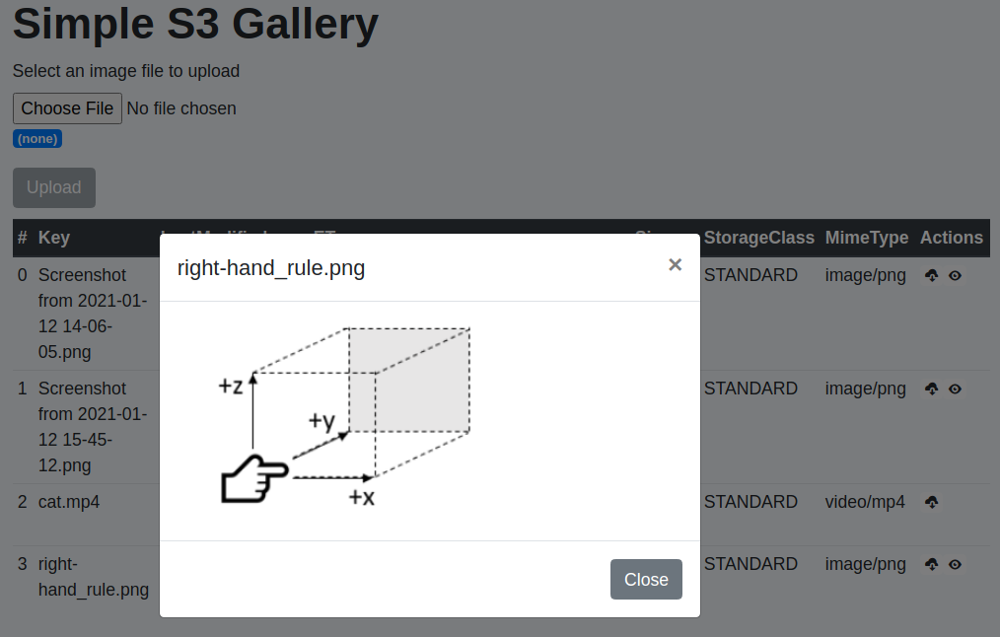
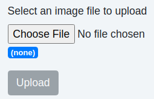
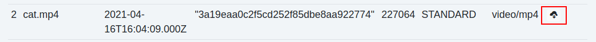
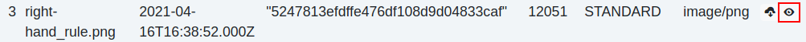

# Part 2: Applications
## Chapter 19 &mdash; Amazon Web Services
### Section 8: Amazon S3 and Glacier
#### 04 &mdash; S3 SDK: Image gallery on *Amazon S3*
> Illustrates how to use the AWS SDK for Node.js (v2) to create simple application that allows the user to upload/download/view images

##### About the example

The example illustrates an application that lets you upload and download images (and other types of files) to/from S3:



The following sections elaborates some of the details of the inner workings of the frontend and backend application.

###### AWS related configuration

You can use environment variables or the `.env` file to tailor the AWS related configuration:

+ `AWS_PROFILE` &mdash; lets you specify a particular *AWS profile* so that all the interactions apply to the account represented by that profile name.
+ `BUCKET_NAME` &mdash; lets you specify the name of the *Amazon S3* bucket that will be used in the application.


| NOTE |
| :--- |
| To prevent leaking the profile name and bucket name used in the examples, the following Git command was used: `git update-index --assume-unchanged .env`. |

###### Uploading documents to S3

File uploading from the browser to the Node.js server is taken care automatically by a form defined on the `index.html` file:

```html
<form action="/upload" method="POST" enctype="multipart/form-data">
  <!-- File input textfield -->
  <div class="form-group">
    <label for="inputFile">Select an image file to upload</label>
    <input type="file" class="form-control-file" id="inputFile" name="inputFile" accept="image/*">
    <span class="badge badge-primary" id="fileInfo">(none)</span>
  </div>

  <!-- Submit button -->
  <button type="submit" class="btn btn-primary" id="submitBtn">Upload</button>
</form>
```

The form features an `<input type="file">` that allows you to select a file from your file system in order to be uploaded.



The form is configured to send a `POST` request to the `/upload` path on the server.

On the Node.js server side, most of the heavy lifting is done by [connect-busboy](https://www.npmjs.com/package/connect-busboy), a connect middleware for [busboy](https://www.npmjs.com/package/busboy). The great thing about that package is that it supports streaming, and therefore is *potentially* very conducive to high level of concurrency.

| NOTE: |
| :---- |
| Alternative modules such as [express-fileupload](https://www.npmjs.com/package/express-fileupload) were evaluated, but [busboy](https://www.npmjs.com/package/busboy) is the one in which you can clearly see that streams are used. |

[connect-busboy](https://www.npmjs.com/package/connect-busboy) is configured as any other *Express middleware* using `app.use(...)`. In this example, and for illustration purposes, we configured many parameters:

```javascript
app.use(busboy({
  highWaterMark: 2 * 1024 * 1024, /* highWaterMark (size of int buffer) */
  fileHwm: 2 * 1024 * 1024,       /* highWaterMark for file streams     */
  limits: {
    /* max file size in bytes     */
    fileSize: (process.env.FILE_SIZE_LIMIT_MB ?? 10) * 1024 * 1024,
    files: 1,           /* max number of file fields  */
    fieldNameSize: 255  /* max field name size        */
  }
}));
```

+ `highWaterMark` &mdash; lets you specify the size of busboy's internal buffer.
+ `fileHwm` &mdash; lets you specify the *high water mark* (size of internal buffer) for file streams.
+ `limits.fileSize` &mdash; lets you specify the max file size limit. In the example, we limit the file size upload to 10 MB.
+ `limits.files` &mdash; the max number of file fields that can be processed by this busboy instance.
+ `fieldNameSize` &mdash; the max filename length for files.


The management of the file upload can be found in the [upload route controller](app/src/routes/upload/index.js):

```javascript
import { buildLogger } from '../../lib/logger.js';
import createError from 'http-errors';
import { uploadToS3 } from '../../services/s3-file-upload.js';
import { listS3Objects } from '../../services/s3-list-objects.js';
import { deleteFromS3 } from '../../services/s3-file-delete.js';
import util from 'util';

const logger = buildLogger('routes:upload');

export async function upload(req, res, next) {
  logger.debug(`About to process file upload request`);

  req.pipe(req.busboy);

  req.busboy.once('file', async (fieldname, filestream, filename, encoding, mimetype) => {
    logger.debug(`Processing file upload request: HTML element name=${ fieldname }, filename=${ filename }`);
    try {
      const data = await uploadToS3(filename, filestream, encoding, mimetype);
      logger.info(`Successfully uploaded file to S3: ${ util.inspect(data) }`);
      res.redirect('back');
    } catch (err) {
      logger.error(`Could not upload to S3: ${ err.message }`);
      if (filestream.truncated) {
        await tryDeleteTruncatedFile(filename);
        return next(createError.PayloadTooLarge('File sent is larger than the specified limit'));
      }
      return next(createError.InternalServerError('Could not upload file'));
    }
  });
}

export async function listUploadedfiles(req, res, next) {

  try {
    const uploadedFiles = await listS3Objects();
    return res.json(uploadedFiles);
  } catch (err) {
    logger.error(`Could not list files uploaded to S3: ${ err.message }`);
    return next(createError.InternalServerError('Could not list files uploaded to S3'));
  }
}

async function tryDeleteTruncatedFile(filename) {
  try {
    await deleteFromS3(filename);
  } catch (err) {
    // report error, but swallow exception
    logger.error(`Truncated uploaded file ${ filename } could not be deleted: ${ err.message }`);
  }
}
```

In the first section we import all the functions that will play some role in the file upload. Immediately afterwards we define our `upload(...)` route controller function.

Within the function, we follow the recommendations from *busboy*:
+ we connect the incoming request to the `req.busboy` function.
+ we create an event handler for the `'file'` event. In the implementation of the handler, we leverage the `uploadToS3(...)` service, passing to it the name of the file to be created, the incoming file stream, as well as the encoding and *MIME type* of the file.<br>If the service can complete the upload, we redirect the user back to the *home page* using `res.redirect('back')`. This is needed because we're delegating the file upload to the `<form>` will will perform a navigation.<br>In case of error, it we need to check if it is because the file was beyond the limit specified in *busboy* configuration, or because any other error.
  + If the file was truncated (`if (filestream.truncated)`) we try to delete the file and return an *HTTP 413 Payload too large* error.
  + If any other error is found, we return an *HTTP 500 Internal Server Error*.

The `uploadToS3()` service is the one that interacts with *Amazon S3* using the *AWS SDK for JavaScript v2*. The method used to save the file is `s3.upload()` which takes care of everything and supports configuring a file stream as the `Body.`

```javascript
import { PassThrough } from 'stream';
import { buildLogger } from '../lib/logger.js';
import AWS from 'aws-sdk';
import util from 'util';

const logger = buildLogger('services:s3-file-upload');

const s3 = new AWS.S3({ apiVersion: '2006-03-01' });


export async function uploadToS3(filename, filestream, encoding, mimetype) {
  let bytesWritten = 0;
  const monitor = new PassThrough();
  monitor.on('data', chunk => {
    bytesWritten += chunk.length;
    logger.debug(`Processing filename=${ filename }: received chunk of ${ chunk.length }, bytes written: ${ bytesWritten }`);
  } );
  monitor.on('finish', () => {
    logger.debug(`Processing filename=${ filename }: ${ bytesWritten } bytes written (truncated: ${ filestream.truncated })`);
  });

  filestream.pipe(monitor);

  const uploadParams = {
    Bucket: process.env.BUCKET_NAME,
    Key: filename,
    Body: monitor,
    ContentType: mimetype,
    ContentEncoding: encoding,
    ServerSideEncryption: 'AES256'
  };

  // uploadOptions is optional, but included for reference
  const uploadOptions = { partSize: 10 * 1024 * 1024, queueSize: 3 };

  try {
    const data = await s3.upload(uploadParams, uploadOptions).promise();
    if (filestream.truncated) {
      logger.error(`${ uploadParams.Bucket }/${ uploadParams.Key } truncated: was larger than the specified limit`);
      throw new Error('File sent is larger than the specified limit');
    }
    logger.info(`Successfully uploaded object: ${ uploadParams.Bucket }/${ uploadParams.Key }: ${ util.inspect(data) }`);
    return data;
  } catch (err) {
    logger.error(`Could not upload object to S3: ${ err.message }`);
    throw err;
  }
}
```

| NOTE: |
| :---- |
| At the time of writing, there is no support for saving file streams to *Amazon S3* using *AWS SDK for JavaScript v3*. |

In order to monitor the upload progress, instead of *piping* the received filestream, we create a *PassThrough* transform stream that would let us obtain more information about the status of the operation:

```javascript
export async function uploadToS3(filename, filestream, encoding, mimetype) {
  let bytesWritten = 0;
  const monitor = new PassThrough();
  monitor.on('data', chunk => {
    bytesWritten += chunk.length;
    logger.debug(`Processing filename=${ filename }: received chunk of ${ chunk.length }, bytes written: ${ bytesWritten }`);
  } );
  monitor.on('finish', () => {
    logger.debug(`Processing filename=${ filename }: ${ bytesWritten } bytes written (truncated: ${ filestream.truncated })`);
  });

  filestream.pipe(monitor);
...
}
```

Then, when configuring the `uploadParams` we set `Body: monitor` which will allow us to receive the `'data'` and `'finish'` events.

If everything goes according to plan, we will return the metadata information returned by `s3.upload()` and in any other case, we will throw an exception so that outer layers can understand what has gone wrong.


###### Downloading documents from S3

For downloading documents, on the client-side, an icon is made available to each of the items in the table to allow the user dowanload the file associated to that row.



When a `'click'` event is detected, the following code is executed:

```javascript
import { streamSaver } from './stream-saver.js';

export async function downloadFile(filename) {
  const url = `download/${ filename }`;
  const fileStream = streamSaver.createWriteStream(filename);

  const res = await fetch(url);
  const readableStream = res.body;

  // optimized approach using streams and pipeTo
  if (window.WritableStream && readableStream.pipeTo) {
    await readableStream.pipeTo(fileStream);
    console.log(`${ filename } successfully saved`);
  } else {
    console.error(`Cannot use streams in this browser runtime`);
    throw new Error('Unsupported runtime');
  }
}
```

The code makes use of a 3rd party dependency [StreamSaver.js](https://github.com/jimmywarting/StreamSaver.js/blob/master/StreamSaver.js) that simplifies the interaction with readable and writable streams on the client side.

| NOTE: |
| :---- |
| At the time of writing, I was not able to make use of [StreamSaver.js](https://github.com/jimmywarting/StreamSaver.js/blob/master/StreamSaver.js) using *ESM import*, so I had to copy the contents of the file and include it in the project as if it was my code. Only minor modifications were included to make perform a minor modification to make the statement `import { streamSaver } from ./stream-saver.js` work. |

In the `downloadFile(...)` function we:
+ create a writeable stream using `streamSaver.createWriteStream()` that will ultimately create a file in our local filesystem.
+ submit a `fetch('/download/${ filename })` to invoke the server side API that streams the contents of the file.
+ pipe the response from the server side to our writeable stream using `readableStream.pipeTo(fileStream)`.

That will ensure that there is no materialization of the whole file being downloaded, which will ensure efficient memory utilization on the client side.

On the server-side, we define a route controller for the `/download/:filename`:

```javascript
import Joi from 'joi';
import createError from 'http-errors';
import AWS from 'aws-sdk';

const s3 = new AWS.S3({ apiVersion: '2006-03-01' });


const logger = buildLogger('routes:download');

export async function download(req, res, next) {
  logger.debug(`About to process file download request for ${ req.params.fileKey }`);
  const fileKey = req.params.fileKey;

  try {
    validateParameter(fileKey);
  } catch (err) {
    logger.error(`Failed to validate request parameter "fileKey"=${ fileKey }: ${ err.message }`);
    return next(createError.BadRequest(`"fileKey" parameter is required`));
  }

  const downloadParams = {
    Bucket: process.env.BUCKET_NAME,
    Key: fileKey
  };

  const s3ObjectRequest = s3.getObject(downloadParams);
  s3ObjectRequest.on('httpHeaders', (statusCode, headers) => {
    res.set('Content-Length', headers['content-length']);
    res.set('Content-Type', 'application/octet-stream; charset=utf-8'); /* instead of using headers['content-type'] */
    res.set('Content-Disposition', `attachment; filename=${ fileKey } filename*=${ fileKey }`);
  });

  const readableStream = s3ObjectRequest.createReadStream();
  readableStream.pipe(res);

  readableStream.on('error', (err) => {
    if (err.code === 'NoSuchKey') {
      return next(createError.NotFound('Specified file does not exist'));
    }

    logger.error(`Could not serve S3 object: ${ err.message }`);
    return next(createError.InternalServerError('Could not download file from S3'));
  });
}

function validateParameter(fileKey) {
  logger.debug(`Validating request parameter fileKey: ${ fileKey }`);
  const schema = Joi.object().keys({
    fileKey: Joi.string().max(255).required()
  }).required();
  const { error } = schema.validate({ fileKey });
  if (error) {
    logger.error(`Validation failed for 'fileKey' request parameter: ${ error }`);
    throw error;
  }
}
```

The controller makes use of the *AWS SDK for JavaScript v2* capabilities to stream the contents of the `getObject(...)` into the Express `response` object.

As a result, after having validated the received parameters, we do:

```javascript
const s3ObjectRequest = s3.getObject(downloadParams);
s3ObjectRequest.on('httpHeaders', (statusCode, headers) => {
  res.set('Content-Length', headers['content-length']);
  res.set('Content-Type', 'application/octet-stream; charset=utf-8'); /* instead of using headers['content-type'] */
  res.set('Content-Disposition', `attachment; filename=${ fileKey } filename*=${ fileKey }`);
});
```

The `s3.getObject(...)` call returns an object that is an `EventEmitter`. An interesting event is the `'httpHeaders'`, which we can use to set the necessary response headers for the incoming request.

For a successful download we need to:
+ set the `Content-Length` HTTP header of the response with what's coming from the `getObject()` invocation.
+ set the `Content-Type` HTTP header to `application/octet-stream` to inform that will proceed with a binary-encoded download.
+ set the `Content-Disposition` to `attachment; filename=<filename-in-local-fs>` to let the browser know that we want to save the file (instead of display it), and that we want to save it with that particular name.

Right after that, it is only needed to create a *readable stream* from the `s3ObjectRequest` object, and then pipe it to the Express `res` object that represents the response.

###### Displaying images downloaded from S3

An additional action icon to view the image is added to the rows that are images.



That identification is performed in the [build-table.js](app/src/public/javascript/services/build-table.js) file:

```javascript
if (dataRowItems['MimeType'].startsWith('image/')) {
  a = document.createElement('a');
  a.href = '#';
  a.className = 'badge badge-light';
  span = document.createElement('span');
  span.className = 'oi oi-eye';
  span.title = `view ${ dataRowItems['Key'] }`;
  span.dataset.action = 'view';
  span.dataset.filename = dataRowItems['Key'];
  a.disabled = true;
  a.appendChild(span);
  td.appendChild(a);
}
```

We check the *MIME type* value for the current row, and if it starts with `/image` we add an additional icon to the actions column.

Then, whenever we detect that the user has clicked on the view icon we initiate the handling of image display on a modal dialog.

The best way to do that consists in creating an *object URL* that will represent the image that has been downloaded.

That process is synthesized in the `getObjectUrlForImage(...)` function:

```javascript
export async function getObjectUrlForImage(filename) {

  const response = await fetch(`/download/${ filename }`);
  const responseBlob = await response.blob();
  const objectUrl = URL.createObjectURL(responseBlob);

  return objectUrl;
}
```

We simply call `fetch()` to trigger an HTTP GET request to `/download/:filename` URL on the server side, and pass the returned *blob* to the `URL.createObjectURL()` function. That *object URL* can then be used to represent the image in the HTML document:

```javascript
const imgObjUrl = await getObjectUrlForImage(filename);
imgPlaceholder.src = imgObjUrl;
imgPlaceholder.onload = () => URL.revokeObjectURL(imgObjUrl);
```

On the server side, there's nothing new to add, as the `/download/:filename` resource is reused.

###### CSP directives customization

The project requires specific customization of CSP directives, that we do on the server side function [get-custom-csp-directives.js](app/src/lib/get-custom-csp-directives.js):

```javascript
import helmet from 'helmet';
import { buildLogger } from './logger.js';
import util from 'util';

const logger = buildLogger('get-custom-csp-directives');

export function getCustomCspDirectives() {
  const defaultDirectives = helmet.contentSecurityPolicy.getDefaultDirectives();
  logger.debug(`Default helmet CSP directives: ${ util.defaultDirectives }`);

  /* customization */
  delete defaultDirectives['upgrade-insecure-requests'];

  const finalDirectives = {
    ...defaultDirectives,
    'img-src': `'self' blob:`,
    'script-src-elem': `'self' https://cdn.jsdelivr.net/npm/web-streams-polyfill@2.0.2/dist/ponyfill.min.js https://code.jquery.com/jquery-3.5.1.slim.min.js https://cdn.jsdelivr.net/npm/bootstrap@4.6.0/dist/js/bootstrap.bundle.min.js`,
    'frame-src': `https://jimmywarting.github.io/`
  };

  logger.info(`Effective CSP directives: ${ util.inspect(finalDirectives) }`);

  return finalDirectives;
}
```

+ `img-src` &mdash; modified so that we can use `blob:` in the client-side JavaScript.
+ `script-src-elem` &mdash; to allow downloading:
  + a polyfill for streams required by [StreamSaver.js](https://github.com/jimmywarting/StreamSaver.js/blob/master/StreamSaver.js)
  + jQuery as required by Bootstrap v4
  + Bootstrap v4 bundle, needed for *modal dialog* handling
+ `frame-src` &mdash; allows accessing https://jimmywarting.github.io/, as referenced by [StreamSaver.js](https://github.com/jimmywarting/StreamSaver.js/blob/master/StreamSaver.js)

###### ToDo

[ ] Spinner
[ ] Improve CSS
