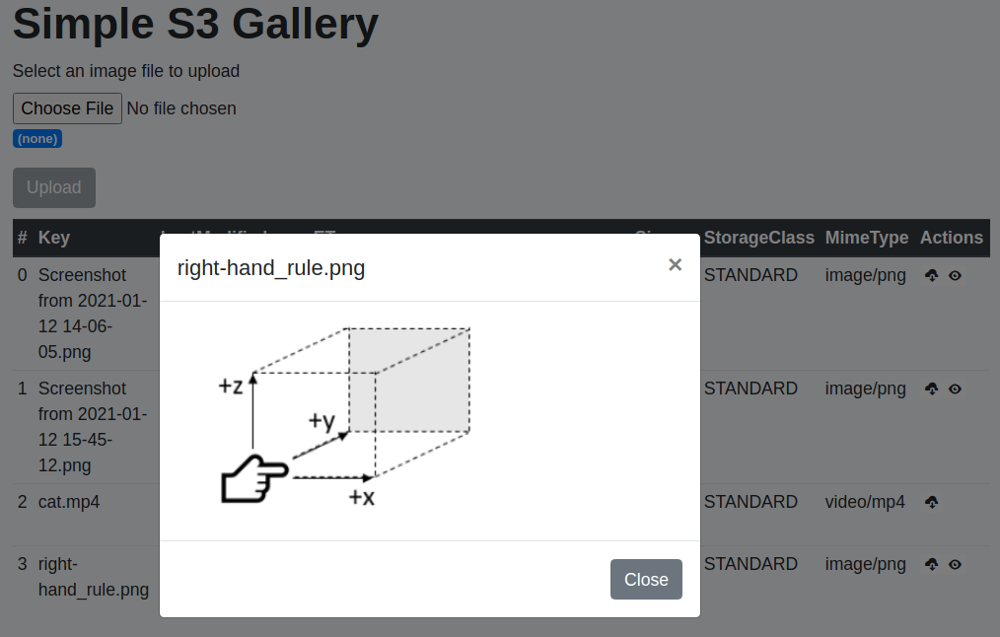

# Chapter 19 &mdash; Interacting with Amazon Web Services
## Section 8: Amazon S3 and Glacier
> TBD

### Summary
*Amazon S3* provided a revolutionary approach to solve the storage needs of modern applications: a distributed data store consisting of a large number of machines connected over a network.

*Amazon S3* is a simple-to-use, fully managed distributed data store provided by AWS, where data is managed as objects. The storage system is classified as an *object store* for that reason.

On top of that, we will discuss *Amazon Glacier*, a backup and archiving store where data storage cost less that storing data on *Amazon S3*, while retrieval times from *Amazon Glacier* can take hours instead of the immediate access *Amazon S3* provides.

### What is an object store?

In an object store, data is stored as objects, with each object consisting of a globally unique UUID, some metadata, and the data itself.

In *Amazon S3*, the object's globally unique UUID is known as its *key*.

The object metadata includes:
+ date of last modification
+ object size
+ object's owner
+ object's content type

### Amazon S3

*Amazon S3* is one of the oldest (if not the oldest) services provided by AWS. *S3* is an acronym of *Simple Storage Service. The service lets you store and retrieve data organized as objects via an API over HTTPS.

Typical use cases for S3 are:
+ storing and delivering static website content
+ backup up data
+ storing structured and unstructured data for analytics
+ storing and delivering user-generated content

*Amazon S3* offers unlimited storage space, for any kind of data (images, documents, binaries...) with an object size limit of 5 TB.

In *Amazon S3* you pay for every GB you store, for the amount of requests that you do to *Amazon S3*, and for all the transferred daata.

*Amazon S3* uses buckets to group objects. A *bucket* is a container for objects. A *bucket* must have a *globally unique name* within the service.

As with other services, you can interact with *Amazon S3* from the *AWS management console*, *AWS CLI* and *AWS SDK*.

### Using Amazon S3 from AWS CLI

In this section we will illustrate how to interact with *Amazon S3* using the *AWS CLI*.

To create a bucket use:

```bash
# mb stands for make bucket
$ aws s3 mb s3://<your-bucket-name>
```

To synchronize an existing local folder to *S3* use `s3 sync`:

```bash
$ aws s3 sync <local-folder> s3://<your-bucket-name>/path/to/backup
```

To retrieve the contents of S3 use `s3 cp`:

```bash
$ aws s3 cp --recursive s3://<your-bucket-name>/path/to/backup <local-folder>
```

A bucket can be deleted using `s3 rb`:

```bash
# rb stands for remove bucket
$ aws s3 rb s3://<your-bucket>
```

As a safety measure, only empty buckets can be removed. If you want to remove a bucket even when it contains objects you can use the `--force` argument:

```bash
# remove bucket even if not empty
$ aws s3 rb --force s3://<your-bucket>
```


### Versioning for objects

By default, S3 versioning is not turned on the service. This means that if you upload to *Amazon S3* an object with the same key of an existing object, the previous object will be overwritten and you will lose the old data.

You can change this behavior by activating *versioning* using the following command:

```bash
$ aws s3api put-bucket-versioning \
--bucket <bucket-name> \
--versioning-configuration Status=Enabled
```

When enabling versioning, you will not lose the previous contents of a file when uploading a new object with the same key.

You will be able to list all the versions of an object using:

```bash
$ aws s3api list-object-versions \
--bucket <your-bucket>
--prefix <your-key> \
```

You can also download any version of the object using

```bash
aws \
s3api get-object \
--bucket <your-bucket> \
--key <your-key> \
--version-id <version-id> \
<your-local-file>
```

| EXAMPLE: |
| :------- |
| See [01 &mdash; Amazon S3: *Amazon S3* from *AWS CLI*](01-hello-s3-versioning) for a runnable example involving bucket creation and configuration (blocking public access, enabling encryption and versioning), copying, downloading, retrieving specific versions, deleting buckets... |

### Archiving objects to optimize costs

*Amazon S3 Glacier* and *S3 Glacier Deep Archive* are a secure, durable, and extremely low-cost Amazon S3 cloud storage classes for data archiving and long-term backup.

While S3 offers instant retrieval of your data, using *S3 Glacier* can take something between one minute and twelve hours for you to retrieve the data. The pricing for long-term archiving on *Amazon S3 Glacier* is by contrast extremely effective.

The following table summarizes the differences between them:

| Quality | Amazon S3 | Amazon S3 Glacier | Amazon S3 Glacier Deep Archive |
| :------ | :-------- | :---------------- | :----------------------------- |
| Storage cost for 1 GB per month (us-east-1) | $0.023 | $0.004 | $0.00099 |
| Cost for inserting data | Low | High | High |
| Cost for retrieving data | Low | High | High |
| Access to data | Immediate upon request | Slow | Very slow |
| Durability | 99.999999999% | 99.999999999% | 99.999999999% |

#### Creating an S3 bucket for the use with *Amazon S3 Glacier*

As a rule of thumb, only move data to Glacier if the chance you'll need to access the data later is low.

Typically, data is moved to *S3 Glacier buckets* using a lifecycle rule that archives data is no longer needed, but that must be backed up (e.g. sensor data that has already been processed).

Using lifecycle rules you will be able to select when after object creation, files can be transitioned to *Amazon S3 Glacier*.

*Amazon S3 Glacier* offers several retrieval options:
+ Expedited &mdash; data will be available within 1-5 minutes. This is the most expensive retrieval option.
+ Standard &mdash; data will be available within 3-5 hours.
+ Bulk &mdash; data will be available within 5-12 hours. This is the least expensive restore option.

### Interacting with S3 programmatically

In this section, we will illustrate how to interact with *Amazon S3* using JavaScript SDK.

Using the SDK you will be able to perform operation such as:
+ listing buckets and their objects
+ creating, removing, updating, and deleting objects and buckets
+ managing access to objects

#### Uploading images to Amazon S3

You can upload images to *Amazon S3* using the `putObject()` function of the *AWS SDK for JavaScript v2*:

```javascript
import AWS from 'aws-sdk';

const params = {
  Body: image,
  Bucket: bucket,
  Key: filename,
  ACL: 'public-read',
  ContentLength: image.byteCount,
  ContentType: image.headers['content-type']
};

try {
  await s3.putObject(params).promise();
} catch (err) {
  /* handle file upload error here */
}
```

Alternatively, you can use the new AWS SDK for JavaScript v3 and send a `PutObjectCommand()`:

```javascript
import { S3Client, PutObjectCommand } from '@aws-sdk/client-s3';
import { fromIni } from '@aws-sdk/credential-provider-ini';


let commandLineArgs;
if (process.argv.length > 3) {
  commandLineArgs = process.argv.slice(2);
} else {
  console.error(`ERROR: Usage node.js main {bucket} {path/to/local/file} [{profile}]`);
  process.exit(1);
}

const [ bucket, file, profileName ] = commandLineArgs;

const s3Client = profileName? new S3Client({
  region: 'us-east-1',
  credentials: fromIni({ profile: profileName })
}) : new S3Client({
  region: 'us-east-1'});


async function main() {
  const fileStream = fs.createReadStream(file);
  const key = path.basename(file);

  const putObjectParams = {
    Bucket: bucket,
    Key: key,
    Body: fileStream
  };

  try {
    const result = await s3Client.send(new PutObjectCommand(putObjectParams));
    console.log(`INFO: Successfully uploaded ${ file } to ${ bucket }: `, result);
  } catch (err) {
    console.error(`ERROR: Could not upload file ${ file }: ${ err.message }`);
    throw err;
  }
}

main()
  .then(() => console.log(`INFO: done!`))
  .catch((err) => console.error(`ERROR: operation could not be completed`, err));```
```

See how support for file streams is also enabled on JavaScript SDK v3, so that you can pipe a readable stream created from a local file to the `Body` property that is used in the `PutObjectCommand()`.


| EXAMPLE: |
| :------- |
| See [02 &mdash; S3 SDK: `PutObject`](02-s3-sdk-put-object) for a runnable example. |

#### Listing the contents of an S3 bucket

You can use the `listObjectsV2()` function of the *Amazon SDK for JavaScript v2* to list up to 1000 objects residing in a bucket:

```javascript
import AWS from 'aws-sdk';

const params = {
  Bucket: process.env.BUCKET_NAME
};

const result = await s3.listObjectsV2(params).promise();
```

Alternatively, you can send the `ListObjectsCommand()` of the *AWS SDK for JavaScript v3*:

```javascript
import { S3Client, ListObjectsCommand } from '@aws-sdk/client-s3';
import { fromIni } from '@aws-sdk/credential-provider-ini';


let commandLineArgs;
if (process.argv.length > 2) {
  commandLineArgs = process.argv.slice(2);
} else {
  console.error(`ERROR: Usage node.js main {bucket} [{profile}]`);
  process.exit(1);
}

const [ bucket, profileName ] = commandLineArgs;

const s3Client = profileName? new S3Client({
  region: 'us-east-1',
  credentials: fromIni({ profile: profileName })
}) : new S3Client({
  region: 'us-east-1'});

const params = {
  Bucket: bucket
};


async function run() {
  let truncated = true;
  let pageMarker;

  while (truncated) {
    try {
      const response = await s3Client.send(new ListObjectsCommand(params));
      response.Contents.forEach(item => console.log(item.Key));
      truncated = response.IsTruncated;
      if (truncated) {
        pageMarker = response.Contents.slice(-1)[0].Key;
        params.Marker = pageMarker;
      }
    } catch (err) {
      console.error(`ERROR: could not list bucket objects: ${ err.message }`);
      truncated = false;
      throw err;
    }
  }
}

run()
  .then(() => console.log(`INFO: done!`))
  .catch((err) => console.error(`ERROR: operation could not be completed`, err));
```

The `ListObjectsCommand()` returns up to 1000 objects in one call, so in the example, we implement a *while* loop that sends as many `ListObjectsCommand(...)` as needed to list all of the objects in the bucket.

| EXAMPLE: |
| :------- |
| See [03 &mdash; S3 SDK: `ListObjects`](03-s3-sdk-list-objects) for a runnable example. |

You can find a large amount of *AWS SDK for JavaScript v3* examples in https://github.com/awsdocs/aws-doc-sdk-examples/tree/master/javascriptv3/example_code/s3.

### Implementing an image gallery with Amazon S3 SDK

You can find a complete application that includes a frontend and a backend that allows the user to upload/download/view images that are stored in *Amazon S3* using *AWS SDK for JavaScript v2* in [04 &mdash; S3 SDK: Image gallery on *Amazon S3*](04-s3-sdk-image-gallery).



| NOTE: |
| :---- |
| The example was implemented using the *AWS SDK for JavaScript v2* because at the time of writing, support for some streaming techniques needed for the application was not available (or was not documented). |

### Using S3 for static web hosting

Amazon S3 can be used to provide a cost effective, scalable and maintenance-free infrastructure for static websites and *Single-Page Applications (SPAs)*.

*Amazon S3* provides the following features that you might require for your website:

+ Defining a custom *index document* and *error documents*.
+ Defining redirects for all or specific requests &mdash; for examaple you might want to forward requests to `/img/old.png` to `/img/new.png`.
+ Setting up a custom domain for an *S3 bucket*.

#### Using a custom domain for a website hosted in *Amazon S3*

You can link a custom domain to an S3 bucket, so that your website hosted on *Amazon S3* uses a friendlier name than: `https://{bucket-name}.s3-website-{region}.amazonaws.com`.

All you have to do is add a *CNAME* record for your domain that points to the bucket's S3 endpoint.

In order to make it work you have to make sure that:
* Your bucket name matches the *CNAME* record name. For example, if you define a *CNAME* for `imdb-cast-fixer.serg.io` your bucket name must be `imdb-cast-fixer.serg.io`.
* *CNAME* records won't work for the *primary domain name*. That is, you need to use a subdomain for *CNAME*. For example, you cannot define a *CNAME* for `serg.io`, you will have to use `something.serg.io`.<br>If you have the requirement to link to a primary domain name, consider using *Amazon Route 53* service.
* Linking a custom domain to your *S3 bucket* only works for HTTP. In order to use HTTPS, consider using *Amazon CloudFront* together with *Amazon S3*, as this service can accept HTTPS request from the client and forward them to *Amazon S3*.

| NOTE: |
| :---- |
| For a detailed walkthrough please see [Configuring a static website using a custom domain registered with Route 53](https://docs.aws.amazon.com/AmazonS3/latest/userguide/website-hosting-custom-domain-walkthrough.html) document from *AWS*. |

##### DNS in a nutshell

DNS (Domain Name Service) is the protocol in charge of translating web addresses such as `www.example.com` into IP addresses such as `93.184.216.34`. Most of network packets have a source and destination IP address and don't use domain names.

As a result, most of the network interactions begin with contacting DNS servers to translate domain names into their corresponding IP addresses.

DNS has multiple *record types* that are used for different purposes. These are a few of the most common ones:

+ **A record** &mdash; it maps a name to an IPv4 address. Every time you go to a website, your browser will look up the *A record* for the address you type in the address bar for you. You can use `dig [+short] A {domain-name}` to perform such query yourself.

+ **CNAME record** &mdash; a *CNAME* record maps an alias name to a canonical domain name. This means it can map a domain name to another hostname, so that DNS queries sent to the alias name will be redirected to the given hostname instead. It is commonly used to define a friendly name such as `myapp.example.com` to a *not-so-friendly-name* such as `{bucket-name}.s3-website-{region}.amazonaws.com` or `{alb-name}-{account-id}.{region}.elb.amazonaws.com`. For this reason, *CNAME* records are extremely useful for hosts whose IP addresses can change frequently, like those controlled by a Load Balancer and an Autoscaling group.<br>There are special rules for *CNAME* records:
  + If you set a *CNAME* record for a name, you can't set other records for that name.
  + You can't set a *CNAME* record for an *apex* domain such as `example.com`.

+ **TXT record** &mdash; it maps a string to any other string . It is typpically used to verify the ownership of a domain, and for SPF/DKIM mail related processes.

+ **AAAA record** &mdash; it maps a name to an IPv6 address.

+ **MX record** &mdash;  used to specify the mail server responsible for accepting the incoming and outgoing emails on behalf of the domain.

+ **NS record** &mdash; used to specify authoritative nameservers.

+ **CAA record** &mdash; used to specify certificate authority rules.

There are 4 types of DNS servers:
+ **root nameservers** &mdash; they store the addressed of TLD nameservers
+ **TLD (top-level domain) nameservers** &mdash; they store the addresses of the authoritative nameservers ending in that TLD (like `.com` or `.org`).
+ **Authoritative nameservers** &mdash; these are the servers you interact with when you set the DNS records for your domain (A, MX, TXT, etc.)
+ **Recursive DNS servers** &mdash; the ones that cache DNS records from authoritative nameservers to accelerate the process of translating domain names into IP addresses. There are millions of these.

Most DNS queries get cached, so that DNS servers do not have to rely on *authoritative DNS servers* to get a response. When the DNS query expires the DNS server needs to contact the authoritative server to get a fresh copy of the DNS record that expired.

To control how long a DNS query for your record should be active, you use TTL value for the record that specifies the number of seconds that the query will be valid.

When you update the value, the existing records on the different DNS servers (other than the authoritative) will not be refreshed and will still respond with the old value. Only when the record has expired the DNS servers will have to ask the authoritative servers to get the new value for the DSN record yo have updated.

| NOTE: |
| :---- |
| Some ISP DNS servers may not honor the TTL and might return old values for DNS records event longer than your established TTL. |

#### Using Amazon CloudFront as a *CDN*

Using a content-delivery network (*CDN*) helps reduce the load time for static web content. A *CDN* distributes static content like HTML, CSS, and images to *Amazon Edge Locations* located all around the world. Then, when a particular user send out a request for some static content, the request is answered from the nearest available node with the lowest latency.

| NOTE: |
| :---- |
| Edge locations are endpoints for AWS which are used for caching contents. <br> Edge locations are not only read-only: you can write, establish TTLs for their content and even clear all the cached content. |

*Amazon CloudFront* is the *CDN* offered by AWS*. You can read the *Amazon CloudFront* documentation at https://docs.aws.amazon.com/cloudfront/index.html. It is a *CDN* that securely delivers data, videos, applications, and APIs to customers globally with low latency, high transfer speeds, all within a developer-friendly environment.

*Amazon CloudFront* is integrated with *AWS* in terms of physical locations that are directly connected to the *AWS global infrastructure*, as well as to other AWS services such as *Amazon S3*, *Elastic Load Balancing*, *Amazon EC2*...

You can think of *Amazon CloudFront* as a way to cache files on *AWS Edge Locations*.

##### Pricing Details for Amazon CloudFront

*Amazon CloudFront* is charged based on the data transfers and requests used to deliver content to your clients.

The following factors are considered:

+ Traffic distribution &mdash; data transfer and request pricing varies across geographic regions and pricing is based on the *edge location* through which your content is being served.

+ Requests &mdash; the price varies depending on the number and type of requests made, and the geographic region on which the requests are made.

+ Data Transfer Out &mdash; the price also depends on the amount of data transferred out of your *Amazon CloudFront's edge locations*.


### Additional considerations when using *Amazon S3*

It's important to note a few nuances that apply when you're using *Amazon S3*:
+ S3 features *read-after-write* consistency for new *PUT* operations, and *eventual consistency* for *PUT* and *DELETE* operations on existing objects.

+ The name of objects stored in S3 are stored in alphabetical order in an index. Moreover, the object's key determines which partition the key is stored in. As a result, if your objects' keys all begin with the same set of characters there's a high chance that they will be stored in the same partition, thus affecting read/write performance. It is therefore recommended to prefix your object keys with random *hashes* such as `jl3STQ-image.png` if you require high-throughput.


### You know you've mastered this section when...

+ You understand that an S3 object consists of a unique identifier, some metadata that describe the object, and the content itself.

+ You're comfortable interacting with S3 using the CLI, SDK and the management console.

+ You understand how to build *Amazon S3* support within your application for the storage layer.

+ You're aware that you can define a lifecycle for your objects to transfer them between different *Amazon S3* storage tiers.

+ You're aware that *Amazon S3* is an *eventual consistency* storage system, and *read-after-write* PUT and DELETE operations on existing objects might return stale data for a while.

+ You're aware that for optimum performance, object keys in *S3* must have random names.


### Code samples and mini-projects

#### [01 &mdash; Amazon S3: *Amazon S3* from *AWS CLI*](01-hello-s3-versioning)
A collection of simple scripts illustrating how to interact with *Amazon S3* from the *CLI*.

#### [02 &mdash; S3 SDK: `PutObject`](02-s3-sdk-put-object)
Illustrates how to use the AWS SDK for Node.js (v3) to create objects in buckets.

#### [03 &mdash; S3 SDK: `ListObjects`](03-s3-sdk-list-objects)
Illustrates how to use the AWS SDK for Node.js (v3) to list the objects in a bucket

#### [04 &mdash; S3 SDK: Image gallery on *Amazon S3*](04-s3-sdk-image-gallery)
Illustrates how to use the AWS SDK for Node.js (v2) to create simple application that allows the user to upload/download/view images.

#### [05 &mdash; S3: Hosting an static website in S3](05-s3-static-site)
Illustrates how to host an static website in S3 using AWS CLI commands.

### Services used in this chapter

| AWS Service | Category | Description |
| :---------- | :------- | :---------- |
| Amazon Glacier | Storage | Secure, durable, and extremely low-cost storage service for data archiving and long-term backup. |
| Amazon S3 | Storage | Object storage service that offers industry-leading scalability, data availability, security, and performance. |
| Amazon CloudFront | Networking | Content Delivery Network (CDN) service that securely delivers data, videos, applications, and APIs to customers globally with low latency, high transfer speeds and with a developer-friendly environment. |


### ToDo

- [ ] Presigning
- [ ] Transform gallery to use presigned requests
- [ ] Investigate abort upload
- [ ] Investigate HTTPS websites
- [ ] CloudFormation template for static website?