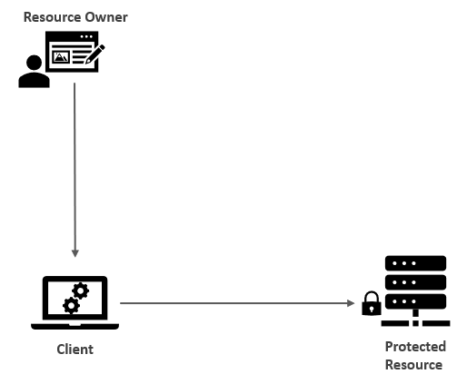
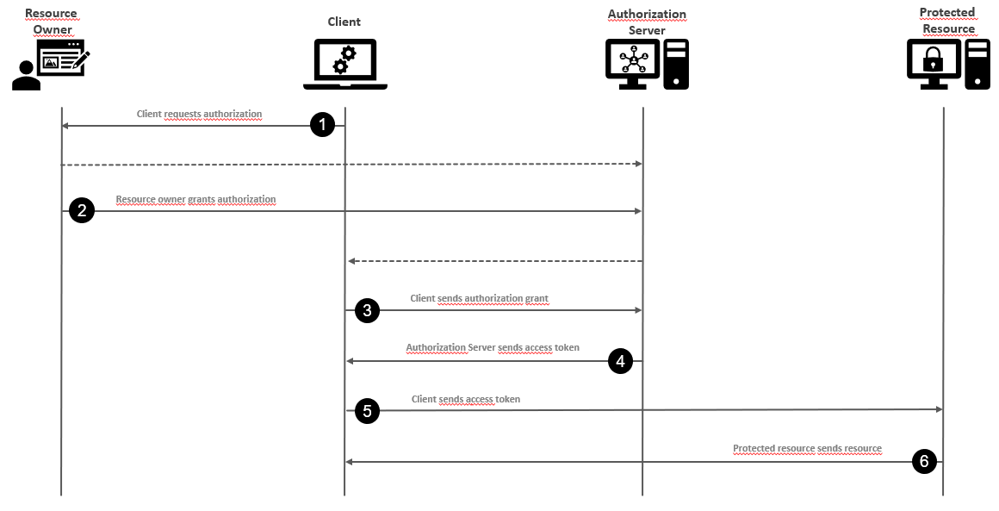

# Part 1 &mdash; OAuth2: Concepts overview
> An overview of the OAuth 2 protocol, and the motivations behind its development.

## Contents
+ Defining OAuth protocol
+ Participants of the OAuth protocol
+ Alternative approaches to solve delegation and their flaws
+ Introducing OAuth
+ What OAuth isn't

## What is OAuth 2.0?

**OAuth 2.0** (or **OAuth2** or **OAuth**) is a security protocol used to secure access to protected resources in a fashion that's friendly to web APIs.

*OAuth2* is a delegation protocol &mdash; a means of letting someone who controls a resource allow a software application to access that resource on their behalf without impersonating them.

OAuth is was designed to solve problems like the following (the *canonical* photo printing scenario):
> You have subscribed to a cloud "photo-storage" service and to a "photo-printing" service. You want to be able to use your "photo-printing" subscription service for the photos you have stored in your "photo-storage" service. Your cloud "photo-printing" service can communicate with your cloud "photo-storage" service using an API. Both services are run by different companies, with no connection between them.

OAuth defines how you can delegate access to your photos in your "photo-storage" service to the "photo-printing" service without giving your "photo-storage" password away to the "photo-printing" service.

In technical terms:
> The OAuth 2.0 authorization framework enables a 3rd party application to obtain limited access to an HTTP service, either on behalf of a resource owner by orchestrating an approval interaction between the resource owner and the HTTP service, or by allowing the 3rd party application to obtain access on its own behalf.

The following diagram depicts the goal of Auth2 protocol:

> The goal of Auth2 is to give the **client application** access to a **protected resource** on behalf of a **resource owner** (usually the end user).

It introduces the following participants:

+ The **resource owner** (usually the end user) has access to an API and can delegate access to that API. The resource owner is usually a person and is generally assumed to have access to a web browser. In the photo printing example, you are the resource owner.
+ The **protected resource** is the component that the **resource owner** has access to. In general, it's a web API of some kind. In our canonical example, the "photo-storage" service is the protected resource.
+ The **client** is a piece of software that access the **protected resource** on behalf of the **resource owner**. In our example, the "photo-printing" service is the client.

## Analysis of alternative approaches to OAuth

This section explores how this type of delegation and impersonation problems were solved before OAuth2, identifying their weaknesses, using our canonical photo printing example as a reference.

### Option 1: Copying and replaying user's credentials
In this first approach, we assume that user's credentials for the "photo-storage" service are also valid for the "photo-printing" service. As a result:
  + When the user logs in to the "photo-printing" service, it makes a copy of the credentials and replays them at the "photo-storage" site in order to gain access to the user's account, pretending to be the user.
  + This require the user to have the same credentials at the **client** application and the **protected resource**. This is only effective if a single company controls the **client** and the **protected resource**, and all of these run in the same policy and network control.

Note that when using this technique, the **protected resource** ("photo-storage" service) has no way of knowing if it's the **resource owner** or the **client** who is accessing the service as they share the same username and password.

### Option 2: Ask the resource owner for the protected resource credentials
In this second approach, we assume that the user's credentials for the "photo-storage" service are different from the "photo-printing" service.

+ The **client** ("photo-printing" service) asks the **resource owner**  for the credentials to log in to the **protected resource** ("photo-storage" service).
+ The user can type these credentials and the **client** ("photo-printing" service) can replay these credentials to the **protected resource** in order to impersonate the **resource owner**.

Note that to keep accessing the API without further user intervention, the **client** ("photo-printing" service) might store the user's credentials so that they can be replayed later as needed. This provides better user experience but it is extremely dangerous, since the compromise of the **client** application will lead to a full compromise of all of the user's accounts across **protected resource**.

Also, the **client** will need to store the user's password in some sort of replayable fashion (plaintext/reversible encryption), which is a vulnerability.
This approach also rules out a large variety of ways the user can log in (e.g. MFA, federated login, etc.)
Additionally, as the protected resource has no way of distinguishing if the call comes directly from the user or the client, the protected resource will expose the whole set of actions (e.g. uploading photos, deleting photos, etc.) instead of granting read-only permissions for accessing the photos.
If the user does not trust the **client** application, the only way to prevent further impersonation would be for the user to change the password on the **protected resource**, which as a side-effect will disable the delegated access.

### Option 3: Using a universal key
Alternatively, it is possible to give the "photo-printing" service access to the **protected resource** independently of the user through a developer key.

+ This solution does not expose the credentials of the user to the **client**, at the expense of opening the door for all types of interactions independently of the user &mdash; with the developer's key, the **client** will be able to impersonate any user that it chooses.

This is not a good solution if the **client** can't be fully trusted by the **protected resource** (won't work across organizations), but can be used within a single organization to delegate access.

Note that even in the context of a single organization, if the developer's key is compromised, the impact will be catastrophic as the owner of the key will be able to access the **protected resource** indefinitely, and for all the users' content.

### Option 4: Per-user key
In this approach, the **protected resource** gives the users a special individual key that will be used only for allowing 3rd party services (such as the "photo-printing" service) access the **protected resource**. This key won't be valid to log in themselves on the client or protected resource.
+ This requires the user to interact with the **protected resource** to generate, acquire, and manage those special credentials in addition to their primary credentials, which complicates the user experience (UX).

Despite the UX, this is the option with less drawbacks. Although it would be better if we could:
+ issue the key separately for each client and user combination
+ bind it with limited rights
+ establish a network-based protocol to allow the generation and secure distribution of these limited credentials across security boundaries in a user friendly and scalable way

## Introducing the OAuth protocol for delegating access

OAuth is a protocol designed to address the shortcomings of the solutions from the previous section. Using OAuth, the end user will be able to **delegate** some part of their authority to access the **protected resource** to the **client** application to act on their behalf.

To do that, the protocol introduces a 4th element in the equation: the **authorization server**.

The **authorization server** is trusted by the **protected resource** to issue special-purpose security credentials called **OAuth access tokens** to **clients**.

The following diagram is an overview of how the OAuth protocol works:

1. To acquire a token, the **client** first must send the **resource owner** to the **authorization server** in order to request that the **resource owner** authorizes this client.
2. The **resource owner** authenticates to the **authorization server**, and is then generally presented with a choice of whether to authorize the **client** who initiated the request. The **client** is able to ask for a subset of functionality (**scopes**), which the **resource owner** must be able to further diminish.
3. Once the authorization grant has been made, the **client** can then request an **access token** from the **authorization server**.
4. If everything checks out, the **client** will receive the access token.
5. The client will be able to present that access token at the **protected resource** to access the API, which will grant the **client** the necessary permissions that were configured by the **resource owner** on the step 2.

Note that:
+ At no time the resource owner's credentials are exposed to the client. The resource owner authenticates to the authorization server separately from anything used to communicate with the client.
+ The client does not possess any sort or high-powered developer key to access the protected resource: the client is unable to access anything on its own, and instead must be authorized by a valid resource owner before it can access any protected resources.
+ The user generally never has to see or deal with the access token directly. The protocol establishes a process for the client to request a token and the user to authorize the client.

## What OAuth2 isn't

+ OAuth should be seen as a *delegation protocol* that provides a way to carry authorization information across systems. It does not help to think of OAuth as a pure *authorization protocol*.

+ OAuth is mostly about how to get a token and how to use a token. OAuth is not an authentication protocol, even though it can be used to build one (it can be used in a larger recipe to provide authentication capabilities).

+ OAuth doesn't define a mechanism for user-to-user delegation. OAuth assumes that the resource owner is the one that's controlling the client. In order for the resource owner to authorize a different user, more than OAuth is needed.

## You know you've mastered this chapter when...

+ You can define what is the OAuth2 protocol, and understand that is used to provide secure access across systems, in a way that is API friendly.
+ You understand that independently of the definition, the best mental model for OAuth consists of thinking of it as a delegation protocol.
+ You're comfortable defining the participants of OAuth, and can easily map those to examples (such as the canonical photo printing scenario):
  + Resource owner
  + Protected resource
  + Authorization service
  + Client
+ You can identify the flaws of the approaches that were used for impersonation before OAuth2:
  + Using the same credentials for the protected resource and the client.
  + Storing the credentials for the protected resource at the client side.
  + Using a Developer's key
  + Using access/secret key per user.
+ You understand the high-level OAuth flow between the different participants.
+ You understand that OAuth2 is primarily focused on describing how to get a token and how to use it to access a protected resource.
