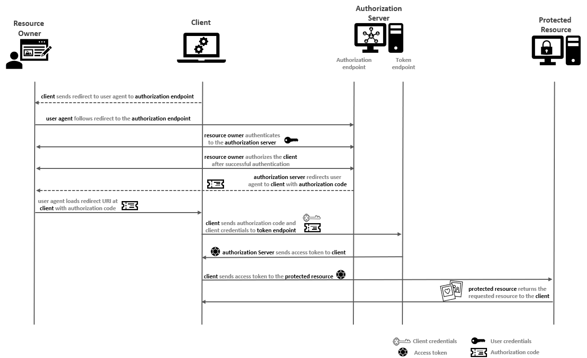
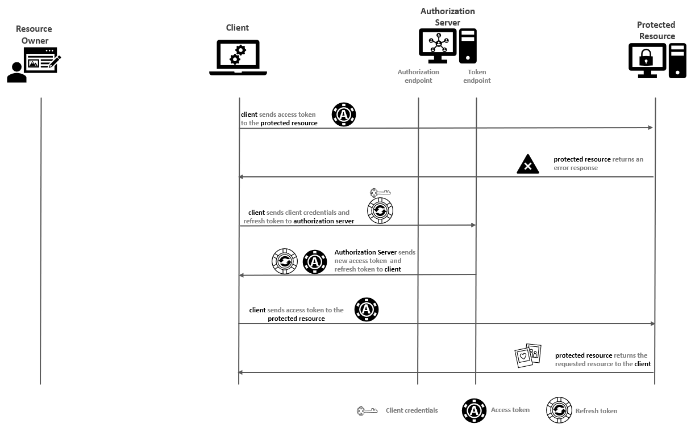

# Part 2 &mdash; The OAuth2 dance
> the steps of the OAth2 protocol

## Contents
+ TBD

## Overview of the OAuth2 protocol

OAuth security protocol involves several participants sending pieces of information to each other in a predefined sequence. This is known as the *OAuth2 dance*:
1. The **resource owner** indicates to the **client** that they would like the **client** to act on their behalf for some activity (hey "photo-printing" service, load my photos from the "photo-storage" service, so that you can print them).
2. The **client** requests authorization from the **resource owner** at the **authorization server** (the "photo-printing" service redirects the user to the **authorization server**).
3. The **resource owner** grants authorization to the **client** (the user authenticates to the authorization server, and chooses the permissions they want to provide the "photo-printing" service with, such as 'read my photos').
4. The **client** receives a token from the **authorization server** (the "photo-printing" service receives an opaque token from the authorization service).
5. The **client** presents that token to the **protected resource** (the "photo-printing" service makes a request to the "photo-storage" service with the token attached to it).

## OAuth 2.0 authorization grant in detail

This section describes in detail the interaction between the different participants (actors) of what is known as the **OAuth authorization grant** process. The process involves the use of a temporary credential known as the **authorization code**, that represents the owner's delegation to the client. It is assumed that the client is a web-based application, and that the resource owner will interactively authorize the client through a browser.



1. The **resource owner** goes to the client application and indicates to the **client** that they would like it to use a particular **protected resource** on their behalf (e.g. the user will tell the "photo-printing" service to use a specific "photo-storage" service). The **client** must know how to interact with the **protected resource** API, and validated that the **protected resource** speaks OAuth.

2. The **client** realizes that to interact with the **protected resource** it needs an access token it does not possess. As a result, the **client** send the resource owner to the **authorization server** with a request that indicates that the **client** is asking to be delegated some piece of authority by that **resource owner** (e.g. the "photo-printing" service will respond to the user request to print a photo from the "photo-storage" service with a redirect request to the user's browser, whose location is the **authorization server**'s authorization endpoint; the request must made clear that the "photo-printing" service is asking for permission to read the photos from the user). This might look like:
```
HTTP/1.1 302 Moved Temporarily
Location: http://<auth-server>:<auth-server-port>/authorize?response_type=code&scope=read&client_id=<client_id>&redirect_uri=http%3A%2F%2F<client-server>%3<client-port>%2Fcallback&state=Lwt50DDQKUB8U7jtfLQCVGDL9cnmwHH1
```

3. The previous response, will make the browser to automatically issue a `GET` request to the given location. This might look something similar to:
```
GET /authorize?response_type=code&scope=read&client_id=<client_id>&redirect_uri=http%3A%2F%2F<client-server>%3<client-port>%2Fcallback&state=Lwt50DDQKUB8U7jtfLQCVGDL9cnmwHH1
Host: <auth-server>:<auth-server-port>
Referer: http://<client-server>:<client-port>
```

4. The **authorization server** will usually require the user to authenticate. This will ensure who the **resource owner** is and what permissions they're allowed to delegate to the client. Note that the user authentication happens directly between the **resource owner** and the **authorization server** &mdash; the **client** application will be completely unaware of this step. The OAuth protocol does not dictate the authenticationt technology, so the authorization server might user simple username/password, MFA, federated SSO, etc. This fact also **insulates** the **client** from changes to the user authentication methods.

5. The **resource owner** authorizes the client application. The OAuth protocol is also flexible at this point, and might allow the user to fine-tune the permissions that will be delegated to the **client** to be a portion of the ones that the **resource owner** possess. For example, it might restrict the **client** to only *read* but not *delete* or *write* photos. Note that the **resource owner** might deny the request as a whole at this point. Also, most of **authorization servers** will remember the **resource owner** decision regarding this particular **client** request and **permissions** so that it will never ask again the user.

6. The **authorization server** will send a redirect response back the **resource owner**'s browser that includes and authorization code. This might look like:

```
HTTP 302 Found
Location: http://<client-server>:<client-port>/callback?code=<authorization-code>&state=Lwt50DDQKUB8U7jtfLQCVGDL9cnmwHH1
```

7. The **resource owner**'s browser will in turn follow the redirect request back to the client. This might look similar to:
```
GET /callback?code=<authorization-code>&state=Lwt50DDQKUB8U7jtfLQCVGDL9cnmwHH1
Host: <client-server>:<client-port>
Referer: http://<auth-server>:<auth-server-port>/authorize?response_type=code&scope=read&client_id=<client_id>&redirect_uri=http%3A%2F%2F<client-server>%3<client-port>%2Fcallback&state=Lwt50DDQKUB8U7jtfLQCVGDL9cnmwHH1
```

8. Note that the redirect includes the special `code` query parameter. This is a one-time-use credential known as the authorization code, and it represents the result of the user's authorization decision. The **client** must parse and extract this parameter to get the authorization code value, and make it available to use in the subsequent step. Also, the **client** must check that the value of the `state` parameter matches the value that it sent in the previous step.

9. Once the state has been verified by the **client**, it can send it back to the **authorization server** on its token endpoint. The client must perform an HTTP `POST` request with its parameters as a form-encoded HTTP entity body, passing its `client_id` and `client_secret` as an HTTP Basic authorization header. This request is made directly between the **client** and the **authorization server** without involving neither the browser, nor the **resource owner** at all. This ensures that the **client** can authenticate itself directly, without other components being able to see or manipulate the token request. The request might look like:

```
POST /token
Host: <authorization-server>:<authorization-server-port>
Content-Type: application/x-www-form-encoded
Authorization: Basic <base64-encoded: 'client_id':'client_secret'>

grant_type=authorization_code&redirect_uri=http%3A%2F%2F<client-server>%3<client-port>%2Fcallback&code=<authorization_code>
```

10. The **authorization server** takes in this request and, if valid, will issue an access token. The validity of the request consists of a number of steps to ensure the request is legitimate. First, it validates the client credentials passed in the `Authorization` header, to determine which client is requesting access. Then, it will read the value of the `code` parameter from the body and will try to match it with the initial authorization request performed by the user at the authorization endpoint: it must confirm that the authorization server has issued that code, for that particular **client**, and that the user authorized the subsequent request and for what set of permissions. If the authorization code is valid, it has not been used previously, and the **client** making the request is the same as the client that made the original request, the **authorization server** generates and returns a new access token for the **client**. The response might look like:
```
HTTP 200 OK
Content-Type: application/json

{
  "access_token:" "<the-access-token>",
  "token_type": "Bearer"
}
```

11. The **client** can now parse the token response, and get the access token value from it so that it can be subsequently used. The response might also include a refresh token (used to generate new tokens without asking for authorization again), as well as some other additional information such as hints about expiration time for the token, the token scopes, etc. The **client** is allowed to store the access token in a secure place for as long as it wants to use the token, even after the user has left.

12. With the token in hand, the **client** can present the token to the **protected resource** API in order to access the secured content. The request might look like:

```
GET /resource HTTP/1.1
Host: <protected-resource-server>:<protected-resource-port>
Authorization: Bearer <the-access-token>
```

13. The **protected resource** can then parse the token out of the header, determine whether it's still valid, and return the response with the requested content if everything matches. A **protected resource** has a number of options for doing this token lookup. One of the options is to make the database of tokens generated by the **authorization server** available to the **protected resource** server, so that it can validate the token.

## OAuth's actors

There are found main actors in an OAuth system: **clients**, **resource owners**, **authorization servers**, and **protected resources**.

### OAuth clients
An OAuth **client** is a piece of software that attempts to access the **protected resource** on behalf of the **resource owner**, and it uses the OAuth protocol to obtain that access.

The responsibilities of the **client** are:
+ obtaining tokens from the **authorization server**.
+ using tokens at the **protected resource**.

The **client** doesn't have to:
+ understand the token
+ inspect the token's contents.

The **client** can be a web application, a native/mobile application, or even an in-browser JavaScript application.

### OAuth protected resource

An OAuth **protected resource** is available through an HTTP server and it requires an OAuth token be accessed.

The **protected resource** responsibilities are:
+ must know how to validate the tokens present to it.
+ must include logic to determine whether and how to serve the requests presented to it.

### OAuth resource owner

A **resource owner** is the entity that has the authority to delegate access to the **client**. Unlike other parts of the OAuth system, the **resource owner** isn't a piece of software. In most cases, the **resource owner** is the person using the **client** software to access something they control. Also in most cases, the **resource owner** will use a web browser to interact with the client, but that is not required by the OAuth protocol.

### OAuth authorization server

An OAuth **authorization server** is an HTTP server that authenticates the **resource owner** and the **client**, provides mechanisms for allowing **resource owners** to authorize **clients**, and issues tokens to **clients**. Additionally, they might offer capabilities for remembering authorization decisions and token introspection.

## OAuth's components

The OAuth specification defines the following components that connect the actors in the previous section in a larger protocol:

### Access tokens

An OAuth **access token** (or simply **token**), is an artifact issues by the authorization server to a client that indicates the rights that the client has been delegated.

| NOTE: |
| :---- |
| The OAuth protocol itself does not define a format or content for the token. |

The tokens are opaque to the **client**. The **client**'s job is to carry the token, requesting it from the **authorization server** and presenting it to the **protected resource**.

The tokens are issued by the **authorization server**, and the **protected resource**'s job is to validate it. This means that the token is not opaque to those actors.

### Scopes

An OAuth **scope** is a representation of a set of rights at a **protected resource**.

Scopes are represented as strings in the OAuth protocol, and they can be combined into a set by using a space-separated list.

Scopes are defined by the **protected resource** (based on the API it's offering). The **client** can request certain scopes, and the **authorization server** can allow the **resource owner** to grant or deny particular scopes to a given **client** during its request.

Scopes are generally additive in nature.

In our photo printing example, we might have something similar to the following:
+ The "photo-storage" service is our **protected resource**. Its API defines several different scopes that describe the different level of permissions for accessing the photos: `"read-photo"`, `"read-metadata"`, `"update-photo"`, `"update-metadata"`, `"create"` and `"delete"`
+ The "photo-printing" service is our **client**. In order to print the photos it only neads to read the photos, and therefore it should ask for the `"read-photo"` scope. Note that if the service implements the capability to print an *album* created by the user in the "photo-storage" service, it might require the `"read-metadata"` scope too. Because of that, the "photo-printing" service would usually require both of them together, so that it can get an access token that works for both capabilities.

### Refresh tokens

An OAuth **refresh token** is similar to an access token, with the difference that the **refresh token** is never sent to the **protected resource**. Instead, the **client** uses the refresh token to request a new access token to the **authorization server** without involving the resource owner.



As the access token is opaque to the **client**, it will usually find out that an access token is no longer working by using it at the **protected resource** and receiving an error response. The reasons for the token not being valid can vary: the user could have revoked the token, the token could have expired, etc. Also, it is possible that the **resource owner** is no longer connected to authorize the request again (e.g. in our photo printing example, the "photo-printing" service might be a background batch job that takes a long time to complete, as it might have to wait for a printer to be available).

Refresh tokens also give the client the ability to *down-scope* its access. If a client is granted scopes `"A"`, `"B"`, and `"C"`, but it knows that it needs only scope `"A"` to make a particular call, it can use the refresh token to get an access token for only scope `"A"`.

If the refresh token itself doesn't work, the **client** will be required to involve the **resource owner** again.

### Authorization grants

An OAuth **authorization grant** is the means by which an OAuth **client** is given access to a **protected resource** using the OAuth protocol, and if successful results in the **client** getting a token.

| NOTE: |
| :---- |
| The authorization grant is one of the most confusing terms in OAuth2. It's better to think that the authorization grant is the method for getting a token.<br>Because of this confusion, the authorization grant is known as a *flow* of the OAuth protocol. |

Several authorization grants (or flows) exist in OAuth, with its own characteristics. We've already seen the authorization code grant type (or authorization code flow).

## Interactions between OAuth's actions and components

OAuth is an HTTP-based protocol, but unlike most HTTP based protocols, OAuth communication doesn't always happen through simple HTTP request and response interaction.

### Back-channel communication

Many parts of the OAuth process use a normal HTTP request/response format. Since these request generally occur outside the purview of the **resource owner** and the user agent, they're referred to as **back-channel communications**.

In other words, back-channel communications use direct HTTP connections between the **client**, **authorization server** and **protected resource** without involving the user interaction or the browser.

For example, the **authorization server** provide a token endpoint that the **client** uses to request access tokens and refresh tokens. The **client** calls this endpoint directly, presenting a *form-encoded* set of parameters that the **authorization server** parses and processes. The **authorization server** then responds with a JSON object representing the token.

Also, when the **client** connects to the **protected resource**, it makes a direct HTTP call in the back channel. The details of this call are entirely dependent on the **protected resource**.

### Front-channel communication

**Front-channel communications** is the communication method the OAuth uses to indirectly communicate two systems through an intermediary browser.

That is, front-channel communication uses HTTP redirects through the web browser instead of direct connections.

This technique is effective to isolate the sessions on either side of the browser, which allows it to work across different security domains. This is what is used when the user needs to authenticate without exposing their credentials to the **client**.

Front-channel communication works by attaching parameters to a URL and indicating that the browser should follow that URL. The receiving party can then parse the incoming URL, as fetched by the browser, and consume the presented information. The receiving party can then respond by redirecting the browser back to a URL hosted by the originator, using the same method of adding parameters. This, both parties, in completely separate security domains, communicate with each other indirectly through the use of a web browser as intermediary.

As a result, each front-channel request and response is actually a pair of HTTP request and response transactions.

For example, in the authorization code grant:
+ the client needs to send the user to the authorization endpoint, and it also needs to communicate certain parts of its request to the authorization server. The **client** sends an HTTP redirect to the browser. The target of this redirect is the authorization server's URL with certain fields attached to it as query parameters:
```
HTTP 302 Found
Location: http://<authorization-server>:<authorization-server-port>/authorize?client_id=<client_id>&response_type=code&state=843hi43824h42tj
```

+ the **authorization server** parses the incoming URL, and extracts the necessary information sent by the **client**. At this point, the **authorization server** can interact with the **resource owner**, authenticating it, and presenting the permissions that the client is asking for. When all this information has been given by the user, the **authorization server** will need to return the authorization code to the **client**. To do that, it sends an HTTP redirect to the browser, but this time with the **client**'s `redirect_uri` as the base and additional query parameters it wants to pass to the client:

```
HTTP 302 Found
Location: http://<client-server>:<client-server-port>/callback?code=<auth-code>&state=843hi43824h42tj
```

+ the browser will follow this redirect by making an HTTP request to the given location. The **client**, when receiving this request, will parse the URL parameters which will make the communication from the **client** to the **authorization server** successful through the browser as an intermediary.


Note that all information passed through the front-channel is accessible to the browser, and therefore subject of being manipulated before the ultimate request is made. The OAuth protocol is aware of this, and limits the amount of information passed through the front channel, and by making sure that none of the piece of information used in the front channel can be used on their own to accomplish the task of delegation:
  + the authorization code can't be used by the browser directly, but instead, it must be presented alongside the client's credentials in the back channel.
  + other protocols such as OIDC offer increased security for this front-channel messages.

## Summary

OAuth protocol has many moving pieces, but it's build of simple actions that add up to a secure method for authentication delegation.
+ OAuth is about getting tokens and using tokens
+ Different components in the OAuth system care about different parts of the process.
+ Components use direct (back channel) and indirect (front channel) HTTP to communicate with each other.

## You know you've mastered this chapter when...

### ToDo
+ Review whole chapter, clean and simplify
+ Thnking about how to draw the front-channel communication diagram.
+ Maybe include examples from real OAuth interactions