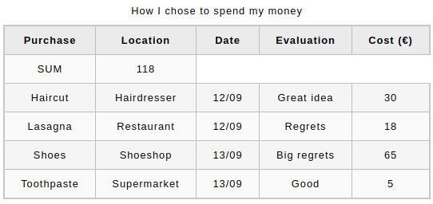
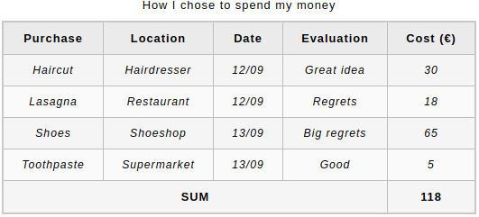

# 04 &mdash; Adding structure mark up to an HTML table
> Illustrates how to add structural markup (`<thead>`, `<tbody>` and `<tfooter>`) to an HTML table.

## Description

This example was developed following the information on [MDN: Adding table structure](https://developer.mozilla.org/en-US/docs/Learn/HTML/Tables/Advanced#active_learning_adding_table_structure).

In the exercise you start with an already made HTML table, and you add structural elements to it.

Starting from:


You will end up building this:


### 1. Adding HTML structural elements

The first task consists in adding `<thead>`, `<tfoot>`, and `<tbody>` elements to the HTML table.

### 2. Adding a `colspan` attribute to the *SUM* column

Add a `colspan` to the *SUM* cell so that it spans 4 columns.

### 3. Add some `<style>` to the table

Inside the `<style>` element to the table add the following CSS as an illustration of how easy it is to style a table when it has structure markup.

```css
tbody {
  font-size: 95%;
  font-style: italic;
}

tfoot {
  font-weight: bold;
}
```
