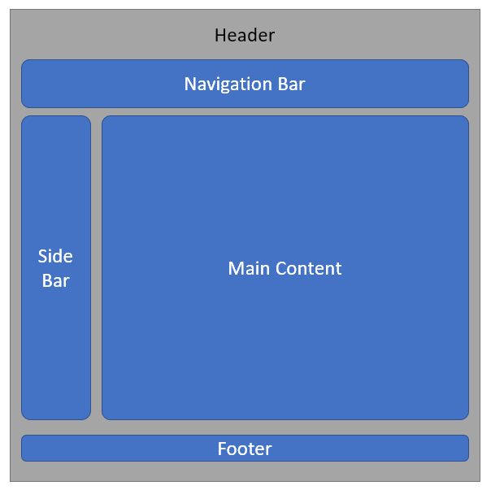
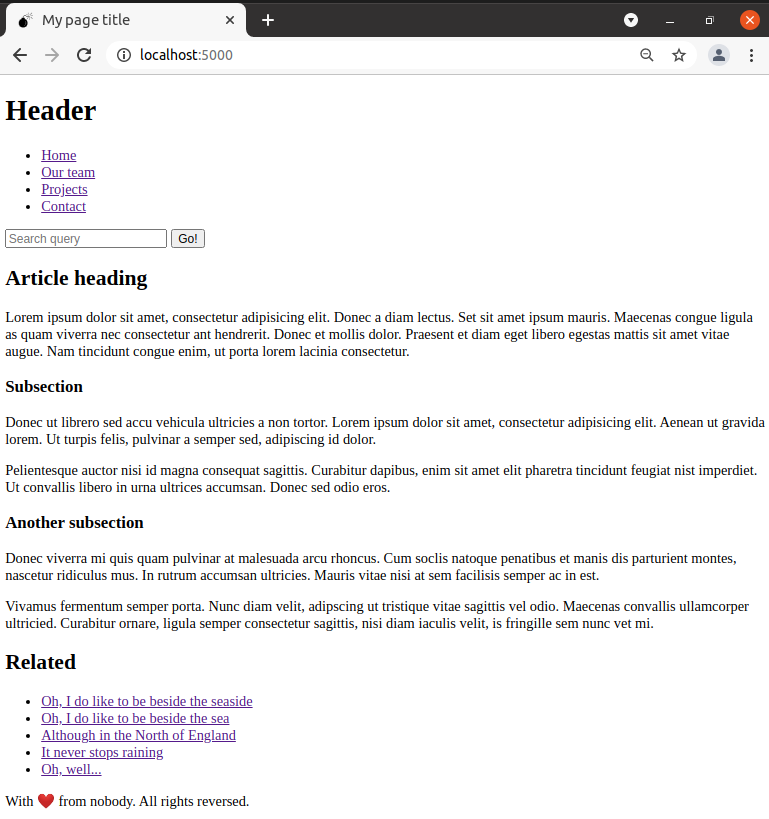
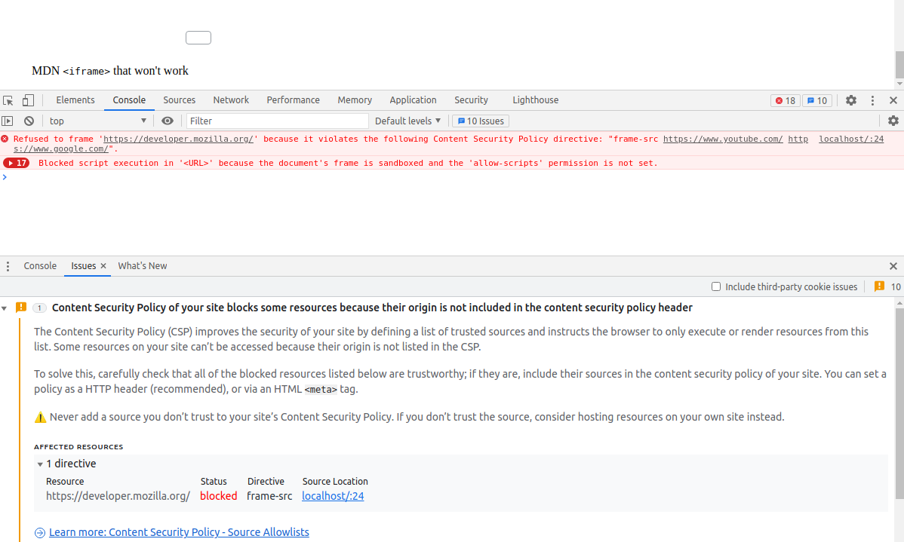
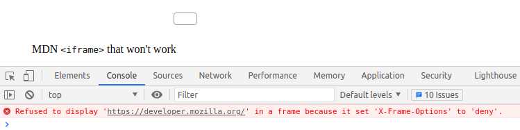

# HTML basics refresher
> practising some HTML concepts

This section does not intend to be a tutorial. It only contains documentation and examples of specific HTML topics.

## Concepts

### HTML first steps

#### Block vs. inline elements

There are two important categories of HTML elements:

+ **Block-level elements** form a visible block on a page. A *block-level element* appears on a new line following the content that precedes it. Any content that follows a *block-level element* also appears on a new line.<br>*Block-level elements* are usually structural elements on the page, such as headings, paragraphs, lists, navigation menus, or footers.<br>*A block-level* element wouldn't be nested inside an inline element, but it might be nested inside another *block-level* element.

+ **Inline elements** are contained within *block-level elements*, and surround only small parts of the document's content. An *inline element* will not cause a new line to appear in the document. It is typically used with text, for example `<a>` element to create a hyperlink in some existing text, or `<em>` or `<strong>` to create emphasis on some parts of a paragraph text.

Consider the following example:

```html
<em>first</em><em>second</em><em>third</em>
<p>fourth</p><p>fifth</p><p>sixth</p><em>seventh</em>
```

As `<em>` is an inline element, the first line would be displayed on a single line, while fourth, fifth and sixth will appear on their own line. The next `<em>` will also appear on their own line as it is following a *block-level element*.

| NOTE: |
| :---- |
| The terms *block* and *inline* should not be confused with the types of *CSS boxes* of the same name. Applying a *block* styling to an element would not change the *nature* of the element as a *block-level* element. |

### Boolean attributes

Sometimes you will find attributes written without values. These are called Boolean attributes. Boolean attributes can only have one value, which is generally the same as the attribute name:

```html
<input type="text" disabled="disabled">
```

You will typically find the shorthand:

```html
<input type="text" disabled>
```

And if you want to make it *enabled* you'd just leave out the `disabled` attribute:

```html
<input type="text"> <!-- enabled input -->
```

| NOTE: |
| :---- |
| In JavaScript you can set *Boolean* attributes doing `input.disabled = true` and `input.disabled = false`. See [01 &mdash; Setting *Boolean* attributes from JavaScript](01-boolean-attrs-js) for an example. |

### HTML entities

You can find the complete list of HTML character entities (such as `'&mdash;'` for &mdash; or `'&lt;'` for `<`) in https://en.wikipedia.org/wiki/List_of_XML_and_HTML_character_entity_references.

### Adding an icon to your page

You can add an icon to your HTML page by including the following line in your HTML's `<head>` block:

```html
<link rel="shortcut icon" href="favicon.ico" type="image/x-icon">
```

| NOTE: |
| :---- |
| Most modern browsers support GIF and PNG images for icons, but using a `'.ico'` will ensure compatibility with older browsers.<br>Note also that you might need to include a *CSP* `img-src` directive to allow fetching the icon of your HTML page. |

### Applying styles to an HTML page

The `<link>` element that goes inside the `<head>` of your document can be used to reference the different CSS stylesheets that you want to apply to your document:

```html
<head>
  <link rel="stylesheet" href="{path-to-local-css-or-remote-url}">
</head>
```

For example:

```html
<link rel="stylesheet" href="https://mystyles.example.com/mystyles.css" integrity="sha384-9aIt2nRpC12Uk9gS9baDl411NQApFmC26EwAOH8WgZl5MYYxFfc+NcPb1dKGj7Sk" crossorigin="anonymous">

<link rel="stylesheet" href="stylesheets/styles1.css">
```

### Applying JavaScript to an HTML page

The `<script>` element (that should go in the `<head>` of your doment), lets you load the JavaScript programs at the same time as the page's HTML.

```html
<head>
  <script src="javascript/app.js" type="module" defer></script>
</head>
```

Note the `defer` boolean attribute &mdash; in modern browsers, this is the most foolproof option to ensure that you don't get errors resulting from JavaScript trying to access an HTML element that doesn't exist on the page yet.

In older browsers, it was common to find the `<script>` tags at the bottom of the `<body>` because browsers load the elements of an HTML page in the order in which they appear. Also, the fetching processes were blocking. Thus, if you included a `<script>` tag at the beginning of the document, it will block the loading of the subsequent elements, thus causing very poor UX for heavy pages.

Also, we wanted to make sure that the JavaScript was executed when all the HTML were loaded, so that the JavaScript found all the elements it was waiting to find.

Nowadays, we have modern techniques that give us all the necessary control about how JavaScript is fetched, loaded and executed: `async` and `defer`.

JavaScript programs using the `async` attribute will be downloaded without blocking the rendering of the page, and executed as soon as the script finishes downloading. This is useful when the scripts in the page do not depend on the content of the page, and if you have several `<script>` tags, you don't care which one gets loaded first.

JavaScript referenced using the `defer` attribute, will run in the order they appear in the page, and will execute as soon as both the script and content are downloaded.

Both, `async` and `defer` attributes make the browser to download the scripts in a different thread from the one that is parsing the HTML page, and therefore offer a good UX. If your scripts need to wait for parsing the HTML and might have dependencies between them, use `defer`. If your scripts should run as soon as possible and they don't have dependencies with the HTML page or other scripts, use `async`.

### Additional meta elements: `name` and `content`

You can use the meta elements `name` and `content` to include additional information about your page. They will be typically used by search engines and content management systems:

```html
<meta name="author" content="Sergio F. Gonzalez">
<meta name="description" content="This page is intended to be used as a sandbox for practising and refreshing some HTML concepts.">
```

### Semantic vs. Presentational elements

Semantic elements such as `<em>` for emphasis, and `<strong>` for strong emphasis should be preferred over presentational elements such as `<b>`, `<i>` and `<u>`. The latter came about in an era where CSS was not omnipresent as it is now. Using the semantic elements would let you leverage additional features such as accesibility, SEO optimization that would be impossible with presentational elements.

### Link attributes: `download`, `target`, and `title`,

When you link to a resource that's to be downloaded rather than opened in the browser, use the `download` attribute to provide a default save filename:

```html
<a href="https://pictures.example.com/foo/bar.png" download="bar.png">download bar.png</a>
```

The `target` attribute is used to display the linked URL:
  + `target="_self"`: the current browsing context (default).
  + `target="_blank"`: usually a new tab, but users can configure browsers to open a new window instead.
  + `target="_parent"`: the parent browsing context of the current one. If no parent, it behaves as `_self`.
  + `target="_top"`: the topmost browsing context. If no ancestors, behaves as `_self`.

The `title` attribute contains additional information about the link:

```html
<a href="https://pictures.example.com/" title="An example website with thousands of free-to-use pictures for you to use">Pictures</a>
```

### Some additional semantic elements worth mentioning

#### Description lists

The purpose of description lists is to mark up a set of items and their associated descriptions, such as terms and definitions, or questions and answers.

```html
<dl>
  <dt>Term 1</dt>
  <dd>Definition for term 1</dd>
  <dt>Term 2</dt>
  <dd>Definition for term 2</dd>
  <dd>Additional info for term 2</dd>
  ...
</dl>
```

#### Blockquotes and inline quotations

You can use the `<blockquote>` and its `cite` attribute when quoting text from somewhere else:

```html
<p>And as Mark Twain said (probably with other words)...<p>
<blockquote cite="https://quoteinvestigator.com/2018/11/18/know-trouble/">
  <p>Assumption is the mother of all fuckups.<p>
</blockquote>
```

Inline quotations work in the same way, but using the `<q>` element:

```html
<p>The quote element is <q cite="https://developer.mozilla.org/en-US/docs/Web/HTML/Element/q">intended for short quotations that don't require paragraph breaks</q><p>
```

In relation to `<blockquote>` and `<q>`, the `<cite>` element is meant to contain the title of the resource being quoted:

```html
<p>
According to the <a href="https://developer.mozilla.org/en-US/docs/Web/HTML/Element/blockquote"><cite>MDN blockquote page</cite></a>:
<p>
```

#### Abbreviation

The element `<abbr>` is use to wrap around an abbreviation or acronym, and provide a full expansion of the term:

```html
<p>The first browser was developed by <abbr title="National Center for Supercomputing Applications">NCSA</abbr> and was called Mosaic<p>
```

#### Address

The `<address>` element is used to mark up contact details:

```html
<address>
  <p>Jason Isaacs, 3 Mill Lane, London, W30 9ZG<p>
</address>
```

Note that it can also be used to mention the author of a page:

```html
<address>
  <p>Page written with ❤️ by <a href="https://github.com/sergiofgonzalez">me</a><p>
</address>
```

#### Superscript and subscript

The `<sup>` and `<sub>` elements are used to mark up superscript and subscript text:

```html
<p>I was born on the 5<sup>th</sup> of February and my favorite beverage is H<sub>2</sub>O</p>
```

#### Computer code related markup

The following elements are used for marking up computer code:

+ `<code>` &mdash; mark up pieces of computer code
+ `<pre>` &mdash; preserving whitespace (for code indentation purposes)
+ `<var>` &mdash; for marking up variable names
+ `<kbd>` &mdash; for marking up keyboard input to be entered
+ `<samp>` &mdash; for marking up the output of a computer program

#### Marking up times and dates

The `<time>` element is used for markin up times and dates in a machine readable format:

```html
<time datetime="2021-04-27">Apr 27, 2021</time>
```

#### Using the Data List element to implement an autocomplete input

The `<datalist>` element contains a set of `<option>` elements that represents the permissible or recommended options available to choose from within other controls:

```html
<label for="ice-cream-choince">Choose a flavor:</label>
<input list="ice-cream-flavors" id="ice-cream-choince" name="ice-cream-choice">
<datalist id="ice-cream-flavors">
  <option value="Chocolate">
  <option value="Strawberry">
  <option value="Vanilla">
  <option value="Cream">
</datalist>
```

#### Using label for an item in a UI

The `<label>` element represents a caption for an intem in a user interface:

```html
<label for="input">Text Input</label>
<input type="text" id="input" placeholder="Type some text">
```

### Basic sections of a document

Webpages tend to share similar standard components:

| Section | HTML tag | Description |
| :------ | :------- | :---------- |
| header | `<header>` | Usually a big strip across the top with a big heading, logo, and perhaps a tagline.<br>This usually stays the same from one webpage to another. |
| navigation bar | `<nav>` | Links to the site's main sections. Usually represented by menu buttons, links, or tabs.<br>Like the header, this content usually remains consistent from one webpage to another. |
| main content | `<main>` | A big area in the center that contains most of the unique content of a given webpage.<br>This part varies from page to page in the website.<br>You might find content subsections represented by `<article>`, `<section>` and `<div>` elements within `<main>`. |
| sidebar | `<aside>` | Some peripheral info, links, quotes, etc. Usually, this is contextual to what is contained in the main content (for example, on a news article page, the sidebar might contain the author's bio, or links to related articles) but in some cases you'll find some recurring elements such as a secondary navidation system.<br>You might find the `<aside>` element often placed within `<main>`. |
| footer | `<footer>` | A strip across the bottom of the page that generally contains fine print, copyright notices, or contact info. It's a place to put common information (like the header). |




When writing a page, all these sections are specified one below the other on the document without minding where their position will be in the document. The latter will be responsibility of the CSS associated to the document.

```html
<!DOCTYPE html>
<html lang="en">
  <head>
    <meta charset="utf-8">

    <title>My page title</title>
    <link rel="shortcut icon" href="favicon.ico" type="image/x-icon">
    <link rel="stylesheet" href="stylesheets/styles1.css">
  </head>
  <body>
    <header>
      <h1>Header</h1>
    </header>

    <nav>
      <ul>
        <li><a href="#">Home</a></li>
        <li><a href="#">Our team</a></li>
        <li><a href="#">Projects</a></li>
        <li><a href="#">Contact</a></li>
      </ul>

      <form>
        <input type="search" name="q" placeholder="Search query">
        <input type="submit" value="Go!">
      </form>
    </nav>

    <main>
      <article>
        <h2>Article heading</h2>
        <p>
          Lorem ipsum dolor sit amet, consectetur adipisicing elit. Donec a
          diam lectus. Set sit amet ipsum mauris. Maecenas congue ligula as
          quam viverra nec consectetur ant hendrerit. Donec et mollis dolor.
          Praesent et diam eget libero egestas mattis sit amet vitae augue.
          Nam tincidunt congue enim, ut porta lorem lacinia consectetur.
        </p>

        <h3>Subsection</h3>
        <p>
          Donec ut librero sed accu vehicula ultricies a non tortor. Lorem
          ipsum dolor sit amet, consectetur adipisicing elit. Aenean ut gravida
          lorem. Ut turpis felis, pulvinar a semper sed, adipiscing id dolor.
        </p>

        <p>
          Pelientesque auctor nisi id magna consequat sagittis. Curabitur dapibus,
          enim sit amet elit pharetra tincidunt feugiat nist imperdiet. Ut convallis
          libero in urna ultrices accumsan. Donec sed odio eros.
        </p>

        <h3> Another subsection</h3>
        <p>Donec viverra mi quis quam pulvinar at malesuada arcu rhoncus. Cum soclis
           natoque penatibus et manis dis parturient montes, nascetur ridiculus mus.
           In rutrum accumsan ultricies. Mauris vitae nisi at sem facilisis semper ac
           in est.
        </p>

        <p>
          Vivamus fermentum semper porta. Nunc diam velit, adipscing ut tristique
          vitae sagittis vel odio. Maecenas convallis ullamcorper ultricied. Curabitur
          ornare, ligula semper consectetur sagittis, nisi diam iaculis velit, is
          fringille sem nunc vet mi.
        </p>
      </article>

      <aside>
        <h2>Related</h2>
        <ul>
          <li><a href="#">Oh, I do like to be beside the seaside</a></li>
          <li><a href="#">Oh, I do like to be beside the sea</a></li>
          <li><a href="#">Although in the North of England</a></li>
          <li><a href="#">It never stops raining</a></li>
          <li><a href="#">Oh, well...</a></li>
        </ul>
      </aside>
    </main>

    <footer>
      <p>With ❤️ from nobody. All rights reversed.</p>
    </footer>
  </body>
</html>
```



| EXAMPLE: |
| :------- |
| See [02 &mdash; Sections of an HTML document](02-html-sections) for a runnable example. |

### Non-semantic wrappers

HTML provides the `<div>` and `<span>` elements to group a set of elements together and act on them with CSS or JavaScript.

`<span>` is an inline non-semantic element typically used to wrap some text for which you don't want to add any specific meaning.

```html
<p>
  This is a paragraph that contains
  some <span class="some-class">text wrapped</span> in
  a span.
<p>
```

`<div>` is a block-level non-semantic element, which should be used only if you can't think of a better semantic block element to use, or don't want to add any specific meaning:

```html
<div class="shopping-car">
  <h2>Shopping cart</h2>
  <ul>
    <li>
      <p><a href="#"><strong>item 1</strong></a>: $19.95</p>
      <p><a href="#"><strong>item 2/strong></a>: $29.95</p>
    </li>
  </ul>
  <p>Total cost: $49.90</p>
</div>
```

### A few guidelines for planning a simple website

When designing a simple website try and follow these steps:

1. As you will have some elements common to most of the pages, it is a good idea to start noting down these common elements (navigation menu, footer, etc.)


2. Next, draw a rough sketch of what you might want the structure of each page to look like.


3. Then, create a big list with the content the website will feature:


4. After that, sort these content items into groups, so that you have an idea of what parts might live together on different pages:


5. Sketch a rough sitemap, have a bubble for each page and draw lines to show the typical navigation between pages. The homepage should be drawn in the center and link to most of the pages. You might also want to include additional notes about how things should be presented.


### Debugging HTML

The way browsers parse HTML is very permissive and you will find that even HTML documents with incorrectly written markup work as expected.

You can use the [Markup Validation Service](https://validator.w3.org/) from *W3C* to validate your HTML documents.

### Images in HTML

Images in HTML are marked up with the `` element.
Use the following attributes:

+ `alt` &mdash; use the *alternative text* attribute to provide a textual description of the image for use in situations where the image cannot be seen or displayed.

+ `width` and `height` &mdash; use these attributes to specify the widht and height of the image in a number of ways.<br>It is a good practice to set these values to the original size of the image, so that the browser can reserve the space the image will take when the whole page is displayed.

+ `title` &mdash; as with links, you can add a title to provide a title for the image.<br>Most browsers will use that information and display a tooltip when the user hovers the mouse over the image.

```html

```

To annotate images you can use the `<figure>` and `<figcaption>` semantic elements:

```html
<figure>
  
  <figcaption>A T-Rex on display in a museum</figcaption>
</figure>
```

| NOTE: |
| :---- |
| A figure doesn't have to be an image. It can be several images, a code snippet, audio, video, equiations, a table... |

### CSS background images

As a side node, you can also use CSS to embed images into webpages with the `background-image` property:

```css
p {
  background-image: url("images/dino.jpg")
}
```

The resulting embedded image will be easier to position and control than with HTML, but CSS should be used *for decoration only* and not to for images with semantic value.

That is, if the image has meaning int terms of your content, use an HTML image; if it's purely for decoration, use the CSS background image approach.

### Video and audio content

The HTML5 specification added the `<video>` and `<audio>` elements, along with some JavaScript APIs to control them.

The `<video>` element allows you to embed a video with the following markup:

```html
<video src="rabbit320.webm" controls>
  <p>
    Your browser does not support HTML5 video.
    Here's a <a href="rabbit320.webm">link</a> to the video instead.
  </p>
</video>
```

The paragraph inside the `<video>` is called the *fallback content*, and will be displayed if the browser does not support the given content.

Alternatively, you can use the following mark up that uses several formats:

```html
<video controls>
  <source src="rabbit320.mp4" type="video/mp4">
  <source src="rabbit320.webm" type="video/webm">
  <p>
    Your browser does not support HTML5 video.
    Here's a <a href="rabbit320.webm">link</a> to the video instead.
  </p>
</video>
```

There are a number of additional features you can include in the `<video>` element:

```html
<video controls width="400" height="400" autoplay loop muted preload="auto" poster="poster.png">
...
</video>
```

+ `autoplay` &mdash; makes the audio or video to start playing right away, while the rest of page might still be loading. Using `autoplay` is discouraged.
+ `loop` &mdash; makes the video (or audio) start playing again when it finishes.
+ `muted` &mdash; causes the media to start playing with the sound turned off.
+ `poster` &mdash; URL of an image that will be displayed before the video is played.
+ `preload` &mdash; used for buffering large files. It can get three values: `'none'` (does not buffer the file), `'auto'` (buffers the media file), and `'metadata'` (buffers only the media metadata).

The `<audio>` element works just like the video:

```html
<audio controls>
  <source src="viper.mp3" type="audio/mp3">
  <source src="viper.ogg" type="audio/ogg">
  <p>
    Your browser does not support HTML5 audio.
    Here's a <a href="viper.mp3">link</a> to the audio instead.
  <p>
</audio>
```
#### Displaying audio/video text tracks

HTML5 supports displaying captions and subtitles using the *WebVTT* format:

```
WEBVTT

1
00:00:22.230 --> 00:00:24.606
This is the first subtitle.

2
00:00:30.739 --> 00:00:34.074
This is the second.

...
```

WebVTT files (saved with extension `.vtt`) can be linked to videos:

```html
  <source src="rabbit320.mp4" type="video/mp4">
  <source src="rabbit320.webm" type="video/webm">
  <track kind="subtitles" src="subtitles_en.vtt" srclang="en" label="English subtitles">
  <p>
    Your browser does not support HTML5 video.
    Here's a <a href="rabbit320.webm">link</a> to the video instead.
  </p>
```

### Embedding content using `<iframe>`s

`<iframe>` elements are designed to allow you to embed other web documents into the current document.

That is good solution for incorporating 3rd party content into your website without having to implement your own version of (such as video, maps, advertising banners...)

```html
<!-- Embedding youtube video-->
<iframe
  width="560" height="315"
  src="https://www.youtube.com/embed/G21ijx_AmUA"
  title="YouTube video player"
  frameborder="0"
  allow="accelerometer; autoplay; clipboard-write; encrypted-media; gyroscope; picture-in-picture"
  allowfullscreen>
</iframe>

<!-- Embedding googlemaps -->
<iframe
  src="https://www.google.com/maps/embed?pb=!1m10!1m8!1m3!1d12142.139214900979!2d-3.7130504!3d40.4634321!3m2!1i1024!2i768!4f13.1!5e0!3m2!1sen!2ses!4v1619763162190!5m2!1sen!2ses"
  width="600" height="450" style="border:0;"
  allowfullscreen="" loading="lazy">
</iframe>
```

There are some serious security concerns to consider with `<iframe>` that you should know about, but that doesn't mean that you shouldn't use them in your websites when you have a use case for them.

The essential template and attributes for the `<iframe>` are:

```html
<iframe src="https://developer.mozilla.org/en-US/docs/Glossary"
  width="100%" height="500" frameborder="0"
  allowfullscreen sandbox>
  <p>
    <a href="/en-US/docs/Glossary">
      Fallback link for browsers that don't support iframes
    </a>
  </p>
</iframe>
```

+ `allowfullscreen` &mdash; if set the `<iframe>` is able to be placed in fullscreen mode using the [Fullscreen API](https://developer.mozilla.org/en-US/docs/Web/API/Fullscreen_API)

+ `frameborder` &mdash; if set to 1, tells the browsers to draw a border between this frame and other frames, which is the default behavior. 0 removes the border. It is recommended to use CSS `border: none`.

+ `src` &mdash; path pointing to the URL of the document to be embedded.

+ `sandbox` &mdash; this attribute requests heightened security settings (which prevents the `<iframe>` content to do evil things).

| NOTE: |
| :---- |
| To improve speed, it's a good idea to set the iframe's `src` attribute with JavaScript after the main content is done with loading. |

| EXAMPLE: |
| :------- |
| See [03 &mdash; Hello, `<iframe>`](03-hello-iframe) for a runnable example. |

### Security concerns using `<iframe>`

This sections provides awareness on the security concerns that you will be exposed when using `<iframe>`.

> *Clickjacking* is a common iframe attack where hackers embed an invisible iframe into your document (or embed your document into their own malicious website) and use it to capture users' interactions.<br>It is a common way to mislead users to steal sensitive data.

A few security mechanisms have been developed for making `<iframe>`s more secure, and there are also best practices to consider.

For example, when this snippet in placed into a web page it won't work:

```html
<iframe src="https://developer.mozilla.org/en-US/docs/Glossary"
  width="100%" height="500" frameborder="0"
  allowfullscreen sandbox>
  <p>
    <a href="/en-US/docs/Glossary">
      Fallback link for browsers that don't support iframes
    </a>
  </p>
</iframe>
```

The link is correct, but nothing will be displayed on the page, and the *developer's console* will warn you about the issue:



This can be solved by adding a `frame-src` CSP directive to your server:

```javascript
'frame-src': 'https://developer.mozilla.org/'
```

| NOTE: |
| :---- |
| *Content Security Policy (CSP)* provides a set of HTTP headers designed to improve the security of your HTML document. |

But even when that issue is solved you'll get another one:



This is because the developers that built MDN have included a setting on the server to disallow them from being embedded inside an `<iframe>`.

| NOTE: |
| :---- |
| The Express server hosting our examples is configured with `X-Frame-Options: SAMEORIGIN`. This ensures that the page will only be able to be embedded in other websites on the same domain. |

Additionally, HTTPS prevents emebedded content from accessing content in your parent document, and vice versa.

> Never embed 3rd party content through HTTP. All reputable companies that make content available for embedding via `<iframe>`s will make it available via HTTPS.

Ultimately, make sure to always use the `sandbox` attribute. Sanboxed content won't be able to execute JavaScript, submit forms, popup windows, etc. If absolutely required, permissions can be added one by one inside the `sandboxed=""` attributes.

> Never add both `sandboxed="allow-scripts allow-same-origin"` as that can be used to bypass the *Same-Origin* policy that stop sites from executing untrusted scripts, and therefore can be used to turn off sandboxing altogether.

| NOTE: |
| :---- |
| The *Same-Origin* policy is a critical security mechanism that restricts how a document or script loaded from one origin can interact with a resource from another origin. It helps isolate potentially malicious documents, reducing possible attack vectors. |


### Embedding content using `<embed>` and `<object>`

The `<embed>` and `<object>` elements are used for embedded multiple types of external content like PDF, SVG, etc.

Those elements are not very popular these days.

### Vector graphics with the `<svg>` element

SVG is an XML-based language for describing vector images.

```xml
<svg version="1.1"
  baseProfile="full"
  width="300" height="200"
  xmlns="http://www.w3.org/2000/svg">
  <rect width="100%" height="100%" fill="black" />
  <circle cx="150" cy="100" r="90" fill="blue" />
</svg>
```

You can easily embed an SVG image in an HTML document using `` as if it was a *raster* image:

```html

```

Note that when using this approach, you cannot manipulate the image with JavaScript, control the content from the CSS you're applying to the page (including re-styling the image with CSS pseudoclasses like `:focus`).


Alternatively, you can include the *SVG* inline in your html:

```html
<svg width="300" height="200">
  <rect width="100%" height="100%" fill="green" />
</svg>
```

Finally, an *SVG* can also be included in an `<iframe>`:

```html
<iframe src="triangle.svg" width="500" height="500" sandbox>
  
</iframe>
```

However, this last method is discouraged.

### Responsive images

Responsive images are images that work well on devices with differing screen sizes, resolutions, and other such features.

| NOTE: |
| :---- |
| Responsive images are just one part of responsive design, a CSS topic, but this section deals with what HTML provides for responsive design for images. |

The first topic to addres is to deal with resolution switching &mdash; we want to display identical image content, just larger or smaller depending on the device.

This can be achieved using two new attributes of the `` element: `srcset` and `sizes`:

```html

```

Each value of `srcset` contains a comma separated list of directives, with each directive made up of three subparts:
1. image filename (such as `elva-fairy-480w.jpg`)
2. a space
3. the image *real* width in pixels expressed as `<number>w`.

`sizes` defines a set of media conditions (i.e. screen widths) and gives directions about what image size would be best to choose when certain media conditions are met:
1. media condition (such as `(max-width: 600px)`, which indicates if viewport width is 600 pixels or less)
2. a space
3. the width of the slot the image will fill when the media condition is met (in this example, `480px`).

When you don't include a media condition, such as `800px`, means the fallback value when none of the media conditions are met.

| NOTE: |
| :---- |
| For the slot width, you can provide an absolute width expressed in `px` or `em`, or a length relative to the view port `vw`, but not percentages. |

The browser in turn when examining an `` will:
1. Look at the device width.
2. Identify within the `sizes` section what media condition is met.
3. Look at the slot size given to that media query.
4. Load the image referenced in the `srcset` list that has the same size as the slot, or if there isn't one, the first image that is bigger than the chosen slot size.

Let's reexamine what will happen then for:

```html

```

on a 480 pixels screen.

> The browser will have a look at the viewport size (480px), and will examine the sizes. As the `max-width: 600px` condition is met, it will read the slot size, which is exactly 480px. Then the browser will examine the `srcset` and will select the image that is tagged with `480w` which happens to be `elva-fairy-480w.jpg`.


| NOTE: |
| :---- |
| When working with responsive images you will note in the head *meta* directive like `<meta name="viewport" content="width=device-width">`.<br>This forces mobile browsers to adapt their real viewport width for loading web pages, as some mobile browsers lie about their viewport width and instead scale them. |

Additionally, you can allow the browser to choose an appropriate resolution for your image using the following syntax with *x-descriptors* instead of sizes:

```html

```

In this case, the browser will work out the resolution of the display and will serve the most appropriate image referenced in the `srcset`. If a low res display (one device pixel representing each CSS pixel), it will show `elva-fairy-320w.jpg`. In a hi-res display where you have two device pixels per CSS pixel or more the `elva-fairy-640w.jpg` will be shown.

Another desired responsive behavior has to do with wanting to change the image displayed to suit different display sizes: you might want to show a landscape picture on a desktop browser and a portrait on a mobile display. This can be done with the `<picture>` element:

```html
<picture>
  <source media="(max-width: 799px)" srcset="elva-480w-close-portrait.jpg">
  <source media="(min-width: 800px)" srcset="elva-800w.jpg">
  
</picture>
```

As in the previous example, the browser will examine the *media queries* and apply the one that is met first. If the viewport is 799 pixels or less, the close portrait will be displayed, otherwise, the 800 pixels wide image will be shown.

| NOTE: |
| :---- |
| Using different images depending on the viewport size is known as *art direction*. |

| EXAMPLE: |
| :------- |
| See [e04 &mdash; Adding media to a splash page](e04-adding-media-to-splash-page) for an example summarizing several techniques involving embedding external media with `<iframe>`s, and responsive images with HTML. |

### HTML tables

#### Using `colspan` and `rowspan` in HTML tables

The attributes `colspan` and `rowspan` let us span individual cells to span across several columns and rows.

```html
<table>
  <tr>
    <th colspan="2">Animals</th>
  </tr>
  <tr>
    <th rowspan="2">Horse</th>
  <tr>
</table>
```

#### Providing common styling to columns

You can use `<colgroup>` and `<col>` elements to provide styling to the columns of a table:

```html
<table>
  <colgroup>
    <col>
    <col style="background-color: yellow">
  </colgroup>
  <tr>
    <th>Data 1</th> <!-- Default styling -->
    <th>Data 2</th> <!-- styled with yellow backgroun -->
  </tr>
  <tr>
    <td>Robots</td> <!-- Default styling -->
    <td>Jazz</td> <!-- styled with yellow backgroun -->
  </tr>
</table>
```

Using this method you can style columns using a few properties such as `border`, `background`, `width`, and `visibility`.

Note that we need to specify a `<col>` element for each of the columns of the table, even if we don't style it. If we wanted to style both columns in the same way, we could've done:

```html
<colgroup>
  <col style="background-color: yellow" span="2">
</colgroup>
```

#### Adding a caption to an HTML table

You can add a caption to a table by putting a `<caption>` element nested right below the `<table>` element:

```html
<table>
  <caption>Dinosaurs</caption>
  ...
</table>
```

#### Adding structure to an HTML table with `<thead>`, `<tfoot>`, and `<tbody>`

The elements `<thead>`, `<tfoot>`, and `<tbody>` are used to mark up the header, footer, and body sections of a table.

Adding those elements will make the styling and layout easier using CSS.

+ `<thead>` &mdash; used to mark up the header of the table. If `<col>` and `<colgroup>` are used, `<thead>` should come just below those.

+ `<tbody>` &mdash; used to mark up the section of the table that isn't the header or the footer.

+ `<tfooter>` &mdash; used to mark up the section of the table that is the footer (for example, a final row with subtotals). The `<tfooter>` can be placed right at the bottom of the table, or just below the header and it will still be rendered at the bottom of the table.

| EXAMPLE: |
| :------- |
| See [04 &mdash; Adding structure mark up to an HTML table](04-html-table-structure) for an example on HTML structural mark up. |

#### Nested tables

You can nest a table inside another table just by adding the complete `<table>` related markup within an existing `<table>`.

Although this technique is typically discouraged, it might become useful if you want to incorporate existing information.

```html
<table id="table1">
  <tr>
    <th>title1</th>
    <th>title2</th>
    <th>title3</th>
  </tr>
  <tr>
    <td id="nested">
      <table id="table2">
        <tr>
          <td>cell1</td>
          <td>cell2</td>
          <td>cell3</td>
        </tr>
      </table>
    </td>
    <td>cell2</td>
    <td>cell3</td>
  </tr>
</table>
```

#### Additional markup for accesibility in HTML tables

HTML markup is challenging for screenreaders. As a result, it is recommended to use additional attributes that will help those screenreaders understand what is the table structure.

The `scope` attribute can be added to the `<th>` element to tell screenreader what cells the header is a heder for:

```html
<thead>
  <tr>
    <th scope="col">Purchase</th> <!-- This is header for the column -->
    ...
  </tr>
  <tr>
    <th scope="row">Haircut</th> <!-- This is a header cell for the row -->
    ...
  </tr>
</thead>
```

| NOTE: |
| :---- |
| `<scope>` can also have the values `colgroup` and `rowgroup` for cells that sit over the top of multiple columns or rows. |

Alternatively, you can add a unique `id` to each `<th>` element, and add a `headers` attribute to each `<td>` element.

```html
<thead>
  <tr>
    <th id="date">Date</th>
    <th id="location">Location</th>
    ...
  </tr>
</thead>
<tbody>
  <tr>
    <th id="haircut">Haircut</th>
    <td headers="location haircut">Hairdresser</td>
    <td headers="date haircut">12/09</td>
    ...
  </tr>
  ...
</tbody>
```

## Examples, Exercises and mini-projects

### [01 &mdash; Setting *Boolean* attributes from JavaScript](01-boolean-attrs-js)
Illustrates how to set boolean values from JavaScript, and how it is different from the approach you'd use in plain HTML.

### [02 &mdash; Sections of an HTML document](02-html-sections)
An HTML document, with no associated CSS in which all the main sections are considered: header, main, navigation bar, main content, sidebar and footer.

### [03 &mdash; Hello, `<iframe>`](03-hello-iframe)
Illustrates how to embed content on a web page using `<iframe>`.

### [04 &mdash; Adding structure mark up to an HTML table](04-html-table-structure)
Illustrates how to add structural markup (`<thead>`, `<tbody>` and `<tfooter>`) to an HTML table.

### [e01 &mdash; Marking up a letter](e01-marking-up-a-letter)
An exercise from [MDN: HTML basics](https://developer.mozilla.org/en-US/docs/Learn/HTML/Introduction_to_HTML/Marking_up_a_letter) illustrating how to mark up a letter in HTML.

### [e02 &mdash; Structuring a page of content(e02-structuring-a-page-of-content)]
Another exercise from [MDN: HTML basics](https://developer.mozilla.org/en-US/docs/Learn/HTML/Introduction_to_HTML/Structuring_a_page_of_content) illustrating how to structure a page of content using the appropriate structural semantics.

### [e03 &mdash; HTML responsive images](03-hello-responsive-images-html)
Illustrates how to use HTML capabilities for responsive images using media queries and `<picture>` element for *art direction*.

### [e04 &mdash; Adding media to a splash page](e04-adding-media-to-splash-page)
Illustrates several techniques related to adding media with `<iframe>` and responsive images to an already prepared splash page.