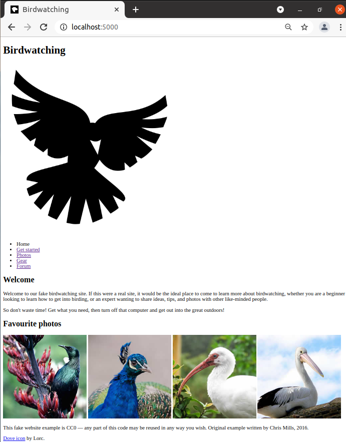

# e02 &mdash; Structuring a page of content
> Another exercise from [MDN: HTML basics](https://developer.mozilla.org/en-US/docs/Learn/HTML/Introduction_to_HTML/Structuring_a_page_of_content) illustrating how to structure a page of content using the appropriate structural semantics.

## Description

For this example, you need to mark up a letter that needs to be hosted on a university intranet. The letter is a response from a research fellow to a prospectve PhD student concerning their application to the university.

Save the [initial resources](https://github.com/mdn/learning-area/blob/master/html/introduction-to-html/structuring-a-page-of-content-start/assets.zip?raw=true) that contain the HTML, CSS and images used on the page and follow the instructions below.

### Project description

The goal is to take the content for the homepage of a bird watching website and add the structural elements to it, so that it can have the appropriate layout applied to it.

It must have:
+ A header spanning the full width of the site containing the main title for the page, the site logo, and the navigation menu. The title and logo will appear side by side once styling is applied, and the navigation will appear below those two items.

+ A main content area containing two columns &mdash; a main block containing the welcome text, and a sidebar containing image thumbnails.

+ A footer containing copyright information and credits

As a result, you will have to add mark up so that the final product features:
+ A header
+ A navigation menu
+ A main content area
+ The welcome text
+ A sidebar for images
+ The footer

Once the mark up is completed and validated, you can apply the provided CSS to validate that the page look like the image below:

### Additional guidelines

+ The [initial resources](https://github.com/mdn/learning-area/blob/master/html/introduction-to-html/structuring-a-page-of-content-start/assets.zip?raw=true) already include a well-constructed HTML that you should use as the starting point for the exercise. You just have to add additional semantic and structural elements to it.

+ Do not mind about the correct layout or CSS while marking up the document &mdash; once the mark up is done, you can link to the provided [CSS file from the resources](https://github.com/mdn/learning-area/blob/master/html/introduction-to-html/structuring-a-page-of-content-start/assets.zip?raw=true) and compare with the image above.

The page without CSS should look like this:

