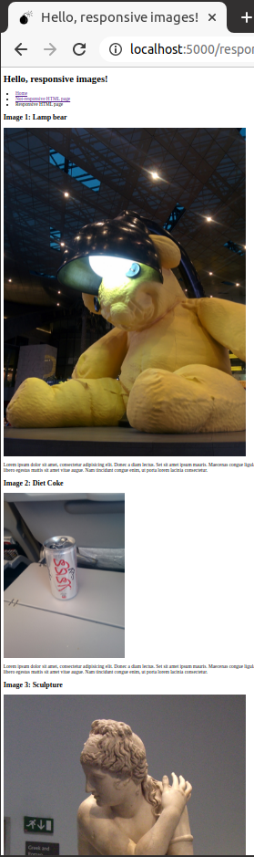
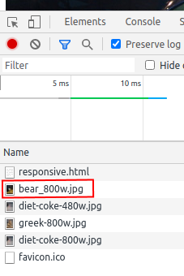
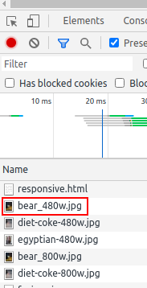
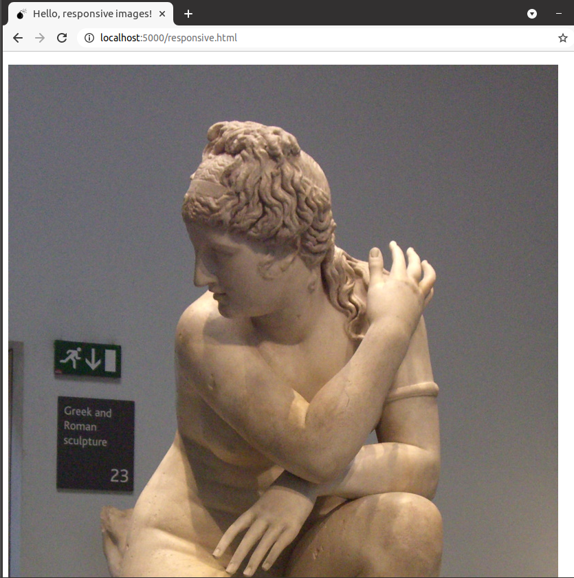
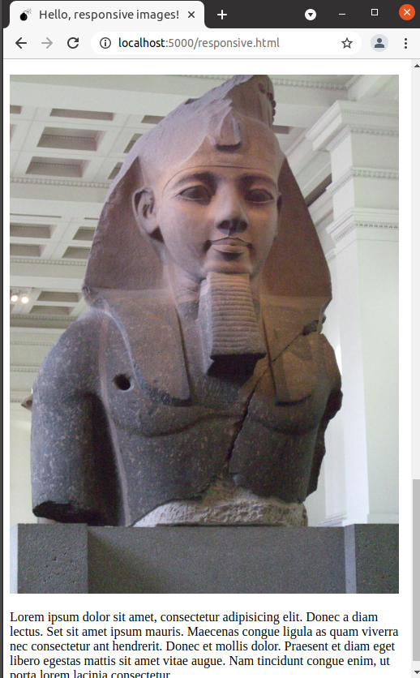

# e03 &mdash; HTML responsive images
> illustrates how to use HTML capabilities for responsive images using media queries and `<picture>` element for *art direction*.

## Description

1. Write some simple HTML with text and three images and save it as `not-responsive.html`.
2. Create a `responsive.html` page on which you apply the three techniques used in the concept section for each of the images:
    1. The first image should switch depending on viewport size using `sizes`.
    2. The second image should use resolution switching.
    3. The third image should use `<picture>` element and media queries to implement *art direction*.

In the example, by varying the size of the browser window you will see how different images are displayed by your browser.

For example, when running full screen, the browser will fetch the large size of the bear picture:

However, when resizing the browser screen making it smaller, you will see that the smaller image is downloaded instead:

Also, you will see that in larger displays, the Greek sculpture will be displayed:

while the Egyptian sculpture will be displayed when resizing:

demonstrating how you can display different images depending on the viewport size.

| NOTE: |
| :---- |
| I wasn't able to trigger the different image resolutions behavior. |
