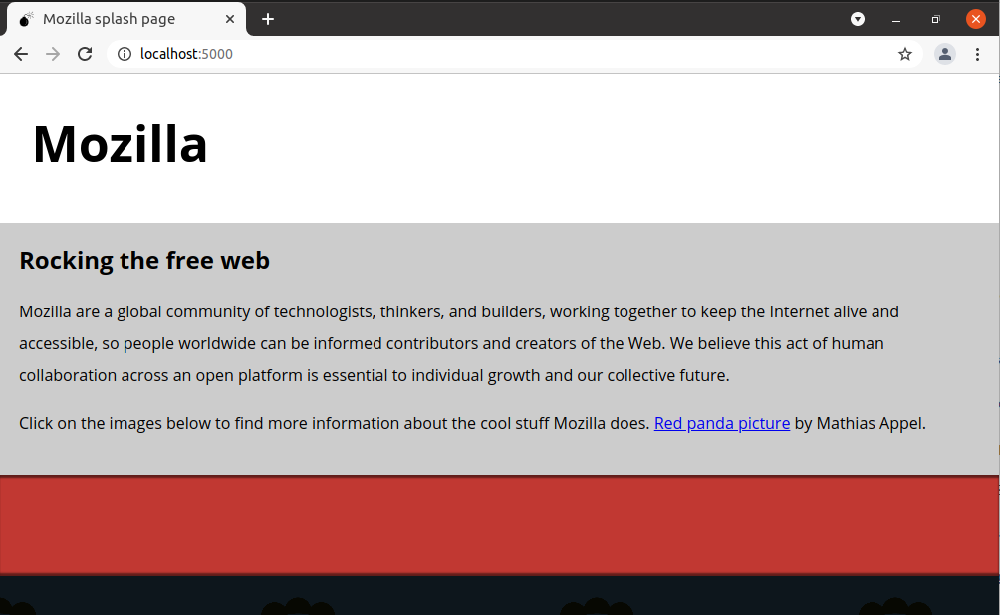
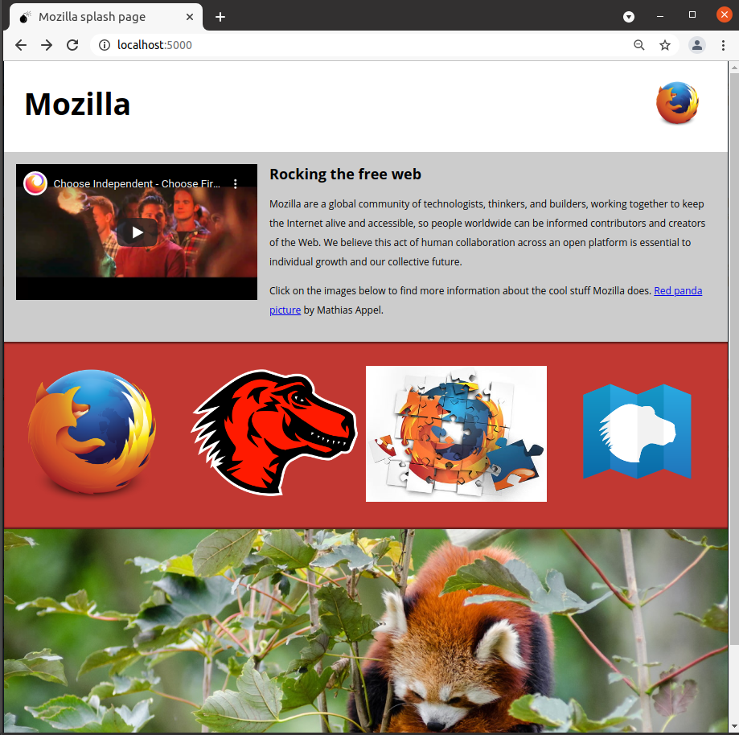
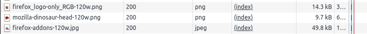
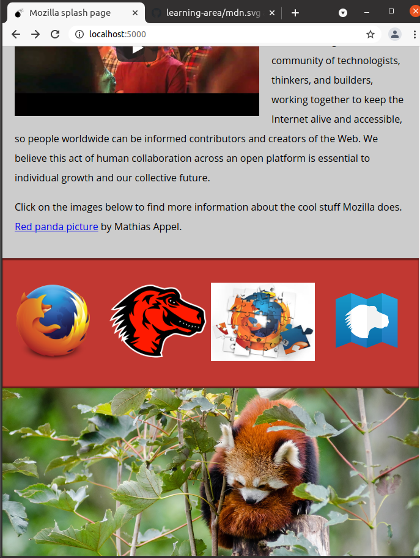
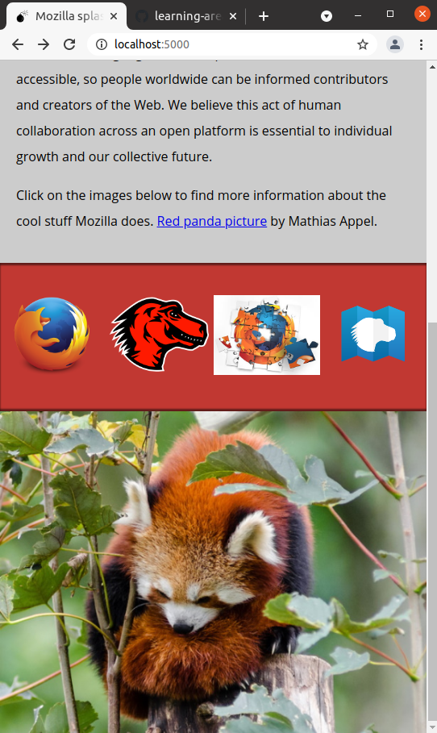

# e04 &mdash; Adding media to a splash page
> Illustrates several techniques related to adding media with `<iframe>` and responsive images to an already prepared splash page.

## Description

This example was developed following the information on [MDN: Mozilla splash page assessment](https://developer.mozilla.org/en-US/docs/Learn/HTML/Multimedia_and_embedding/Mozilla_splash_page).

In the exercise, you are given a mostly-finished splash page about *Mozilla*, and you have to add additional media to make the page look nicer and more attractive.

Starting from:

You will end up building this:

### 0. Preparing images

The first task consists in creating 400px wide and 120px wide versions of `firefox_logo-only_RGB.jpg`, `firefox-addons.jpg` and `mozilla-dinosaur-head.png`.

Then, create a 1200px wide landscape, and a 600px wide portrait version of the `red-panda.jpg`.

### 1. Adding a a logo to the header

Inside the `<header>` element, add an `` element that embeds the small version of the Firefox logo.

### 2. Adding a video to the main article content

Inside the `<article>` element embed the YouTube video found at https://www.youtube.com/watch?v=ojcNcvb1olg.

Adjust the video to be 400px wide.

### 3. Adding responsive images to the further info links

Inside the `
` with the class `further-info` there are `<a>` elements &mdash; each one linking to a Mozilla-related page.

Insert an `` element inside each one containing the appropriate *responsive image markup* with `srcset`, `sizes`, `src` and `alt`.

For all images (except for the one that is inherently responsive), make the browser serve the 120px wide version with the viewport width is 500px or less, and the 400px otherwise.

### 4. An *art directed* red panda

Finally, inside the `
` with the class `red-panda` insert a `<picture>` element that serves the small portrait for viewports that are 600px wide or less, and the large landscape picture otherwise.

## Validation

After finishing the task you can validate:

1. That small images are downloaded (instead of the large ones), when reducing the size of the viewport:

2. That the *red panda* image changes from the landscape image, to the close-up, also when reducing the viewport:

