# 53 &mdash; *Flexbox*
> a series of exercises that illustrates the different flexbox layout technique concepts and behavior

## Initial state
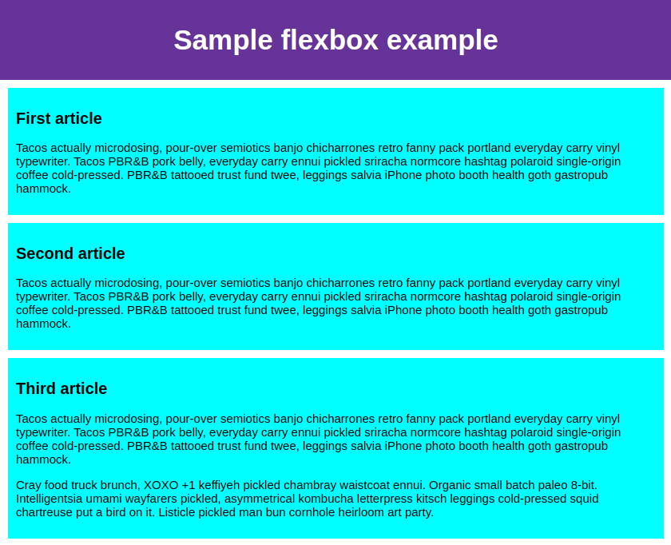

## Basic three column layout
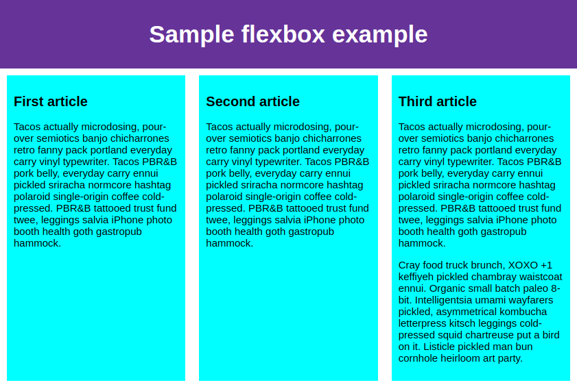

## Basic three rows layout (`flex-direction: column`)
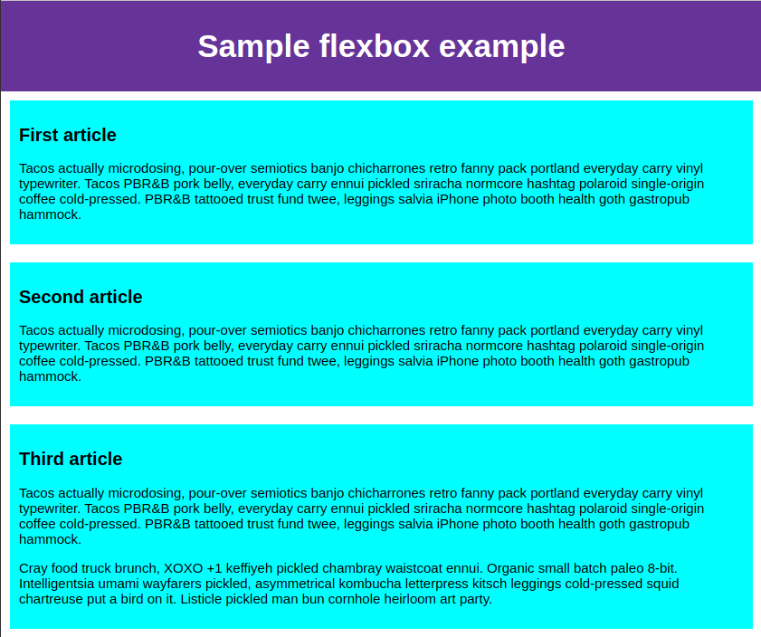

## Basic three rows layout reversed (`flex-direction: column-reverse`)
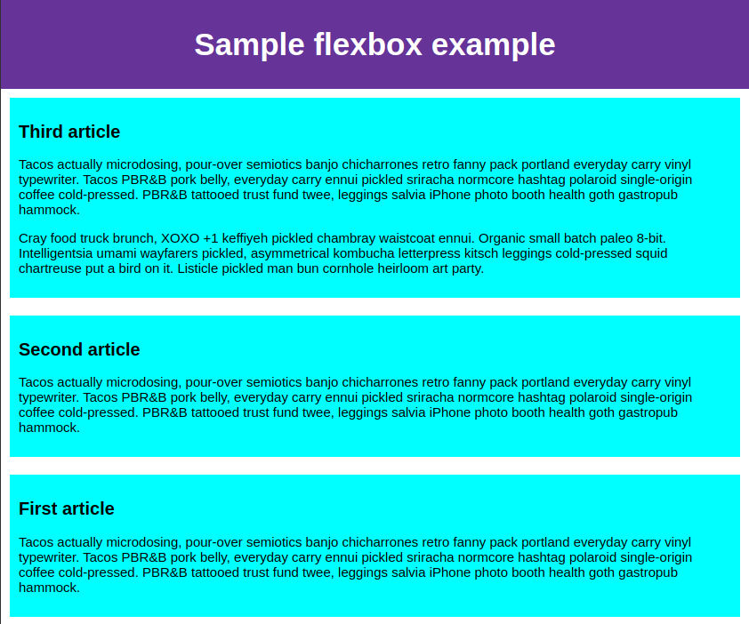

## Large content that does not fit in the viewport
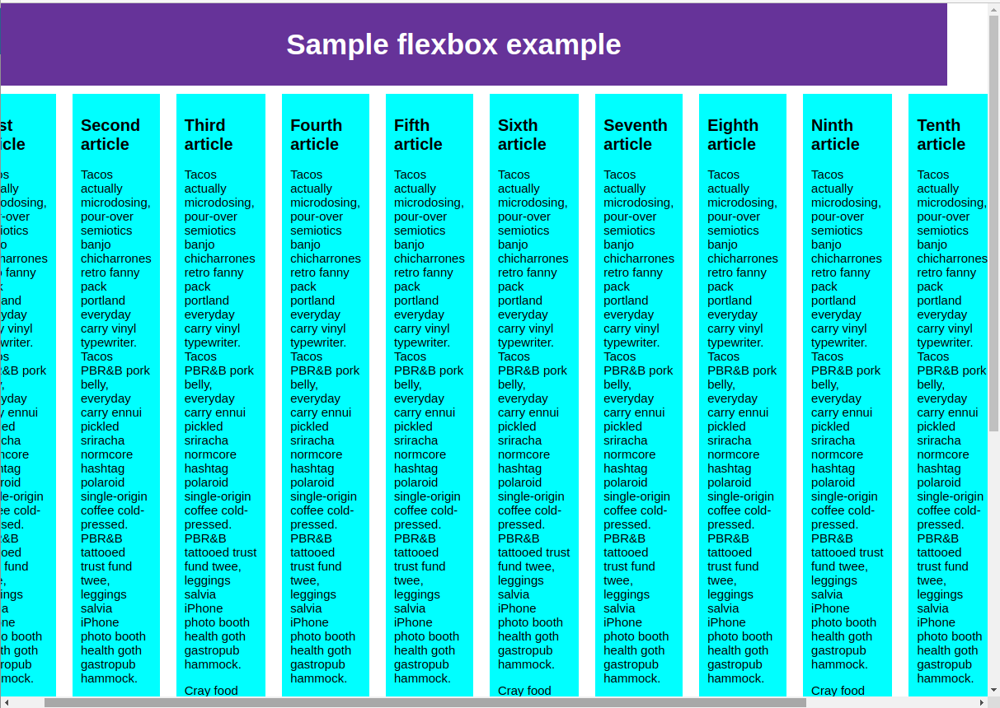

## Large content that does not fit in the viewport fixed with `flex-wrap: wrap`

## Flexbox sizing: making an element the double as the other two
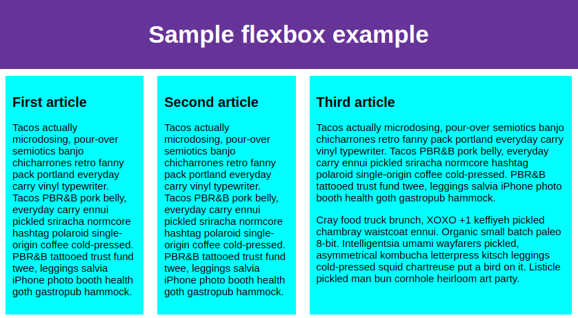

## Flexbox sizing: specifying min width

### Narrow viewport
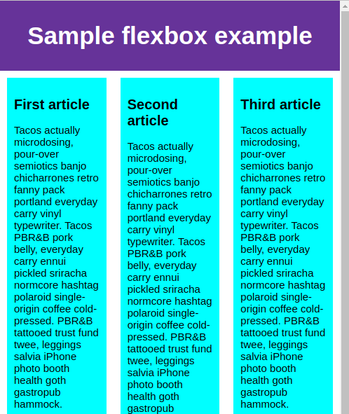

### Medium viewport
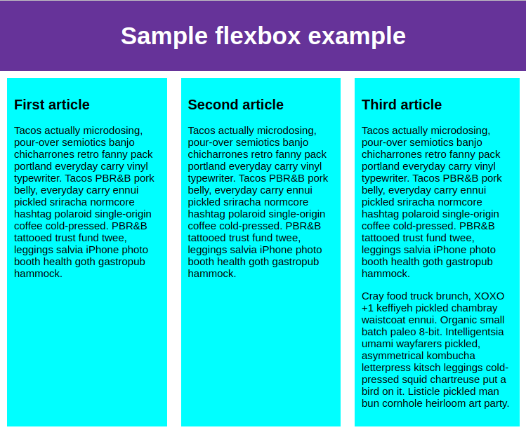

### Wide viewport
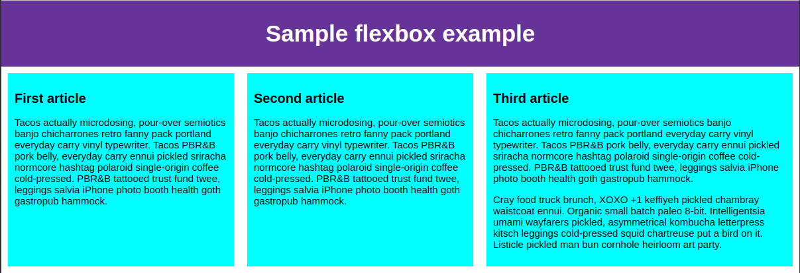

## Flexbox horizontal and vertical alignment

### Before

### After

## Flexbox horizontal and vertical alignment: overriding one item placement

## Flexbox ordering of items

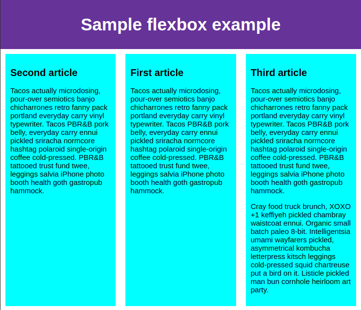

## Flexbox nested boxes

### Complex layout on narrow viewport
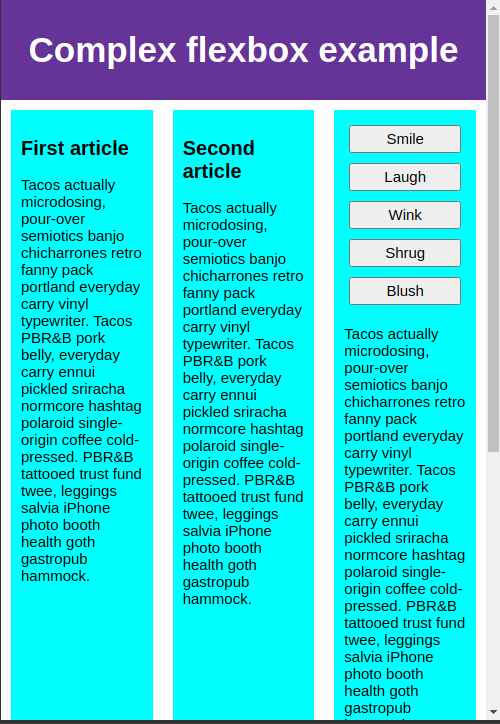

### Complex layout on medium viewport
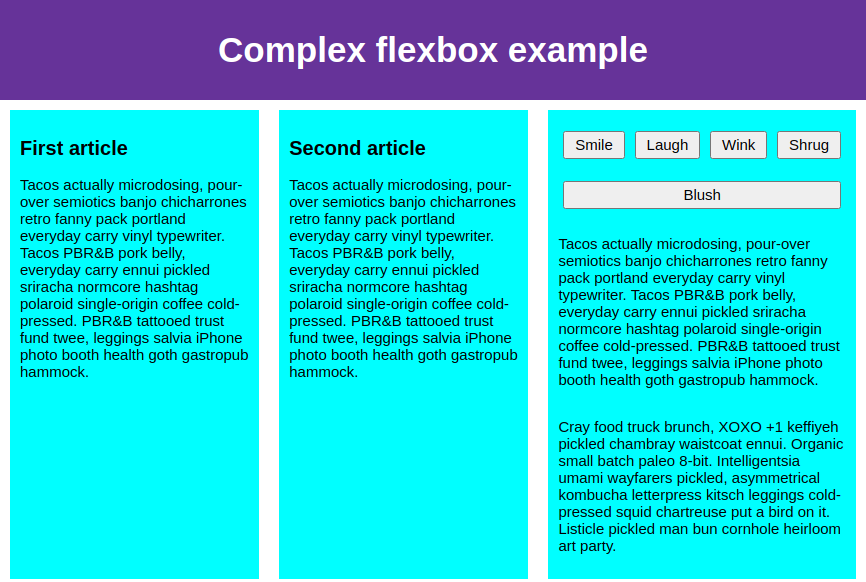

### Complex layout on wide viewport
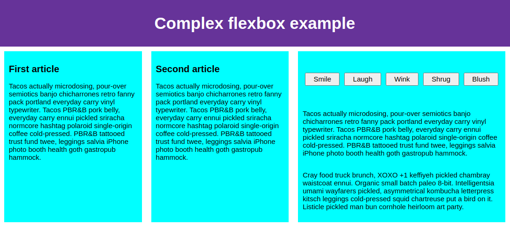