# 56 &mdash; Positioning with `position`
> a series of exercises that illustrates how to use `position` to position elements outside of their normal flow.

## Initial state

## Static positioning (normal flow)

## Relative positioning (adjustements over normal flow)

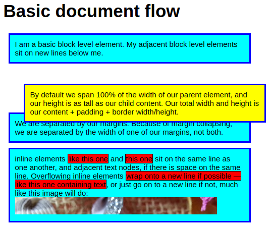

## Absolute positioning

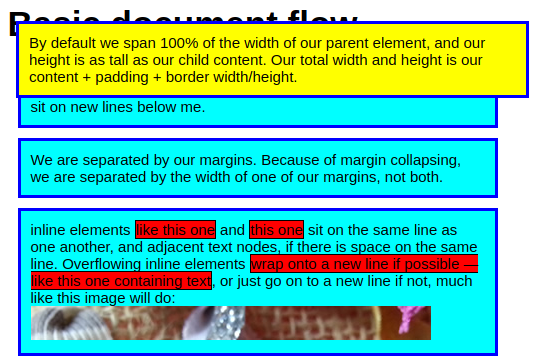

## Resizing with absolute positioning

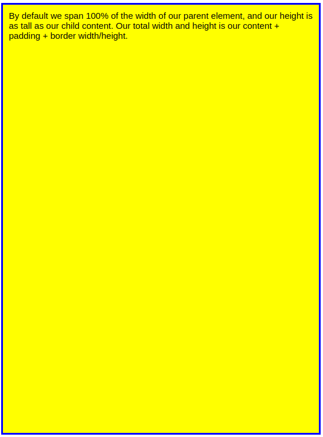

## Switching containment block on elements with absolute positioning

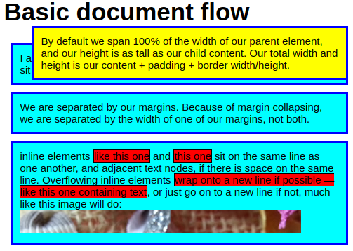

## Overlapping elements with absolute positioning

### No `z-index` used
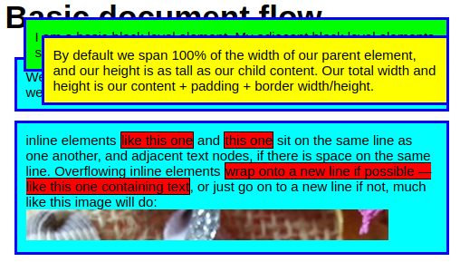

### Using `z-index` to control placement on the stack

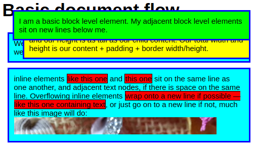

## Fixed positioning

### Initial

### Final

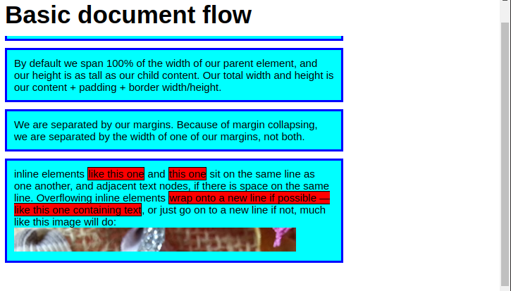

## Sticky positioning: simple

### Initial

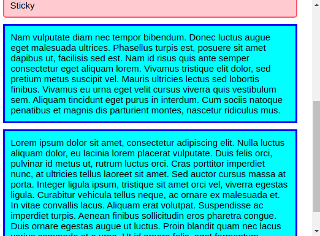

### Final

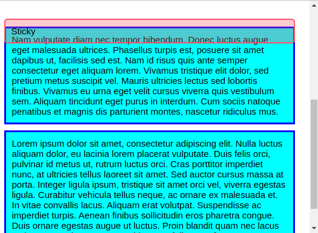

## Sticky positioning: scrolling index

### Initial

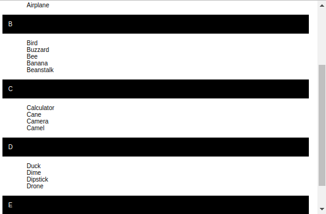

### Final

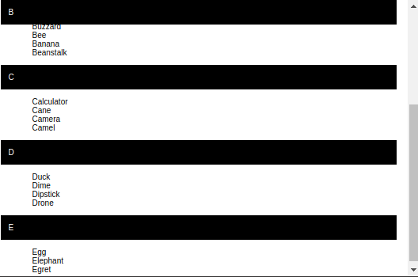

## Sticky positioning: Sticky table headers and footers

### Initial

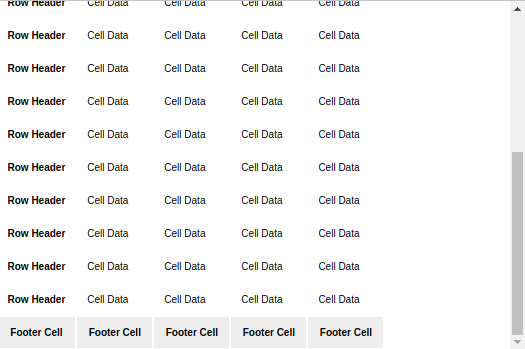

### Final

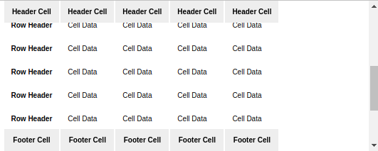
