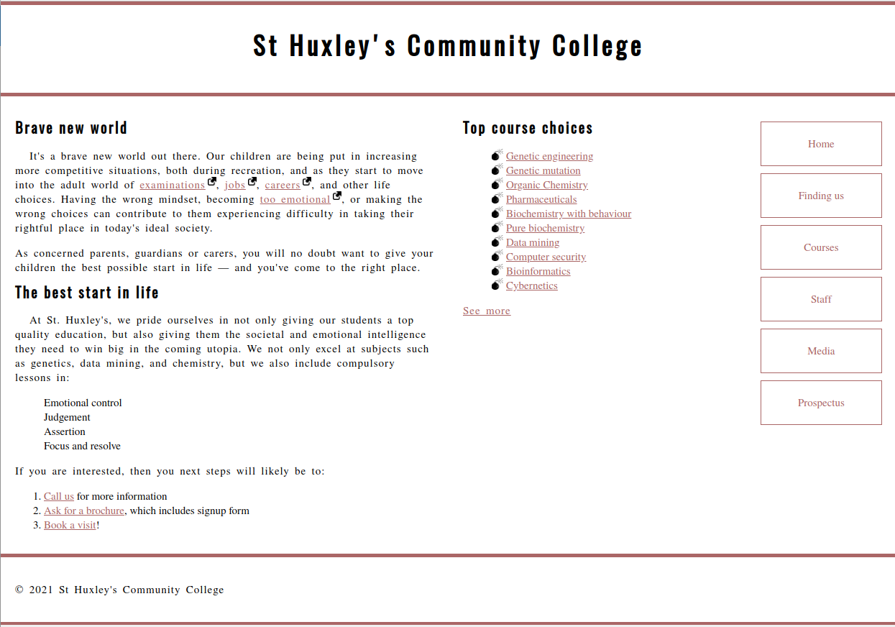

# e12 &mdash; Practising CSS Text styling by creating a community school homepage
> miniproject on fundamentals of text styling CSS in which we apply the techniques we've learned about text styles to a community school's homepage.

## Description

This is the exercise [MDN: Typesetting a community school homepage](https://developer.mozilla.org/en-US/docs/Learn/CSS/Styling_text/Typesetting_a_homepage)

It consists of an exercise in which you are given a fixed HTML document and an initial CSS file and some images and you style a page.

### Exercise

You have been provided with some raw HTMLfor the homepage of an imaginary community college, plus some CSS that styles the page into a three-column layout and provides some other rudimentary styling.

You have to add some additional CSS to accomplish the following:

#### Fonts

+ Download a serif font that we will use for the general text body, coupled with sans-serif or slab serif for the headings.
+ Use a suitable service to generate `@font-face` code for these two downloaded fonts.
+ Apply your body font to the whole page, and your heading font to your headings.

#### General Text Styling
+ Give the page a site-wide font size of 10 pixels.
+ Give your headings and other element types appropriate font sizes defined using a suitable relative unit.
+ Give your body text a suitable line-height.
+ Center your top level heading on the page.
+ Give your headings a little bit of letter spacing to make them not too squashed, and allow the letters to breathe a bit.
+ Give your body text some letter spacing and word spacing as appropriate.
+ Give the first paragraph after each heading in the `<section>` a little bit of text indentation (around 20 pixels).

#### Links
+ Give the link, visited, focus, and hover states some colors that go with the corolor of the horizontal bars at the top and bottom of the page.
+ Make it so that links are underlined by default, but when you hover or focus them, the underline disappears.
+ Remove the default focus outline from all the links on the page.
+ Give the active state a noticeable different styling so it stands out nicely, but make it still fil in with the overall page design.
+ Make it so that external links have the external link icon inserted next to them.

#### Lists
+ Make sure the spacing of your lists and list items works well with the styling of the overall page. Each list item should have the same line-height as a paragraph line, and each list should have the same spacing at its top and bottom as you have between paragraphs.
+ Give your list items a nice bullet, appropriate for the design of the page. You can shoose a custom bullet image or something else.

#### Navigation Menu
+ Style your navigation menu so that it has an appropriate look for the design of the page.

The final result should look like:

