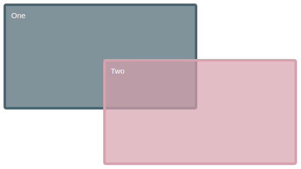
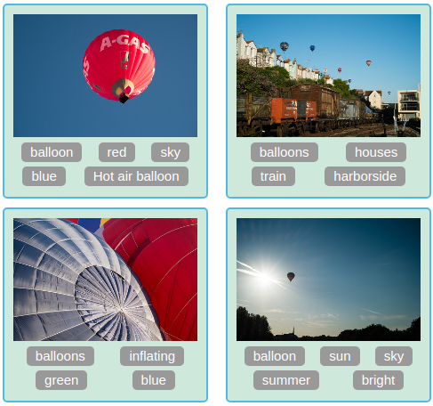
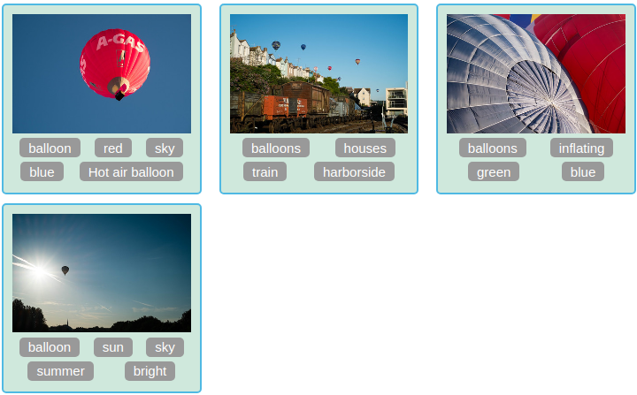
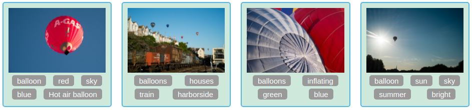

# e14 &mdash; Practising CSS Layout: Grid layout
> Exercises about the CSS Grid Layout module

## Description

This is the exercise [MDN: Test your skills: Grid Layout](https://developer.mozilla.org/en-US/docs/Learn/CSS/CSS_layout/Grid_skills)

It consists of a series of exercises in which you are given fixed HTML documents and you practice how the grid and grid items behave.

### Exercise One

Create a grid into which the four child elements will *auto-place*. The grid should have three columns sharing the available space equally, and a 20-pixel gap between the column and row track.

### Exercise Two

Given an already defined grid, edit the CSS rules for the two child elements causing them to span over several grid tracks, and overlay as depicted on the image below.

### Exercise Three

There are four direct children in this grid. Arrange them using `grid-area` and `grid-template-areas` so that the final state mimics the picture below:

### Exercise Four: Grid and Flex layout together!

Use both Grid and Flexbox layout systems to recreate the example below without changing the HTML.

#### Final state on narrow viewports

#### Final state on mid-sized viewports

#### Final state on large viewports

| NOTE: |
| :---- |
| I feel that there will be multiple solutions to this exercise that use a different approach than the one that it took that consisted in using Grid for the card positioning and using flex for the tags. In particular, I think that using only flex could be a better solution in this case. |