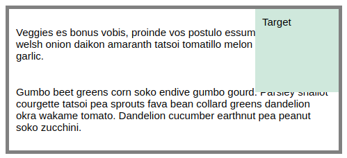
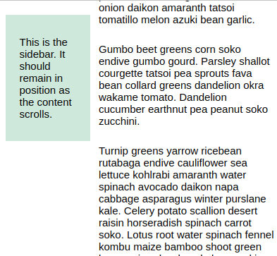

# e16 &mdash; Practising CSS Layout: Positioning
> Exercises about positioning using `position` property

## Description

This is the exercise [MDN: Test your skills: position](https://developer.mozilla.org/en-US/docs/Learn/CSS/CSS_layout/Position_skills)

It consists of a series of exercises in which you are given fixed HTML documents and you practice positioning concepts.

### Exercise One

You need to position the item with a class of `.target` to the top and right of the container which has the 5px grey border.

### Exercise Two

In the example below, you have to make that the sidebar stays in place so that only the content scrolls.

