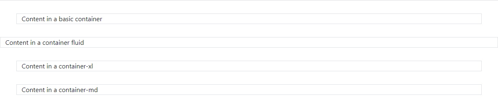

# 02: Bootstrap v5 &mdash; Hello, Bootstrap containers!
> illustrates `.container`, `.container-fluid`, and `.container-*`.

## Description

In the example, we create different containers to illustrates the basic concepts of containers.

+ `.container` &mdash; will feature right and left margin for screens larger than the extra small breakpoint (576px)
+ `.container-fluid` &mdash; will span the whole width of the screen
+ `.container-*` &mdash; will behave as a container fluid below the established size (no margins), and as a container (with margins) above that.

