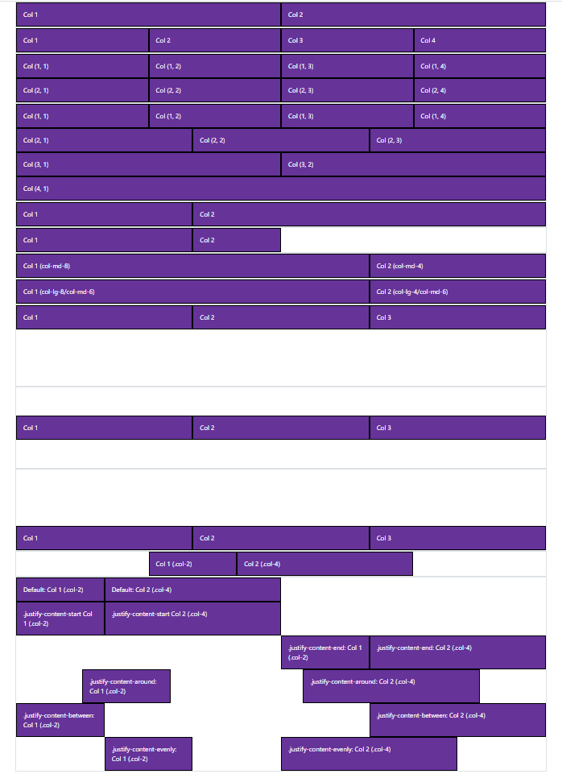

# 03: Bootstrap v5 &mdash; Hello, Bootstrap grid system!
> illustrates the basic concepts of the Bootstrap grid system, including layout, sizing, responsiveness, and vertical and horizontal alignment.

## Description

In the example, we create different layouts using the grid system to understand all the different concepts.

You can comment and uncomment the different sections in the `index.html` to focus on a particular aspect

