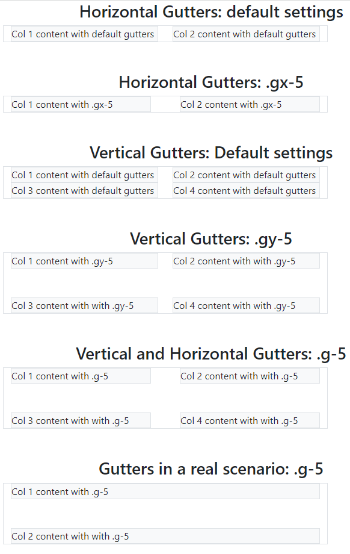

# 04: Bootstrap v5 &mdash; More on gutters!
> illustrates the basics of gutters to control the spacing between columns in the grid system

## Description

In the example, it is illustrated how to use `gx-*`, `gy-*`, and `g-*` to control the spacing between columns, and how the result compares with the default situation (in which gutters are not being set.)

