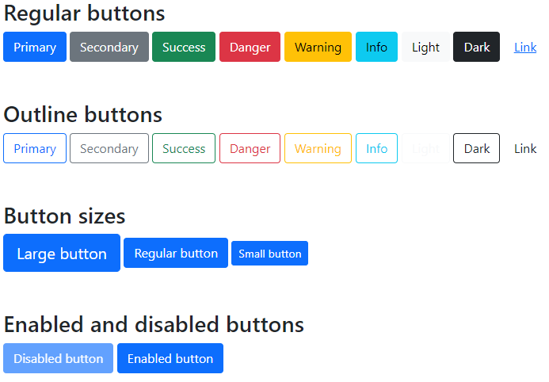

# 05: Bootstrap v5 &mdash; Buttons in action!
> illustrates the basics of Bootstrap buttons

## Description

In the example, it is illustrates how to create:
+ regular and outline buttons with the semantic classes `btn-primary`, `btn-secondary`, etc.
+ buttons of different sizes
+ disabled buttons

