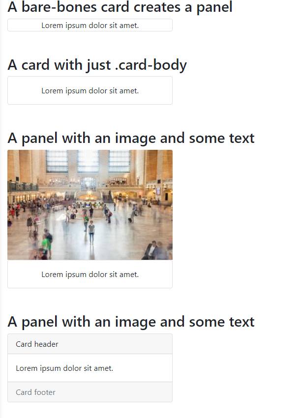

# 06: Bootstrap v5 &mdash; Cards in action!
> illustrates the basics of Bootstrap Cards

## Description

Illustrates how to compose different types of cards:
+ cards with images
+ cards with header and footer
+ horizontal cards
+ basic panels (based on cards)
+ customizing the background color of the cards
+ customizing the border color of the cards

It also illustrates the use of group cards.

