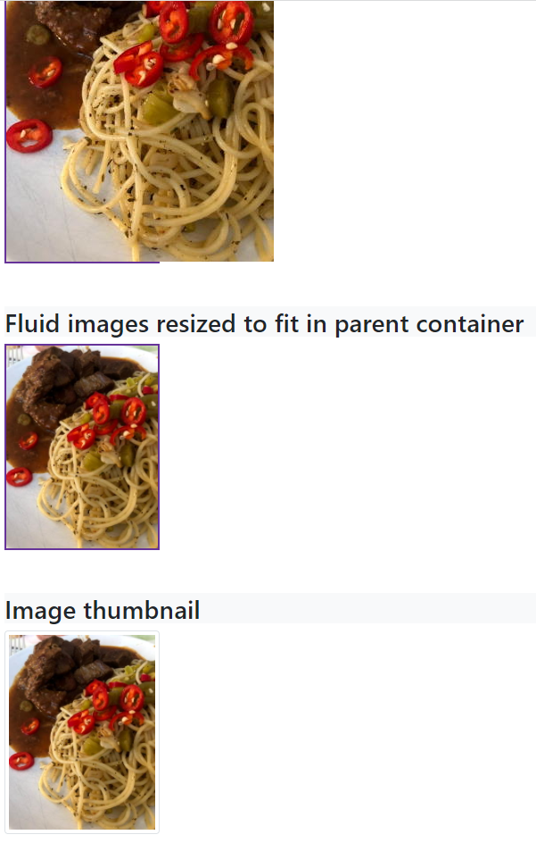

# 08: Bootstrap v5 &mdash; Images in action!
> illustrates the basics of Bootstrap image utilities

## Description

Illustrates several basic aspects of Bootstrap images:
+ using `.img-fluid` for responsive images that are well-behaved with their container.
+ thumbnails
+ image sizing and alignment
+ rounded borders

