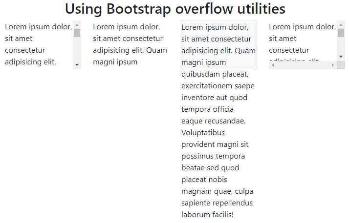

# 11: Bootstrap v5 &mdash; Hello, overflow utilities!
> illustrates the basics of Bootstrap overflow utilities

## Description

Illustrates the overflow utilities to:
+ show the scroll bar when text overflows the specified container size
+ remove the text that overflows automatically
+ show the text that overflows
+ show the scroll bars even when text does not overflow

