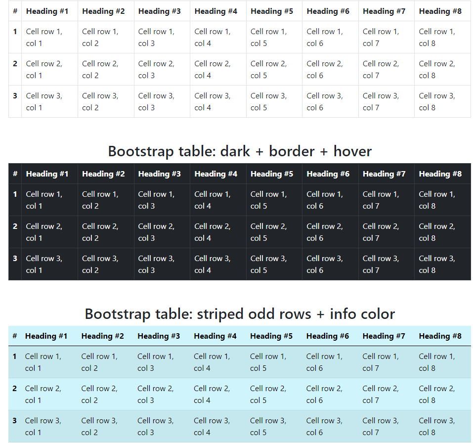

# 13: Bootstrap v5 &mdash; Hello, tables!
> illustrates the basics of Bootstrap tables

## Description

Illustrates basic table classes to create:
+ basic Bootstraps tables that look much nicer than plain HTML tables
+ responsive tables/responsive tables on specific breakpoints
+ changing the appearance of tables (dark, info...)
+ creating borders around the table cells
+ striped rows, hover rows...

