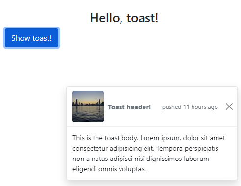

# 15: Bootstrap v5 &mdash; Hello, Toasts!
> illustrates the basics of Bootstrap Toasts, a modern component for notifications.

## Description

Illustrates how to show a basic toast on the bottom right of your screen.

Note that this project requires the Bootstrap library as a dependency. It has also been configured with Browserify. I suspect that as I'm only bundling Bootstrap JS library in `node_modules/` the example should fail in prod, but for some reason it works in my localhost.