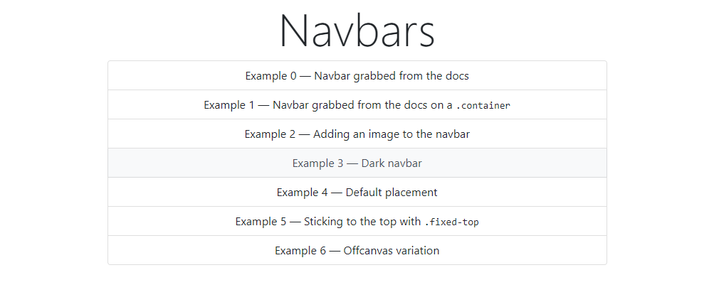

# 16: Bootstrap v5 &mdash; Hello, navbar!
> illustrates the basics of Bootstrap navbar component

## Description

Illustrates basic usage of navbar:
+ default navbar on container and container-fluid
+ Adding images/icons to your navbar
+ coloring your navbar
+ Adjusting your navbar placement: behavior while scrolling
+ Advanced variations: offcanvas navbar

