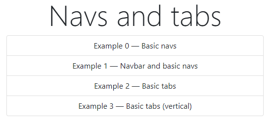
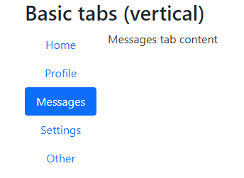

# 17: Bootstrap v5 &mdash; Hello, navs and tabs!
> illustrates the basics of Bootstrap navs and tabs components

## Description

This example illustrates a few basic scenarios of navs and tabs components:
+ Basic navs (standalone)
+ Basic navs with a navbar
+ Basic horizontal tabs (with pills)
+ Basic vertical tabs (with pills)

