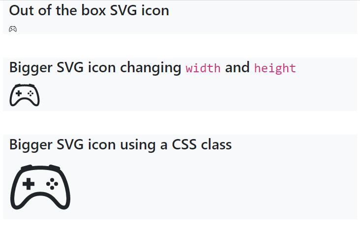

# 18: Bootstrap v5 &mdash; Hello, Bootstrap icons!
> illustrates the basics of Bootstrap Icons project, and the different ways to consume those icons and style them.

## Description

This example illustrates a few basic usages of icons:
+ Using SVG icons (require no additional packages)
+ Adjusting SVG icon size
+ Using icons with a font stylesheet
+ Adjusting icons with a font stylesheet

