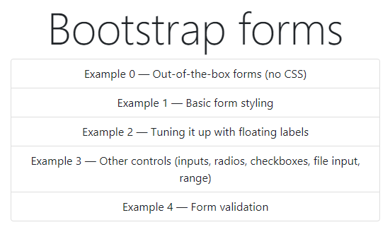
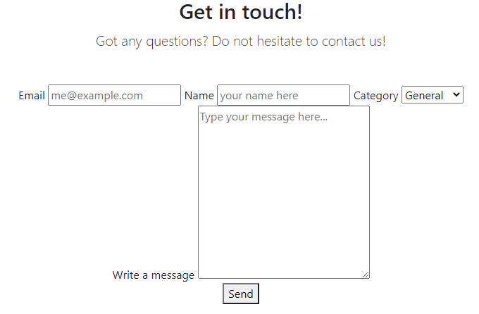
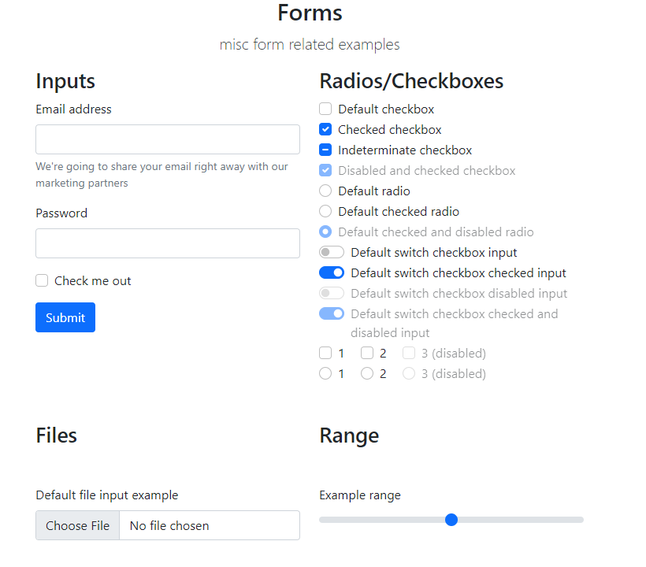
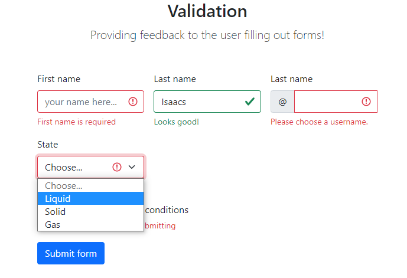

# 19: Bootstrap v5 &mdash; Hello, Bootstrap forms!
> illustrates the basics of Bootstrap forms

## Description

This example illustrates a few basic forms:
+ using Bootstrap classes to create a simple form
+ tuning up a form with floating levels
+ misc components used in forms: inputs, checkboxes, radio buttons, ranges...
+ form validation

