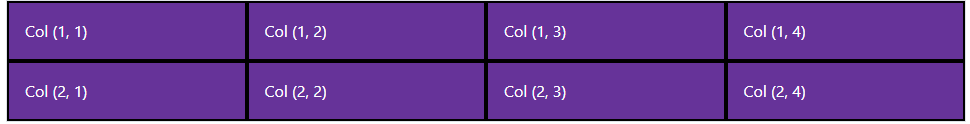
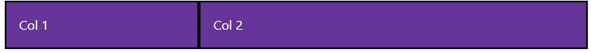

# CSS &mdash; Bootstrap v5 CSS Framework
> Bootstrap v5 CSS frameworks and concepts

## Table of Contents
+ Bootstrap v5 first steps: Breakpoints and containers
  + Breakpoints
  + Containers
+ Basics of Bootstrap's grid system
  + Using *t-shirt sizes* in the column specification
  + Aligning columns vertically and horizontally
  + Spacing your columns with gutters
    + A few words on utility classes: remembering the CSS box model
    + Horizontal and vertical gutters
+ Buttons


## Bootstrap v5 first steps: Breakpoints and containers

Bootstrap is the most popular CSS framework. It enables web developers to quickly design responsive, mobile-first sites.

### Breakpoints

Bootstrap define a series of *t-shirt sizes* for the dimensions of the screen. Those are used to control how the layout *responds* to different screen sizes. These are known as breakpoints.

Breakpoints are used across the board for many Bootstrap elements: from its grid system, to containers, buttons, etc.

The following table illustrates this idea:

| T-Shirt size (breakpoint) | Class infix | Active for screens...  |
| :-- | :-- | :-- |
| Extra-Small | (none) | < 576px |
| Small | `sm` | ≥ 576px |
| Medium | `md` | ≥ 768px |
| Large | `lg` | ≥ 992px |
| Extra Large | `xl` | ≥ 1200px |
| Double-XL | `xxl` | ≥ 1400px |

| NOTE: |
| :---- |
| Breakpoints can be customized, but there is no reason to do so. |

### Containers

Containers are the most basic element in Bootstrap, and are required when using Bootstrap's grid system.

The most basic container is:

```html
<div class="container border">Content</div>
```


| NOTE: |
| :---- |
| `.border` is used to demarcate the area that the container spans in a very easy way. |


This will result in a container that will be centered horizontally and that will feature some margins to the left and right of the container until the dimension of the screen hits 576px. Screens smaller than 576px will feature no margins for the basic container.


Another popular container is the `.container-fluid`, which will use 100% of the available width:

```html
<div class="container-fluid border">Content</div>
```


You can mix the basic container with the t-shirt sizes to make the basic container behave as container-fluid when that breakpoint is reached.

For example, you can use the code below to make a container behave as a container-fluid for widths below 1200px and start adding margins above that width:

```html
<div class="container-xl border">Content</div>
```


| NOTE: |
| :---- |
| The size suffix in containers establish the breakpoint from where the container behaves as a container-fluid and removes the extra margin. As an example, adding the class `container-md` will ensure that no margins are present below widths of 768px. |


As a summary:

+ `.container` &mdash; will feature right and left margin for screens larger than the extra small breakpoint (576px)
+ `.container-fluid` &mdash; will span the whole width of the screen
+ `.container-*` &mdash; will behave as a container fluid below the established size (no margins), and as a container (with margins) above that.

| EXAMPLE: |
| :------- |
| See [02: Hello, Bootstrap containers!](02-hello-containers) for a runnable example illustrating these concepts. |

## Basics of Bootstrap's Grid System

The grid system is the fundamental mechanism in Bootstrap to build mobile-first layouts. It lets you structure a page in a responsive way as a series of rows and columns.

The grid system gives you 12 available *width units* that you can use to accommodate your elements in each row.

| NOTE: |
| :---- |
| As a result, you can have a maximum of 12 columns per row. |


Three elements are involved whe using the grid system:
  + a container &mdash; which will host the grid
  + rows &mdash; used to set out the content vertically
  + columns &mdash; used to set out the content horizontally

When using the grid system, you don't have to explicitly fill out the 12 columns. You can use the columns that you need (up to 12), and Bootstrap will do the math for you and span the 12 available width units.

For example, if you do:

```html
<div class="container-md border">
  <div class="row">
    <div class="col">Col 1</div>
    <div class="col">Col 2</div>
  </div>
</div>
```


See how Bootstrap has used the 12 available units by creating two equally sized columns that take up the whole width of the container.

Now, if you include more columns, it will do similarly and span the same width with 4 equally sized columns:

```html
<div class="container-md border">
  <div class="row">
    <div class="col">Col 1</div>
    <div class="col">Col 2</div>
  </div>
</div>
```


You can add more rows by simple using `.row` as seen below:

```html
<div class="container-md border">
  <div class="row">
    <div class="col">Col (1, 1)</div>
    <div class="col">Col (1, 2)</div>
    <div class="col">Col (1, 3)</div>
    <div class="col">Col (1, 4)</div>
  </div>
  <div class="row">
    <div class="col">Col (2, 1)</div>
    <div class="col">Col (2, 2)</div>
    <div class="col">Col (2, 3)</div>
    <div class="col">Col (2, 4)</div>
  </div>
</div>
```




Obviously, your are not restricted to have the same amount of columns in every row:

```html
<div class="container-md border">
  <div class="row">
    <div class="col">Col (1, 1)</div>
    <div class="col">Col (1, 2)</div>
    <div class="col">Col (1, 3)</div>
    <div class="col">Col (1, 4)</div>
  </div>
  <div class="row">
    <div class="col">Col (2, 1)</div>
    <div class="col">Col (2, 2)</div>
    <div class="col">Col (2, 3)</div>
  </div>
  <div class="row">
    <div class="col">Col (3, 1)</div>
    <div class="col">Col (3, 2)</div>
  </div>
  <div class="row">
    <div class="col">Col (4, 1)</div>
  </div>
</div>
```


Up until now, we have only used layouts with equally sized columns, but Bootstrap's grid system allows you to have columns of different sizes.

The following snippet will create a first column taking 4 of the 12 available units, and a second column taking the remaining 8 ones:

```html
<div class="container-md border">
  <div class="row">
    <div class="col-4">Col 1</div>
    <div class="col">Col 2</div>
  </div>
</div>
```




| NOTE: |
| :---- |
| See how Bootstrap does not require you to specify the size of the second column. But default, Bootstrap will do the math for you and make the second column span the remaining units. |

The grid system also allows you *not* to use the whole units and leave space to the right:

```html
  <div class="container-md border">
    <div class="row">
      <div class="col-4">Col 1</div>
      <div class="col-2">Col 2</div>
    </div>
  </div>
```


See how this time we define our second to be 2 units wide, so that 6 units are left unused to the right of the row.

### Using t-shirt sizes in the column specification

The latest feature with regards to the grid system consists in also using the *t-shirt sizes* so that you not only specify how you want to look in larger screens, but also how they should be accommodated on smaller ones.

| NOTE: |
| :---- |
| You are encouraged to use both column sizes and *t-shirt sizes* when using Bootstrap grid system to provide flexible layouts. |

For example, the following snippet:

```html
<div class="container-md border">
  <div class="row">
    <div class="col-md-8">Col 1 (col-md-8)</div>
    <div class="col-md-4">Col 2 (col-md-4)</div>
  </div>
</div>
```

will create a layout consisting in two differently sized columns that will be set out in one row for screen sizes larger than the md breakpoint (768px), and that will change into a 2x1 layout with equally sized columns below that breakpoint.


But there's yet another twist: you can also mix and match multiple `.col-*-*` specifications, so that the columns are sized differently depending on the width of the viewport.

For example:

```html
<div class="container-md border">
  <div class="row">
    <div class="col-lg-8 col-md-6">Col 1 (col-lg-8/col-md-6)</div>
    <div class="col-lg-4 col-md-6">Col 2 (col-lg-4/col-md-6)</div>
  </div>
</div>
```

The previous code snippet will behave as follows:
+ For screens wider than 992px it will feature two colums taking 8 and 4 width units respectively.


+ For screens between 768px and 992px it will feature two equally sized columns taking 6 units each.


+ For screens narrower than 768px it will feature a 2x1 layout with the columns taking the whole width of the viewport.


### Aligning columns vertically and horizontally

You will also need to know how to align your columns both vertically and horizontally.

To vertically align your row to the top of the available space you can use `.align-items-start` in your row specification.

```html
<div class="container-md border">
  <div class="row align-items-start" style="height: 200px">
    <div class="col">Col 1</div>
    <div class="col">Col 2</div>
    <div class="col">Col 3</div>
  </div>
</div>
```

| NOTE: |
| :---- |
| A specific height is given to the row to illustrate the effect. Otherwise, the row will by default take only the required space. |


Similarly, you can use `.align-items-center`:

```html
<div class="container-md border">
  <div class="row align-items-center" style="height: 200px">
    <div class="col">Col 1</div>
    <div class="col">Col 2</div>
    <div class="col">Col 3</div>
  </div>
</div>
```


And `.align-items-end`:

```html
<div class="container-md border">
  <div class="row align-items-end" style="height: 200px">
    <div class="col">Col 1</div>
    <div class="col">Col 2</div>
    <div class="col">Col 3</div>
  </div>
</div>
```


For the horizontal alignment, you can use `.justify-content-center` in your row:

```html
<div class="container-md border">
  <div class="row justify-content-center">
    <div class="col-2">Col 1 (.col-2)</div>
    <div class="col-4">Col 2 (.col-4)</div>
  </div>
</div>
```


And you can use the following classes to align to the left, right, or to distribute the space in different ways:
+ `.justify-content-start` &mdash; align to the left (in L2R)
+ `.justify-content-end` &mdash; align to the right (in L2R)
+ `.justify-content-around`, `.justify-content-between`, `.justify-content-evenly` &mdash; different ways to distribute the space (see below)


### Spacing your columns with gutters

Gutters are used to introduce padding between your column content, in a responsive way.

#### A few words on utility classes
The gutters use a mechanism that is also used in many other places in Bootstrap, the *utility classes*.

In particular, you can use something like `my-*`, with `*` being a number to add margin in the y-axis, and `mx-*` to add margin in the x-axis. Similarly, you can use `py-*` and `px-*` for the padding.


In the standard box model, the `width` and `height` attribute defines the width and height of the content box. As a result, to get the total size taken by an element you have to add the padding and border.

However, Bootstrap uses the `.border-box` alternative CSS box model. This means that for an element such as the following:

```css
.box {
  width: 350px;
  height: 150px;
  margin: 10px;
  padding: 25px;
  border: 5px solid black;
}
```

We will have:


That is, the `width` and `height` include the padding and the border.


| NOTE: |
| :---- |
| You can review the box model concepts here [The box model](../01-vanilla-css/README.md#the-box-model) and [What is the CSS box model?](../01-vanilla-css/README.md#what-is-the-css-box-model). |


In summary, by using:

```html
<h2 class="text-center">Gutters</h2>
<div class="container-md border my-5">
```

We are ensuring 5 units of margin between the contents of the `<h2>` and the subsequent container.

#### Horizontal and vertical gutters

Now, back to the gutters. Gutters are applied in the rows to apply spacing between the columns.
These are used to maintain the space in the x- and y- axis in the complex scenarios:

For example, the following screenshot compares two columns when using and not using horizontal gutters:

```html
<div class="container border">
  <div class="row gx-5">
    <div class="col">
      <div class="border bg-light">Col 1 content with .gx-5</div>
    </div>
    <div class="col">
      <div class="border bg-light">Col 2 content with .gx-5</div>
    </div>
  </div>
</div>
```


The easiest way to see the vertical gutters in action can be achieved creating a row that exceeds the 12 units:

```html
<div class="container border">
  <div class="row gy-5">
    <div class="col-6">
      <div class="border bg-light">Col 1 content with .gy-5</div>
    </div>
    <div class="col-6">
      <div class="border bg-light">Col 2 content with with .gy-5</div>
    </div>
    <div class="col-6">
      <div class="border bg-light">Col 3 content with with .gy-5</div>
    </div>
    <div class="col-6">
      <div class="border bg-light">Col 4 content with with .gy-5</div>
    </div>
  </div>
</div>
```


You can also use the `.g-*` class to apply both vertical and horizontal gutters:

```html
<div class="container border">
  <div class="row g-5">
    <div class="col-6">
      <div class="border bg-light">Col 1 content with .g-5</div>
    </div>
    <div class="col-6">
      <div class="border bg-light">Col 2 content with with .g-5</div>
    </div>
    <div class="col-6">
      <div class="border bg-light">Col 3 content with with .g-5</div>
    </div>
    <div class="col-6">
      <div class="border bg-light">Col 4 content with with .g-5</div>
    </div>
  </div>
</div>
```


In a real scenario, vertical gutters will kick in when you reach the breakpoint beyond where the columns are stacked, instead of being set out in a row:


| EXAMPLE: |
| :------- |
| See [03: Hello, Bootstrap grid system!](03-hello-grid-system) and [04: More on gutters!](04-more-on-gutters) for a runnable example illustrating the concepts in this section. |

#### Exercise 1: Practicing the Grid system

Using Bootstrap's grid system, reproduce the following layout:


| Solution: |
| :------- |
| See [e01: Practicing the Grid layout!](e01-practicing-grid-layout) for the solution. |

## Buttons

Buttons are one of the most popular components of Bootstraps.

They include several predefined styles that allows you to give semantic purpose to them, and they also come in different sizes and appearance.

The following snippet shows how to create regular buttons.

```hmtl
<div class="container">
  <button type="button" class="btn btn-primary">Primary</button>
  <button type="button" class="btn btn-secondary">Secondary</button>
  <button type="button" class="btn btn-success">Success</button>
  <button type="button" class="btn btn-danger">Danger</button>
  <button type="button" class="btn btn-warning">Warning</button>
  <button type="button" class="btn btn-info">Info</button>
  <button type="button" class="btn btn-light">Light</button>
  <button type="button" class="btn btn-dark">Dark</button>
  <button type="button" class="btn btn-link">Link</button>
</div>
```

You can also create those same buttons with different appearance (outline).

```html
<div class="container">
  <button type="button" class="btn btn-outline-primary">Primary</button>
  <button type="button" class="btn btn-outline-secondary">Secondary</button>
  <button type="button" class="btn btn-outline-success">Success</button>
  <button type="button" class="btn btn-outline-danger">Danger</button>
  <button type="button" class="btn btn-outline-warning">Warning</button>
  <button type="button" class="btn btn-outline-info">Info</button>
  <button type="button" class="btn btn-outline-light">Light</button>
  <button type="button" class="btn btn-outline-dark">Dark</button>
  <button type="button" class="btn btn-outline-link">Link</button>
</div>
```

Buttons come in three different sizes: `.btn-lg`, `.btn-sm` and the regular one:

```hmtl
<div class="container">
  <button type="button" class="btn btn-primary btn-lg">Large button</button>
  <button type="button" class="btn btn-primary">Regular button</button>
  <button type="button" class="btn btn-primary btn-sm">Small button</button>
</div>
```

Buttons can be disabled using the `disabled` attribute as seen below:

```html
<div class="container">
  <button type="button" class="btn btn-primary" disabled>Disabled button</button>
  <button type="button" class="btn btn-primary">Enabled button</button>
</div>
```


| EXAMPLE: |
| :------- |
| See [05: Buttons in action!](05-buttons) for a runnable example. |


## Examples, Exercises and mini-projects

### [01: Hello, Bootstrap v5 refresher](01-hello-bootstrap-v5)
Starter project for Bootstrap v5 examples, backed by a Express server that exposes the `public/` directory for frontend development.

### [02: Hello, Bootstrap containers!](02-hello-containers)
Illustrates `.container`, `.container-fluid`, and `.container-*`.

### [03: Hello, Bootstrap grid system!](03-hello-grid-system)
Illustrates the basic concepts of the Bootstrap grid system, including layout, sizing, responsiveness, and vertical and horizontal alignment.

### [04: More on gutters!](04-more-on-gutters)
Illustrates the basics of gutters to control the spacing between columns in the grid system.

### [05: Buttons in action!](05-buttons)
Illustrates the basics of Bootstrap buttons.

### [e01: Practicing the Grid layout!](e01-practicing-grid-layout)
Using the grid system to obtain three different layouts.
