# CSS &mdash; Bootstrap v5 CSS Framework
> Bootstrap v5 CSS frameworks and concepts

## Table of Contents
+ Bootstrap v5 first steps: Breakpoints and containers
  + Breakpoints
  + Containers
+ Basics of Bootstrap's grid system
  + Using *t-shirt sizes* in the column specification
  + Aligning columns vertically and horizontally
  + Spacing your columns with gutters
    + A few words on utility classes: remembering the CSS box model
    + Horizontal and vertical gutters
+ Buttons
+ Cards


## Bootstrap v5 first steps: Breakpoints and containers

Bootstrap is the most popular CSS framework. It enables web developers to quickly design responsive, mobile-first sites.

### Breakpoints

Bootstrap define a series of *t-shirt sizes* for the dimensions of the screen. Those are used to control how the layout *responds* to different screen sizes. These are known as breakpoints.

Breakpoints are used across the board for many Bootstrap elements: from its grid system, to containers, buttons, etc.

The following table illustrates this idea:

| T-Shirt size (breakpoint) | Class infix | Active for screens...  |
| :-- | :-- | :-- |
| Extra-Small | (none) | < 576px |
| Small | `sm` | ≥ 576px |
| Medium | `md` | ≥ 768px |
| Large | `lg` | ≥ 992px |
| Extra Large | `xl` | ≥ 1200px |
| Double-XL | `xxl` | ≥ 1400px |

| NOTE: |
| :---- |
| Breakpoints can be customized, but there is no reason to do so. |

### Containers

Containers are the most basic element in Bootstrap, and are required when using Bootstrap's grid system.

The most basic container is:

```html
<div class="container border">Content</div>
```


| NOTE: |
| :---- |
| `.border` is used to demarcate the area that the container spans in a very easy way. |


This will result in a container that will be centered horizontally and that will feature some margins to the left and right of the container until the dimension of the screen hits 576px. Screens smaller than 576px will feature no margins for the basic container.


Another popular container is the `.container-fluid`, which will use 100% of the available width:

```html
<div class="container-fluid border">Content</div>
```


You can mix the basic container with the t-shirt sizes to make the basic container behave as container-fluid when that breakpoint is reached.

For example, you can use the code below to make a container behave as a container-fluid for widths below 1200px and start adding margins above that width:

```html
<div class="container-xl border">Content</div>
```


| NOTE: |
| :---- |
| The size suffix in containers establish the breakpoint from where the container behaves as a container-fluid and removes the extra margin. As an example, adding the class `container-md` will ensure that no margins are present below widths of 768px. |


As a summary:

+ `.container` &mdash; will feature right and left margin for screens larger than the extra small breakpoint (576px)
+ `.container-fluid` &mdash; will span the whole width of the screen
+ `.container-*` &mdash; will behave as a container fluid below the established size (no margins), and as a container (with margins) above that.

| EXAMPLE: |
| :------- |
| See [02: Hello, Bootstrap containers!](02-hello-containers) for a runnable example illustrating these concepts. |

## Basics of Bootstrap's Grid System

The grid system is the fundamental mechanism in Bootstrap to build mobile-first layouts. It lets you structure a page in a responsive way as a series of rows and columns.

The grid system gives you 12 available *width units* that you can use to accommodate your elements in each row.

| NOTE: |
| :---- |
| As a result, you can have a maximum of 12 columns per row. |


Three elements are involved whe using the grid system:
  + a container &mdash; which will host the grid
  + rows &mdash; used to set out the content vertically
  + columns &mdash; used to set out the content horizontally

When using the grid system, you don't have to explicitly fill out the 12 columns. You can use the columns that you need (up to 12), and Bootstrap will do the math for you and span the 12 available width units.

For example, if you do:

```html
<div class="container-md border">
  <div class="row">
    <div class="col">Col 1</div>
    <div class="col">Col 2</div>
  </div>
</div>
```


See how Bootstrap has used the 12 available units by creating two equally sized columns that take up the whole width of the container.

Now, if you include more columns, it will do similarly and span the same width with 4 equally sized columns:

```html
<div class="container-md border">
  <div class="row">
    <div class="col">Col 1</div>
    <div class="col">Col 2</div>
  </div>
</div>
```


You can add more rows by simple using `.row` as seen below:

```html
<div class="container-md border">
  <div class="row">
    <div class="col">Col (1, 1)</div>
    <div class="col">Col (1, 2)</div>
    <div class="col">Col (1, 3)</div>
    <div class="col">Col (1, 4)</div>
  </div>
  <div class="row">
    <div class="col">Col (2, 1)</div>
    <div class="col">Col (2, 2)</div>
    <div class="col">Col (2, 3)</div>
    <div class="col">Col (2, 4)</div>
  </div>
</div>
```


Obviously, your are not restricted to have the same amount of columns in every row:

```html
<div class="container-md border">
  <div class="row">
    <div class="col">Col (1, 1)</div>
    <div class="col">Col (1, 2)</div>
    <div class="col">Col (1, 3)</div>
    <div class="col">Col (1, 4)</div>
  </div>
  <div class="row">
    <div class="col">Col (2, 1)</div>
    <div class="col">Col (2, 2)</div>
    <div class="col">Col (2, 3)</div>
  </div>
  <div class="row">
    <div class="col">Col (3, 1)</div>
    <div class="col">Col (3, 2)</div>
  </div>
  <div class="row">
    <div class="col">Col (4, 1)</div>
  </div>
</div>
```


Up until now, we have only used layouts with equally sized columns, but Bootstrap's grid system allows you to have columns of different sizes.

The following snippet will create a first column taking 4 of the 12 available units, and a second column taking the remaining 8 ones:

```html
<div class="container-md border">
  <div class="row">
    <div class="col-4">Col 1</div>
    <div class="col">Col 2</div>
  </div>
</div>
```


| NOTE: |
| :---- |
| See how Bootstrap does not require you to specify the size of the second column. But default, Bootstrap will do the math for you and make the second column span the remaining units. |

The grid system also allows you *not* to use the whole units and leave space to the right:

```html
  <div class="container-md border">
    <div class="row">
      <div class="col-4">Col 1</div>
      <div class="col-2">Col 2</div>
    </div>
  </div>
```


See how this time we define our second to be 2 units wide, so that 6 units are left unused to the right of the row.

### Using t-shirt sizes in the column specification

The latest feature with regards to the grid system consists in also using the *t-shirt sizes* so that you not only specify how you want to look in larger screens, but also how they should be accommodated on smaller ones.

| NOTE: |
| :---- |
| You are encouraged to use both column sizes and *t-shirt sizes* when using Bootstrap grid system to provide flexible layouts. |

For example, the following snippet:

```html
<div class="container-md border">
  <div class="row">
    <div class="col-md-8">Col 1 (col-md-8)</div>
    <div class="col-md-4">Col 2 (col-md-4)</div>
  </div>
</div>
```

will create a layout consisting in two differently sized columns that will be set out in one row for screen sizes larger than the md breakpoint (768px), and that will change into a 2x1 layout with equally sized columns below that breakpoint.


But there's yet another twist: you can also mix and match multiple `.col-*-*` specifications, so that the columns are sized differently depending on the width of the viewport.

For example:

```html
<div class="container-md border">
  <div class="row">
    <div class="col-lg-8 col-md-6">Col 1 (col-lg-8/col-md-6)</div>
    <div class="col-lg-4 col-md-6">Col 2 (col-lg-4/col-md-6)</div>
  </div>
</div>
```

The previous code snippet will behave as follows:
+ For screens wider than 992px it will feature two colums taking 8 and 4 width units respectively.


+ For screens between 768px and 992px it will feature two equally sized columns taking 6 units each.


+ For screens narrower than 768px it will feature a 2x1 layout with the columns taking the whole width of the viewport.


### Aligning columns vertically and horizontally

You will also need to know how to align your columns both vertically and horizontally.

To vertically align your row to the top of the available space you can use `.align-items-start` in your row specification.

```html
<div class="container-md border">
  <div class="row align-items-start" style="height: 200px">
    <div class="col">Col 1</div>
    <div class="col">Col 2</div>
    <div class="col">Col 3</div>
  </div>
</div>
```

| NOTE: |
| :---- |
| A specific height is given to the row to illustrate the effect. Otherwise, the row will by default take only the required space. |


Similarly, you can use `.align-items-center`:

```html
<div class="container-md border">
  <div class="row align-items-center" style="height: 200px">
    <div class="col">Col 1</div>
    <div class="col">Col 2</div>
    <div class="col">Col 3</div>
  </div>
</div>
```


And `.align-items-end`:

```html
<div class="container-md border">
  <div class="row align-items-end" style="height: 200px">
    <div class="col">Col 1</div>
    <div class="col">Col 2</div>
    <div class="col">Col 3</div>
  </div>
</div>
```


For the horizontal alignment, you can use `.justify-content-center` in your row:

```html
<div class="container-md border">
  <div class="row justify-content-center">
    <div class="col-2">Col 1 (.col-2)</div>
    <div class="col-4">Col 2 (.col-4)</div>
  </div>
</div>
```


And you can use the following classes to align to the left, right, or to distribute the space in different ways:
+ `.justify-content-start` &mdash; align to the left (in L2R)
+ `.justify-content-end` &mdash; align to the right (in L2R)
+ `.justify-content-around`, `.justify-content-between`, `.justify-content-evenly` &mdash; different ways to distribute the space (see below)


### Spacing your columns with gutters

Gutters are used to introduce padding between your column content, in a responsive way.

#### A few words on utility classes
The gutters use a mechanism that is also used in many other places in Bootstrap, the *utility classes*.

In particular, you can use something like `my-*`, with `*` being a number to add margin in the y-axis, and `mx-*` to add margin in the x-axis. Similarly, you can use `py-*` and `px-*` for the padding.


##### The CSS Box Model in a nutshell

An element in HTML is made of two major components:
+ the **content** box
+ the **border** box &mdash; a rectangular border that surrounds the content.

These components demarcate a few additional areas of interest:
+ the **padding** &mdash; the area between the content and the border.
+ the **margin** &mdash; the area surrounding the border that creates the space between adjacent HTML elements.


There are two ways of specifying the dimensions of a given element:
+ **The standard box model** &mdash; the `width` and `height` attribute of the element defines the width and height of the content box. When using this model, to get the total size taken by an element on the screen. you have to add the padding and border.

+ **The alternative box model**/**border-box model** &mdash; the `width` and `height` includes the padding and the border:

Bootstrap uses the `.border-box`, alternative CSS box model. This means that in Bootstrap, an element with the following CSS rule:

```css
.box {
  width: 350px;
  height: 150px;
  margin: 10px;
  padding: 25px;
  border: 5px solid black;
}
```

will have:


| NOTE: |
| :---- |
| You can review the box model concepts here [The box model](../01-vanilla-css/README.md#the-box-model) and [What is the CSS box model?](../01-vanilla-css/README.md#what-is-the-css-box-model). |


In summary, by using:

```html
<h2 class="text-center">Gutters</h2>
<div class="container-md border my-5">
```

We are ensuring 5 units of margin between the contents of the `<h2>` and the subsequent container.

#### Horizontal and vertical gutters

Now, back to the gutters. Gutters are applied in the rows to apply spacing between the columns.
These are used to maintain the space in the x- and y- axis in the complex scenarios:

For example, the following screenshot compares two columns when using and not using horizontal gutters:

```html
<div class="container border">
  <div class="row gx-5">
    <div class="col">
      <div class="border bg-light">Col 1 content with .gx-5</div>
    </div>
    <div class="col">
      <div class="border bg-light">Col 2 content with .gx-5</div>
    </div>
  </div>
</div>
```


The easiest way to see the vertical gutters in action can be achieved creating a row that exceeds the 12 units:

```html
<div class="container border">
  <div class="row gy-5">
    <div class="col-6">
      <div class="border bg-light">Col 1 content with .gy-5</div>
    </div>
    <div class="col-6">
      <div class="border bg-light">Col 2 content with with .gy-5</div>
    </div>
    <div class="col-6">
      <div class="border bg-light">Col 3 content with with .gy-5</div>
    </div>
    <div class="col-6">
      <div class="border bg-light">Col 4 content with with .gy-5</div>
    </div>
  </div>
</div>
```


You can also use the `.g-*` class to apply both vertical and horizontal gutters:

```html
<div class="container border">
  <div class="row g-5">
    <div class="col-6">
      <div class="border bg-light">Col 1 content with .g-5</div>
    </div>
    <div class="col-6">
      <div class="border bg-light">Col 2 content with with .g-5</div>
    </div>
    <div class="col-6">
      <div class="border bg-light">Col 3 content with with .g-5</div>
    </div>
    <div class="col-6">
      <div class="border bg-light">Col 4 content with with .g-5</div>
    </div>
  </div>
</div>
```


In a real scenario, vertical gutters will kick in when you reach the breakpoint beyond where the columns are stacked, instead of being set out in a row:


| EXAMPLE: |
| :------- |
| See [03: Hello, Bootstrap grid system!](03-hello-grid-system) and [04: More on gutters!](04-more-on-gutters) for a runnable example illustrating the concepts in this section. |

#### Exercise 1: Practicing the Grid system

Using Bootstrap's grid system, reproduce the following layout:


| Solution: |
| :------- |
| See [e01: Practicing the Grid layout!](e01-practicing-grid-layout) for the solution. |

## Buttons

Buttons are one of the most popular components of Bootstraps.

They include several predefined styles that allows you to give semantic purpose to them, and they also come in different sizes and appearance.

The following snippet shows how to create regular buttons.

```html
<div class="container">
  <button type="button" class="btn btn-primary">Primary</button>
  <button type="button" class="btn btn-secondary">Secondary</button>
  <button type="button" class="btn btn-success">Success</button>
  <button type="button" class="btn btn-danger">Danger</button>
  <button type="button" class="btn btn-warning">Warning</button>
  <button type="button" class="btn btn-info">Info</button>
  <button type="button" class="btn btn-light">Light</button>
  <button type="button" class="btn btn-dark">Dark</button>
  <button type="button" class="btn btn-link">Link</button>
</div>
```

You can also create those same buttons with different appearance (outline).

```html
<div class="container">
  <button type="button" class="btn btn-outline-primary">Primary</button>
  <button type="button" class="btn btn-outline-secondary">Secondary</button>
  <button type="button" class="btn btn-outline-success">Success</button>
  <button type="button" class="btn btn-outline-danger">Danger</button>
  <button type="button" class="btn btn-outline-warning">Warning</button>
  <button type="button" class="btn btn-outline-info">Info</button>
  <button type="button" class="btn btn-outline-light">Light</button>
  <button type="button" class="btn btn-outline-dark">Dark</button>
  <button type="button" class="btn btn-outline-link">Link</button>
</div>
```

Buttons come in three different sizes: `.btn-lg`, `.btn-sm` and the regular one:

```html
<div class="container">
  <button type="button" class="btn btn-primary btn-lg">Large button</button>
  <button type="button" class="btn btn-primary">Regular button</button>
  <button type="button" class="btn btn-primary btn-sm">Small button</button>
</div>
```

Buttons can be disabled using the `disabled` attribute as seen below:

```html
<div class="container">
  <button type="button" class="btn btn-primary" disabled>Disabled button</button>
  <button type="button" class="btn btn-primary">Enabled button</button>
</div>
```


| EXAMPLE: |
| :------- |
| See [05: Buttons in action!](05-buttons) for a runnable example. |

## Cards

Cards provide a very flexible way to host content for your pages. It includes options to include images, headers and footers, etc.

The most basic card markup for the card follows below:

```html
<div class="container my-5">
  <div class="card" style="width: 18rem;">
    
    <div class="card-body">
      <h5 class="card-title">Card title</h5>
      <p class="card-text">
        Lorem ipsum dolor sit, amet consectetur adipisicing elit.
        Asperiores optio a blanditiis voluptatibus ea aperiam id
        velit eos ipsam?
      </p>
    </div>
  </div>
</div>
```


See how you have to specify the width. If you don't specify the size, the image will take the whole available width.

For the sizing there are a few available options:
+ use the `style="width= nrem;"` as seen above
+ you can use the grid system as seen in the first example below


```html
<div class="container my-5">
  <div class="row">
    <div class="col-4">
      <div class="card">
        
        <div class="card-body">
          <h5 class="card-title">Card title</h5>
          <p class="card-text">
            Lorem ipsum dolor sit, amet consectetur adipisicing elit.
          </p>
          <a href="#" class="btn btn-primary">Go somewhere</a>
        </div>
      </div>
    </div>
  </div>
</div>
```

The snippet above creates a card that takes 1/3 of the space, as it uses `col-4`.


+ you can use the utility classes like `w-75`:

```html
<div class="container my-5">
    <div class="card w-75">
      
      <div class="card-body">
        <h5 class="card-title">Card title</h5>
        <p class="card-text">
          Lorem ipsum dolor sit, amet consectetur adipisicing elit.
        </p>
        <a href="#" class="btn btn-primary">Go somewhere</a>
      </div>
    </div>
</div>
```

In this example, we create a card that takes up 75% of the available width.


One of the powerful features of cards is that you can compose a very complex card using flexible markup. For example, a bare-bones `.card` will create a panel:

```html
<div class="container my-5">
  <div class="row">
    <div class="col-6">
      <div class="card text-center">
        Lorem ipsum dolor sit amet.
      </div>
    </div>
  </div>
</div>
```


Just by adding a `.card-body` markup, the panel will look much nicer:

```html
<div class="container my-5">
  <div class="row">
    <div class="col-6">
      <div class="card text-center">
        <div class="card-body">
          Lorem ipsum dolor sit amet.
        </div>
      </div>
    </div>
  </div>
</div>
```

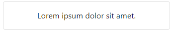

And if you just add an `` element on top of your card body, you'll obtain a simple card with an image and a body:

```html
<div class="container my-5">
  <div class="row">
    <div class="col-6">
      
      <div class="card text-center">
        <div class="card-body">
          Lorem ipsum dolor sit amet.
        </div>
      </div>
    </div>
  </div>
</div>
```


Or you can add a header and a footer:

```html
<div class="container my-5">
  <h2>A panel with an image and some text</h2>
  <div class="row">
    <div class="col-6">
      <div class="card">
        <div class="card-header">Card header</div>
        <div class="card-body">
          Lorem ipsum dolor sit amet.
        </div>
        <div class="card-footer text-muted">Card footer</div>
      </div>
    </div>
  </div>
</div>
```


You get the idea, you can compose your card just by adding more and more markup: from the bare-bones panel, to the card with header, footer, image, etc.

You can also change the default layout to create horizontal cards:

```html
<div class="container my-5">
  <div class="card mb-3">
    <div class="row g-0">
      <div class="col-4">
        
      </div>
      <div class="col-8">
        <div class="card-body">
          <h5 class="card-title">Card title</h5>
          <p class="card-text">Lorem ipsum, dolor sit amet consectetur adipisicing elit. Corporis maiores est nam ipsa totam, dolorem accusantium voluptate incidunt tempora voluptates!</p>
          <p class="card-text"><small class="text-muted">Last updated 5 centuries ago</small></p>
        </div>
      </div>
    </div>
  </div>
</div>
```


Or create groups of cards and set them out side-by-side:

```html
<div class="container my-5">
  <div class="card-group">
    <div class="card">
      
      <div class="card-body">
        <h5 class="card-title">Left card title</h5>
        <p class="card-text">Lorem ipsum, dolor sit amet consectetur adipisicing elit. Consectetur modi numquam nam doloremque, quas nemo accusamus ea quisquam ullam temporibus.</p>
        <p class="card-text"><small class="text-muted">Last updated 5 seconds ago</small></p>
      </div>
    </div>
    <div class="card">
      
      <div class="card-body">
        <h5 class="card-title">Middle card title</h5>
        <p class="card-text">Lorem, ipsum dolor sit amet consectetur adipisicing elit. Officia, architecto deserunt totam rem animi veniam?</p>
        <p class="card-text"><small class="text-muted">Last updated 5 mins ago</small></p>
      </div>
    </div>
    <div class="card">
      
      <div class="card-body">
        <h5 class="card-title">Right card title</h5>
        <p class="card-text">Lorem, ipsum dolor sit amet consectetur adipisicing elit. Repudiandae, eaque?</p>
        <p class="card-text"><small class="text-muted">Last updated 5 hours ago</small></p>
      </div>
    </div>
  </div>
</div>
```


You can also customize the color of your card using Bootstrap semantic color schemes:

```html
<div class="container my-5">
  <div class="row">
    <div class="col-4">
      <div class="card text-white bg-primary mb-3">
        <div class="card-header">Primary color header</div>
        <div class="card-body">
          <h5 class="card-title">Primary card title</h5>
          <p class="card-text">Lorem, ipsum dolor sit amet consectetur adipisicing elit. Quae sint ipsa atque.</p>
        </div>
      </div>
    </div>
  </div>
</div>
```


See that the markup uses the `.bg-primary` class to display the card using the primary color.

Similarly, you can adjust only the outline using `.border-primary`

```html
<div class="container my-5">
  <div class="row">
    <div class="col-4">
      <div class="card border-primary mb-3">
        <div class="card-header">Primary color header</div>
        <div class="card-body text-primary">
          <h5 class="card-title">Primary card title</h5>
          <p class="card-text">Lorem, ipsum dolor sit amet consectetur adipisicing elit. Quae sint ipsa atque.</p>
        </div>
      </div>
    </div>
  </div>
</div>
```


See that it uses `.border-primary` to specify the color of the border and then `.text-primary` to adjust the color of the card body text.

| EXAMPLE: |
| :------- |
| See [06: Cards in action!](06-cards) for a runnable example in which you can see cards in action and practice the different concepts of the previous section. |

## Typography

Bootstraps sets some basic styling regarding typography, so that you don't have to provide your own.

Headers require no classes, only HTML markup:

```html
<div class="container my-5">
  <h1>Header 1</h1>
  <h2>Header 2</h2>
  <h3>Header 3</h3>
  <h4>Header 4</h4>
  <h5>Header 5</h5>
  <h6>Header 6</h6>
</div>
```


Note also that the actual computed sizes of the headers are adjusted with the viewport size.

For convenience, Bootstrap also defines some classes that you can use to obtain the same styling as the real headers for other HTML elements, for example, paragraphs:

```html
<div class="container my-5">
  <p class="h1">Heading 1 look-alike</p>
  <p class="h2">Heading 2 look-alike</p>
  <p class="h3">Heading 3 look-alike</p>
  <p class="h4">Heading 4 look-alike</p>
  <p class="h5">Heading 5 look-alike</p>
  <p class="h6">Heading 6 look-alike</p>
</div>
```

Bootstrap also comes with display headings with a slightly bigger style to make them stand out:

```html
<div class="container my-5">
  <h1 class="display-1">Heading 1</h1>
  <h2 class="display-2">Heading 2</h2>
  <h3 class="display-3">Heading 3</h3>
  <h4 class="display-4">Heading 4</h4>
  <h5 class="display-5">Heading 5</h5>
  <h6 class="display-6">Heading 6</h6>
</div>
```


Bootstrap also features a lot of inline elements for semantic and styling purposes:

```html
  <div class="container my-5">

    <!-- highlight -->
    <p>Lorem ipsum <mark>dolor</mark> sit amet.</p>

    <!-- deleted & striked-out text -->
    <p>Lorem ipsum <del>dolor sit</del> amet.</p>
    <p>Lorem ipsum <s>dolor sit</s> amet.</p>

    <!-- inserted & underlined text -->
    <p>Lorem ipsum <ins>dolor sit</ins> amet.</p>
    <p>Lorem ipsum <u>dolor sit</u> amet.</p>

    <!-- small -->
    <p>Lorem ipsum <small>dolor sit</small> amet.</p>

    <!-- strong (will show in bold)-->
    <p>Lorem ipsum <strong>dolor sit</strong> amet.</p>

    <!-- emphasis (will show in italics)-->
    <p>Lorem ipsum <em>dolor sit</em> amet.</p>
  </div>
```

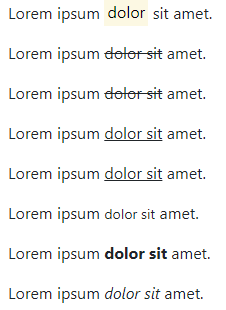

It is recommended to use that markup according to its semantic use. For the purpose of styling Bootstrap also provide equivalent classes such as `.mark`, `.del`, etc.


Another interesting example is the blockquote element:

```html
<div class="container my-5">
  <div class="row">
    <!-- Regular blockquote -->
    <div class="col-4">
      <blockquote class="blockquote">
        <p>Lorem ipsum dolor sit amet.</p>
      </blockquote>
    </div>

    <!-- Styled blockquote with footer -->
    <div class="col-4">
      <figure>
        <blockquote class="blockquote">
          <p>Lorem ipsum dolor sit amet.</p>
        </blockquote>
        <figcaption class="blockquote-footer">
          Lorem ipsum <cite title="source title">dolor</cite> sit amet.
        </figcaption>
      </figure>
    </div>

    <!-- Styled blockquote with footer, and text alignment -->
    <div class="col-4">
      <figure class="text-end">
        <blockquote class="blockquote">
          <p>Lorem ipsum dolor sit amet.</p>
        </blockquote>
        <figcaption class="blockquote-footer">
          Lorem ipsum <cite title="source title">dolor</cite> sit amet.
        </figcaption>
      </figure>
    </div>
  </div>
</div>
```


Finally, we also have lists. The following block of code creates a list with 5 items that include a sublist. The list is *unstyled* so that it doesn't feature any bullets:

```html
<div class="container my-5">
  <div class="row">
    <ul class="list-unstyled">
      <li>List item #1</li>
      <li>List item #2</li>
      <li>List item #3</li>
      <li>List item #4</li>
      <li>List item #5</li>
      <ul>
        <li>Sublist item #1</li>
        <li>Sublist item #2</li>
        <li>Sublist item #3</li>
      </ul>
    </ul>
  </div>
</div>
```

Note that the `.list-unstyled` does not apply to the sublist items:


| NOTE: |
| :---- |
| You can use Emmet to quicly create lists with sample content using `li*5>{List item #$}`. |

Lists are often used to create navigation bars. In those cases, the lists have to arranged horizontally as inline items. This can be achieved using the code below:

```html
<div class="container my-5">
  <ul class="list-inline">
    <li class="list-inline-item">inline list item 1</li>
    <li class="list-inline-item">inline list item 2</li>
    <li class="list-inline-item">inline list item 3</li>
    <li class="list-inline-item">inline list item 4</li>
    <li class="list-inline-item">inline list item 5</li>
  </ul>
</div>
```

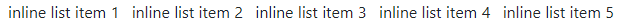


| EXAMPLE: |
| :------- |
| See [07: Hello, Boostrap typography!](07-typography) for a runnable example illustrating the basics of this section. |

## Images

Bootstrap provides support for images, so that controlling sizing and overflow becomes a breeze.

Dealing with images has been traditionally challenging, as seen in the snippet below:

```html
<div class="container my-5">
  <div style="width: 25%; border: 2px solid rebeccapurple">
    
  </div>
</div>
```

Here, we are setting up a `<div>` which will take 25% of the viewport width and we are trying to use it as a container for an image.

However, we can see that the image overflows:

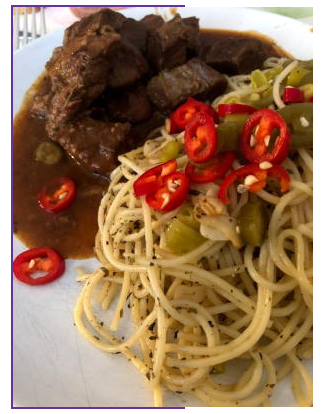


Bootstrap helps you accomplish that, so that you can size images according to the container div using `.img-fluid`:

```html
<div class="container my-5">
  <div style="width: 25%; border: 2px solid rebeccapurple">
    
  </div>
</div>
```


Note that adding `.img-fluid` to the image will also make the image responsive.


The class `.img-thumbnail` can be used to create a sort of frame around the picture:

```html
<div class="container my-5">
  <div style="width: 25%">
    
  </div>
</div>
```


To align the images you have to use the float utility:

```html
<div class="container my-5">
  
</div>
```

| NOTE: |
| :---- |
| The `.w-25` CSS class is used to reduce the image in width to 25%. |


Note that when using `.float` you need to use `.clearfix` right afterwards to prevent breaking the normal flow of the document as seen below:


```html
<div class="container my-5">
  
</div>
<!-- this demonstrates how using float breaks the normal flow of the document -->
<p>
  ...really long text that should be place below previous <div>...
</p>
```

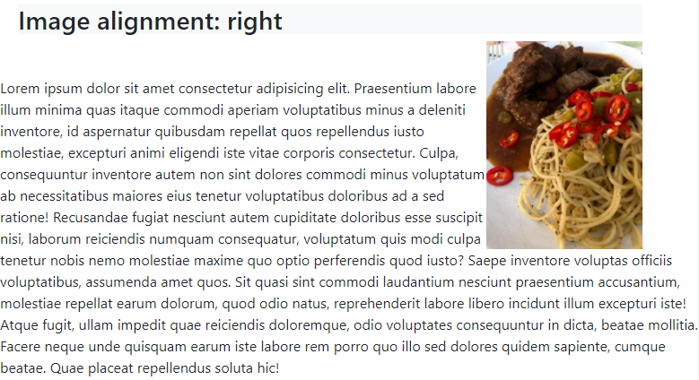

See how the text, that was supposed to be placed right below the `<div>` containing the image is surrounding the ``, thus breaking the expected flow of the HTML document.


The following fixes that problem:

```html
<div class="container my-5">
  <h2 class="bg-light">Image alignment: right</h2>
  
</div>
<!--
  Comment the next div to see the results with and without clearfix
  this demonstrates how using float breaks the normal flow of the document
-->
<div class="clearfix"></div>
<p>
  ...really long text that should be place below previous...
</p>
```


Therefore, `.clearfix` reestablish the normal flow of the document.


You can also align images in the center of the container `<div>` using Flexbox utilities:


```html
<div class="container my-5">
  
</div>
```


Finally, Bootstrap also provides a class to add a rounded corners to a given image simply adding the `.rounded` class:

```html
<div class="container my-5">
  
</div>
```


| EXAMPLE: |
| :------- |
| See [08: Images in action!](08-images) for a runnable example that illustrates the concepts of this section. |


## Utilities

Bootstrap provides a wide range of *utility classes* to control concerns such as spacing, alignment, visibility, etc.

All of them use a consistent notation, so that they become really easy to use.

### Spacing utilities

Bootstrap spacing utilities provide a way to control margin, padding.

The general notation is:

```
{property}{sides}[-{breakpoint}]-{size}
```

where property is shorthand for:
+ `m` &mdash; margin
+ `p` &mdash; padding

where sides is shorthand for:
+ `t` &mdash; for top
+ `b` &mdash; for bottom
+ `s` &mdash; for start
+ `e` &mdash; for end
+ `x` &mdash; for horizontal axis
+ `y` &mdash; for vertical axis
+ `` (blank) &mdash; to set on all sides of an element

where `{breakpoint}` is `sm`, `md`, `lg`, `xl`, and `xxl` (blank means is the xs breakpoint < 576px).

where `{size}` is:
+ `0` &mdash; to eliminate (e.g. marging/padding)
+ numbers from `1` to `5` &mdash; different degrees of spacing
+ `auto` &mdash; shorthand for properties that accept this value (e.g. `margin: auto`)

 For example:
 | spacing utility class | description |
 | :-------------------- | :---------- |
 | mt-5 | apply the largest margin top |


The spacing utilities are also used for alignment, such as horizontal centering of elements and content.

For example, the following markup uses `mx-auto` to center a div horizontally on the available space:

```html
<div class="mx-auto mt-5 border border-1 border-dark w-50">
```

### Border utilities

The border utilities let you apply borders to HTML elements using classes.

For example, the following markup defines a dark border of size 1 to a `<div>`:

```html
<div class="border border-1 border-dark">
  ...
</div>
```

### Color utilities

Bootstrap color utilities define a few semantic properties that can be used for both the foreground and background of elements, as well as for text. The suffixes are used in all the corresponding components that accepts colors such as borders, buttons, cards, etc.

Note that you can also specify gradients and opacity, to obtain variants on a given color.

### Sizing utilities

Bootstrap sizing utilities let you specify the size of an element (width/height) using classes:

```html
<div class="w-50 border border-1 border-dark">
  ...
</div>
```

The previous snipped sets the width of the div to 50% of width of the parent.

### Display utilities

Bootstrap display utilities let you change the display properties of an object using predefined classes.

For example, you can use `.d-none` on an object to make it disappear:

```html
<!-- This paragraph won't show up -->
<p class="d-none">
  Lorem ipsum dolor sit amet consectetur adipisicing elit.
</p>
```

The twist, is that Bootstrap allows you to mix display utilities like `.d-none` with the t-shirt size breakpoints to make items appear/disappear depending on the screen size.

For example, the following markup hides the paragraph on screens larger than the *md* breakpoint (768 px):

```html
<!-- hidden on screens larger than 768px -->
<p class="m-5 d-md-none">
  Lorem ipsum dolor sit amet consectetur adipisicing elit.
</p>
```

The usual case would be the opposite: hide an element below a certain screen size (e.g. below 768px screens)

```html
<p class="m-5 d-none d-md-block d-lg-block d-xl-block d-xxl-block">
  Lorem ipsum dolor sit amet consectetur adipisicing elit.
</p>
```


Use `.d-block` to make an inline element behave as a block element (e.g. usefult to make an inline element take all the available space):

```html
<span class="bg-dark text-white">
  span!
</span>
<span class="d-block bg-dark text-center text-white">
  span with <code>.dblock</code>!
</span>
```

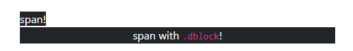


Or `.d-inline` for the opposite:

```html
<div class="d-inline bg-dark text-white mx-1">
  div with <code>.d-inline</code>!
</div>
<div class="d-inline bg-dark text-white mx-1">
  div with <code>.d-inline</code>!
</div>
```

| EXAMPLE: |
| :------- |
| See [09: Hello, display utilities!](09-hello-display-utilities) for a runnable example illustrating several examples of the display utilities. |

### Flex utilities

Bootstrap provides a set of classes to manage the flebox capabilities.

### Interactions

The interactions utility classes can be used to change the way certain elements behaves to user actions, such as when a user clicks on a paragraph, etc.

```html
<p class="user-select-all m-5">
  This paragraph will be entirely selected when the user clicks on it.
</p>

<p class="user-select-none m-5">
  This paragraph won't be selectable when clicked.
</p>
```

| EXAMPLE: |
| :------- |
| See [10: Hello, interaction utilities!](10-interactions) for a runnable example on interaction utilities. |

### Opacity utilities

Opacity utilities allow you to change the opacity of elements using CSS classes.

### Overflow utilities

Bootstrap overflow utilities give you a simple way to control how the content of an element overflows the container using simple CSS classes:

```html
  <div class="container my-5">
    <h2 class="text-center">Using Bootstrap overflow utilities</h2>
    <div class="row">
      <div class="col-3">
        <div class="overflow-auto" style="height: 100px">
          ... will display scroll bar when content overflows ...
        </div>
      </div>
      <div class="col-3">
        <div class="overflow-hidden" style="height: 100px">
          ... will automatically hide the content that overflows ...
        </div>
      </div>
      <div class="col-3">
        <div class="overflow-visible border bg-light" style="height: 100px">
          ... will display the text that overflows ...
        </div>
      </div>
      <div class="col-3">
        <div class="overflow-scroll" style="height: 100px">
          ... will display the scroll bars even when content does not overflow...
        </div>
      </div>
    </div>
  </div>
```


| EXAMPLE: |
| :------- |
| See [11: Hello, interaction utilities!](11-overflow) for a runnable example. |


### Shadow utilities

Bootstrap features to apply shadows to elements:

```html
<div class="container my-5">
  <div class="shadow-sm bg-body rounded p-3 mb-5">
    small shadow
  </div>
  <div class="shadow bg-body rounded p-3 mb-5">
    regular shadow
  </div>
  <div class="shadow-lg bg-body rounded p-3 mb-5">
    large shadow
  </div>
</div>
```

| EXAMPLE: |
| :------- |
| See [12: Bootstrap v5 &mdash; Hello, shadow utilities!](12-shadows) for a runnable example. |

### Visibility utilities

The visibility utilities are similar to the `.d-none` and related utilities seen on the [Display utilities](#display-utilities) section, but in this case, the elements are simply hidden without modifying their display properties.

As a result, elements will still take place on the layout:

```html
<div class="visible">...this will be shown...</div>
<div class="invisible">
  ...this won't be shown, but will take space on the page...
</div>
```

## Tables

Bootstrap offers a wide range of customization capabilities for your tables.

In its simplest form, Bootstrap tables only require you to add the `.table` class to the `<table>` HTML element:

```html
<div class="container my-5">
  <table class="table">
    <thead>
      <tr>
        <th scope="col">#</th>
        <th scope="col">Heading #1</th>
        <th scope="col">Heading #2</th>
        <th scope="col">Heading #3</th>
        <th scope="col">Heading #4</th>
        <th scope="col">Heading #5</th>
        <th scope="col">Heading #6</th>
        <th scope="col">Heading #7</th>
        <th scope="col">Heading #8</th>
      </tr>
    </thead>
    <tbody>
      <tr>
        <th scope="row">1</th>
        <td>Cell row 1, col 1</td>
        <td>Cell row 1, col 2</td>
        <td>Cell row 1, col 3</td>
        <td>Cell row 1, col 4</td>
        <td>Cell row 1, col 5</td>
        <td>Cell row 1, col 6</td>
        <td>Cell row 1, col 7</td>
        <td>Cell row 1, col 8</td>
      </tr>
      <tr>
        <th scope="row">2</th>
        <td>Cell row 2, col 1</td>
        <td>Cell row 2, col 2</td>
        <td>Cell row 2, col 3</td>
        <td>Cell row 2, col 4</td>
        <td>Cell row 2, col 5</td>
        <td>Cell row 2, col 6</td>
        <td>Cell row 2, col 7</td>
        <td>Cell row 2, col 8</td>
      </tr>
      <tr>
        <th scope="row">3</th>
        <td>Cell row 3, col 1</td>
        <td>Cell row 3, col 2</td>
        <td>Cell row 3, col 3</td>
        <td>Cell row 3, col 4</td>
        <td>Cell row 3, col 5</td>
        <td>Cell row 3, col 6</td>
        <td>Cell row 3, col 7</td>
        <td>Cell row 3, col 8</td>
      </tr>
    </tbody>
  </table>
</div>
```


You can also make a table responsive by placing the table on a container div featuring the `.table-responsive` class:

```html
<div class="container my-5">
  <div class="table-responsive">
    <table class="table">
      <thead>
        <tr>
          <th scope="col">#</th>
          <th scope="col">Heading #1</th>
          <th scope="col">Heading #2</th>
          <th scope="col">Heading #3</th>
          <th scope="col">Heading #4</th>
          <th scope="col">Heading #5</th>
          <th scope="col">Heading #6</th>
          <th scope="col">Heading #7</th>
          <th scope="col">Heading #8</th>
        </tr>
      </thead>
      <tbody>
        <tr>
          <th scope="row">1</th>
          <td>Cell row 1, col 1</td>
          <td>Cell row 1, col 2</td>
          <td>Cell row 1, col 3</td>
          <td>Cell row 1, col 4</td>
          <td>Cell row 1, col 5</td>
          <td>Cell row 1, col 6</td>
          <td>Cell row 1, col 7</td>
          <td>Cell row 1, col 8</td>
        </tr>
        <tr>
          <th scope="row">2</th>
          <td>Cell row 2, col 1</td>
          <td>Cell row 2, col 2</td>
          <td>Cell row 2, col 3</td>
          <td>Cell row 2, col 4</td>
          <td>Cell row 2, col 5</td>
          <td>Cell row 2, col 6</td>
          <td>Cell row 2, col 7</td>
          <td>Cell row 2, col 8</td>
        </tr>
        <tr>
          <th scope="row">3</th>
          <td>Cell row 3, col 1</td>
          <td>Cell row 3, col 2</td>
          <td>Cell row 3, col 3</td>
          <td>Cell row 3, col 4</td>
          <td>Cell row 3, col 5</td>
          <td>Cell row 3, col 6</td>
          <td>Cell row 3, col 7</td>
          <td>Cell row 3, col 8</td>
        </tr>
      </tbody>
    </table>
  </div>
</div>
```

As seen below, this will include a scrollbar so that you can review all of the table information:


You can also specify the t-shirt size beyond where the table will become responsive:

```html
<div class="container my-5">
  <div class="table-responsive-sm">
    <table class="table">
      <thead>
        <tr>
          <th scope="col">#</th>
          <th scope="col">Heading #1</th>
          <th scope="col">Heading #2</th>
          <th scope="col">Heading #3</th>
          <th scope="col">Heading #4</th>
          <th scope="col">Heading #5</th>
          <th scope="col">Heading #6</th>
          <th scope="col">Heading #7</th>
          <th scope="col">Heading #8</th>
        </tr>
      </thead>
      <tbody>
        <tr>
          <th scope="row">1</th>
          <td>Cell row 1, col 1</td>
          <td>Cell row 1, col 2</td>
          <td>Cell row 1, col 3</td>
          <td>Cell row 1, col 4</td>
          <td>Cell row 1, col 5</td>
          <td>Cell row 1, col 6</td>
          <td>Cell row 1, col 7</td>
          <td>Cell row 1, col 8</td>
        </tr>
        <tr>
          <th scope="row">2</th>
          <td>Cell row 2, col 1</td>
          <td>Cell row 2, col 2</td>
          <td>Cell row 2, col 3</td>
          <td>Cell row 2, col 4</td>
          <td>Cell row 2, col 5</td>
          <td>Cell row 2, col 6</td>
          <td>Cell row 2, col 7</td>
          <td>Cell row 2, col 8</td>
        </tr>
        <tr>
          <th scope="row">3</th>
          <td>Cell row 3, col 1</td>
          <td>Cell row 3, col 2</td>
          <td>Cell row 3, col 3</td>
          <td>Cell row 3, col 4</td>
          <td>Cell row 3, col 5</td>
          <td>Cell row 3, col 6</td>
          <td>Cell row 3, col 7</td>
          <td>Cell row 3, col 8</td>
        </tr>
      </tbody>
    </table>
  </div>
</div>
```

In the example above, the table will display a scrollbar for screens narrower than the *sm* breakpoint (576px).


You can use additional classes to change the appearance of the table:

```html
<div class="container my-5">
  <table class="table table-dark">
    <thead>
      <tr>
        <th scope="col">#</th>
        <th scope="col">Heading #1</th>
        <th scope="col">Heading #2</th>
        <th scope="col">Heading #3</th>
        <th scope="col">Heading #4</th>
        <th scope="col">Heading #5</th>
        <th scope="col">Heading #6</th>
        <th scope="col">Heading #7</th>
        <th scope="col">Heading #8</th>
      </tr>
    </thead>
    <tbody>
      <tr>
        <th scope="row">1</th>
        <td>Cell row 1, col 1</td>
        <td>Cell row 1, col 2</td>
        <td>Cell row 1, col 3</td>
        <td>Cell row 1, col 4</td>
        <td>Cell row 1, col 5</td>
        <td>Cell row 1, col 6</td>
        <td>Cell row 1, col 7</td>
        <td>Cell row 1, col 8</td>
      </tr>
      <tr>
        <th scope="row">2</th>
        <td>Cell row 2, col 1</td>
        <td>Cell row 2, col 2</td>
        <td>Cell row 2, col 3</td>
        <td>Cell row 2, col 4</td>
        <td>Cell row 2, col 5</td>
        <td>Cell row 2, col 6</td>
        <td>Cell row 2, col 7</td>
        <td>Cell row 2, col 8</td>
      </tr>
      <tr>
        <th scope="row">3</th>
        <td>Cell row 3, col 1</td>
        <td>Cell row 3, col 2</td>
        <td>Cell row 3, col 3</td>
        <td>Cell row 3, col 4</td>
        <td>Cell row 3, col 5</td>
        <td>Cell row 3, col 6</td>
        <td>Cell row 3, col 7</td>
        <td>Cell row 3, col 8</td>
      </tr>
    </tbody>
  </table>
</div>
```

For example, the `.table-dark` class will make the table look like the image below:


You can create borders around the cells using `.table-bordered`:

```html
<div class="container my-5">
  <table class="table table-bordered">
    <thead>
      <tr>
        <th scope="col">#</th>
        <th scope="col">Heading #1</th>
        <th scope="col">Heading #2</th>
        <th scope="col">Heading #3</th>
        <th scope="col">Heading #4</th>
        <th scope="col">Heading #5</th>
        <th scope="col">Heading #6</th>
        <th scope="col">Heading #7</th>
        <th scope="col">Heading #8</th>
      </tr>
    </thead>
    <tbody>
      <tr>
        <th scope="row">1</th>
        <td>Cell row 1, col 1</td>
        <td>Cell row 1, col 2</td>
        <td>Cell row 1, col 3</td>
        <td>Cell row 1, col 4</td>
        <td>Cell row 1, col 5</td>
        <td>Cell row 1, col 6</td>
        <td>Cell row 1, col 7</td>
        <td>Cell row 1, col 8</td>
      </tr>
      <tr>
        <th scope="row">2</th>
        <td>Cell row 2, col 1</td>
        <td>Cell row 2, col 2</td>
        <td>Cell row 2, col 3</td>
        <td>Cell row 2, col 4</td>
        <td>Cell row 2, col 5</td>
        <td>Cell row 2, col 6</td>
        <td>Cell row 2, col 7</td>
        <td>Cell row 2, col 8</td>
      </tr>
      <tr>
        <th scope="row">3</th>
        <td>Cell row 3, col 1</td>
        <td>Cell row 3, col 2</td>
        <td>Cell row 3, col 3</td>
        <td>Cell row 3, col 4</td>
        <td>Cell row 3, col 5</td>
        <td>Cell row 3, col 6</td>
        <td>Cell row 3, col 7</td>
        <td>Cell row 3, col 8</td>
      </tr>
    </tbody>
  </table>
</div>
```


You can also create hover effects over the rows with `.table-hover`. Note also that you can mix and match several of the classes seen above. For example, below you have a table featuring the dark theme, with bordered cells and hover effect (on the third row):

```html
<div class="container my-5">
  <table class="table table-dark table-bordered table-hover">
    <thead>
      <tr>
        <th scope="col">#</th>
        <th scope="col">Heading #1</th>
        <th scope="col">Heading #2</th>
        <th scope="col">Heading #3</th>
        <th scope="col">Heading #4</th>
        <th scope="col">Heading #5</th>
        <th scope="col">Heading #6</th>
        <th scope="col">Heading #7</th>
        <th scope="col">Heading #8</th>
      </tr>
    </thead>
    <tbody>
      <tr>
        <th scope="row">1</th>
        <td>Cell row 1, col 1</td>
        <td>Cell row 1, col 2</td>
        <td>Cell row 1, col 3</td>
        <td>Cell row 1, col 4</td>
        <td>Cell row 1, col 5</td>
        <td>Cell row 1, col 6</td>
        <td>Cell row 1, col 7</td>
        <td>Cell row 1, col 8</td>
      </tr>
      <tr>
        <th scope="row">2</th>
        <td>Cell row 2, col 1</td>
        <td>Cell row 2, col 2</td>
        <td>Cell row 2, col 3</td>
        <td>Cell row 2, col 4</td>
        <td>Cell row 2, col 5</td>
        <td>Cell row 2, col 6</td>
        <td>Cell row 2, col 7</td>
        <td>Cell row 2, col 8</td>
      </tr>
      <tr>
        <th scope="row">3</th>
        <td>Cell row 3, col 1</td>
        <td>Cell row 3, col 2</td>
        <td>Cell row 3, col 3</td>
        <td>Cell row 3, col 4</td>
        <td>Cell row 3, col 5</td>
        <td>Cell row 3, col 6</td>
        <td>Cell row 3, col 7</td>
        <td>Cell row 3, col 8</td>
      </tr>
    </tbody>
  </table>
</div>
```


You can also create striped tables with `.table-striped`. Note that also the color of the table was adjusted using semantic colors to `.table-info`:

```html
<div class="container my-5">
  <table class="table table-striped table-info">
    <thead>
      <tr>
        <th scope="col">#</th>
        <th scope="col">Heading #1</th>
        <th scope="col">Heading #2</th>
        <th scope="col">Heading #3</th>
        <th scope="col">Heading #4</th>
        <th scope="col">Heading #5</th>
        <th scope="col">Heading #6</th>
        <th scope="col">Heading #7</th>
        <th scope="col">Heading #8</th>
      </tr>
    </thead>
    <tbody>
      <tr>
        <th scope="row">1</th>
        <td>Cell row 1, col 1</td>
        <td>Cell row 1, col 2</td>
        <td>Cell row 1, col 3</td>
        <td>Cell row 1, col 4</td>
        <td>Cell row 1, col 5</td>
        <td>Cell row 1, col 6</td>
        <td>Cell row 1, col 7</td>
        <td>Cell row 1, col 8</td>
      </tr>
      <tr>
        <th scope="row">2</th>
        <td>Cell row 2, col 1</td>
        <td>Cell row 2, col 2</td>
        <td>Cell row 2, col 3</td>
        <td>Cell row 2, col 4</td>
        <td>Cell row 2, col 5</td>
        <td>Cell row 2, col 6</td>
        <td>Cell row 2, col 7</td>
        <td>Cell row 2, col 8</td>
      </tr>
      <tr>
        <th scope="row">3</th>
        <td>Cell row 3, col 1</td>
        <td>Cell row 3, col 2</td>
        <td>Cell row 3, col 3</td>
        <td>Cell row 3, col 4</td>
        <td>Cell row 3, col 5</td>
        <td>Cell row 3, col 6</td>
        <td>Cell row 3, col 7</td>
        <td>Cell row 3, col 8</td>
      </tr>
    </tbody>
  </table>
</div>
```


| EXAMPLE: |
| :------- |
| See [13: Hello, tables!](13-tables) for a runnable example illustrating the basics of tables. |

## Alerts

You can use the alert components to create notifications on the screen.

The markup below demonstrates how to create simple alert:

```html
<div class="container my-5">
  <div class="alert alert-primary" role="alert">
    An alert using the primary theme!
  </div>
  <div class="alert alert-secondary" role="alert">
    Another alert using the secondary theme!
  </div>
</div>
```


You can make them a little bit more appealing using icons:

```html
<div class="container my-5">
  <div class="alert alert-danger d-flex align-items-center" role="alert">
    <svg xmlns="http://www.w3.org/2000/svg" width="24" height="24" fill="currentColor" class="bi bi-exclamation-triangle-fill flex-shrink-0 me-2" viewBox="0 0 16 16" role="img" aria-label="Warning:">
      <path d="M8.982 1.566a1.13 1.13 0 0 0-1.96 0L.165 13.233c-.457.778.091 1.767.98 1.767h13.713c.889 0 1.438-.99.98-1.767L8.982 1.566zM8 5c.535 0 .954.462.9.995l-.35 3.507a.552.552 0 0 1-1.1 0L7.1 5.995A.905.905 0 0 1 8 5zm.002 6a1 1 0 1 1 0 2 1 1 0 0 1 0-2z"/>
    </svg>
    <div>
      An alert danger with an icon!
    </div>
  </div>
</div>
```


The technique above uses a one-off SVG icon. But you can also create *sprites* so that you can more easily reference your SVG icons, as seen below:

```html
<div class="container my-5">
  <!-- creating sprites -->
  <svg xmlns="http://www.w3.org/2000/svg" style="display: none;">
    <symbol id="check-circle-fill" fill="currentColor" viewBox="0 0 16 16">
      <path d="M16 8A8 8 0 1 1 0 8a8 8 0 0 1 16 0zm-3.97-3.03a.75.75 0 0 0-1.08.022L7.477 9.417 5.384 7.323a.75.75 0 0 0-1.06 1.06L6.97 11.03a.75.75 0 0 0 1.079-.02l3.992-4.99a.75.75 0 0 0-.01-1.05z"/>
    </symbol>
    <symbol id="info-fill" fill="currentColor" viewBox="0 0 16 16">
      <path d="M8 16A8 8 0 1 0 8 0a8 8 0 0 0 0 16zm.93-9.412-1 4.705c-.07.34.029.533.304.533.194 0 .487-.07.686-.246l-.088.416c-.287.346-.92.598-1.465.598-.703 0-1.002-.422-.808-1.319l.738-3.468c.064-.293.006-.399-.287-.47l-.451-.081.082-.381 2.29-.287zM8 5.5a1 1 0 1 1 0-2 1 1 0 0 1 0 2z"/>
    </symbol>
  </svg>

  <div class="alert alert-primary d-flex align-items-center" role="alert">
    <svg class="bi flex-shrink-0 me-2" width="24" height="24" role="img" aria-label="Info:"><use xlink:href="#info-fill"/></svg>
    <div>
      An informational alert with an icon referenced as a sprite!
    </div>
  </div>

  <div class="alert alert-success d-flex align-items-center" role="alert">
    <svg class="bi flex-shrink-0 me-2" width="24" height="24" role="img" aria-label="Success:"><use xlink:href="#check-circle-fill"/></svg>
    <div>
      A success alert with another icon referenced as a sprite!
    </div>
  </div>
</div>
```

Note how we first define the sprites, and then reference them in our alerts. That fosters reusability.


Also, when using the Bootstrap JavaScript bundle, you can create dismissable alerts with the markup below:

```html
<div class="container my-5">
  <div class="alert alert-warning alert-dismissible fade show" role="alert">
    <strong>Click the button to dismiss!</strong> Once you click the element will be removed from the page.
    <button type="button" class="btn-close" data-bs-dismiss="alert" aria-label="Close"></button>
  </div>
</div>
```


Note that you have to add more classes, as well as include a button so that the user can dismiss.

| EXAMPLE: |
| :------- |
| See [14: Hello, alerts!](14-alerts) for a runnable example to practice the concepts of this section. |

## Toasts

*Toasts* are advanced lightweight Bootstrap components frequently used to show notifications.

Even the simplest of Toasts require complicated markup and TypeScript.

Let's start with the markup:

```html
<div class="container my-5">
  <!-- This button is used to show the toast below -->
  <button type="button" class="btn btn-primary" id="liveToastBtn">Show toast!</button>

  <div class="position-fixed bottom-0 end-0 p-3" style="z-index:11">
    <div id="liveToast" class="toast hide" role="alert" aria-live="assertive" aria-atomic="true">
      <div class="toast-header">
        
        <strong class="me-auto">Toast header!</strong>
        <small>pushed 11 hours ago</small>
        <button type="button" class="btn-close" data-bs-dismiss="toast" aria-label="Close"></button>
      </div> <!-- toast-header -->
      <div class="toast-body">
        This is the toast body. Lorem ipsum, dolor sit amet consectetur adipisicing elit. Tempora perspiciatis non a natus adipisci nisi dignissimos laborum eligendi omnis voluptas.
      </div>
    </div> <!-- toast -->
  </div>
</div>
```

See how the toast is contained on a div that is use to specify its placement (bottom right in this example). Also, toasts are not displayed by default, and therefore, in the example we set out a button which will trigger the following TypeScript code on click:

```typescript
import { Toast } from 'bootstrap';


const toastBtn: HTMLButtonElement = getValidatedHtmlElement(`liveToastBtn`);
const toast: HTMLElement = getValidatedHtmlElement(`#liveToast`);

toastBtn.addEventListener('click', () => {
  const bsToast = new Toast(toast);
  bsToast.show();
});

function getValidatedHtmlElement<T extends Element>(htmlSelector: string): T {
  const elem = document.querySelector(htmlSelector);
  if (!elem) {
    console.log(`ERROR: ${ htmlSelector } was not found in the HTML`);
    throw new Error(`Missing element ${ htmlSelector } in HTML`);
  }
  return elem as T;
}
```

See how the event handler creates a new instance of the toast and shows it.

| EXAMPLE: |
| :------- |
| See [15: Hello, Toasts!](15-toasts) for a runnable example illustrating the concepts above, and ready to use for experimenting more advanced scenarios for toasts. |

## Navbar

Bootstrap provides a *navbar* component that facilitates the creation of visually appealing, customizable navigation bars that are responsive by design.

The markup for the complete *navbar* is quite complex, so it is recommended to grab the example from the Bootstrap docs and make some adjustments to achieve the desired results.

The default example is the following:

```html
<nav class="navbar navbar-expand-lg navbar-light bg-light">
  <div class="container-fluid">
    <a class="navbar-brand" href="#">Navbar</a>
    <button class="navbar-toggler" type="button" data-bs-toggle="collapse" data-bs-target="#navbarSupportedContent" aria-controls="navbarSupportedContent" aria-expanded="false" aria-label="Toggle navigation">
      <span class="navbar-toggler-icon"></span>
    </button>
    <div class="collapse navbar-collapse" id="navbarSupportedContent">
      <ul class="navbar-nav me-auto mb-2 mb-lg-0">
        <li class="nav-item">
          <a class="nav-link active" aria-current="page" href="#">Home</a>
        </li>
        <li class="nav-item">
          <a class="nav-link" href="#">Link</a>
        </li>
        <li class="nav-item dropdown">
          <a class="nav-link dropdown-toggle" href="#" id="navbarDropdown" role="button" data-bs-toggle="dropdown" aria-expanded="false">
            Dropdown
          </a>
          <ul class="dropdown-menu" aria-labelledby="navbarDropdown">
            <li><a class="dropdown-item" href="#">Action</a></li>
            <li><a class="dropdown-item" href="#">Another action</a></li>
            <li><hr class="dropdown-divider"></li>
            <li><a class="dropdown-item" href="#">Something else here</a></li>
          </ul>
        </li>
        <li class="nav-item">
          <a class="nav-link disabled">Disabled</a>
        </li>
      </ul>
      <form class="d-flex">
        <input class="form-control me-2" type="search" placeholder="Search" aria-label="Search">
        <button class="btn btn-outline-success" type="submit">Search</button>
      </form>
    </div>
  </div>
</nav>
```

Note that it has been setup on a regular `.container` and therefore features some margins on the *x- axis*, and by default it is placed on the top of the screen leaving no margin there.

The previous markup renders the following results in wide and narrow screens, and you can see how the navbar items are displayed when clicking on the hamburger icon:


The default navbar uses a `.container-fluid` for the items. You can easily switch to a plain `.container` to add more padding:

```html
<nav class="navbar navbar-expand-lg navbar-light bg-light">
  <div class="container">
    <a class="navbar-brand" href="#">Navbar</a>
    <button class="navbar-toggler" type="button" data-bs-toggle="collapse" data-bs-target="#navbarSupportedContent" aria-controls="navbarSupportedContent" aria-expanded="false" aria-label="Toggle navigation">
      <span class="navbar-toggler-icon"></span>
    </button>
    <div class="collapse navbar-collapse" id="navbarSupportedContent">
      <ul class="navbar-nav me-auto mb-2 mb-lg-0">
        <li class="nav-item">
          <a class="nav-link active" aria-current="page" href="#">Home</a>
        </li>
        <li class="nav-item">
          <a class="nav-link" href="#">Link</a>
        </li>
        <li class="nav-item dropdown">
          <a class="nav-link dropdown-toggle" href="#" id="navbarDropdown" role="button" data-bs-toggle="dropdown" aria-expanded="false">
            Dropdown
          </a>
          <ul class="dropdown-menu" aria-labelledby="navbarDropdown">
            <li><a class="dropdown-item" href="#">Action</a></li>
            <li><a class="dropdown-item" href="#">Another action</a></li>
            <li><hr class="dropdown-divider"></li>
            <li><a class="dropdown-item" href="#">Something else here</a></li>
          </ul>
        </li>
        <li class="nav-item">
          <a class="nav-link disabled">Disabled</a>
        </li>
      </ul>
      <form class="d-flex">
        <input class="form-control me-2" type="search" placeholder="Search" aria-label="Search">
        <button class="btn btn-outline-success" type="submit">Search</button>
      </form>
    </div>
  </div>
</nav>
```

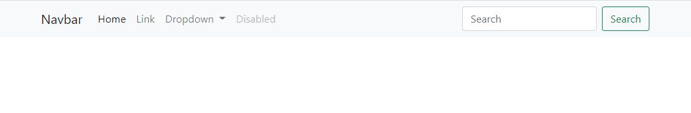


You can then add an image to the navbar by including an `` on the navbar brand link:

```html
<nav class="navbar navbar-expand-lg navbar-light bg-light">
  <div class="container-fluid">
    <a class="navbar-brand" href="#">
      
      Navbar
    </a>
    <button class="navbar-toggler" type="button" data-bs-toggle="collapse" data-bs-target="#navbarSupportedContent" aria-controls="navbarSupportedContent" aria-expanded="false" aria-label="Toggle navigation">
      <span class="navbar-toggler-icon"></span>
    </button>
    <div class="collapse navbar-collapse" id="navbarSupportedContent">
      <ul class="navbar-nav me-auto mb-2 mb-lg-0">
        <li class="nav-item">
          <a class="nav-link active" aria-current="page" href="#">Home</a>
        </li>
        <li class="nav-item">
          <a class="nav-link" href="#">Link</a>
        </li>
        <li class="nav-item dropdown">
          <a class="nav-link dropdown-toggle" href="#" id="navbarDropdown" role="button" data-bs-toggle="dropdown" aria-expanded="false">
            Dropdown
          </a>
          <ul class="dropdown-menu" aria-labelledby="navbarDropdown">
            <li><a class="dropdown-item" href="#">Action</a></li>
            <li><a class="dropdown-item" href="#">Another action</a></li>
            <li><hr class="dropdown-divider"></li>
            <li><a class="dropdown-item" href="#">Something else here</a></li>
          </ul>
        </li>
        <li class="nav-item">
          <a class="nav-link disabled">Disabled</a>
        </li>
      </ul>
      <form class="d-flex">
        <input class="form-control me-2" type="search" placeholder="Search" aria-label="Search">
        <button class="btn btn-outline-success" type="submit">Search</button>
      </form>
    </div>
  </div>
</nav>
```

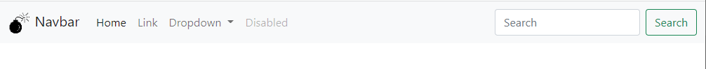


You can switch to the dark navbar adding a `.navbar-dark` and `.bg-dark` classes to your `<nav>` element:

```html
<nav class="navbar navbar-expand-lg navbar-dark bg-dark">
  <div class="container-fluid">
    <a class="navbar-brand" href="#">
      
      Navbar
    </a>
    <button class="navbar-toggler" type="button" data-bs-toggle="collapse" data-bs-target="#navbarSupportedContent" aria-controls="navbarSupportedContent" aria-expanded="false" aria-label="Toggle navigation">
      <span class="navbar-toggler-icon"></span>
    </button>
    <div class="collapse navbar-collapse" id="navbarSupportedContent">
      <ul class="navbar-nav me-auto mb-2 mb-lg-0">
        <li class="nav-item">
          <a class="nav-link active" aria-current="page" href="#">Home</a>
        </li>
        <li class="nav-item">
          <a class="nav-link" href="#">Link</a>
        </li>
        <li class="nav-item dropdown">
          <a class="nav-link dropdown-toggle" href="#" id="navbarDropdown" role="button" data-bs-toggle="dropdown" aria-expanded="false">
            Dropdown
          </a>
          <ul class="dropdown-menu" aria-labelledby="navbarDropdown">
            <li><a class="dropdown-item" href="#">Action</a></li>
            <li><a class="dropdown-item" href="#">Another action</a></li>
            <li><hr class="dropdown-divider"></li>
            <li><a class="dropdown-item" href="#">Something else here</a></li>
          </ul>
        </li>
        <li class="nav-item">
          <a class="nav-link disabled">Disabled</a>
        </li>
      </ul>
      <form class="d-flex">
        <input class="form-control me-2" type="search" placeholder="Search" aria-label="Search">
        <button class="btn btn-outline-success" type="submit">Search</button>
      </form>
    </div>
  </div>
</nav>
```

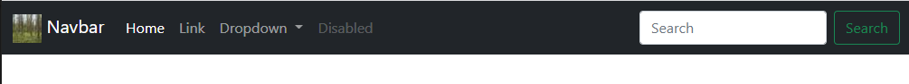


The default navbar will disappear if there's enough content on the page to scroll down, as seen below:

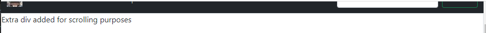

You can use different options to make it stick to the top even when scrolling, but take into account that it might affect the normal flow of the document, as seen below when using `.fixed-top`:

```html
<nav class="navbar navbar-expand-lg navbar-dark bg-dark fixed-top">
  <div class="container-fluid">
    <a class="navbar-brand" href="#">
      
      Navbar
    </a>
    <button class="navbar-toggler" type="button" data-bs-toggle="collapse" data-bs-target="#navbarSupportedContent" aria-controls="navbarSupportedContent" aria-expanded="false" aria-label="Toggle navigation">
      <span class="navbar-toggler-icon"></span>
    </button>
    <div class="collapse navbar-collapse" id="navbarSupportedContent">
      <ul class="navbar-nav me-auto mb-2 mb-lg-0">
        <li class="nav-item">
          <a class="nav-link active" aria-current="page" href="#">Home</a>
        </li>
        <li class="nav-item">
          <a class="nav-link" href="#">Link</a>
        </li>
        <li class="nav-item dropdown">
          <a class="nav-link dropdown-toggle" href="#" id="navbarDropdown" role="button" data-bs-toggle="dropdown" aria-expanded="false">
            Dropdown
          </a>
          <ul class="dropdown-menu" aria-labelledby="navbarDropdown">
            <li><a class="dropdown-item" href="#">Action</a></li>
            <li><a class="dropdown-item" href="#">Another action</a></li>
            <li><hr class="dropdown-divider"></li>
            <li><a class="dropdown-item" href="#">Something else here</a></li>
          </ul>
        </li>
        <li class="nav-item">
          <a class="nav-link disabled">Disabled</a>
        </li>
      </ul>
      <form class="d-flex">
        <input class="form-control me-2" type="search" placeholder="Search" aria-label="Search">
        <button class="btn btn-outline-success" type="submit">Search</button>
      </form>
    </div>
  </div>
</nav>
```

The navbar will stick to the top even when scrolling, but the text that we placed after the navbar has disappeared, as the normal flow of the document have changed.


This can be fixed using `.sticky-top` instead:

```html
<nav class="navbar navbar-expand-lg navbar-dark bg-dark sticky-top">
  <div class="container-fluid">
    <a class="navbar-brand" href="#">
      
      Navbar
    </a>
    <button class="navbar-toggler" type="button" data-bs-toggle="collapse" data-bs-target="#navbarSupportedContent" aria-controls="navbarSupportedContent" aria-expanded="false" aria-label="Toggle navigation">
      <span class="navbar-toggler-icon"></span>
    </button>
    <div class="collapse navbar-collapse" id="navbarSupportedContent">
      <ul class="navbar-nav me-auto mb-2 mb-lg-0">
        <li class="nav-item">
          <a class="nav-link active" aria-current="page" href="#">Home</a>
        </li>
        <li class="nav-item">
          <a class="nav-link" href="#">Link</a>
        </li>
        <li class="nav-item dropdown">
          <a class="nav-link dropdown-toggle" href="#" id="navbarDropdown" role="button" data-bs-toggle="dropdown" aria-expanded="false">
            Dropdown
          </a>
          <ul class="dropdown-menu" aria-labelledby="navbarDropdown">
            <li><a class="dropdown-item" href="#">Action</a></li>
            <li><a class="dropdown-item" href="#">Another action</a></li>
            <li><hr class="dropdown-divider"></li>
            <li><a class="dropdown-item" href="#">Something else here</a></li>
          </ul>
        </li>
        <li class="nav-item">
          <a class="nav-link disabled">Disabled</a>
        </li>
      </ul>
      <form class="d-flex">
        <input class="form-control me-2" type="search" placeholder="Search" aria-label="Search">
        <button class="btn btn-outline-success" type="submit">Search</button>
      </form>
    </div>
  </div>
</nav>
```


See how in this case, the navbar stays on top while the regular document flow is not broken, and you can see the content right below the navbar without making more adjustments.

Note that if you need to use fixed top, you can fix it adjusting the padding-top on the body:


```css
<style>
  body {
    padding-top: 10rem;
  }
</style>
```


Bootstrap v5 features several navbar variations, such as the *Offcanvas navbar*:

```html
<nav class="navbar navbar-light bg-light fixed-top">
  <div class="container-fluid">
    <a class="navbar-brand" href="#">Offcanvas navbar</a>
    <button class="navbar-toggler" type="button" data-bs-toggle="offcanvas" data-bs-target="#offcanvasNavbar" aria-controls="offcanvasNavbar">
      <span class="navbar-toggler-icon"></span>
    </button>
    <div class="offcanvas offcanvas-end" tabindex="-1" id="offcanvasNavbar" aria-labelledby="offcanvasNavbarLabel">
      <div class="offcanvas-header">
        <h5 class="offcanvas-title" id="offcanvasNavbarLabel">Offcanvas</h5>
        <button type="button" class="btn-close text-reset" data-bs-dismiss="offcanvas" aria-label="Close"></button>
      </div>
      <div class="offcanvas-body">
        <ul class="navbar-nav justify-content-end flex-grow-1 pe-3">
          <li class="nav-item">
            <a class="nav-link active" aria-current="page" href="#">Home</a>
          </li>
          <li class="nav-item">
            <a class="nav-link" href="#">Link</a>
          </li>
          <li class="nav-item dropdown">
            <a class="nav-link dropdown-toggle" href="#" id="offcanvasNavbarDropdown" role="button" data-bs-toggle="dropdown" aria-expanded="false">
              Dropdown
            </a>
            <ul class="dropdown-menu" aria-labelledby="offcanvasNavbarDropdown">
              <li><a class="dropdown-item" href="#">Action</a></li>
              <li><a class="dropdown-item" href="#">Another action</a></li>
              <li>
                <hr class="dropdown-divider">
              </li>
              <li><a class="dropdown-item" href="#">Something else here</a></li>
            </ul>
          </li>
        </ul>
        <form class="d-flex">
          <input class="form-control me-2" type="search" placeholder="Search" aria-label="Search">
          <button class="btn btn-outline-success" type="submit">Search</button>
        </form>
      </div>
    </div>
  </div>
</nav>
```


Note that it uses `.fixed-top` and therefore requires you to adjust your content, as you will have modified the normal document flow.

| EXAMPLE: |
| :------- |
| See [16: Hello, navbar!](16-navbars) for a runnable example. |

## Navs and tabs

Bootstrap provides also several CSS components to add navs to your page.

Navs are typically included in your page for navigation purposes. For instance, in Amazon.com you can find navs right below the navbar on top:


Basic navs require very little markup. They are based on unordered lists:

```html
<div class="container">
  <ul class="nav">
    <li class="nav-item">
      <a class="nav-link active" aria-current="page" href='#'>Active</a>
    </li>
    <li class="nav-item">
      <a href="#" class="nav-link">Link</a>
    </li>
    <li class="nav-item">
      <a href="#" class="nav-link">Another link</a>
    </li>
    <li class="nav-item">
      <a href="#" class="nav-link disabled">Disabled link</a>
    </li>
  </ul>
</div>
```


Bootstrap also provides an easy way to handle tabs via CSS + JavaScript plugin:

```html
<div class="container">
  <ul class="nav nav-pills mb-3" id="pills-tab" role="tablist">
    <li class="nav-item" role="presentation">
      <button class="nav-link active" id="pills-home-tab" data-bs-toggle="pill" data-bs-target="#pills-home" type="button" role="tab" aria-controls="pills-home" aria-selected="true">Home</button>
    </li>
    <li class="nav-item" role="presentation">
      <button class="nav-link" id="pills-profile-tab" data-bs-toggle="pill" data-bs-target="#pills-profile" type="button" role="tab" aria-controls="pills-profile" aria-selected="false">Profile</button>
    </li>
    <li class="nav-item" role="presentation">
      <button class="nav-link" id="pills-contact-tab" data-bs-toggle="pill" data-bs-target="#pills-contact" type="button" role="tab" aria-controls="pills-contact" aria-selected="false">Contact</button>
    </li>
  </ul>
  <div class="tab-content" id="pills-tabContent">
    <div class="tab-pane fade show active" id="pills-home" role="tabpanel" aria-labelledby="pills-home-tab">Home tab content</div>
    <div class="tab-pane fade" id="pills-profile" role="tabpanel" aria-labelledby="pills-profile-tab">Profile tab content</div>
    <div class="tab-pane fade" id="pills-contact" role="tabpanel" aria-labelledby="pills-contact-tab">Contact tab content</div>
  </div>
</div>
```

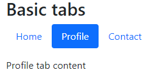


The library also provides an easy way to transform the previous horizontal tabs into a vertical tabs using the flex utilities:

```html
<div class="container">
  <div class="d-flex align-items-start">
    <div class="nav flex-column nav-pills me-3" id="v-pills-tab" role="tablist" aria-orientation="vertical">
      <button class="nav-link active" id="v-pills-home-tab" data-bs-toggle="pill" data-bs-target="#v-pills-home" type="button" role="tab" aria-controls="v-pills-home" aria-selected="true">Home</button>
      <button class="nav-link" id="v-pills-profile-tab" data-bs-toggle="pill" data-bs-target="#v-pills-profile" type="button" role="tab" aria-controls="v-pills-profile" aria-selected="false">Profile</button>
      <button class="nav-link" id="v-pills-messages-tab" data-bs-toggle="pill" data-bs-target="#v-pills-messages" type="button" role="tab" aria-controls="v-pills-messages" aria-selected="false">Messages</button>
      <button class="nav-link" id="v-pills-settings-tab" data-bs-toggle="pill" data-bs-target="#v-pills-settings" type="button" role="tab" aria-controls="v-pills-settings" aria-selected="false">Settings</button>
      <button class="nav-link" id="v-pills-other-tab" data-bs-toggle="pill" data-bs-target="#v-other-settings" type="button" role="tab" aria-controls="v-pills-settings" aria-selected="false">Other</button>
    </div>
    <div class="tab-content" id="v-pills-tabContent">
      <div class="tab-pane fade show active" id="v-pills-home" role="tabpanel" aria-labelledby="v-pills-home-tab">Home tab content</div>
      <div class="tab-pane fade" id="v-pills-profile" role="tabpanel" aria-labelledby="v-pills-profile-tab">Profile tab content</div>
      <div class="tab-pane fade" id="v-pills-messages" role="tabpanel" aria-labelledby="v-pills-messages-tab">Messages tab content</div>
      <div class="tab-pane fade" id="v-pills-settings" role="tabpanel" aria-labelledby="v-pills-settings-tab">Settings tab content</div>
      <div class="tab-pane fade" id="v-other-settings" role="tabpanel" aria-labelledby="v-other-settings-tab">Other tab content</div>
    </div>
  </div>
</div>
```


| EXAMPLE: |
| :------- |
| See [17: Hello, navs and tabs!](17-navs-and-tabs) for a runnable example. |

## Icons

Bootstrap used to come with their own icon set. Then, they decided not to include it anymore, so that you had to rely on external icon libraries such as [Font Awesome](https://fontawesome.com/).

Bootstrap v5 does not feature any icon library either, but the twist is that they now provide first-class support for a very good icon library also developed by the Bootstrap team as a separate project: [Bootstrap icons](https://icons.getbootstrap.com/)


From there you can search for icons, and you have detailed information about how to include it in your application as font, or as svg.

In order to use a single SVG icon, you don't need to include any kind of styleshee, you just need to use the following markup:

```html
<div class="container bg-light">
  <svg xmlns="http://www.w3.org/2000/svg" width="16" height="16" fill="currentColor" class="bi bi-controller" viewBox="0 0 16 16">
    <path d="M11.5 6.027a.5.5 0 1 1-1 0 .5.5 0 0 1 1 0zm-1.5 1.5a.5.5 0 1 0 0-1 .5.5 0 0 0 0 1zm2.5-.5a.5.5 0 1 1-1 0 .5.5 0 0 1 1 0zm-1.5 1.5a.5.5 0 1 0 0-1 .5.5 0 0 0 0 1zm-6.5-3h1v1h1v1h-1v1h-1v-1h-1v-1h1v-1z"/>
    <path d="M3.051 3.26a.5.5 0 0 1 .354-.613l1.932-.518a.5.5 0 0 1 .62.39c.655-.079 1.35-.117 2.043-.117.72 0 1.443.041 2.12.126a.5.5 0 0 1 .622-.399l1.932.518a.5.5 0 0 1 .306.729c.14.09.266.19.373.297.408.408.78 1.05 1.095 1.772.32.733.599 1.591.805 2.466.206.875.34 1.78.364 2.606.024.816-.059 1.602-.328 2.21a1.42 1.42 0 0 1-1.445.83c-.636-.067-1.115-.394-1.513-.773-.245-.232-.496-.526-.739-.808-.126-.148-.25-.292-.368-.423-.728-.804-1.597-1.527-3.224-1.527-1.627 0-2.496.723-3.224 1.527-.119.131-.242.275-.368.423-.243.282-.494.575-.739.808-.398.38-.877.706-1.513.773a1.42 1.42 0 0 1-1.445-.83c-.27-.608-.352-1.395-.329-2.21.024-.826.16-1.73.365-2.606.206-.875.486-1.733.805-2.466.315-.722.687-1.364 1.094-1.772a2.34 2.34 0 0 1 .433-.335.504.504 0 0 1-.028-.079zm2.036.412c-.877.185-1.469.443-1.733.708-.276.276-.587.783-.885 1.465a13.748 13.748 0 0 0-.748 2.295 12.351 12.351 0 0 0-.339 2.406c-.022.755.062 1.368.243 1.776a.42.42 0 0 0 .426.24c.327-.034.61-.199.929-.502.212-.202.4-.423.615-.674.133-.156.276-.323.44-.504C4.861 9.969 5.978 9.027 8 9.027s3.139.942 3.965 1.855c.164.181.307.348.44.504.214.251.403.472.615.674.318.303.601.468.929.503a.42.42 0 0 0 .426-.241c.18-.408.265-1.02.243-1.776a12.354 12.354 0 0 0-.339-2.406 13.753 13.753 0 0 0-.748-2.295c-.298-.682-.61-1.19-.885-1.465-.264-.265-.856-.523-1.733-.708-.85-.179-1.877-.27-2.913-.27-1.036 0-2.063.091-2.913.27z"/>
  </svg>
</div>
```


Note that the `<svg>` tag includes `width` and `height` attributes, as well as a `class` attribute that identifies the icon. The values for `width` and `height` can be adjusted to create larger icons.

```html
<div class="container bg-light mt-5">
  <svg xmlns="http://www.w3.org/2000/svg" width="64" height="64" fill="currentColor" class="bi bi-controller" viewBox="0 0 16 16">
    <path d="M11.5 6.027a.5.5 0 1 1-1 0 .5.5 0 0 1 1 0zm-1.5 1.5a.5.5 0 1 0 0-1 .5.5 0 0 0 0 1zm2.5-.5a.5.5 0 1 1-1 0 .5.5 0 0 1 1 0zm-1.5 1.5a.5.5 0 1 0 0-1 .5.5 0 0 0 0 1zm-6.5-3h1v1h1v1h-1v1h-1v-1h-1v-1h1v-1z"/>
    <path d="M3.051 3.26a.5.5 0 0 1 .354-.613l1.932-.518a.5.5 0 0 1 .62.39c.655-.079 1.35-.117 2.043-.117.72 0 1.443.041 2.12.126a.5.5 0 0 1 .622-.399l1.932.518a.5.5 0 0 1 .306.729c.14.09.266.19.373.297.408.408.78 1.05 1.095 1.772.32.733.599 1.591.805 2.466.206.875.34 1.78.364 2.606.024.816-.059 1.602-.328 2.21a1.42 1.42 0 0 1-1.445.83c-.636-.067-1.115-.394-1.513-.773-.245-.232-.496-.526-.739-.808-.126-.148-.25-.292-.368-.423-.728-.804-1.597-1.527-3.224-1.527-1.627 0-2.496.723-3.224 1.527-.119.131-.242.275-.368.423-.243.282-.494.575-.739.808-.398.38-.877.706-1.513.773a1.42 1.42 0 0 1-1.445-.83c-.27-.608-.352-1.395-.329-2.21.024-.826.16-1.73.365-2.606.206-.875.486-1.733.805-2.466.315-.722.687-1.364 1.094-1.772a2.34 2.34 0 0 1 .433-.335.504.504 0 0 1-.028-.079zm2.036.412c-.877.185-1.469.443-1.733.708-.276.276-.587.783-.885 1.465a13.748 13.748 0 0 0-.748 2.295 12.351 12.351 0 0 0-.339 2.406c-.022.755.062 1.368.243 1.776a.42.42 0 0 0 .426.24c.327-.034.61-.199.929-.502.212-.202.4-.423.615-.674.133-.156.276-.323.44-.504C4.861 9.969 5.978 9.027 8 9.027s3.139.942 3.965 1.855c.164.181.307.348.44.504.214.251.403.472.615.674.318.303.601.468.929.503a.42.42 0 0 0 .426-.241c.18-.408.265-1.02.243-1.776a12.354 12.354 0 0 0-.339-2.406 13.753 13.753 0 0 0-.748-2.295c-.298-.682-.61-1.19-.885-1.465-.264-.265-.856-.523-1.733-.708-.85-.179-1.877-.27-2.913-.27-1.036 0-2.063.091-2.913.27z"/>
  </svg>
</div>
```

Alternatively, you can create a CSS class and reference it in your SVG:

```html
<style>
  .icon-xxl {
    width: 128px;
  }
</style>

<div class="container bg-light mt-5">
  <svg xmlns="http://www.w3.org/2000/svg" fill="currentColor"
    class="bi bi-controller icon-xxl" viewBox="0 0 16 16">
    <path d="M11.5 6.027a.5.5 0 1 1-1 0 .5.5 0 0 1 1 0zm-1.5 1.5a.5.5 0 1 0 0-1 .5.5 0 0 0 0 1zm2.5-.5a.5.5 0 1 1-1 0 .5.5 0 0 1 1 0zm-1.5 1.5a.5.5 0 1 0 0-1 .5.5 0 0 0 0 1zm-6.5-3h1v1h1v1h-1v1h-1v-1h-1v-1h1v-1z" />
    <path d="M3.051 3.26a.5.5 0 0 1 .354-.613l1.932-.518a.5.5 0 0 1 .62.39c.655-.079 1.35-.117 2.043-.117.72 0 1.443.041 2.12.126a.5.5 0 0 1 .622-.399l1.932.518a.5.5 0 0 1 .306.729c.14.09.266.19.373.297.408.408.78 1.05 1.095 1.772.32.733.599 1.591.805 2.466.206.875.34 1.78.364 2.606.024.816-.059 1.602-.328 2.21a1.42 1.42 0 0 1-1.445.83c-.636-.067-1.115-.394-1.513-.773-.245-.232-.496-.526-.739-.808-.126-.148-.25-.292-.368-.423-.728-.804-1.597-1.527-3.224-1.527-1.627 0-2.496.723-3.224 1.527-.119.131-.242.275-.368.423-.243.282-.494.575-.739.808-.398.38-.877.706-1.513.773a1.42 1.42 0 0 1-1.445-.83c-.27-.608-.352-1.395-.329-2.21.024-.826.16-1.73.365-2.606.206-.875.486-1.733.805-2.466.315-.722.687-1.364 1.094-1.772a2.34 2.34 0 0 1 .433-.335.504.504 0 0 1-.028-.079zm2.036.412c-.877.185-1.469.443-1.733.708-.276.276-.587.783-.885 1.465a13.748 13.748 0 0 0-.748 2.295 12.351 12.351 0 0 0-.339 2.406c-.022.755.062 1.368.243 1.776a.42.42 0 0 0 .426.24c.327-.034.61-.199.929-.502.212-.202.4-.423.615-.674.133-.156.276-.323.44-.504C4.861 9.969 5.978 9.027 8 9.027s3.139.942 3.965 1.855c.164.181.307.348.44.504.214.251.403.472.615.674.318.303.601.468.929.503a.42.42 0 0 0 .426-.241c.18-.408.265-1.02.243-1.776a12.354 12.354 0 0 0-.339-2.406 13.753 13.753 0 0 0-.748-2.295c-.298-.682-.61-1.19-.885-1.465-.264-.265-.856-.523-1.733-.708-.85-.179-1.877-.27-2.913-.27-1.036 0-2.063.091-2.913.27z" />
  </svg>
</div>
```


Alternatively, you can link to a font stylesheet to use it the icons, and then reference the icon via `<i>` with the corresponding CSS class:

```html
<head>
...
  <!-- Bootstrap Icons -->
  <link rel="stylesheet" href="https://cdn.jsdelivr.net/npm/bootstrap-icons@1.7.2/font/bootstrap-icons.css">
...
</head>
<body>
    <div class="container bg-light">
    <i class="bi bi-card-checklist"></i>
  </div>
</body>
```

To make the icon bigger you have to use the related font CSS properties:

```html
<div class="container bg-light">
  <i class="bi bi-card-checklist" style="font-size: 64px;"></i>
</div>
```

Or you can define a CSS rule and then apply it to the icon `class` property:

```html
<style>
  .icon-purple-xxl {
    font-size: 128px;
    color: rebeccapurple;
  }
</style>
...

<div class="container bg-light">
  <i class="bi bi-card-checklist icon-purple-xxl" style="font-size: 64px;"></i>
</div>
```

| EXAMPLE: |
| :------- |
| See [18: Hello, Bootstrap icons!](18-bootstrap-icons) for a runnable example. |


## Forms

Bootstrap provides first class support for forms. As a matter of facts they have recently dedicated a top-level section in the documentation for forms and form components.

Creating basic forms only requires a little bit of Bootstrap CSS to do the styling:

```html
<div class="container">
  <div class="text-center">
    <h2>Get in touch!</h2>
    <p class="lead">Got any questions? Do not hesitate to contact us!</p>
  </div>
  <div class="row justify-content-center my-5">
    <div class="col-lg-6">
      <form action="">
        <!-- Email -->
        <label for="emailInput" class="form-label">Email</label>
        <input type="email" id="emailInput" class="form-control" placeholder="me@example.com">

        <!-- Name -->
        <label for="nameInput" class="form-label">Name</label>
        <input type="text" id="nameInput" class="form-control" placeholder="your name here">

        <!-- Category -->
        <label for="categorySelect" class="form-label">Category</label>
        <select name="category" id="categorySelect" class="form-select">
          <option value="pricing">Pricing</option>
          <option value="technical">Technical</option>
          <option value="general" selected>General</option>
        </select>

        <!-- Message -->
        <label for="messageTextarea" class="form-label">Write a message</label>
        <textarea name="messageTextarea" id="messageTextarea" cols="30" rows="10" class="form-control" placeholder="Type your message here..."></textarea>

        <!-- Send button -->
        <div class="text-center">
          <button type="submit" class="btn btn-primary">Send</button>
        </div>

      </form>
    </div>
  </div>
</div>
```

The markup below is used to render a basic contact form as showing below:

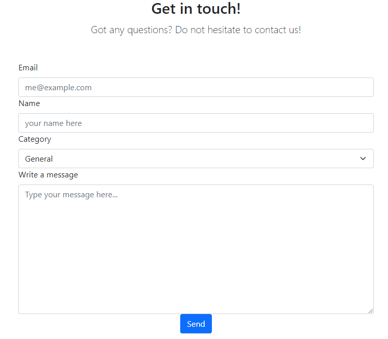

The most relevant parts are:
+ The form header is outside of `<form>` and uses headings and `.lead` class.
+ The form element does not include any classes.
+ Each input control typically consists on a `<label>` element styled with the `.form-label` class and the corresponding input/textarea with the `.form-control` class.
+ The select control also features a label like the input, and a `<select>` styled with the `form-select` class.
+ The form placement is controlled with the Bootstrap grid, using the `.justify-content-center` for horizontal alignment.


With some simple changes, the previous form can be tuned to make it more visually appealing with floating labels and animations:

```html
<div class="container">
  <div class="text-center">
    <h2>Get in touch!</h2>
    <p class="lead">Got any questions? Do not hesitate to contact us!</p>
  </div>
  <div class="row justify-content-center my-5">
    <div class="col-lg-6">
      <form action="">
        <div class="form-floating my-5">
          <!-- Email -->
          <input type="email" id="emailInput" class="form-control" placeholder="me@example.com">
          <label for="emailInput" class="form-label">Email</label>
        </div>

        <div class="form-floating my-5">
          <!-- Name -->
          <input type="text" id="nameInput" class="form-control" placeholder="your name here">
          <label for="nameInput" class="form-label">Name</label>
        </div>

        <div class="form-floating my-5">
          <!-- Category -->
          <select name="category" id="categorySelect" class="form-select">
            <option value="pricing">Pricing</option>
            <option value="technical">Technical</option>
            <option value="general" selected>General</option>
          </select>
          <label for="categorySelect" class="form-label">Category</label>
        </div>

        <div class="form-floating my-5">
          <!-- Message -->
          <textarea name="messageTextarea" id="messageTextarea" class="form-control" placeholder="something" style="height: 15rem;"></textarea>
          <label for="messageTextarea" class="form-label">Write a message</label>
        </div>

        <!-- Send button -->
        <div class="text-center">
          <button type="submit" class="btn btn-primary">Send</button>
        </div>

      </form>
    </div>
  </div>
</div>
```

The previous markup will result in:


Note that only a few extra `<div>`s with `.form-floating` class and a bit of reorganization was needed to accomplish the tuning up of the previous basic form.

The following section illustrate some form controls individually.


### Inputs

Inputs (text, email, password) use the following simple markup:

```html
<div class="mb-3">
  <label for="inputPassword" class="form-label">Password</label>
  <input type="password" class="form-control" id="inputPassword">
</div>
```


### Checkboxes

Checkboxes use the following markup:

```html
<div class="mb-3 form-check">
  <input type="checkbox" class="form-check-input" id="check">
  <label class="form-check-label" for="check">Check me out</label>
</div>
```


By default, a checkbox will show up in an unchecked status. If you want to be checked by default, make sure to include the `checked` attribute as shown below:

```html
<div class="form-check">
  <input type="checkbox" class="form-check-input" value="" id="checkedCheckbox" checked>
  <label for="checkedCheckbox" class="form-check-label">Checked checkbox</label>
</div>
```

You can disaable a checked box in the same way using the `disabled` property:

```html
<div class="form-check">
  <input type="checkbox" class="form-check-input" value="" id="disabledCheckCheckbox" checked disabled>
  <label for="disabledCheckCheckbox" class="form-check-label">Disabled and checked checkbox</label>
</div>
```


You can also have indeterminate checkboxes, but you need TypeScript to set them, as there is not HTML attribute to set them:

```html
<div class="form-check">
  <input type="checkbox" class="form-check-input" value="" id="indeterminateCheckbox">
  <label for="indeterminateCheckbox" class="form-check-label">Indeterminate checkbox</label>
</div>
```

```typescript
const indeterminateCheckbox: HTMLInputElement = getValidatedHtmlElement('#indeterminateCheckbox');

indeterminateCheckbox.indeterminate = true;

function getValidatedHtmlElement<T extends Element>(htmlSelector: string): T {
  const elem = document.querySelector(htmlSelector);
  if (!elem) {
    console.log(`ERROR: ${ htmlSelector } was not found in the HTML`);
    throw new Error(`Missing element ${ htmlSelector } in HTML`);
  }
  return elem as T;
}
```


### Radio buttons

Groups of radio buttons use the following markup:

```html
<div class="form-check">
  <input type="radio" class="form-check-input" name="radioDefault" id="radioDefault1">
  <label for="radioDefault1" class="form-check-label">Default radio</label>
</div>

<div class="form-check">
  <input type="radio" class="form-check-input" name="radioDefault" id="radioDefault2" checked>
  <label for="radioDefault2" class="form-check-label">Default checked radio</label>
</div>

<div class="form-check">
  <input type="radio" class="form-check-input" name="radioDefault" id="radioDefault3" checked disabled>
  <label for="radioDefault3" class="form-check-label">Default checked and disabled radio</label>
</div>
```


See how the group share the same name, with individual `id`s.

#### Inline variant for checkboxes and radio buttons

You can use the following markup to display checkboxes and radios on a single line, rather that in an vertical fashion:

```html
<div>
  <div class="form-check form-check-inline">
    <input type="checkbox" class="form-check-input" id="inlineCheckbox1" value="option1">
    <label class="form-check-label" for="inlineCheckbox1">1</label>
  </div>

  <div class="form-check form-check-inline">
    <input type="checkbox" class="form-check-input" id="inlineCheckbox2" value="option2">
    <label class="form-check-label" for="inlineCheckbox2">2</label>
  </div>

  <div class="form-check form-check-inline">
    <input type="checkbox" class="form-check-input" id="inlineCheckbox3" value="option3" disabled>
    <label class="form-check-label" for="inlineCheckbox3">3 (disabled)</label>
  </div>
</div>

<div>
  <div class="form-check form-check-inline">
    <input class="form-check-input" type="radio" name="inlineRadios" id="inlineRadio1" value="option1">
    <label class="form-check-label" for="inlineRadio1">1</label>
  </div>

  <div class="form-check form-check-inline">
    <input class="form-check-input" type="radio" name="inlineRadios" id="inlineRadio2" value="option2">
    <label class="form-check-label" for="inlineRadio2">2</label>
  </div>

  <div class="form-check form-check-inline">
    <input class="form-check-input" type="radio" name="inlineRadios" id="inlineRadio3" value="option3" disabled>
    <label class="form-check-label" for="inlineRadio3">3 (disabled)</label>
  </div>
</div>
```


### Switches

Switches are checkboxes that feature a different appearance:

```html
<!-- Unchecked Switch -->
<div class="form-check form-switch">
  <input type="checkbox" class="form-check-input" id="switchCheckbox">
  <label for="switchCheckbox" class="form-check-label">Default switch checkbox input</label>
</div>

<!-- Checked Switch -->
<div class="form-check form-switch">
  <input type="checkbox" class="form-check-input" id="switchCheckedCheckbox" checked>
  <label for="switchCheckedCheckbox" class="form-check-label">Default switch checkbox checked input</label>
</div>

<!-- Disabled Unchecked Switch -->
<div class="form-check form-switch">
  <input type="checkbox" class="form-check-input" id="switchCheckboxDisabled" disabled>
  <label for="switchCheckboxDisabled" class="form-check-label">Default switch checkbox disabled input</label>
</div>

<!-- Disabled Checked Switch -->
<div class="form-check form-switch">
  <input type="checkbox" class="form-check-input" id="switchCheckedDisabled" disabled checked>
  <label for="switchCheckedDisabled" class="form-check-label">Default switch checkbox checked and disabled input</label>
</div>
```


### File input

File inputs use very little markup:

```html
<div>
  <label for="formfile" class="form-label">Default file input example</label>
  <input type="file" class="form-control" id="formfile">
</div>
```


### Range control

Range control can be used to provide a numeric value in a certain range. The markup is very simple:

```html
<label for="customRange" class="form-label">Example range</label>
<input type="range" class="form-range" id="customRange">
```


### Validation components

Bootstrap provides a rich set of validation components used to provide feedback to the user about the text they are typing or the selections they are doing.

The validation requires a bit of markup, and a bit of TypeScript.

Let's start with the markup of a simple input:

```html
<form class="row g-3 needs-validation" novalidate>

  <div class="col-md-4">
    <label for="firstName" class="form-label">First name</label>
    <input type="text" class="form-control" id="firstName" placeholder="your name here..." required>
    <div class="valid-feedback">Looks good!</div>
    <div class="invalid-feedback">First name is required</div>
  </div>

  <div class="col-12">
    <button class="btn btn-primary" type="submit">Submit form</button>
  </div>
</form>
```

The previous snippet illustrates a form with a single text input allowing the user to type their first name.

Note the following:
+ There is a `<form>` element with the `novalidate` attribute. This is required to perform validation on-demand.
+ The element to validate features a `required` attribute. This signals the browser that this element requires validation.
+ Two `<div>`s are added in the same container as the input that is validated: One is associated with the `.valid-feedback` class, the other with the `.invalid-feedback` class. Those will be displayed and styled appropriately if the field passes or fails validation respectively.
+ The validation visual cues will be in effect after the first submission. Before that, nothing happens (see first image below).
+ Although not evident from the markup, the element itself will be styled appropriately with green/red icons to give proper feedback to the user (see 2nd and 3rd image below).


In order to make this work, you also need a bit of TypeScript:

```typescript
const forms: HTMLFormElement[] = getValidatedHtmlElements('.needs-validation');

for (const form of forms) {
  form.addEventListener('submit', (event) => {
    if (!form.checkValidity()) {
      event.preventDefault();
      event.stopPropagation();
    }
    form.classList.add('was-validated');
  }, false);
}


function getValidatedHtmlElements<T extends Element>(htmlSelector: string): T[] {
  const elems = document.querySelectorAll(htmlSelector);
  if (!elems) {
    console.log(`ERROR: ${ htmlSelector } was not found in the HTML`);
    throw new Error(`Missing element ${ htmlSelector } in HTML`);
  }
  return [...elems] as T[];
}
```

First of all you retrieve all the forms to be validated, and then bind each one of them with a simple event handler for the `'submit'` event that:
  + disables the submission if the form is not valid, which is checked using `form.checkValidity()`
  + adds the class `.was-validated` to the form, so that the interactive visual cues are activated after the first submission.


| EXAMPLE: |
| :------- |
| See [19: Hello, Bootstrap forms!](19-forms) for a runnable example illustrating all the concepts of this section, along with a more complex validation form. |

## Examples, Exercises and mini-projects

### [01: Hello, Bootstrap v5 refresher](01-hello-bootstrap-v5)
Starter project for Bootstrap v5 examples, backed by a Express server that exposes the `public/` directory for frontend development.

### [02: Hello, Bootstrap containers!](02-hello-containers)
Illustrates `.container`, `.container-fluid`, and `.container-*`.

### [03: Hello, Bootstrap grid system!](03-hello-grid-system)
Illustrates the basic concepts of the Bootstrap grid system, including layout, sizing, responsiveness, and vertical and horizontal alignment.

### [04: More on gutters!](04-more-on-gutters)
Illustrates the basics of gutters to control the spacing between columns in the grid system.

### [05: Buttons in action!](05-buttons)
Illustrates the basics of Bootstrap buttons.

### [06: Cards in action!](06-cards)
Illustrates the basics of Bootstrap cards.

### [07: Hello, Boostrap typography!](07-typography)
Illustrates the basics of Bootstrap typography utilities.

### [08: Images in action!](08-images)
Illustrates the basics of Bootstrap image utilities.

### [09: Hello, display utilities!](09-hello-display-utilities)
Illustrates the basics of Bootstrap display utilities

### [10: Hello, interaction utilities!](10-interactions)
Illustrates the basics of Bootstrap interaction utilities.

### [11: Hello, overflow utilities!](11-overflow)
Illustrates the basics of Bootstrap overflow utilities.

### [12: Hello, shadow utilities!](12-shadows)
Illustrates the basics of Bootstrap shadow utilities.

### [13: Hello, tables!](13-tables)
Illustrates the basics of Bootstrap tables.

### [14: Hello, alerts!](14-alerts)
Illustrates the basics of Bootstrap alerts.

### [15: Hello, Toasts!](15-toasts)
Illustrates the basics of Bootstrap Toasts, a modern component for notifications.

### [16: Hello, navbar!](16-navbars)
Illustrates the basics of Bootstrap navbar component.

### [17: Hello, navs and tabs!](17-navs-and-tabs)
Illustrates the basics of Bootstrap navs and tabs components.

### [18: Hello, Bootstrap icons!](18-bootstrap-icons)
Illustrates the basics of Bootstrap Icons project, and the different ways to consume those icons and style them.

### [19: Hello, Bootstrap forms!](19-forms)
Illustrates the basics of Bootstrap forms

### [e01: Practicing the Grid layout!](e01-practicing-grid-layout)
Using the grid system to obtain three different layouts.

### [e02: Images in action!](e02-practicing-utilities)
Illustrates the basics of Bootstrap image utilities

## Todo

+ [ ] Grokking display utilities: using `d-none` linked to a button to toggle the visibility of elements (e.g. completed
todo tasks) vs. `d-invisible`
+ [ ] Review flexbox from vanilla CSS and see how to replicate using Bootstrap flex utilities.