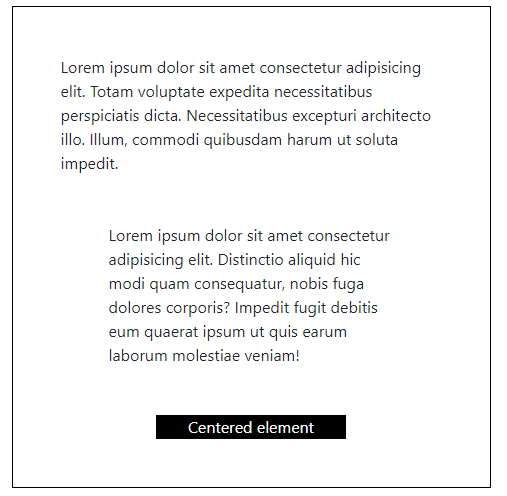

# e02: Bootstrap v5 &mdash; Practicing Bootstrap utilities!
> using Bootstrap v5 utilities to recreate a pure vanilla CSS example.

## Description

In this example we will recreate the following box using the Bootstrap utilities:

As you see it consists of:
+ a black rectangular bordered box containing
+ a first text paragraph with  some space on all sides
+ a second text paragraph featuring some extra spacing on the horizontal axis
+ a black rectangular element, centered on the containinx box, also featuring text that is centered in the screen.

| NOTE: |
| :---- |
| The CSS is applied inline for convenience. |

### Additional details and hints

Start by creating the same content without styles. You can then start adding classes to the different elements to achieve the desired results.