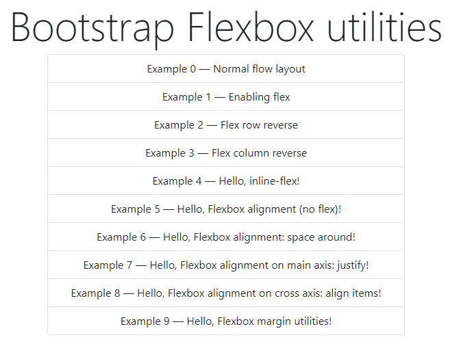
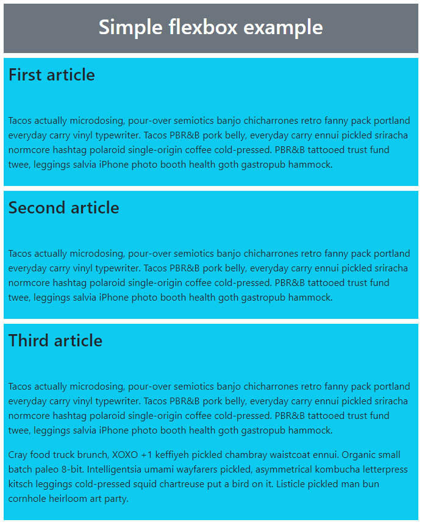
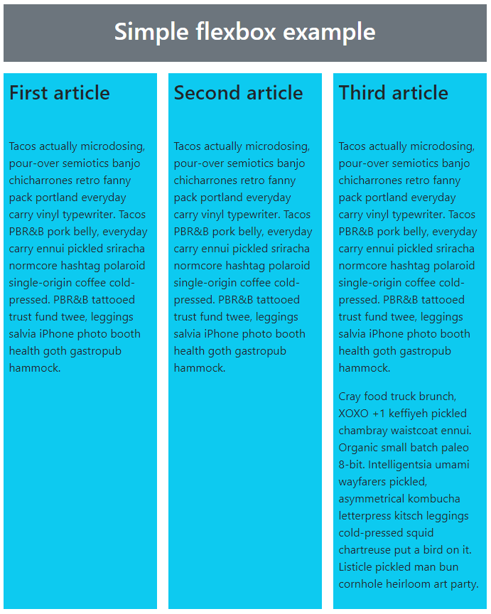
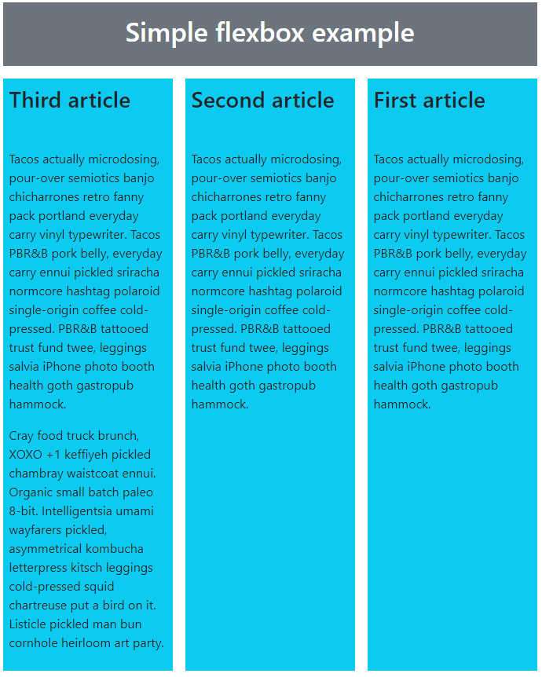
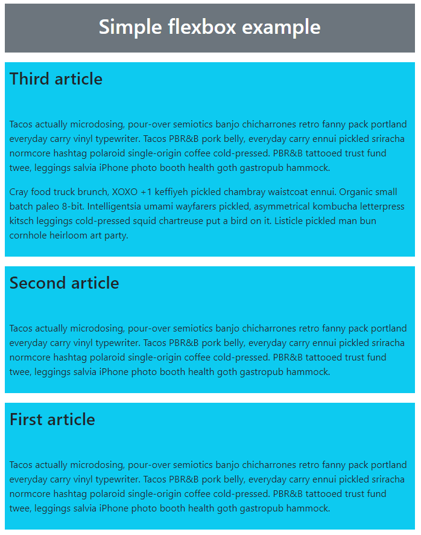
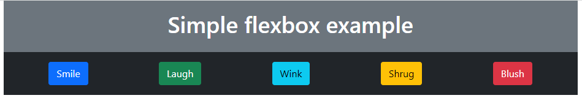
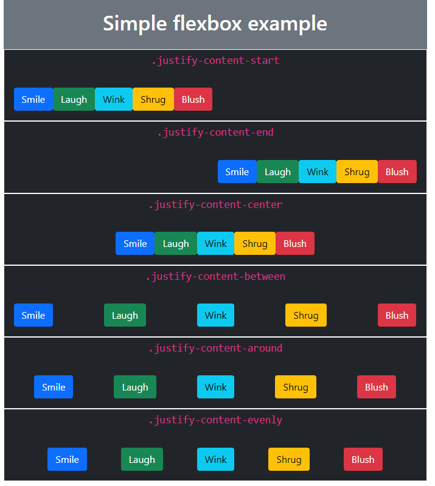
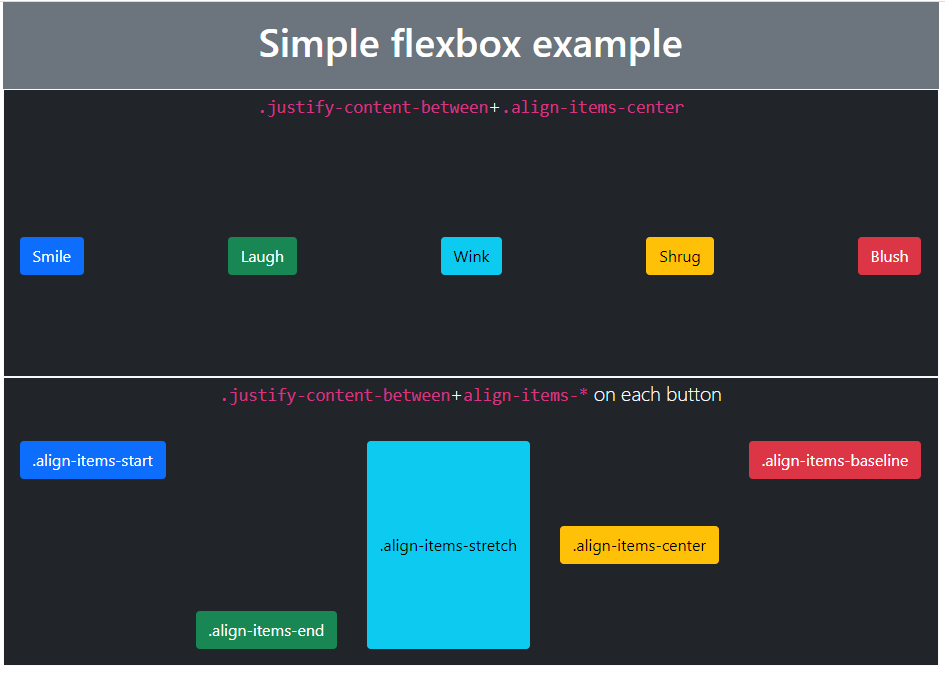
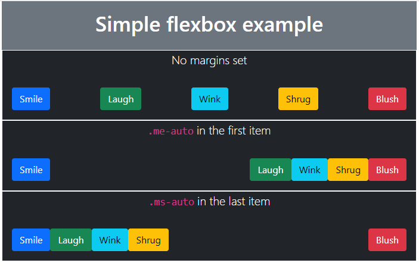

# e03: Bootstrap v5 &mdash; Practicing Bootstrap flex utilities!
> practicing Bootstrap v5 *flexbox* utilities

## Description

This example illustrates Bootstrap Flexbox utilities:
+ Enabling Flexbox to bend normal flow layout
+ Establishing Flexbox direction: row and column
+ Reversing content
+ Alignment on main and cross axis (vertical and horizontal alignment)
+ Using margins to distribute items in specific way

*Examples index*

*Starting point*

*Enabling flex*

*Flexbox row reverse*

*Flexbox column reverse*

*Flexbox alignment: starting point*

*Flexbox alignment: space around*

*Flexbox alignment on main axis*

*Flexbox alignment on cross axis*

*Flexbox margin utilities for alignment*
