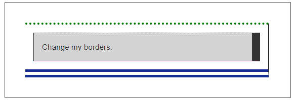

# 13 &mdash; Setting border properties
> illustrates how to use the *longhand* border properties

In the example, you are given a simple HTML and you have to play with the CSS to get the following final result:

