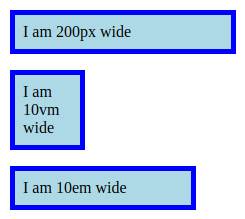

# 24 &mdash; Hello, *absolute* and *relative* lengths
> Illustrates the use of *absolute* and *relative* lengths on a simple example.

In the example, we have three boxes for which their width is specified using an absolute length, a viewport percentage, and an *em* value.

