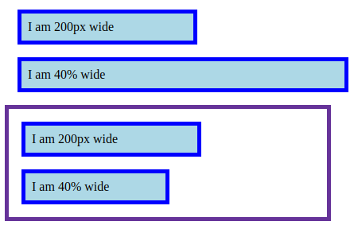

# 26 &mdash; Hello, percentages!
> Illustrates the use of percentages for setting lengths and sizes

In the example, we illustrate two different cases in which percentages are used.

1. Boxes &mdash; we create two sets of boxes with the same CSS and dimensions. Within each set we have a box with a width in pixels and another with a width in percentages. The second set is wrapped within a container, so that the percentage *refers* to that one when using percentages. As a result, the second box from the top gets a different width depending on the size of the viewport, while the 4th box has always the same size.

2. Lists &mdash; A few nested lists are created and in the CSS we set the font size for the `<li>` elements as a percentage. As a result, with each level the font size gets bigger and bigger.

