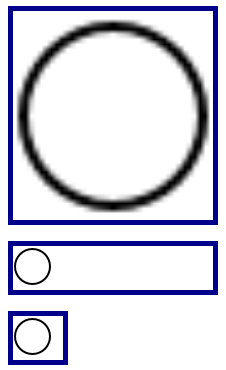

# 31 &mdash; *min-* and *max-* sizes behavior
> Illustrates the behavior of *min-* and *max-* sizes on several examples.

In the first example, we set a box with `min-height`. This ensures that the box has a minimum height even when empty, but it is capable to resize when it gets some text.

in the second example, we use the same image three times. The image in top has been given a `width: 100%` and it is in a container with a fixed width. The container width is larger than the image, and therefore, the image is stretched to the container width and appears pixelated.

The image in the middle has `max-width: 100%` and therefore, does not stretch to fill the cotnainer.

The image in the bottom is also set with `max-width: 100%` but is not set in a container with a fixed width, and as a result the image is scaled down to fit into the box.

