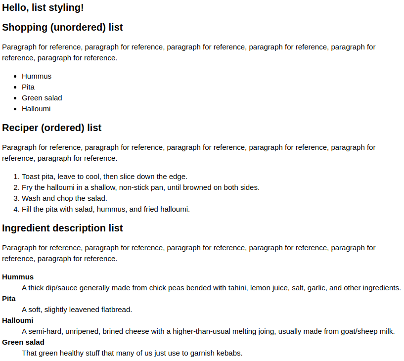
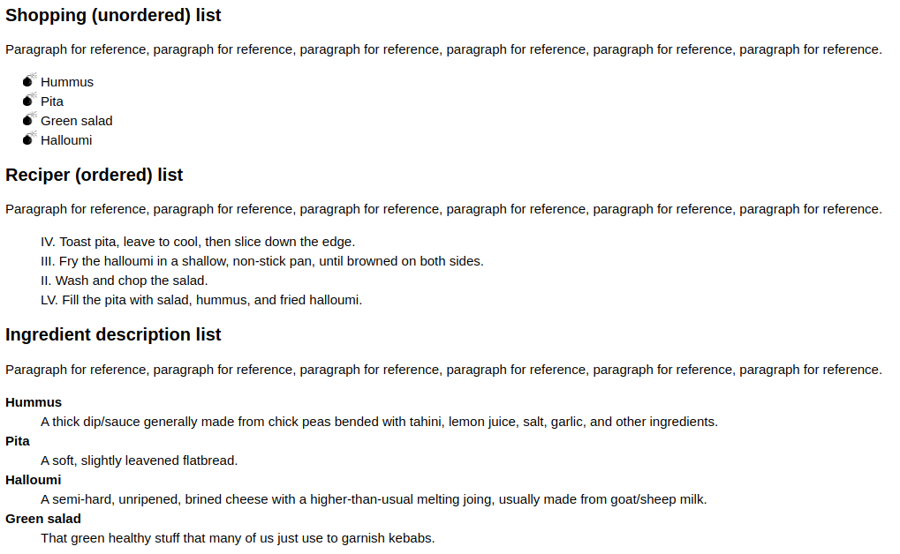
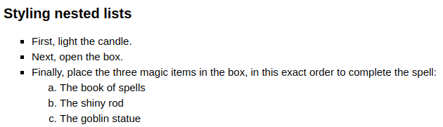

# 43 &mdash; Hello list styling!
> Illustrates how to style different types of lists.

## Basic styling (spacing and general styles)

## Advanced styling (bullets, numbering, ...)

## Advanced styling of nested list (bullets, numbering)

