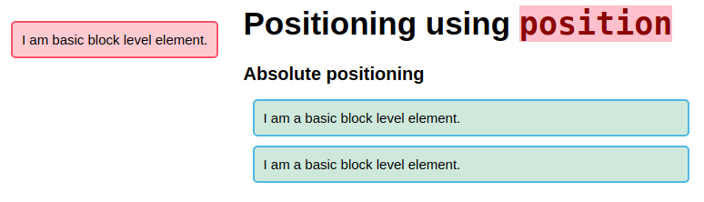
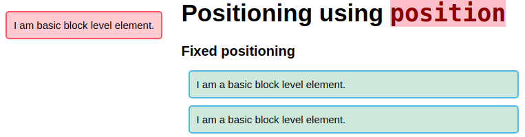
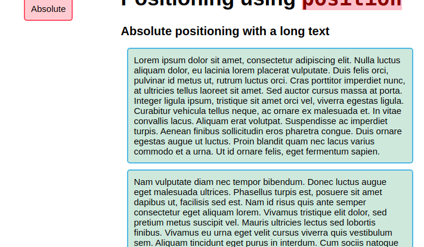
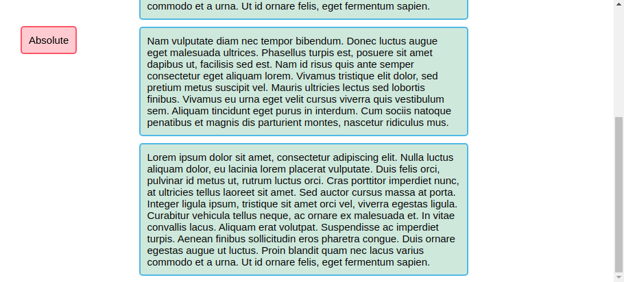

# 49 &mdash; Hello Position!
> illustrates some of the techniques associated to the `position` property-


## About `margin: 0 auto`

In the example, we use the following CSS rule:

```css
body {
  margin: 0 auto;
}
```

This has the effect of centering horizontally the HTML contents in the viewport.

As you know, `margin` is a shorthand for `margin-top`, `margin-right`, `margin-bottom` and `margin-left`.

+ When one value is specified, it applies the same margin to all four sides.
+ when two values are given, the first value applies to top and bottom, and the second to the right and left.
+ When three values are specified, the first margin applies to the top, the seond to the right and the left, and the third to the bottom.

Thus, `margin: 0 auto` has the effect of no adding extra space to the top and bottom, and use a *suitable margin* chosen by the browser for the left and right margin. This ultimately centers the contents horizontally.

## `position: static`


## `position: relative`


## `position: absolute`



## `position: fixed`



## `position: absolute` with scrolling




## `position: fixed` with scrolling



## `position: sticky` with scrolling


