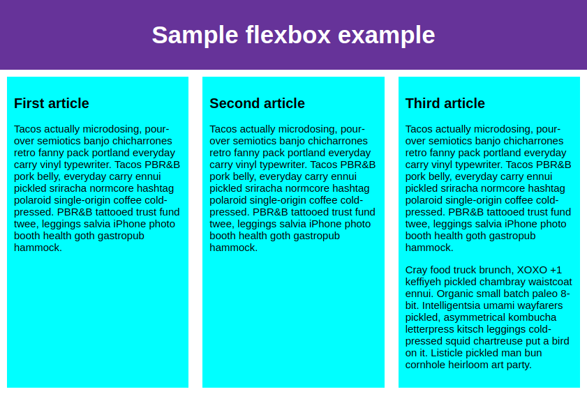
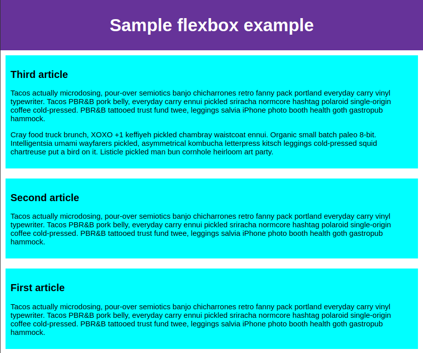
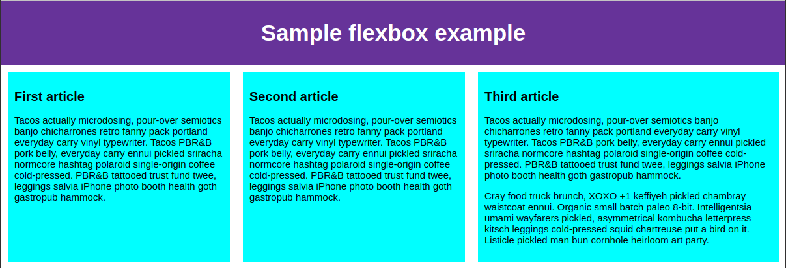
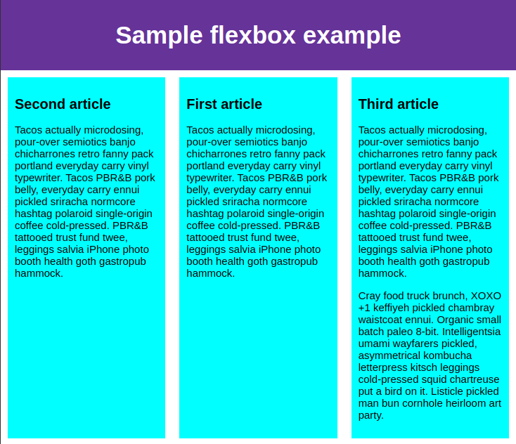
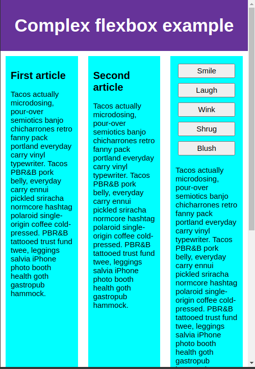
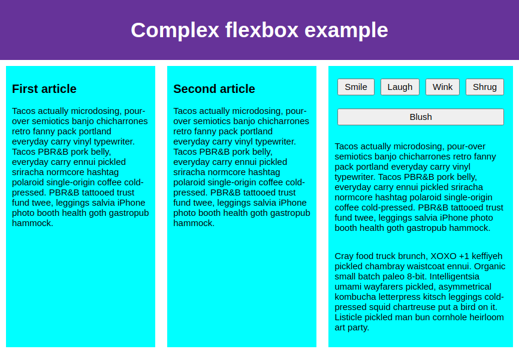

# 53 &mdash; *Flexbox*
> a series of exercises that illustrates the different flexbox layout technique concepts and behavior

## Initial state

## Basic three column layout

## Basic three rows layout (`flex-direction: column`)

## Basic three rows layout reversed (`flex-direction: column-reverse`)

## Large content that does not fit in the viewport

## Large content that does not fit in the viewport fixed with `flex-wrap: wrap`

## Flexbox sizing: making an element the double as the other two

## Flexbox sizing: specifying min width

### Narrow viewport

### Medium viewport

### Wide viewport

## Flexbox horizontal and vertical alignment

### Before

### After

## Flexbox horizontal and vertical alignment: overriding one item placement

## Flexbox ordering of items

## Flexbox nested boxes

### Complex layout on narrow viewport

### Complex layout on medium viewport

### Complex layout on wide viewport
