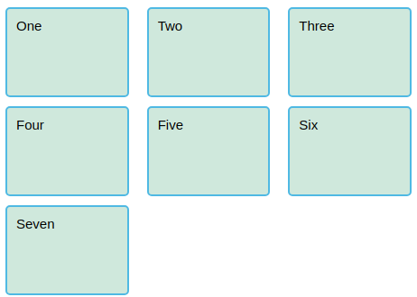
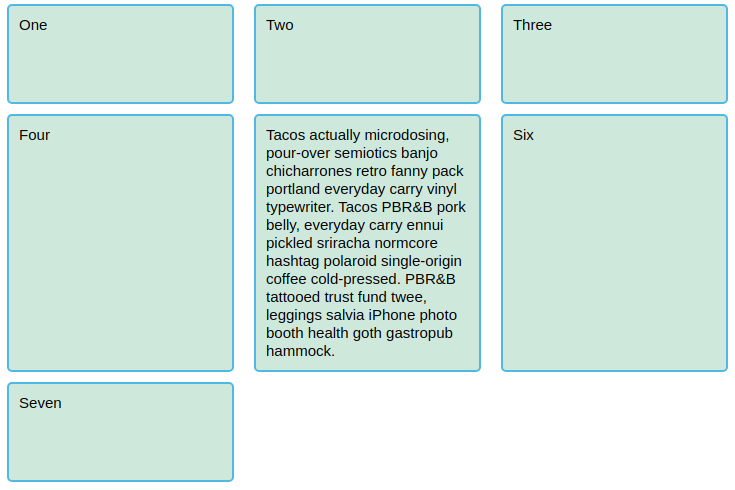
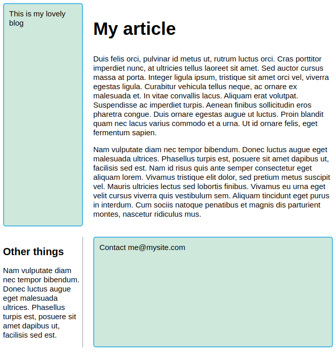

# 54 &mdash; *CSS Grid Layout*
> a series of exercises that illustrates the different CSS Grid Layout concepts

## Initial state

## Basic layout with 3 columns

### Wide viewport

### Narrow viewport

## Basic layout with 3 equally size columns using `fr` units

## Basic layout with 3 unequally sized columns using `fr` units

## Setting gaps between tracks

## Using `repeat` for an equally sized 3-column layout with gaps

## Setting row height (implicit grid) with `grid-auto-rows`

## Using `minmax()` to flexibly set the row height

### With small content

### With large content

## Flexible layout with as many columns as will fit in the container

### On narrow viewports

### On wide viewports

## Explicit placement on rows and columns

### Initial state

### Midway: grid enablement

### Final: placement rules
