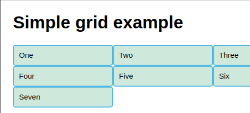
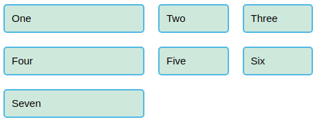
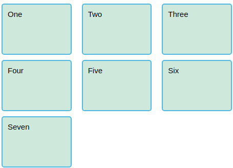

# 54 &mdash; *CSS Grid Layout*
> a series of exercises that illustrates the different CSS Grid Layout concepts

## Initial state

## Basic layout with 3 columns

### Wide viewport

### Narrow viewport

## Basic layout with 3 equally size columns using `fr` units

## Basic layout with 3 unequally sized columns using `fr` units

## Setting gaps between tracks

## Using `repeat` for an equally sized 3-column layout with gaps

## Setting row height (implicit grid) with `grid-auto-rows`

